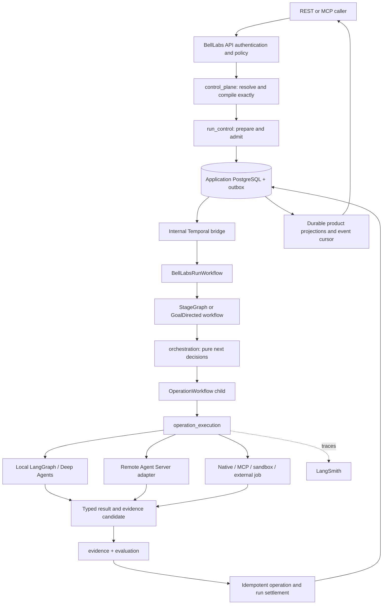

# BellLabs backend deep-module codebase organization

Status: **proposed final recommendation — owner approval required**  
Recorded: 2026-08-08  
Scope: `biotech-research-ingestion-evaluation-system` production backend under `app/`  
Supersession intent: after approval, this document should replace
`CANONICAL_APPLICATION_CODEBASE_ORGANIZATION.md` as the target organization authority; until then,
the existing accepted documents remain normative.

## 1. Recommendation in one page

Keep BellLabs as one typed Python application and one deployable product/control boundary. Do not
split repositories, Python distributions, or microservices. Organize the implementation around a
small set of **deep modules** under `app/modules/`: each module owns a coherent capability, exposes
only a few root entry points, and hides its domain rules, use-case coordination, repositories, and
module-specific adapters below those entry points.

Keep the runtime and transport edges visibly separate:

- `app/api/` is the sole governed public REST surface;
- `app/mcp/` is another transport over the same module interfaces, not another control plane;
- `app/temporal/` is the sole production macro-workflow runtime;
- `app/agent_server/` contains bounded cognitive graphs, development/Studio assets, and
  qualification surfaces; it is not an application root or macro scheduler;
- `app/adapters/` contains only genuinely shared or runtime-level adapters. Module-owned
  persistence implementations remain hidden inside their owning module for locality;
- `app/server.py` and worker entry points are thin deployment composition roots.

The initial deep modules should be:

| Module | Capability it owns |
|---|---|
| `control_plane` | Governed definitions, catalog, capability discovery, deterministic compilation, exact immutable run configuration and assembly |
| `run_control` | Launch preparation/admission, lifecycle, commands/messages, budgets, decisions, linked-run facts, idempotency, inbox/outbox, product run projection |
| `orchestration` | Pure StageGraph and GoalDirected semantics, readiness, joins, convergence, exact operation planning and runtime-neutral dispatch decisions |
| `operation_execution` | Independently durable operation attempt semantics, claims, journals, effects, usage, settlement, intervention, workspace/sandbox ownership and runtime binding |
| `evidence` | Typed results, artifact/evidence admission, immutable manifests, provenance, citations, promotion, durable product events and reconnectable projections |
| `evaluation` | Versioned deterministic validators, semantic evaluators, datasets, qualification policy, evaluation results and LangSmith evaluation coordination |
| `schema_grounding` | The coherent schema-catalog/context/grounding capability and its Workflow Types; governed Neo4j read authority, selection, projection and reconciliation |
| `web_research` | Governed web/source research capability, retrieval observations, candidate synthesis, citations and research-specific acceptance |
| `knowledge_ingestion` | Graph Candidate → validated Ingestion Plan → approved Graph Commit; canonical ingestion and promotion into Neo4j-backed knowledge |

The first six are reusable platform capabilities. The final three are product/workflow capabilities.
Future Workflow Types should join an existing product module when they share its invariants and
change together; create a new module only when it has its own stable interface, semantic ownership,
and independent reason to change.

The central design rule is:

> A caller asks a module for an outcome. It does not assemble the module's repositories,
> validators, provider clients, or domain steps itself.

## 2. Decisions already accepted and preserved

This recommendation does not reopen the accepted runtime architecture.

1. **Temporal is the only production macro runtime.** One `BellLabsRunWorkflow` owns the durable
   root lifecycle and delegates to a StageGraph or GoalDirected family workflow and independently
   durable operation children.
2. **LangGraph and Deep Agents are bounded cognitive runtimes.** They may implement one exact
   operation binding; their checkpoints are not run, budget, evidence, or terminality authority.
3. **LangSmith is the tracing, evaluation, sandbox, graph-development, and optional remote bounded
   graph plane.** It is not the product status store or public facade.
4. **BellLabs PostgreSQL is application authority** for run, command, inbox/outbox, budget,
   approval, claim, effect, settlement, and durable product-event facts.
5. **Temporal PostgreSQL is separate runtime persistence.** It is never queried as the BellLabs
   application database and never shares application credentials or migrations.
6. **MongoDB owns immutable semantic/configuration documents and document-shaped manifests** where
   already assigned. It does not become lifecycle or transaction authority.
7. **Neo4j owns the admitted knowledge graph and graph traversal surface.** It does not own workflow
   lifecycle, unreviewed research candidates, or ingestion decisions.
8. **Object storage owns large immutable bytes**: source captures, corpora, reports, artifacts,
   datasets, and sandbox snapshots. Temporal payloads and database rows carry compact references.
9. **The BellLabs API is the only governed public facade.** REST and MCP call the same module
   interfaces and enforce the same identity, policy, idempotency, and error semantics.
10. **Research output is not canonical knowledge.** It becomes eligible for Neo4j promotion only
    through evidence validation and an admitted ingestion plan.

These decisions come from the accepted
[`TEMPORAL_LANGSMITH_DEEPAGENTS_BELLLABS_BACKEND_ARCHITECTURE_PROPOSAL.md`](TEMPORAL_LANGSMITH_DEEPAGENTS_BELLLABS_BACKEND_ARCHITECTURE_PROPOSAL.md),
[`BELLLABS_AGENT_WORKFLOW_CONTRACT_ARCHITECTURE.md`](BELLLABS_AGENT_WORKFLOW_CONTRACT_ARCHITECTURE.md),
and the Stage 7
[`10_STAGE_7_API_COORDINATOR_OBSERVABILITY_EVALUATION_AND_SECURITY.md`](migrations_instructions/implementation_work_packages/10_STAGE_7_API_COORDINATOR_OBSERVABILITY_EVALUATION_AND_SECURITY.md).

## 3. Why the current horizontal organization should be deepened

The existing code has strong semantics but weak locality. A read-only inventory on 2026-08-08 found:

- `app/application/`: 97 Python modules and approximately 36,000 lines;
- `app/domain/`: 60 Python modules and approximately 12,600 lines;
- `app/integrations/`: 37 Python modules and approximately 7,200 lines;
- `app/temporal/`: 23 Python modules and approximately 4,700 lines;
- 103 test modules at the root of `tests/`, before experiment tests.

Several production composition modules import dozens of application, repository, integration, and
runtime modules directly. The two largest observed composition paths import roughly 50 internal
modules each. The result is predictable:

- callers must understand repositories and providers that should be implementation details;
- domain behavior, use-case coordination, persistence, and tests for one capability are scattered;
- `application` has become both a layer and a catch-all;
- persistence implementations live beside use cases and are imported as ordinary application code;
- production wiring leaks into capability logic;
- tests naturally reach past intended seams because no enforced package interface exists;
- changing one capability requires searching across every horizontal layer.

The existing inward rule—`domain <- application <- transports/runtimes/integrations`—was useful for
establishing semantic authority. It should survive **inside** each deep module, not remain the
top-level organizing axis for the whole application.

The target is vertical ownership with internal layering:

```text
deep module interface
  -> use-case implementation
       -> pure domain implementation
       -> module-owned ports
       -> hidden persistence/provider adapters
```

This preserves framework independence without making every caller traverse the layers itself.

## 4. Target codebase shape

This tree intentionally names packages and ownership classes, not every future file.

```text
app/
  server.py                 # public ASGI composition root
  config.py                 # process configuration only
  preflight.py              # deployment/readiness checks

  modules/                  # flat root of BellLabs deep modules
    control_plane/
    run_control/
    orchestration/
    operation_execution/
    evidence/
    evaluation/
    schema_grounding/
    web_research/
    knowledge_ingestion/

  api/                      # REST transport adapters; grouped by public resource
  mcp/                      # MCP transport adapters over the same module interfaces

  temporal/
    workflows/              # deterministic runtime control only
    activities/             # I/O adapters into module interfaces
    workers/                # independently deployable workload classes
    registration/           # explicit workflow/activity/queue inventories

  agent_server/
    operations/             # bounded remote cognitive operation graphs
    development/            # Studio/local development graph entry points
    qualification/          # compatibility, resume, checkpoint and deployment proofs
    shared/                 # graph-only state/reducer/auth helpers

  adapters/                 # shared runtime/provider adapters only
    cognitive/              # local LangGraph/Deep Agents and remote Agent Server
    temporal/               # launch, signal/update, query and reconciliation clients
    observability/          # LangSmith and OpenTelemetry
    providers/              # cross-module model, MCP, source and sandbox gateways

  migrations/               # application PostgreSQL migrations only

tests/
  integration/              # real database/provider-boundary tests
  contract/                 # transport, adapter and serialized-contract compatibility
  replay/                   # Temporal histories and workflow versioning
  acceptance/               # production-shaped capability and stage gates
  security/                 # tenant, authority, redaction and effect-safety tests
```

The application remains one `uv` project, one wheel containing `app`, and one repository. A folder
does not imply a separately deployed service. The API and worker processes select different
composition roots from the same application package.

### 4.1 The standard deep-module shape

Every immediate child of `app/modules/` is a flat package with a few public root modules and hidden
implementation below them:

```text
app/modules/<module>/
  __init__.py              # empty or minimal; never a broad re-export barrel
  <entry point>.py         # commands/use cases intended for callers
  <entry point>.py         # queries/read interfaces when materially distinct
  contracts.py             # only serialized contracts callers actually exchange
  wiring.py                # composition-root-only construction, if needed
  lib/                     # private implementation at any depth
    domain/                # pure invariants, reducers, interpreters, decisions
    use_cases/             # orchestration behind the public module interface
    ports/                 # internal seams justified by real adapters
    adapters/              # module-owned Postgres/Mongo/Neo4j/object-store implementations
  tests/                   # tests through root entry points; private fixtures
```

These are roles, not mandatory filenames. A small module may expose only one root entry point. A
module with separate command and query callers may expose two or three. Do not create empty folders
to satisfy the diagram.

Public is determined structurally:

- root-level modules under a deep-module package are entry points;
- every subdirectory is implementation-private;
- callers, adapters, and tests import only entry points;
- broad `__init__.py` barrels are prohibited;
- internal modules may import each other freely;
- packages must remain acyclic.

## 5. Deep-module ownership and interfaces

An interface includes more than Python types: it includes invariants, ordering constraints, error
modes, idempotency behavior, configuration requirements, and performance expectations.

### 5.1 `control_plane`

**Owns**

- Workflow Type, blueprint, implementation, policy, profile, capability and assembly definitions;
- draft/publish/retire/alias semantics;
- exact-reference and digest resolution;
- deterministic compilation into the Effective Run Configuration and RunPlan;
- capability discovery and maturity/readiness facts used during compilation;
- redacted compile preview and compatibility findings.

**Small interface**

- author or publish a definition;
- compile exact launch intent;
- inspect/compare definitions and compiled output.

**Hides** Mongo document shapes, payload externalization, capability search indexes, extension and
validator registries, canonicalization, overlays, digest checks, repository selection, and compile
steps.

**Invariants** Compilation is pure with respect to exact inputs; aliases resolve before admission;
compilation can only narrow authority; no runtime/provider availability can widen a definition.

### 5.2 `run_control`

**Owns**

- immutable launch tickets, admission, run identity and lifecycle;
- actor/tenant/resource/action authorization decisions at the application seam;
- commands, messages, pending decisions and complete receipt states;
- budgets, reservations, approvals and lifecycle terminality;
- linked-run relationships and fork/continuation facts;
- transactional inbox/outbox and idempotency;
- authoritative product run projection.

**Small interface**

- prepare/admit a compiled run;
- apply a typed command or decision;
- observe a run, pending work, or terminal result.

**Hides** transaction boundaries, PostgreSQL rows, optimistic/CAS versions, idempotency tables,
outbox leases, reducer sequencing, linked-run bookkeeping and projection reconstruction.

**Invariants** Accepted launch facts and launch outbox are one transaction; command facts and command
outbox are one transaction; HTTP success means durable acceptance, not downstream completion;
terminality follows accepted evidence, never provider state.

### 5.3 `orchestration`

**Owns**

- the two canonical families, StageGraph and GoalDirected;
- dependency/join semantics, fairness, readiness, convergence and stop decisions;
- runtime-neutral RunPlan interpretation;
- exact StageExecutionBinding/OperationAssembly selection;
- compact decisions that Temporal can durably execute.

**Small interface**

- advance a frozen orchestration snapshot to a typed decision set;
- evaluate a returned operation/evidence fact against the family state;
- explain why work is runnable, waiting, degraded or complete.

**Hides** frontier algorithms, dependency classes, join evaluation, cycle policy, goal revisions,
convergence policy, fallback/degradation decisions and scheduling fairness.

**Invariants** The module is deterministic and performs no network/database I/O. It never invokes a
provider, chooses an undeclared task queue, or terminalizes a BellLabs run.

### 5.4 `operation_execution`

**Owns**

- one independently durable semantic operation attempt and its execution generations;
- claim, journal, effect, usage, cancellation, intervention and settlement semantics;
- exact runtime binding and provider lineage;
- workspace ownership, materialization, sandbox lifecycle and snapshots;
- result-candidate handoff to evidence admission;
- start-bind-wait/reconcile behavior for local, remote and asynchronous runtimes.

**Small interface**

- claim/prepare an admitted operation;
- observe, reconcile or intervene in its execution;
- settle one outcome and its effects idempotently.

**Hides** journal entries, provider SDKs, retry classification, effect claims, sandbox provider
mechanics, message injection mechanics, workspace paths and repository implementations.

**Invariants** Technical retries never create a new semantic attempt; consequential effects have
stable claims; uncertain effects reconcile rather than resubmit; `applied` messages require a
committed model-visible checkpoint; local and remote cognitive variants are exact bindings and not
implicit fallbacks.

### 5.5 `evidence`

**Owns**

- typed result/evidence candidates and admission decisions;
- immutable artifact manifests, checksums, provenance, citations and retention state;
- promotion from workspace candidate to durable artifact;
- durable BellLabs product events and monotonic cursors;
- snapshot-plus-tail projections for status and reconnect;
- safe object-store upload/download references.

**Small interface**

- admit or reject a typed evidence/result candidate;
- retrieve authorized artifacts/results;
- read/replay product events and projections.

**Hides** object-store keys, content deduplication, projection consumers, cursor persistence,
redaction, retention and reconciliation.

**Invariants** Artifact bytes do not enter Temporal history or unrestricted traces; evidence is
immutable and attributable; projections are derived and cannot mutate authority; clients reconnect
from BellLabs cursors, not Temporal histories or Agent Server streams.

### 5.6 `evaluation`

**Owns**

- ValidatorDefinition, implementation binding, validation set/report and stable finding codes;
- deterministic validation execution against immutable inputs;
- versioned datasets, evaluators, rubrics, thresholds and qualification results;
- pinned semantic judges where deterministic validation cannot answer the question;
- offline evaluation and authorized online-sampling configuration;
- LangSmith evaluation submission and reconciliation behind an adapter.

**Small interface**

- validate a subject against an exact validation set;
- evaluate accepted evidence against an exact evaluation policy;
- retrieve qualification status and findings.

**Hides** evaluator implementation registries, LangSmith payloads, judge prompts/models, dataset
storage, sampling, retries and scoring normalization.

**Invariants** Deterministic validators cannot read mutable external state; judges never admit,
publish or terminalize; every score has a named dimension and pinned version; missing or malformed
evaluation input fails according to explicit policy.

### 5.7 Product/workflow modules

`schema_grounding`, `web_research`, and `knowledge_ingestion` use the same package rule but own
workflow-specific semantics instead of platform mechanics.

Each product module owns:

- its Workflow Type definitions and obligations;
- input admission and accepted output contracts;
- pure domain transformations and deterministic validators;
- operation handlers specific to the capability;
- evidence/evaluation bindings and typed failure language;
- only the persistence/query implementation unique to that capability.

It does **not** own a scheduler, generic run lifecycle, provider gateway, public auth stack, or a
second compiler. A workflow module contributes reviewed definitions and handlers to the common
platform at composition time.

Specific consolidation:

- current `schema_catalog`, `schema_context`, and `schema_grounding` packages become private
  implementation areas of one `schema_grounding` deep module because callers need the complete
  select → validate → project → reconcile capability, not three separately assembled packages;
- current web-research coordinator/runtime/repository/semantic-handler code becomes one
  `web_research` deep module rather than a cross-layer cluster;
- governed graph writes belong to `knowledge_ingestion`, separate from schema grounding and from
  raw research. Neo4j mutation occurs only after a validated, approved Ingestion Plan.

## 6. Dependency rules

The deep-module graph must be acyclic. The preferred dependency direction is:

```text
control_plane
  <- run_control
  <- orchestration
  <- operation_execution
  <- evidence
  <- evaluation
  <- product/workflow modules
```

This is not a mandate that every module import the one immediately before it. It is the maximum
direction of dependency. Modules import only the specific entry-point contracts they consume.

Additional rules:

1. Product/workflow modules may consume platform module interfaces; platform modules never import a
   product/workflow implementation.
2. Registration is inverted at composition: a product module returns reviewed definitions,
   handlers and validators; the composition root installs them into platform registries.
3. API, MCP, Temporal, Agent Server, and provider adapters may call module entry points. Modules may
   not import those edge packages.
4. Temporal workflows import only deterministic contracts and pure orchestration entry points.
   Activities perform I/O through module commands.
5. Concrete database/provider types do not cross module interfaces. Exchange domain contracts,
   immutable refs, receipts and typed errors.
6. No module imports another module's `lib/` or `tests/` tree.
7. No `shared`, `common`, `helpers`, `utils`, `manager`, or generic `services` package is created.
   Put behavior with the capability whose invariant it protects.

If a genuinely universal value type emerges—such as a digest or exact reference—it remains owned
by the module that defines its meaning and is imported through that module's contracts. Do not
create a miscellaneous kernel pre-emptively.

## 7. Runtime and adapter seams

Classify dependencies before adding a port. A seam is justified by real variation, not by a desire
to wrap every library.

| Dependency class | BellLabs examples | Recommendation |
|---|---|---|
| In-process | compilers, reducers, StageGraph/GoalDirected interpreters, canonicalization, pure validators | Keep private and call directly; no adapter |
| Local-substitutable | Postgres/Mongo repositories, object storage, Neo4j query/commit implementation | Module-owned port plus real integration implementation and focused local test adapter |
| Remote but owned | Temporal service, optional remote Agent Server deployment | Port at the owning module seam; production remote adapter plus in-memory/test adapter |
| True external | model providers, source/search providers, MCP servers, sandbox providers, LangSmith Cloud | Inject a narrow port and use mock/fake adapters for module tests |

### 7.1 Cognitive runtime seam

`operation_execution` owns one provider-neutral bounded-operation runtime interface. At least two
real adapters justify the seam:

1. **Local production adapter:** runs the exact LangGraph/Deep Agents assembly inside an authorized
   Temporal activity/worker.
2. **Remote Agent Server adapter:** starts an exact deployed graph/thread/run, persists the binding,
   waits or receives a qualified callback, and reconciles the result.

A test adapter supplies deterministic operation results and failure trajectories. Binding selection
is frozen in the OperationAssemblySpec; local and remote are not fallback modes unless an explicit
compiled policy authorizes a new attempt/generation.

The API never calls either adapter directly. The path is:

```text
BellLabs admission -> Temporal operation child -> activity -> operation_execution interface
  -> exact cognitive runtime adapter -> result candidate -> evidence/settlement
```

### 7.2 Temporal seam

Temporal is an execution adapter for admitted BellLabs decisions. Keep two directions distinct:

- the API/outbox dispatcher uses a narrow Temporal client adapter to start, Signal, Update, query,
  and reconcile exact workflow identities;
- Temporal workflows and activities call BellLabs module interfaces to hydrate authority, request
  decisions, record observations and settle outcomes.

No generic pass-through method accepts arbitrary workflow types, task queues, Signals, Updates, or
provider configuration.

### 7.3 Module-owned persistence adapters

SQL, Mongo queries, Neo4j Cypher and object-key logic belong to the module whose invariant they
persist. Hide them in that module's implementation and expose composition through `wiring` or a
module factory. Share connection pools/driver lifecycle at the process composition root; do not
share repository implementations.

Use `app/adapters/` only when the adapter itself is shared across capability modules or represents a
runtime edge, such as the Temporal client, the cognitive runtime, a governed provider gateway, or
observability export.

## 8. Data ownership and consistency

Polyglot persistence is deliberate. A use case must not perform an informal multi-database
transaction. One module and one authoritative store commit the decision; outbox-driven projections
or idempotent reconciliation update secondary stores.

| Store | Authoritative for | Explicitly not authoritative for |
|---|---|---|
| Application PostgreSQL | run lifecycle; launch/command/callback inbox and outbox; budgets, approvals, claims, effects, usage and settlements; durable product events; ingestion-plan approval/commit facts | large documents, graph traversal, Temporal history |
| Temporal persistence PostgreSQL | Temporal histories, timers, workflow/activity tasks and runtime visibility | BellLabs lifecycle, evidence, budgets, product events |
| MongoDB | immutable published semantic/configuration documents, exact binding-definition records, document-shaped research/config manifests and snapshot metadata assigned to it | lifecycle transactions, mutable run projection, effect settlement |
| Neo4j | admitted graph entities/relationships/provenance projection and bounded graph queries | research candidates, identity guesses, run state, ingestion approval |
| Object storage | immutable source bytes, corpora, derived representations, artifacts, reports, datasets and sandbox snapshots | searchable lifecycle authority |
| Redis | ephemeral realtime fan-out, cache, throttling and coordination where loss is recoverable | durable events, approvals, commands or product status |
| LangGraph checkpointer | bounded operation cognitive state | BellLabs authority, scientific evidence or product terminality |
| LangSmith | traces, experiments, evaluator runs and optional remote graph runtime records | product state, admission, accepted evidence |

Required cross-store patterns:

- Postgres transaction + outbox for launch, commands, callbacks, graph commits and product events;
- stable idempotency/effect keys for every retried external mutation;
- content-addressed refs and digests rather than copied mutable payloads;
- explicit projection lag/degraded state;
- reconciliation for unknown outcomes; never infer success from transport acknowledgement;
- graph writes record the exact admitted Ingestion Plan and evidence refs and are reconciled back to
  the authoritative Postgres commit record.

## 9. End-to-end system logic



The governing invariant remains:

> Discover broadly, select narrowly, compile exactly, admit authoritatively, execute from frozen
> bindings, reconcile continuously, and terminalize only from accepted evidence.

### 9.1 Research-to-ingestion logic

1. `web_research` captures provider-native retrieval observations and immutable source refs.
2. Research synthesis emits typed claims, citations, gaps and evidence candidates; it does not
   write canonical graph knowledge.
3. `evidence` and `evaluation` validate provenance, applicability, required coverage and quality.
4. `knowledge_ingestion` constructs a reviewable Graph Candidate and ordered Ingestion Plan.
5. Deterministic validation, policy and required human/independent review admit or reject the plan.
6. The approved plan is committed idempotently through the Neo4j adapter.
7. Postgres records the authoritative commit fact and outbox; Neo4j holds the admitted graph
   projection; evidence and lineage link both.

## 10. Functional requirements mapped to modules

| Functional requirement | Primary owner | Important collaborators |
|---|---|---|
| Define, publish, compare and retire Workflow Types/Implementations | `control_plane` | product modules contribute definitions |
| Compile exact models, prompts, tools, skills, MCP, workspace, sandbox, verifier and runtime choices | `control_plane` | `orchestration`, product modules |
| Preview authority, incompatibilities, degradations, costs and resource needs | `control_plane` | `evaluation`, `operation_execution` |
| Prepare and idempotently admit a run | `run_control` | `control_plane` |
| Pause, resume, steer, cancel, fork and answer decisions | `run_control` | `operation_execution`, Temporal adapter |
| Schedule `all`, `any`, `minimum(k)` and GoalDirected convergence | `orchestration` | Temporal workflows |
| Execute heterogeneous native, agent, MCP, sandbox and external operations | `operation_execution` | cognitive/provider adapters |
| Persist messages and distinguish receipt states through `applied` | `run_control` | `operation_execution` |
| Capture, promote, retrieve and retain artifacts/results | `evidence` | object-store adapter |
| Stream/reconnect product status from a monotonic cursor | `evidence` | `run_control` |
| Run deterministic and semantic evaluations | `evaluation` | `evidence`, LangSmith adapter |
| Select and reconcile bounded schema context | `schema_grounding` | Neo4j read adapter |
| Acquire and synthesize governed source research | `web_research` | source-provider adapters, `evidence` |
| Validate and commit canonical graph knowledge | `knowledge_ingestion` | `evidence`, Neo4j write adapter |
| Accept authenticated provider callbacks | `run_control` | provider/Temporal adapters |
| Reconcile orphans and ambiguous external effects | owning module (`run_control` or `operation_execution`) | verification/reconciliation worker |

## 11. Non-functional requirements and where they live

### Reliability and durability

- Temporal workflows are replay-safe and deterministic; I/O stays in Activities.
- External effects are at-least-once technically and exactly-once semantically through stable
  claims, idempotency and settlement.
- Long activities heartbeat with compact non-sensitive progress.
- Continue-As-New preserves BellLabs identity while bounding Temporal history.
- Every ambiguous launch, callback, provider effect and graph commit has a reconciliation path.
- Required worker-pool absence degrades readiness; an HTTP process responding is not sufficient.

### Consistency and authority

- Every fact has one module owner and one authoritative store.
- Cross-store propagation uses outbox and reconciliation, never best-effort dual writes.
- Runtime state, projections and traces are explicitly non-authoritative.
- A provider result is a claim until BellLabs validates and settles it.

### Security and privacy

- Default-deny tenant/resource/action authorization at REST and MCP entry points and again at
  consequential module interfaces.
- Exact capability and immutable binding checks before every operation effect.
- No secrets or PHI in Temporal history, logs, heartbeats, product events, LangSmith traces or
  evaluator inputs; secret references resolve only inside authorized workers.
- Sandboxes have explicit filesystem, mount, egress, package, credential and cleanup policy.
- Provider callbacks authenticate and persist before Temporal delivery.
- Redaction occurs before persistence/export, not only at response time.

### Observability and operability

- Structured correlation joins BellLabs run/epoch/operation, Temporal workflow/run/activity,
  Agent Server thread/run/checkpoint, sandbox/job, artifact, message/effect and LangSmith trace IDs.
- Metrics cover admission, outbox age, task-queue age, pollers, schedule-to-start, heartbeat age,
  provider latency/cost, projection lag, orphan age and reconciliation outcome.
- Product diagnostics link to Temporal/LangSmith/provider records but never derive authority from
  them.
- Failures use stable typed error/finding codes with actionable remediation.

### Performance and scalability

- Keep one modular application while scaling worker processes independently.
- Preserve five logical workload classes: coordinator/family, agent cognition, ingestion I/O,
  sandbox/external job, and verification/reconciliation.
- Task queues come from exact compiled bindings; models and workflow code cannot invent queues.
- Backpressure is explicit in admissions, reservations, provider quotas, worker concurrency and
  queue-age policy.
- Large payloads use object references; workflow and event payloads remain compact.

### Evolvability and maintainability

- Module entry points are the only caller/test surface.
- Import boundaries and cycles fail CI.
- Serialized contracts, Temporal workflows, checkpoints and operation assemblies are versioned.
- No provider/framework type appears in a stable BellLabs module interface.
- Compatibility shims are narrow, measured and removed at an explicit gate.

### Scientific and product quality

- Source observations, assertions, evidence assessment, adjudication and accepted knowledge remain
  distinct.
- Deterministic validation and independent review are separate from generation.
- Provenance/citations survive every transformation and graph commit.
- Research remains research, not medical advice, and no generated output silently becomes canonical
  knowledge.

## 12. Python and `uv` tooling recommendation

Keep the current fundamentals:

- Python 3.12+;
- one `pyproject.toml`, one `uv.lock`, one Hatchling-built wheel containing `app`;
- Pydantic v2 for serialized boundary/domain contracts;
- `Protocol` for ports and adapter conformance;
- Ruff, mypy and pytest as the core quality toolchain.

Do **not** introduce a uv workspace, `src/` relocation, multiple distributions, Poetry, a DI
framework, or generated repository classes. None improves the selected seams today.

### 12.1 Enforce deep-module imports

After approval, apply the `setup-py-deep-modules` convention with:

- packages root: `app/modules`;
- root package: `app.modules`;
- `grimp` as a development dependency;
- `deep_modules.toml` and `scripts/lint_boundaries.py`;
- a boundary check in the same umbrella command as Ruff, mypy and tests.

The linter must enforce:

1. outside code imports only a module's root entry points;
2. module implementation folders remain private;
3. module tests use the same entry points as callers;
4. test helpers never enter production code;
5. package dependency cycles fail.

Prove the rule with a clean pass, an intentional deep-import failure, and a restored pass before
calling it installed.

### 12.2 Typed Python posture

- New deep-module entry points and serialized contracts are fully typed from creation.
- Enable strict mypy rules first for `app.modules.*` through a module-specific override; tighten
  legacy packages incrementally rather than turning on global strict mode and accumulating ignores.
- Avoid `Any` at module interfaces. Quarantine unavoidable provider `Any` values inside adapters and
  validate them into BellLabs contracts immediately.
- Prefer immutable Pydantic models for serialized facts and simple immutable dataclasses for
  in-process values that never cross a process/storage boundary.
- Async is used for actual I/O and durable waits, not for pure compiler/interpreter functions.
- Public exceptions are stable typed module errors; provider exceptions are normalized inside the
  adapter.

### 12.3 Checks

The repository should converge on one documented `check` command equivalent to:

```text
uv run ruff check app tests
uv run mypy app
uv run python scripts/lint_boundaries.py
uv run pytest
```

Module-local tests should be included in pytest discovery alongside the top-level integration,
contract, replay, acceptance and security suites.

## 13. Testing by seam

The interface is the test surface.

| Test class | What it proves |
|---|---|
| Module tests, co-located | Observable behavior through root entry points using fakes only at justified seams |
| Adapter contract tests | Every concrete and fake adapter satisfies the same ordering, idempotency, error and serialization contract |
| Database integration tests | Real Postgres transaction/isolation/outbox behavior, Mongo immutability/digests, Neo4j constraints/query scope and object-store checksums |
| Temporal tests | workflow decisions, child policies, Signals/Updates, cancellation, timeouts, Continue-As-New and workflow environment behavior |
| Replay tests | captured histories replay on N/N+1 code and fail safely on incompatible changes |
| Transport contract tests | REST/MCP auth, scope, idempotency, schemas, cursor and error equivalence |
| Acceptance tests | complete compile → admit → execute → evidence → settle → reconnect paths and failure recovery |
| Security tests | cross-tenant denial, secret/PHI redaction, callback replay, arbitrary-signal denial, SSRF and duplicate-effect prevention |
| Evaluation tests | known-good/known-bad fixtures, deterministic finding codes and pinned judge behavior |

When a shallow cluster is replaced by a deep module, replace its implementation-coupled unit tests
with interface tests. Do not permanently layer duplicate tests over old and new implementations.

## 14. Incremental migration plan

There must be no big-bang move. The target organization is reached one behavior-preserving vertical
slice at a time.

### Phase 0 — approve and freeze the module map

- Resolve the interview questions in Section 16.
- Mark this document accepted and explicitly supersede the prior organization target.
- Add the module convention to `AGENTS.md` and contributor guidance.
- Install the boundary linter for `app/modules/` before implementation expands there.

### Phase 1 — deepen the active production runtime seam

- Start with `orchestration` and `operation_execution`, because the accepted Temporal production
  path and local/remote cognitive adapter seam are active work.
- Move one complete vertical behavior, including implementation and tests, behind its new entry
  point; do not add a permanent forwarding facade over the old cluster.
- Keep only narrow old-import compatibility re-exports where existing callers require them, ban new
  imports through those paths, and record their removal gate.

### Phase 2 — deepen authority and remove composition mega-modules

- Move `run_control` as one transaction-owning capability, including inbox/outbox and linked-run
  facts.
- Move `control_plane` with its compiler, definition repositories and capability projection.
- Replace production "live" composition modules that import dozens of internals with thin wiring in
  deployment composition roots plus calls to module entry points.

### Phase 3 — deepen evidence and evaluation

- Consolidate artifact promotion, result admission, durable events and projections under
  `evidence`.
- Introduce the validator/evaluator registry and LangSmith adapter under `evaluation` without
  granting it lifecycle authority.
- Establish contract, dataset and redaction qualification before online evaluation.

### Phase 4 — deepen product/workflow capabilities as touched

- Consolidate schema catalog/context/grounding into the `schema_grounding` module.
- Consolidate current web-research behavior into `web_research`.
- Introduce `knowledge_ingestion` with the first real Graph Candidate → Ingestion Plan → Graph Commit
  vertical slice; do not create it as empty scaffolding.

### Phase 5 — normalize edges and tests

- Group Temporal workflows, activities, workers and registration incrementally.
- Repurpose Agent Server paths to bounded operations/development/qualification after parity gates.
- Rename `integrations` to `adapters` only as moved code removes the old path; the vocabulary and
  import direction matter more than a bulk folder rename.
- Move tests with the behavior they protect and remove compatibility shims at explicit gates.

Each phase requires:

- behavior parity;
- import-boundary pass;
- type, lint and test pass;
- no new cross-layer/deep imports;
- updated path disposition and shim-removal evidence.

## 15. Explicitly rejected organizations

- **No top-level horizontal `domain/application/integrations` target.** Preserve those layers inside
  modules, where they support locality.
- **No microservice-per-module split.** Module seams prepare optional future extraction without
  paying distributed-system costs now.
- **No Agent Server application root.** It remains a bounded runtime/development adapter.
- **No provider-shaped product modules** such as `langgraph_service`, `mongo_service` or
  `temporal_manager`. Providers implement BellLabs interfaces.
- **No generic coordinator domain.** A coordinator is a governed caller/facade that uses
  `control_plane` and `run_control`; it does not own a second compiler, scheduler or lifecycle.
- **No giant `research` or `ingestion` catch-all.** Product modules follow shared invariants and
  Workflow Type cohesion; they are not bucket names.
- **No universal repository or event-bus abstraction.** Module-owned ports encode the semantics
  required at that seam.
- **No barrel exports or deep imports.** Several small root entry points are clearer than one giant
  `__init__.py`.
- **No speculative file tree.** Exact files are selected by the first vertical slice in each module.
- **No empty module scaffolding.** A package is created when behavior and its interface move into it.

## 16. Approval interview

The recommendation is intentionally opinionated, but these decisions should be confirmed before it
becomes normative.

1. **Module root:** approve `app/modules/` as the flat deep-module root, replacing top-level
   horizontal layering as the target?
2. **Core module set:** approve the six platform modules—`control_plane`, `run_control`,
   `orchestration`, `operation_execution`, `evidence`, and `evaluation`?
3. **Schema consolidation:** approve treating schema catalog, schema context and schema grounding as
   one externally visible deep module with private internal subdomains?
4. **Ingestion ownership:** approve `knowledge_ingestion` as the sole owner of Graph Candidate,
   Ingestion Plan and Graph Commit semantics, with Neo4j as its admitted graph projection?
5. **Cognitive seam:** approve local LangGraph/Deep Agents and remote Agent Server as exact adapters
   to one bounded-operation runtime interface, with no implicit fallback?
6. **Persistence locality:** approve keeping module-specific SQL/Mongo/Cypher/object-store adapters
   private inside their owning module while sharing only driver/pool lifecycle in composition?
7. **Tests:** approve co-located module interface tests plus top-level integration, contract, replay,
   acceptance and security suites?
8. **Enforcement:** approve Grimp boundary enforcement for `app/modules/` and strict typing for new
   module interfaces from their first commit?
9. **Migration order:** approve starting at the active `orchestration`/`operation_execution` Temporal
   seam, then moving authority, evidence/evaluation and product modules incrementally?

If these are approved, exact entry-point names for the first module should be designed twice and
compared for depth, locality and seam placement before implementation. That later design exercise
should project only the first vertical slice, not the entire future codebase.

## 17. Research basis

Local implementation and architecture evidence:

- [`BELLLABS_AGENT_WORKFLOW_CONTRACT_ARCHITECTURE.md`](BELLLABS_AGENT_WORKFLOW_CONTRACT_ARCHITECTURE.md)
- [`TEMPORAL_LANGSMITH_DEEPAGENTS_BELLLABS_BACKEND_ARCHITECTURE_PROPOSAL.md`](TEMPORAL_LANGSMITH_DEEPAGENTS_BELLLABS_BACKEND_ARCHITECTURE_PROPOSAL.md)
- [`10_STAGE_7_API_COORDINATOR_OBSERVABILITY_EVALUATION_AND_SECURITY.md`](migrations_instructions/implementation_work_packages/10_STAGE_7_API_COORDINATOR_OBSERVABILITY_EVALUATION_AND_SECURITY.md)
- [`CODEBASE_DOMAIN_WORKFLOW_GUIDE.md`](CODEBASE_DOMAIN_WORKFLOW_GUIDE.md)
- executable `app/`, `tests/`, `pyproject.toml`, `uv.lock`, `langgraph.json`, worker registration and
  current local/remote runtime adapters, inspected 2026-08-08.

Current primary documentation checked for framework constraints:

- Temporal requires deterministic Workflow code and places network/database I/O in reliably retried
  Activities: [Temporal Python workflow versioning](https://docs.temporal.io/develop/python/workflows/versioning).
- Continue-As-New starts fresh history while preserving logical Workflow ID continuity:
  [Temporal Continue-As-New](https://docs.temporal.io/design-patterns/continue-as-new).
- A deployed LangGraph can be consumed through `RemoteGraph`/SDK operations, supporting a genuine
  remote bounded-operation adapter:
  [LangGraph RemoteGraph](https://docs.langchain.com/langsmith/use-remote-graph) and
  [Agent Server](https://docs.langchain.com/langsmith/agent-server).
- Deep Agents exposes configurable middleware, filesystem tools/backends and subagents that should
  remain behind exact operation bindings:
  [Deep Agents overview](https://docs.langchain.com/oss/python/deepagents/overview) and
  [Deep Agents subagents](https://docs.langchain.com/oss/python/deepagents/subagents).
- uv supports standardized dependency groups and a project lockfile, matching the existing
  single-project toolchain:
  [uv dependency management](https://docs.astral.sh/uv/concepts/projects/dependencies).
- Grimp builds an import graph suitable for enforcing package dependency and visibility rules:
  [Grimp usage](https://grimp.readthedocs.io/en/stable/usage.html).
- MongoDB recommends data modeling around access patterns and recognizes immutable data as suitable
  for duplication:
  [MongoDB data-modeling practices](https://www.mongodb.com/docs/manual/data-modeling/best-practices/).
- PostgreSQL documents transaction isolation and whole-transaction retry requirements for
  serialization conflicts:
  [PostgreSQL transaction isolation](https://www.postgresql.org/docs/current/transaction-iso.html).
- Neo4j executes Cypher updates transactionally, appropriate for applying an admitted graph plan
  while BellLabs retains the cross-system commit record:
  [Cypher and Neo4j transactions](https://neo4j.com/docs/cypher-manual/current/introduction/cypher-neo4j/).

## 18. Final decision statement

The BellLabs backend should become a **modular monolith of deep capability modules** inside the
existing `app` Python distribution. Business meaning and use-case behavior should be local to the
module that owns the capability; public transports, Temporal, Agent Server and providers should be
thin adapters over those module interfaces. PostgreSQL remains application authority, Temporal
remains durable execution, MongoDB remains immutable document/config storage, Neo4j remains the
admitted knowledge graph, and LangSmith/LangGraph/Deep Agents remain bounded cognition,
observability and evaluation infrastructure.

This design is intentionally smaller than a service architecture and deeper than the current
horizontal package layout. It gives callers fewer interfaces to learn, maintainers one place to
change each capability, tests a stable seam, and future deployment choices room to evolve without
letting framework or storage mechanics redefine BellLabs semantics.
