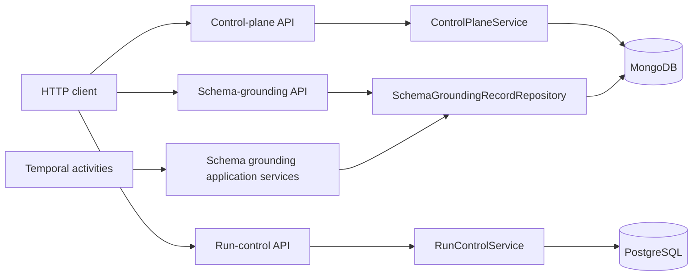
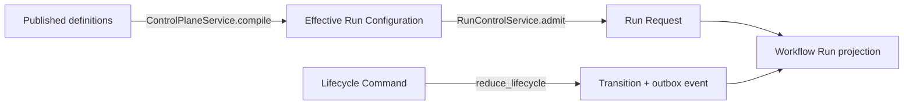
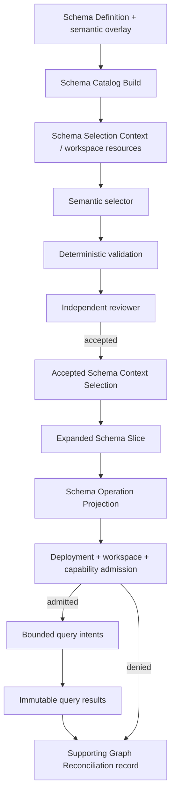

# Current codebase and domain-workflow guide

> **Status — current/as-built reference.** This guide preserves a description of the executable
> code as built; it is not the target organization. Planned direction is governed by
> [`CANONICAL_APPLICATION_CODEBASE_ORGANIZATION.md`](CANONICAL_APPLICATION_CODEBASE_ORGANIZATION.md)
> and the
> [accepted implementation index](migrations_instructions/implementation_work_packages/00_MAIN_GOAL_AND_INDEX.md).
> Where they conflict, those target documents govern planned work, while executable code and
> tests govern current behavior.

This guide explains the current `app/` codebase using the domain language in
[`biotech-meta/docs/CONTEXT.md`](../../biotech-meta/docs/CONTEXT.md). It traces the
FastAPI surfaces into application services and domain functions, then follows the
Schema Context Selection and Supporting Graph Reconciliation paths in more detail.

This is a description of the code as it exists now. It distinguishes:

- **domain-defined** behavior: contracts, invariants, and workflow definitions exist;
- **application-implemented** behavior: a service or pure function performs the behavior;
- **runtime-connected** behavior: the production server or worker can currently invoke it;
- **query-exposed** behavior: an HTTP route can currently retrieve its durable result.

That distinction matters because schema grounding is substantially implemented, but not every
defined StageGraph stage is connected end to end in the current production worker.

## 1. Executive view

The application currently has three HTTP control surfaces:

| Router | Primary responsibility | Authoritative storage |
| --- | --- | --- |
| `/control-plane/v1` | Author and publish Workflow Types, blueprints, profiles, configurations, aliases, and compile an Effective Run Configuration | MongoDB plus content-addressed payload storage |
| `/run-control/v1` | Admit Workflow Runs, apply lifecycle commands, inspect lifecycle/budget state, and submit the generic artifact operation | PostgreSQL; Temporal for submitted operation execution |
| `/schema-grounding/v1` | Read immutable schema-grounding records and export their JSON Schemas | MongoDB/Beanie schema-grounding record collection |

The schema-grounding router is intentionally a **read model**, not a workflow command API.
Catalog construction, schema derivation, and graph reconciliation enter through Temporal
activities. Semantic selection is an application-owned workflow invoked by tests and the
experiment runner, but it is not yet registered as a production HTTP command or as a concrete
StageGraph operation executor.

## 2. How the layers correspond to the domain language

The slightly outdated project-organization note remains directionally correct:

| Code layer | What it means now |
| --- | --- |
| [`app/api/`](../app/api/) | Transport, dependency composition, authentication/authorization checks, timestamps, and response shaping |
| [`app/application/`](../app/application/) | Use-case coordination, ports, repositories, persistence boundaries, and application-owned workflows |
| [`app/domain/`](../app/domain/) | Frozen contracts, deterministic validation/reducers/compilers, canonical digests, and workflow definitions |
| [`app/integrations/`](../app/integrations/) | MongoDB, PostgreSQL, S3, Neo4j, OpenAI Agents SDK, and Temporal adapters |
| [`app/temporal/`](../app/temporal/) | Durable execution mechanics and activity entry points; not the source of domain truth |
| [`app/models/`](../app/models/) | Persistence-facing documents |
| [`app/experiments/schema_context_selection/`](../app/experiments/schema_context_selection/) | The current end-to-end experimental harness and diagnostic adapters |

The newer schema packages were added after
[`project-organization.mdc`](../.cursor/rules/project-organization.mdc):

- `app/domain/schema_catalog/` models and deterministically derives the Schema Catalog.
- `app/domain/schema_context/` owns selection, review, expansion, projection, and query
  contracts/invariants.
- `app/domain/schema_grounding/` owns catalog-build, workspace-binding, graph-admission,
  reconciliation, and Workflow Type/control-plane definitions.

This generally conforms to the rule that business truth belongs in `domain` and
`application`, while vendor mechanics remain in `integrations`, `temporal`, and `api`.

## 3. The two control flows

There are two related but different flows.

### 3.1 Control and lifecycle flow

This flow defines what may run, compiles its authority, admits a run, and controls its
lifecycle:

This is the implementation of the `CONTEXT.md` concepts **Workflow Type**,
**Workflow Execution Blueprint**, **Effective Run Configuration**, **Run Request**,
**Workflow Run**, **Workflow Lifecycle Command**, **Workflow Run Lifecycle Reducer**,
**Workflow Lifecycle Transition Record**, **Budget Envelope**, and
**Workflow Domain Event Envelope**.

### 3.2 Schema-grounding data flow

This flow creates and consumes schema context:

The code intentionally prevents an agent-selected subset from becoming graph authority by
itself. Semantic membership, structural closure, purpose-specific query authority, deployment
compatibility, and runtime capability are separate decisions.

## 4. FastAPI route-to-domain trace

[`app/server.py`](../app/server.py) creates the FastAPI application, installs middleware,
registers domain exception handlers, and includes all three routers. Its lifespan initializes
the run-control PostgreSQL pool. The control-plane Mongo client is initialized lazily.

Authentication is a deployment seam: `get_control_plane_principal()` currently raises HTTP
503 until deployment code overrides the dependency. Therefore the authenticated routes are
implemented but are not usable in a standalone server without that composition.

### 4.1 Control-plane routes

Router: [`app/api/control_plane.py`](../app/api/control_plane.py)  
Service: [`app/application/control_plane.py`](../app/application/control_plane.py)

| Route | API work | Application call | Domain behavior and persistence |
| --- | --- | --- | --- |
| `POST /control-plane/v1/definitions` | Requires publisher; supplies server time | `ControlPlaneService.publish()` | Validates definition shape/extensions, then `DefinitionRepository.publish()` stores an immutable revision |
| `PUT /control-plane/v1/drafts` | Requires author/publisher; supplies server time | `save_draft()` | Validates shape, stores mutable authoring head |
| `GET /control-plane/v1/drafts/{kind}/{logical_id}` | Requires author/publisher | `get_draft()` | Reads the authoring head |
| `POST /control-plane/v1/drafts/publish` | Requires publisher | `publish_draft()` | Reads exact draft revision, detects stale publication, validates, publishes immutable definition |
| `POST /control-plane/v1/aliases` | Requires publisher/operator | `move_alias()` | Moves a mutable alias to an exact immutable definition |
| `POST /control-plane/v1/aliases/resolve` | Resolves selector | `resolve_alias()` | Reads current alias binding |
| `POST /control-plane/v1/compile` | Verifies actor, tenant, and compilation ceiling | `compile()` | Resolves exact definitions, verifies allowed combinations/authority, calls `compile_effective_run_configuration()`, then stores content-addressed ERC metadata/payload |
| `GET /control-plane/v1/effective-run-configurations/{digest}` | Public service dependency only | `retrieve()` | Reads inline or externalized ERC and revalidates its digest |
| `POST /control-plane/v1/definitions/retire` | Requires publisher/operator | `retire()` | Retires an immutable definition without rewriting it |
| `GET /control-plane/v1/schemas` | None | None | Exports JSON Schema from the same Pydantic domain contracts |

The domain compiler is
[`app/domain/control_plane/compiler.py`](../app/domain/control_plane/compiler.py). It is the
important boundary between individually published definitions and one immutable
**Effective Run Configuration**. API input is not itself authority; the compiler intersects
the selected definitions and caller ceiling.

The schema-specific definitions are authored in
[`app/domain/schema_grounding/definitions.py`](../app/domain/schema_grounding/definitions.py).
They define:

- `schema-context-selection` as a Workflow Type with a five-stage StageGraph;
- `supporting-graph-reconciliation` as a Workflow Type with a nine-stage StageGraph;
- control, runtime, workspace, and evaluation profiles;
- official Workflow Configurations;
- a required-blocking linked-run slot from reconciliation to selection; and
- schema-grounding extension payloads naming operation and output contracts.

`schema_grounding_definitions()` currently has no production bootstrap caller. Tests publish
the returned definitions, and the normal definition API can publish them, but server startup
does not do so automatically.

### 4.2 Run-control routes

Router: [`app/api/run_control.py`](../app/api/run_control.py)  
Service: [`app/application/run_control.py`](../app/application/run_control.py)

| Route | API work | Application/domain trace |
| --- | --- | --- |
| `POST /run-control/v1/run-requests` | Verifies scope, idempotency issuer, actor permissions, sponsorship, approvals, and server time | `RunControlService.admit()` → `F1RunConfigurationVerifier.verify()` → exact configuration/budget/parent checks → schema-specific `AdmissionPolicyRegistry` validator → atomic `commit_admission()` |
| `POST /run-control/v1/runs/{run_id}/commands` | Verifies path/body identity, tenant, idempotency issuer, and actor authority | `RunControlService.execute()` → load run and budget → pure `reduce_lifecycle()` → atomic projection/budget/transition/outbox commit |
| `POST /run-control/v1/runs/{run_id}/operations` | Requires an active run, exact operation-to-run revision/config binding, and a live budget reservation | Injected `GenericArtifactSubmissionPort.submit()`; the available Temporal adapter runs `GenericArtifactWorkflow`. The ordinary server lifespan does not install this dependency, and this is not the schema selection start path |
| `GET /run-control/v1/runs/{run_id}` | Read/scope authorization | Repository `get_run()` |
| `GET /run-control/v1/runs/{run_id}/budget` | Read/scope authorization | Repository `get_budget()` |
| `GET /run-control/v1/runs/{run_id}/transitions` | Read/scope authorization | Repository `list_transitions()` |
| `GET /run-control/v1/outbox` | Requires relay permission | Repository `list_outbox()` via `pending_outbox()` |
| `GET /run-control/v1/schemas` | None | Exports run/lifecycle/budget/operation JSON Schemas |

Schema Workflow Type admission is connected here through
[`app/application/schema_grounding_admission.py`](../app/application/schema_grounding_admission.py).
The policy registry requires exact evidence-reference prefixes:

- selection: catalog build, workspace binding, and selection brief;
- reconciliation: accepted selection, operation projection, deployment manifest, workspace
  binding, graph capability, and bounded query plan.

This is a concrete implementation of an **Input Admission Contract**, though the current
validator uses evidence-reference prefixes rather than resolving and validating all referenced
records at admission time. Exact record validation happens later at graph admission and service
boundaries.

The pure lifecycle authority is
[`app/domain/run_control/reducer.py`](../app/domain/run_control/reducer.py). Temporal, HTTP,
humans, and agents do not directly mutate run state; they submit typed commands to the service,
which delegates transition legality to this reducer.

### 4.3 Schema-grounding query routes

Router: [`app/api/schema_grounding.py`](../app/api/schema_grounding.py)  
Repository: [`app/application/schema_grounding_repository.py`](../app/application/schema_grounding_repository.py)

All these routes authorize tenant scope and operator/scheduler/auditor read roles, then read an
immutable record envelope and validate its payload into the response contract.

| Route | Record read | Meaning |
| --- | --- | --- |
| `GET /schema-grounding/v1/catalog-builds/{build_id}` | `("catalog_build", build_id)` | Published Schema Catalog Build metadata |
| `GET /schema-grounding/v1/catalog-builds/{build_id}/resources` | Calls `get_catalog_build()` | Read-only catalog resource manifest |
| `GET /schema-grounding/v1/selections/{selection_id}` | `("accepted_selection", selection_id)` | Accepted semantic selection plus validation/review lineage |
| `GET /schema-grounding/v1/projections/{projection_id}` | `("operation_projection", projection_id)` | Purpose-bound graph read projection |
| `GET /schema-grounding/v1/runs/{run_id}/binding` | Latest run `workspace_binding` | Exact run/catalog/profile materialization binding |
| `GET /schema-grounding/v1/runs/{run_id}/compatibility` | Latest `compatibility_decision` | Deployment/workspace/capability graph-admission decision |
| `GET /schema-grounding/v1/runs/{run_id}/reconciliation` | Latest `reconciliation` | Bounded observational result and evidence |
| `GET /schema-grounding/v1/runs/{run_id}/evaluation` | Latest `evaluation` envelope | Reconciliation counts and gate evidence |
| `GET /schema-grounding/v1/schemas` | None | JSON Schemas for public schema-grounding contracts |

There are no `POST` routes in this router. The write path is the append-only
`SchemaGroundingRecordRepository`, called by application services and Temporal activities.

## 5. Schema workflow, operation by operation

### 5.1 Catalog build

**Domain terms:** Schema Definition → Schema Catalog → Compact Schema Overview →
Schema Selection Context.

Runtime entry:
`schema_grounding.build_catalog` in
[`app/temporal/schema_grounding_activities.py`](../app/temporal/schema_grounding_activities.py).

Application service:
[`SchemaCatalogBuildService`](../app/application/schema_catalog_build.py).

Trace:

1. The Temporal activity receives a `SchemaCatalogBuildRequest` plus exact SDL, semantic
   overlay, and optional report-seed bytes.
2. `build()` calculates a request fingerprint and checks for an existing build identity.
   Exact replay returns the prior immutable record; conflicting reuse raises
   `CatalogPublicationConflict`.
3. `_verify_declared_inputs()` and `_build()` authenticate each supplied byte payload against
   its declared digest.
4. `parse_physical_schema()` parses the physical SDL view.
5. `parse_schema_catalog()` applies the governed semantic overlay and builds the logical,
   typed catalog.
6. The same inputs are parsed a second time. A changed logical digest is rejected as
   nondeterministic.
7. `materialize_schema_workspace()` renders Tier 0, candidate detail cards, navigation skill,
   profiles, and a resource manifest in an empty temporary directory.
8. The complete bundle is canonicalized and stored through a content-addressed payload port
   (S3 when configured).
9. A `SchemaCatalogBuildRecord` is appended to the schema-grounding repository. Failed builds
   append a rejection record.

`materialize_schema_workspace()` is in
[`app/application/schema_workspace.py`](../app/application/schema_workspace.py):

- `build_tier0()` produces the bounded, complete discovery surface.
- `select_workspace_candidates()` deterministically ranks nodes and relationships using report
  vocabulary, semantic aliases, topology, and reconciliation seed types.
- detail cards are generated only for the shortlist;
- `schema/overview/tier0.json` remains the global vocabulary/topology index;
- `schema/skills/schema-navigation/SKILL.md` instructs the agent not to invent names and not to
  treat schema files as graph authority.

This strongly matches **Schema Catalog**, **Compact Schema Overview**, and
**Schema Selection Context**. The candidate seed is currently report bytes and a digest, rather
than a fully typed/versioned **Schema Selection Brief**, so that term is only partially realized.

### 5.2 Semantic selection and independent acceptance

**Domain terms:** Schema Context Selection → Schema Selection Review.

Application workflow:
[`SchemaContextSelectionWorkflow`](../app/application/schema_context_selection.py).

Contracts:
[`app/domain/schema_context/contracts.py`](../app/domain/schema_context/contracts.py).

Trace:

1. A `SelectionAgentPort` produces a `SchemaContextSelection` draft.
2. The host writes `selection/draft.json` and can append a `selection_draft` record.
3. The pure `validate_selection()` function:
   - checks purpose and schema/catalog/report lineage;
   - rejects unknown node and relationship names;
   - checks that selected relationships touch selected topology;
   - reports structural endpoint nodes required later; and
   - warns when known legacy mappings are not addressed.
4. A separate `ReviewAgentPort` produces `SchemaSelectionReview`.
5. If the reviewer binds the wrong `selection_id`, the host persists the discarded attempt and
   retries the review once without rerunning selection.
6. Acceptance requires:
   - deterministic validation is structurally valid;
   - reviewer identity binds to the exact draft;
   - reviewer decision is `accepted`; and
   - reviewer also reports structural validity.
7. `accept_selection()` digests the selection, deterministic diagnostic, and independent review
   into an immutable `AcceptedSchemaContextSelection`.
8. If the first review requests revision, the selector receives the review findings and
   deterministic errors for one final semantic revision. The loop is bounded at two revisions.

The Pydantic contracts also enforce canonical sorting, unique node/relationship names, and
forbid properties as semantic selection members. `PropertyIntentHint` is explicitly a hint, not
a pruning authority.

This is a close implementation of the domain definitions. The noteworthy limitations are:

- `SelectionAgentPort` and `ReviewAgentPort` may be implemented by one adapter instance; the
  workflow comments say authority separation belongs in operation bindings, but this class does
  not independently prove different models, profiles, or actors.
- Evidence locators are strings, not typed durable Source Locators.
- The workflow persists immutable application records, but is not currently called from a
  production StageGraph operation executor.

The concrete sandboxed Agents SDK adapters live under
[`app/experiments/schema_context_selection/agents.py`](../app/experiments/schema_context_selection/agents.py).
Production code does not import that experiment package.

### 5.3 Deterministic expansion and projection

**Domain terms:** Expanded Schema Slice → Schema Operation Projection.

Runtime entry:
`schema_grounding.derive_context`.

Application service:
[`SchemaContextDerivationService`](../app/application/schema_context_derivation.py).

Pure domain functions:

- [`expand_selection()`](../app/domain/schema_context/expansion.py)
- [`build_operation_projection()`](../app/domain/schema_context/projection.py)

Trace:

1. `derive()` accepts only the purpose `read_query_reconciliation`.
2. It verifies the accepted selection belongs to the exact catalog and Schema Definition.
3. `expand_selection()` adds deterministic structural closure:
   - relationship endpoint nodes;
   - concrete members of union/interface endpoints;
   - relationship-property types;
   - required enums, unions, interfaces, directives, and index declarations;
   - selected SDL that is reparsed for validity.
4. Structural additions are recorded in diagnostics and do not alter the agent’s semantic
   selection.
5. `build_operation_projection()` reduces the expanded slice to read/query authority:
   - semantic labels and selected relationship types;
   - allowed properties and traversals;
   - identity fields;
   - online full-text/vector capabilities;
   - allowlisted query kinds and procedures;
   - result, limit, depth, and timeout bounds.
6. The service appends the expanded slice and projection as separate immutable records.

This is one of the strongest points of conformance. The code preserves the distinction between
agent-selected meaning, deterministic structural closure, and a narrower purpose-specific
runtime view.

### 5.4 Schema deployment, workspace, and graph-capability gate

**Domain terms:** Schema Deployment Manifest, Schema Workspace Materialization,
Operation Execution Binding/Execution Capability Profile, Supporting Graph Lookup.

Application service:
[`SchemaGraphAdmissionService`](../app/application/schema_workspace_binding.py).

The service fails closed before a Neo4j executor is created. It requires all three independent
authorities:

1. an active, non-revoked deployment manifest issued by the expected authority, bound to the
   exact environment, database, deployment, Schema Definition reference, and SDL digest;
2. a read-only, run-scoped workspace binding issued by the expected authority, bound to the
   exact catalog build, catalog digest, resource-manifest digest, runtime slot/profile, and
   purpose; and
3. a graph capability grant bound to the same run, purpose, environment, database, secret
   reference, and budget reservation.

The decision is persisted as `compatibility_decision`; the workspace binding is also persisted
for query retrieval.

This conforms well to the no-live-introspection-as-schema-authority rule and to capability
separation. Naming still carries issue-oriented authority prefixes (`issue-12:` and
`issue-13:`), which is implementation history rather than durable domain language.

### 5.5 Bounded Supporting Graph Reconciliation

**Domain term:** Supporting Graph Lookup, realized here as the
`supporting-graph-reconciliation` Workflow Type.

Runtime entry:
`schema_grounding.reconcile`.

Application workflow:
[`SupportingGraphReconciliationWorkflow`](../app/application/supporting_graph_reconciliation.py).

Graph query boundary:
[`app/application/graph_query.py`](../app/application/graph_query.py) and
[`app/integrations/schema_neo4j_executor.py`](../app/integrations/schema_neo4j_executor.py).

Trace:

1. The workflow digests the request plus optional supplied evidence and enforces immutable,
   idempotent reconciliation identity.
2. `SchemaGraphAdmissionService.decide()` runs before executor creation.
3. A denied gate produces and persists a `rejected` reconciliation without constructing a graph
   client.
4. The workflow enforces the request’s maximum intent count.
5. Previously persisted results are loaded by intent so safe replay does not rerun completed
   queries.
6. For each ordered intent:
   - persist the immutable intent;
   - verify contiguous sequence and exact projection/schema/selection lineage;
   - reject arbitrary Cypher;
   - intersect query kind, labels, relationships, limit, and depth with the capability grant;
   - lazily create the executor only for an admitted intent;
   - execute or create a typed rejected/failed result;
   - persist every result, including successful-zero, rejected, and failed.
7. `validate_query_intent()` performs the deeper projection checks, including requested
   properties, online index availability, secret/raw-embedding exclusion, and required
   parameters.
8. `compile_query_intent()` host-compiles allowlisted query kinds. Agents do not supply
   executable Cypher.
9. Supplied evidence must reference the exact persisted intent/result pairs. Otherwise the host
   creates conservative observational evidence.
10. The workflow persists both a reconciliation record and a separate evaluation envelope.

The default evidence explicitly says it does not claim broad **Knowledge Preflight** coverage,
does not resolve identity, and performs no graph mutation. That is a direct and useful
conformance safeguard.

## 6. Workflow definitions versus current runtime wiring

The code has a general StageGraph mechanism:

- [`StageGraphLaunchService`](../app/application/orchestration.py) resolves the exact admitted
  blueprint and creates immutable Temporal input.
- [`StageGraphInterpreter`](../app/domain/orchestration/interpreter.py) is the pure deterministic
  scheduler.
- [`StageGraphWorkflow`](../app/temporal/stagegraph_workflow.py) coordinates stages and sends all
  lifecycle facts back through `RunControlService`.
- [`StageGraphActivities`](../app/temporal/orchestration_activities.py) defines ports for a
  concrete stage operation executor and workflow evaluator.

Current connection status:

| Capability | Domain-defined | Application-implemented | Activity/worker connected | HTTP exposed |
| --- | --- | --- | --- | --- |
| Schema Catalog Build | Yes | Yes | Yes, schema-grounding activity worker | Read only |
| Schema Context Selection | Yes, including StageGraph | Yes | No concrete production selector/reviewer StageGraph executor | Accepted result read only |
| Schema Context Derivation | Yes | Yes | Yes, schema-grounding activity worker | Projection read only |
| Graph Admission | Yes | Yes | Called inside reconciliation activity | Decision read only |
| Supporting Graph Reconciliation | Yes, including StageGraph | Yes | Yes as one direct schema-grounding activity | Result/evaluation read only |
| Generic StageGraph orchestration | Yes | Yes | Factory exists, but `app/temporal/worker.py` does not construct/run it | No launch route |
| Linked-run orchestration | Yes | Yes | Linked-run worker is constructed | Managed through run-control/link services, not schema API |
| Schema definition publication | Yes | Yes | No automatic bootstrap | Generic control-plane publication API |

The production worker currently runs:

- the sandbox agent probe worker;
- the linked-run worker; and
- the schema-grounding activity worker.

It does **not** currently construct `create_stagegraph_worker()`. Therefore the StageGraph
blueprints accurately describe the intended workflows and are testable domain contracts, but
the production worker does not yet execute those schema stages through the generic StageGraph
path.

The direct reconciliation activity calls the whole
`SupportingGraphReconciliationWorkflow.run()` service. This means there are presently two
levels of workflow description:

1. the desired nine-stage StageGraph in the control plane; and
2. one application method that executes graph admission, intents, evidence, and evaluation as a
   single Temporal activity.

That is acceptable as an intermediate state, but it should not be described as fully wired
stage-by-stage orchestration.

## 7. Conformance assessment against `CONTEXT.md`

| Domain concept | Current realization | Assessment |
| --- | --- | --- |
| Schema Definition | Exact SDL reference and digest are required throughout catalog, selection, projection, deployment, and query lineage | Strong |
| Schema Deployment Manifest | Exact deployed SDL match plus active/revoked and authority checks | Strong |
| Schema Catalog | Deterministic typed parse, semantic overlay, repeat-build check, content-addressed bundle | Strong |
| Compact Schema Overview | Bounded Tier 0 with names, metadata, topology, identities/search indicators | Strong |
| Schema Selection Context | Tier 0 plus deterministic high-recall candidate detail cards and navigation skill | Strong |
| Schema Selection Brief | Report reference/digest, intended operations, and coverage obligations exist, but no distinct rich brief aggregate is built here | Partial |
| Schema Module / Module Definition | Catalog models expose module memberships, but this traced workflow does not visibly own a full reviewed module-definition lifecycle | Partial |
| Schema Workspace | Run-oriented materialized resource profiles exist; catalog build creates them in a temporary directory before durable bundling | Good, with ownership split |
| Schema Workspace Materialization | Deterministic resources and exact binding contracts exist; Issue 13 remains an external authority boundary | Good/partial |
| Schema Context Selection | Immutable, purpose-bound, exact lineage, explicit exclusions/unresolved/near misses | Strong |
| Schema Selection Review | Deterministic validation plus separate reviewer port and exact binding | Strong, though runtime identity separation is delegated |
| Expanded Schema Slice | Deterministic endpoint/type/directive/index closure without semantic expansion | Strong |
| Schema Operation Projection | Purpose-specific read authority with strict query/result bounds | Strong |
| Schema Context Selection Workflow | Workflow Type and application workflow exist | Partial runtime integration |
| Supporting Graph Lookup | Bounded observational query, exact schema context, immutable request/result evidence, no mutation | Strong |
| Knowledge Preflight boundary | Evaluation/evidence explicitly disclaims broad coverage and identity resolution | Strong |
| Workflow Type | Published-definition contracts exist for selection and reconciliation | Strong definition; publication is manual |
| Workflow Execution Blueprint / StageGraph | Application-owned acyclic stages, output slots, cycles, evaluation refs | Strong definition; production worker not composed |
| Input Admission Contract | Run-control policy registry enforces required evidence classes | Partial; some checks are prefix-based |
| Effective Run Configuration | Control-plane compiler resolves exact definitions and effective authority | Strong |
| Workflow Run lifecycle | PostgreSQL projection, pure reducer, append-only transitions, outbox | Strong |
| Run Composition Link | Selection is a required-blocking linked-run slot of reconciliation | Strong definition; schema end-to-end launch remains incomplete |
| Operation Execution Binding | Generic operation-execution contracts/runtime exist; schema agent ports are not yet wired through them in production | Partial |
| Evaluation | Reconciliation evaluation record and profile gates exist | Partial; profile gate execution is not shown in the direct activity path |

## 8. Important current-state caveats

1. **The schema API is read-only.** Creating a run through `/run-control/v1/run-requests`
   admits domain state; it does not automatically launch the schema StageGraph.
2. **The authenticated API requires deployment composition.**
   `get_control_plane_principal()` deliberately returns 503 until overridden.
3. **The generic artifact submission route also requires deployment composition.**
   `get_generic_artifact_submitter()` returns 503 unless a submitter is installed or the
   dependency is overridden; the acceptance/probe harness demonstrates that override.
4. **Schema definitions are not automatically seeded.**
   `schema_grounding_definitions()` is used by tests but has no application bootstrap caller.
5. **The generic StageGraph worker is not started by the main worker.**
   Its workflow, interpreter, activities, and factory exist, but no production composition
   supplies a schema-aware `StageOperationExecutor` and evaluator.
6. **Selection is application-complete but not production-invokable through a first-class
   transport.** Tests and the experiment harness invoke it directly.
7. **Reconciliation is directly activity-backed, not stage-backed.**
   The application workflow is real and durable at its record boundaries, but the declared
   nine stages are not individually dispatched by Temporal in the current worker.
8. **The experiment harness is the closest end-to-end executable demonstration.**
   [`ReportGraphReconciliationWorkflow`](../app/experiments/schema_context_selection/reconciliation_workflow.py)
   materializes a workspace, runs selection/review, expands, projects, gates, queries, evaluates,
   and writes a final result. It should be read as a proving harness, not as production domain
   authority.

## 9. A practical reading order

To understand one workflow without getting lost in infrastructure, read in this order:

1. [`CONTEXT.md`](../../biotech-meta/docs/CONTEXT.md), especially Schema Definition through
   Schema Context Selection Workflow, then Workflow Type through Run Input Manifest.
2. [`app/domain/schema_grounding/definitions.py`](../app/domain/schema_grounding/definitions.py)
   for the intended Workflow Types, stages, authority, workspace, and evaluation declarations.
3. [`app/domain/schema_context/contracts.py`](../app/domain/schema_context/contracts.py) for the
   artifacts passed between operations.
4. [`app/application/schema_context_selection.py`](../app/application/schema_context_selection.py)
   plus [`validation.py`](../app/domain/schema_context/validation.py) for selection acceptance.
5. [`expansion.py`](../app/domain/schema_context/expansion.py) and
   [`projection.py`](../app/domain/schema_context/projection.py) for the semantic-to-structural-
   to-operational transformation.
6. [`schema_workspace_binding.py`](../app/application/schema_workspace_binding.py) and
   [`supporting_graph_reconciliation.py`](../app/application/supporting_graph_reconciliation.py)
   for the graph gate and observational workflow.
7. [`app/api/schema_grounding.py`](../app/api/schema_grounding.py) to see how durable results are
   retrieved.
8. [`app/api/run_control.py`](../app/api/run_control.py) and
   [`app/application/run_control.py`](../app/application/run_control.py) to see how a Workflow
   Run is admitted and controlled independently of its operation implementation.
9. [`app/temporal/worker.py`](../app/temporal/worker.py) last, to compare intended definitions
   with what is actually composed at runtime.

## 10. The most useful mental model

The current code does not define a workflow as “one API handler that calls several helper
functions.” It defines a workflow across four planes:

| Plane | Question answered |
| --- | --- |
| Control plane | What exact Workflow Type, blueprint, profiles, configuration, authority, and budget may be used? |
| Run-control plane | Was this particular run admitted, and what lifecycle transition is valid now? |
| Operation/application plane | What semantic work happens, what invariants accept its output, and what immutable evidence is recorded? |
| Runtime/integration plane | Which Temporal activity, agent runtime, sandbox, database, graph executor, or object store performs the mechanics? |

For Schema Selection, the domain design is already visible and coherent:

> a bounded selection context is presented to a selector; the host validates exact lineage and
> schema names; an independent reviewer decides semantic coverage; acceptance creates an
> immutable purpose-bound selection; deterministic code adds structural closure; another
> deterministic projection narrows that closure into read authority; and a separate deployment,
> workspace, capability, and budget gate must pass before any graph read occurs.

The remaining work is mainly integration: publish the definitions, connect a concrete
schema-aware StageGraph operation executor/evaluator, launch admitted StageGraph runs, and
decide whether the direct reconciliation activity remains a coarse operation or is decomposed
into the declared stages.

## 11. Implementation-binding prototype update

The control plane now has an additive
`WorkflowImplementationBindingDefinition` prototype that binds one exact semantic Workflow Type
revision to an exact blueprint/profile/configuration tuple, typed obligation realizations, typed
output-contract realizations, and conformance evidence.

The Supporting Graph Reconciliation prototype has:

- a default staged implementation that executes the five host-required intents directly; and
- a named GoalDirected alternative that preserves the bounded agent query planner.

Both were run live with `gpt-5-mini` against the accepted workload and passed all nine comparison
gates. The staged default was substantially faster and cheaper. Generic production GoalDirected
Temporal dispatch is still not implemented; the alternative currently runs through the
application-owned experiment adapter.

See
[`WORKFLOW_IMPLEMENTATION_BINDINGS_PROTOTYPE.md`](WORKFLOW_IMPLEMENTATION_BINDINGS_PROTOTYPE.md)
for the contract shape, live results, rejected-run evidence, and next runtime slice.
