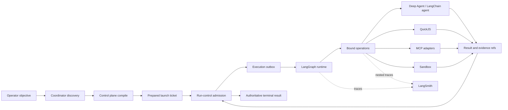
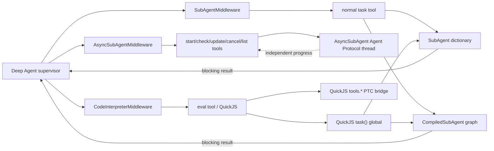
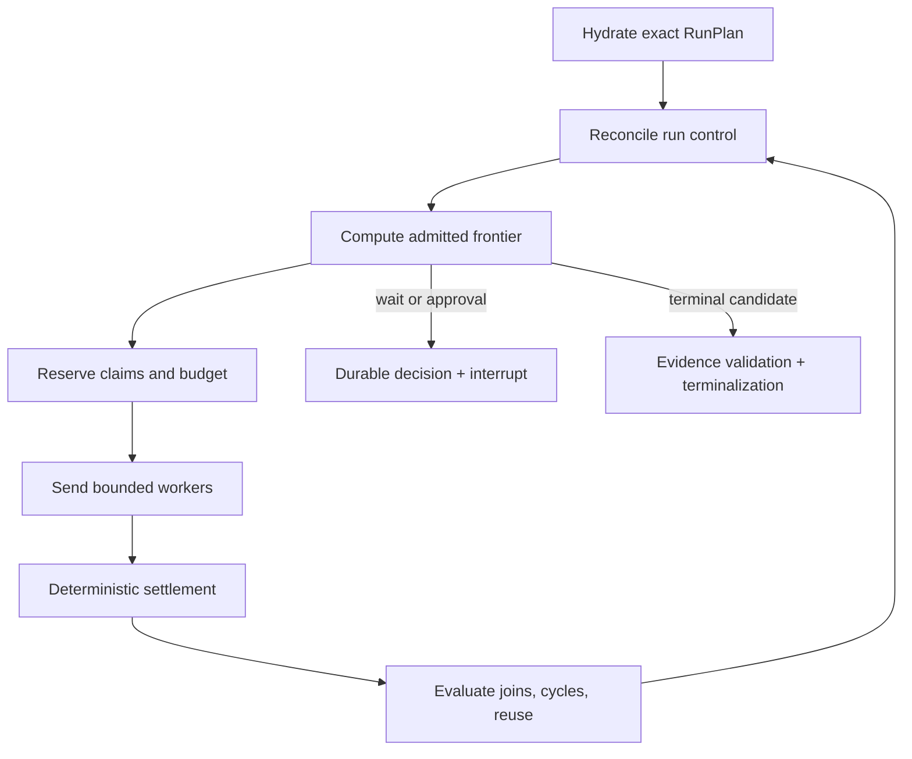
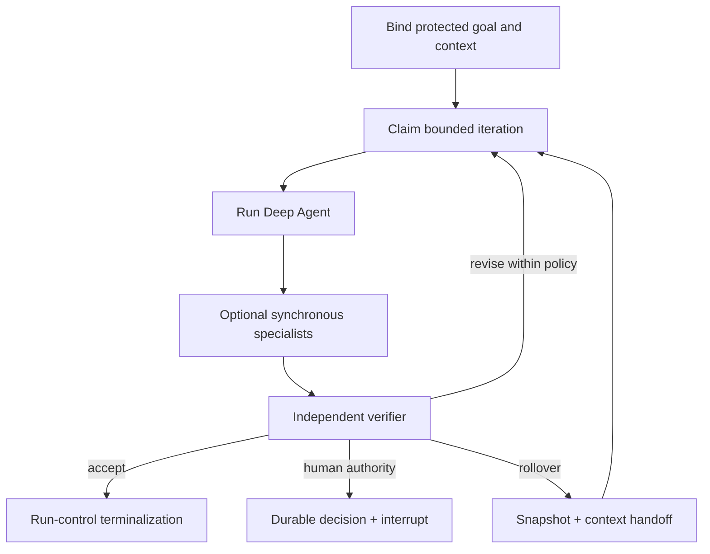
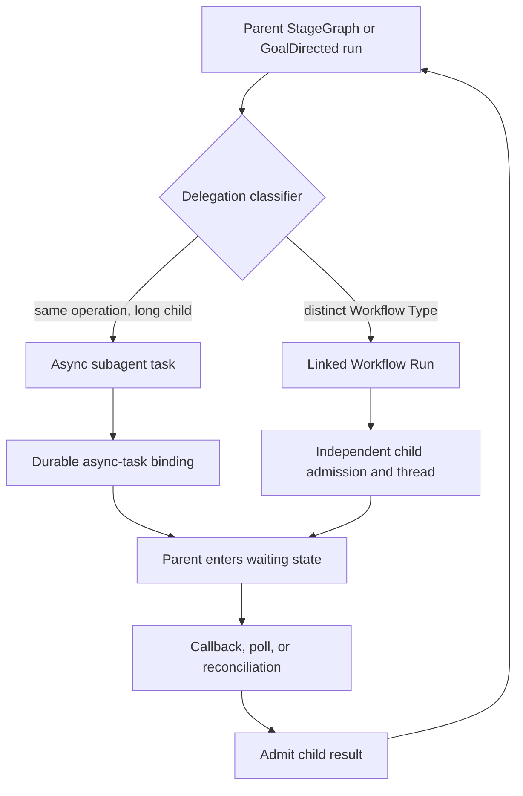

# Controlled Runs in the LangChain–LangGraph–Deep Agents–LangSmith Ecosystem

## Proof of representation for the BellLabs coordinator, control plane, and run control

**Status:** architecture representation; not executable code and not an accepted product contract  
**Date:** 2026-08-02  
**Scope:** search, discovery, exact compilation, governed run creation, LangGraph execution, Deep Agents operation harnesses, MCP, tools, skills, prompts, snapshots, delegation, QuickJS, and LangSmith evidence

## Executive position

BellLabs should integrate LangGraph and Deep Agents as an execution system beneath the existing control-plane and run-control authorities—not as their replacement.

The compact system narrative is:

> **Discover broadly, select narrowly, compile exactly, admit authoritatively, execute from frozen bindings, reconcile continuously, and terminalize only from accepted evidence.**

The current code already proves most of the governance spine:

- immutable and content-addressed control-plane definitions;
- pure compilation into an Effective Run Configuration (ERC);
- authority, budget, concurrency, environment, and overlay intersection;
- preview-before-launch and immutable prepared launch tickets;
- idempotent run admission and optimistic lifecycle commands;
- multidimensional budget accounting and continuation decisions;
- exact operation bindings for prompts, models, tools, MCP servers, skills, delegates, workspaces, secrets, policies, and snapshots;
- clone-on-restore snapshots that never restore credentials or live authority;
- a coordinator MCP surface and Agent Skill that enforce internal-first discovery and exact launch preparation.

LangGraph, Deep Agents, and LangSmith add the missing execution substrate:

- durable graph execution, checkpoints, interrupts, replay, and streaming;
- an agent harness with planning, filesystem context, skills, context management, and **synchronous subagents** defined either as `SubAgent` dictionaries or reusable `CompiledSubAgent` graphs;
- `SubAgentMiddleware` and its blocking `task` tool for direct synchronous delegation;
- **asynchronous subagents** declared as `AsyncSubAgent` graph/assistant references and controlled through `AsyncSubAgentMiddleware` lifecycle tools;
- `CodeInterpreterMiddleware` and its bounded QuickJS `eval` tool for in-process JavaScript, stateful computation, and optional programmatic tool calling;
- **dynamic subagents**, where interpreter code uses the QuickJS `task()` global to route, loop, fan out, recursively analyze, and synthesize across configured subagents;
- outbound MCP adaptation;
- sandboxed shell/filesystem/browser mechanics;
- hierarchical tracing, datasets, evaluators, and operational inspection.

The integration should therefore add a **runtime assembly layer**, not a second lifecycle model.

## 1. What this document represents

This document is a proof that the current BellLabs concepts can be represented as one coherent controlled-run system in the LangChain ecosystem. It is deliberately more concrete than a vision document and less prescriptive than implementation code.

It establishes:

1. the authority and persistence boundaries;
2. the coordinator’s optimal search-to-launch process;
3. a compact representation of an exact runnable assembly;
4. three useful run variations;
5. enhanced contracts and naming conventions;
6. failure, pause, resume, reconciliation, and terminalization semantics;
7. the limits of Deep Agents, MCP, snapshots, subagents, and QuickJS.

It does not claim that the LangGraph/Deep Agents dependencies or graph entry points are installed today. The migration plan records that these remain target dependencies requiring a pinned compatibility qualification.

## 2. Grounded current-state inventory

### 2.1 Control plane: semantic authority and exact compilation

The present control plane provides strict, frozen Pydantic definitions and exact references containing `kind`, `logical_id`, `revision`, and canonical SHA-256 digest.

Its current executable definition families include:

| Existing definition | Present meaning |
|---|---|
| `WorkflowTypeDefinition` | Semantic purpose, admission contract, invariants, obligations, outputs, authority ceiling, workspace contract, and linked-run slots |
| `WorkflowImplementationBindingDefinition` | One approved realization of a Workflow Type through a blueprint and exact control/runtime/workspace/evaluation profiles |
| `StageGraphBlueprint` | Host-owned staged topology with dependencies, joins, fairness, concurrency, reservations, cycles, obligations, and output slots |
| `GoalDirectedBlueprint` | Bounded adaptive topology with protected scope, iteration budget, convergence, rollover, and independent verification |
| `ControlProfileDefinition` | Variants, authority ceiling, and permitted strengthen-only overlays |
| `RuntimeProfileDefinition` | Runtime binding, required capabilities, secrets, and availability policy |
| `WorkspaceTemplateDefinition` | Logical workspace slots and their access modes |
| `EvaluationProfileDefinition` | Required gates and evaluation capabilities |
| `PromptDefinition` | Exact prompt body or payload, variable schema, trust class, and evaluation refs |
| `SkillDefinition` | Immutable skill bundle, file manifest, compatibility, provenance, and review status |
| `MCPServerDefinition` / `MCPToolDefinition` | Reviewed transport recipe, credentials by reference, exact allowlist, schema snapshot/digest, side-effect class, and approval posture |
| `AgentProfileDefinition` | Exact prompt, skill, MCP, tool, model, guardrail, output, and maximum capability request |

`compile_effective_run_configuration(...)` is a pure boundary. It validates exact publication evidence, checks implementation conformance, intersects every authority ceiling, verifies environment and secret availability, applies only permitted overlays, and emits a content-addressed ERC.

That ERC is the immutable semantic input to execution. Framework configuration must be derived from it; framework configuration must never reinterpret or widen it.

### 2.2 Run control: lifecycle and budget authority

The current `reduce_lifecycle(...)` function is the authoritative lifecycle state machine. Its important properties are:

- expected-version compare-and-set semantics;
- permission checks for each lifecycle action;
- stable commands, transitions, events, and outbox identities;
- explicit pending, active, waiting, paused, cancelling, and terminal phases;
- separate terminal outcome and output readiness axes;
- multidimensional reservations, consumption, pending settlement, and hard caps;
- typed continuation proposals at soft limits;
- explicit finalization plans that freeze the evidence frontier;
- terminalization only from an accepted `TerminalizationProposal`.

A LangGraph checkpoint can cache a projection of this state. It cannot perform or authorize these transitions by itself.

### 2.3 Operation execution: the existing anti-corruption layer

`OperationExecutionRequest` and `OperationExecutionBinding` already contain the right conceptual seam between BellLabs and any agent framework:

- semantic operation attempt identity;
- exact prompt segments and trust classes;
- model and fallback policy;
- tool schemas and approval policies;
- MCP server bindings and allowlists;
- immutable skills and plugins;
- guardrails and structured output;
- delegation bindings and an intersected delegation ceiling;
- workspace contract and exact mounts;
- secret references rather than secret values;
- budget reservation and limits;
- trace, sensitive-data, and snapshot policies;
- stable side-effect key.

The binding should be extended to select a LangChain or Deep Agents harness. It should not be replaced with loose `create_agent(...)` keyword arguments.

### 2.4 Coordinator surface: current discovery and launch discipline

The coordinator MCP server currently exposes the essential coarse-grained operations:

```text
coordinator_bootstrap
search_capabilities
get_capability
discover_mcp_servers
discover_agent_skills
inspect_external_candidate
validate_workflow_design
prepare_workflow_launch
launch_workflow
get_workflow_result
```

Its resource surface provides exact Workflow Type contracts, catalog assets/manifests, and run launch/binding/result views. Its current prompt surface names four coordinator prompts, while composition may expose only those whose exact definitions and payloads are actually available.

The project-local `belllabs-workflow-coordinator` Agent Skill correctly establishes:

- Workflow Type search before topology design;
- internal catalog search before external discovery;
- external results as quarantined candidates, never executable authority;
- exact rehydration before selection;
- validation before preparation;
- preparation before consequential launch;
- exact run identity and typed result retrieval after launch.

### 2.5 Current gap

The public discovery surface remains mostly generic, and the runtime contracts do not yet encode the complete LangGraph/Deep Agents assembly. In particular, the current operation delegation contract distinguishes `handoff` and `task_subagent`, but it does not represent either the two synchronous construction forms or the four target continuity modes.

Synchronous construction forms:

1. dictionary-based `SubAgent`;
2. graph-based `CompiledSubAgent`.

Continuity modes:

1. synchronous subagent;
2. dynamic interpreter subagent;
3. asynchronous subagent;
4. linked Workflow Run.

The axes are related but not interchangeable. `SubAgent` and `CompiledSubAgent` answer **how a blocking child is constructed**. Dynamic dispatch answers **how QuickJS programmatically invokes configured blocking children**. `AsyncSubAgent` answers **how a stateful background graph is addressed and controlled through Agent Protocol**. A linked run answers **when the child crosses a BellLabs Workflow Type and authority boundary**.

Similarly, the current ERC references runtime and operation assets but does not yet contain a frozen graph assembly, middleware order, context assembly, interpreter profile, or durable async-task policy.

The current launch path is also still provider-shaped around `WorkflowSubmission.workflow_id`, `temporal_run_id`, and a Temporal-backed dispatcher. The repository does not yet declare the target LangChain, LangGraph, Deep Agents, MCP-adapter, QuickJS, Sandbox, or Agent Server dependencies, and it has no `langgraph.json`. Those are explicit migration gaps, not hidden implementation assumptions in this representation.

The intended anti-corruption mapping is:

| Current seam | LangGraph/Deep Agents target |
|---|---|
| `WorkflowImplementationBindingDefinition` | Selects an exact compatible graph and operation implementation set |
| `RuntimeProfileDefinition.binding` | Resolves to a `GraphAssemblyDefinition` and deployment compatibility contract |
| `OperationExecutionBinding` | Constructs one deterministic, LangChain-agent, Deep-Agent, MCP, QuickJS, sandbox, or human operation |
| `WorkflowSubmission.workflow_id` / `temporal_run_id` | Replaced by provider-neutral submission plus `RuntimeExecutionBinding` with qualified Agent Server identities |
| `DelegationBinding` | Evolves into explicit synchronous construction, interpreter/dynamic, asynchronous, and linked-run policies |
| `WorkspaceContract` | Selects the Deep Agents backend and/or sandbox mounts without changing logical workspace authority |
| `SandboxSnapshot` | Remains the governed clone-on-restore artifact beneath LangSmith Sandbox mechanics |
| `RuntimeEventEnvelope` and run-control outbox | Feed resumable BellLabs events while LangGraph/LangSmith streams remain runtime/observability projections |

## 3. Target authority model

The following ownership map is the central representation:

| Layer | Owns | Must not own |
|---|---|---|
| Coordinator | Intent normalization, discovery sequence, proposal construction, presentation of blockers | Authority grants, mutable alias selection after preparation, lifecycle transitions |
| BellLabs control plane | Published definitions, aliases, compilation, ERC, exact assembly specifications | Runtime checkpoints or active execution state |
| BellLabs run control | Admission, lifecycle CAS, budgets, waits, approvals, interventions, terminality, outbox | Agent messages or framework retry loops |
| LangGraph / Agent Server | Execution scheduling, checkpointing, suspension, resume, streaming, runtime threads/runs | Semantic admission, budgets, evidence acceptance, terminal success |
| LangChain / Deep Agents | Bounded model-tool loop, filesystem context, planning, skills, subagents, compaction | Workflow topology authority or self-granted capabilities |
| MCP adapters | Transport to reviewed external tool servers | Selection of unreviewed tools or bypass of BellLabs wrappers |
| QuickJS | Bounded in-process JavaScript and explicitly injected programmatic calls | Security sandboxing, ambient filesystem/network/shell/secrets, lifecycle authority |
| Sandbox | Isolated shell, files, packages, browser, OS processes | Durable authority or automatic artifact admission |
| LangSmith | Traces, Studio, datasets, evaluators, online feedback | Run lifecycle or scientific truth |
| Artifact/Snapshot store | Immutable files, snapshots, reports, large results | Credentials, leases, or current capability grants |



The invariant is simple: **execution produces claims and evidence; BellLabs accepts, rejects, settles, and terminalizes them.**

## 4. Compact representation model

The existing definitions remain valuable, but the coordinator needs a smaller number of concepts. Reduce the visible configuration surface without collapsing authority boundaries.

### 4.1 Seven coordinator-facing nouns

| Coordinator noun | Existing and target contracts hidden behind it |
|---|---|
| **Workflow** | Workflow Type plus an approved Workflow Implementation |
| **Capability** | Prompt, model, skill, tool, MCP, filesystem, interpreter, sandbox, or delegation capability with exact implementation and maturity facts |
| **Run Plan** | ERC plus graph, context, harness, middleware, and delegation assembly specs |
| **Launch Ticket** | Immutable, expiring, actor/tenant/policy/environment-bound prepared launch |
| **Run** | BellLabs Workflow Run and authoritative lifecycle projection |
| **Runtime Binding** | Exact Agent Server deployment, graph assembly, thread, run, epoch, and checkpoint correlation |
| **Result** | Typed outcome, readiness, accepted evidence, artifacts, usage, warnings, and provenance |

These nouns are read models and facades, not replacements for the precise domain contracts.

### 4.2 One frozen `RunPlan`

The target ERC should reference one compact `RunPlan` representation:

```yaml
run_plan:
  semantic:
    workflow_type_ref: exact_ref
    implementation_ref: exact_ref
    input_manifest_ref: content_ref
    obligation_revision: exact_ref
    output_contract_refs: [exact_ref]
  control:
    effective_authority: authority_ceiling
    budget_envelope: multidimensional_limits
    max_concurrency: 4
    approval_policy_ref: exact_ref
    intervention_policy_ref: exact_ref
  graph:
    family: stagegraph | goal_directed
    graph_id: belllabs_stagegraph | belllabs_goal_directed
    assembly_digest: sha256:...
    state_schema_digest: sha256:...
    topology_version: 1
    stable_node_manifest_ref: content_ref
  operations:
    registry_digest: sha256:...
    bindings: [operation_implementation_ref]
  harnesses:
    profiles: [agent_harness_profile_ref]
    middleware_stack_ref: exact_ref
    context_policy_ref: exact_ref
    delegation_policy_ref: exact_ref
    synchronous_subagents:
      definitions: [subagent_definition_ref]
      default_general_purpose: disabled
      middleware_manifest_ref: exact_ref
    asynchronous_subagents:
      definitions: [async_subagent_definition_ref]
      middleware_manifest_ref: exact_ref
    interpreter:
      profile_ref: exact_ref | null
      dynamic_subagent_policy_ref: exact_ref | null
  resources:
    workspace_template_ref: exact_ref
    snapshot_policy_ref: exact_ref
    mcp_server_refs: [exact_ref]
    interpreter_profile_ref: exact_ref | null
    sandbox_profile_ref: exact_ref | null
  evaluation:
    profile_ref: exact_ref
    trace_policy_ref: exact_ref
    redaction_policy_ref: exact_ref
```

Every leaf is either an exact definition reference, a content digest/reference, or a compiled scalar bounded by authority. No mutable alias, credential value, ad hoc prompt, or model-authored grant appears in a `RunPlan`.

### 4.3 Recommended contract reduction

The migration plan proposes several new definition kinds. They can be organized into four reusable bundles:

| Bundle | Contains | Reason for grouping |
|---|---|---|
| `GraphAssemblyDefinition` | Graph runtime profile, state/reducer compatibility, stable node manifest, operation registry | These fields jointly define checkpoint-compatible graph mechanics |
| `AgentHarnessDefinition` | Harness kind, exact model/prompt, ordered middleware, context policy, filesystem backend, skills, tools, output schema | These fields jointly construct one bounded agent loop |
| `DelegationPolicyDefinition` | Synchronous construction kind, named child profiles, normal `task` policy, interpreter `task()` policy, async graph refs/transports, context slices, ceilings, and reconciliation | Delegation has distinct construction, dispatch, continuity, authority, and recovery axes |
| `ExecutionEnvironmentDefinition` | MCP transports, interpreter profile, sandbox profile, workspace and snapshot policy | These are execution resources whose compatibility and cleanup are compiled together |

Keep their submanifests independently content-addressed so a change can be diffed precisely. The reduction is in coordinator cognition and API payload size, not in audit detail.

## 5. The optimal coordinator process

### Phase A — search and discovery

#### Step 1: frame the request

Create an `IntentFrame` containing:

- objective and admitted inputs;
- requested output and evidence quality;
- explicit non-goals;
- time, token, tool-call, cost, page, and concurrency limits;
- write/network/approval posture;
- stopping conditions;
- whether adaptive discovery or long-running child work is actually needed.

The frame is not a prompt-only summary. Its accepted form becomes an Intake Brief or run input manifest reference.

#### Step 2: bootstrap the effective surface

Call `coordinator_bootstrap` and verify:

- available graph families;
- enabled tools, prompts, and resources;
- deployment readiness;
- caller/tenant/request scope;
- permitted discovery and launch operations;
- feature maturity for sync delegation, dynamic QuickJS delegation, async delegation, sandbox, and linked runs.

Unavailable capabilities are facts. They are not invitations to silently substitute another mechanism.

#### Step 3: search Workflow Types first

Use compact workflow cards and structured filters before loading full definitions. Rank on:

- semantic purpose and non-goals;
- accepted input/output kinds;
- StageGraph versus GoalDirected family;
- required operation classes;
- authority and workspace compatibility;
- evaluation and evidence obligations;
- environment availability.

Search rank is retrieval evidence only.

#### Step 4: rehydrate plausible exact contracts

For each candidate, read the exact Workflow Type and approved Implementation contract. Verify digest and retrieve progressively:

1. input/admission schema;
2. invariants and obligations;
3. output/evaluation contract;
4. workspace contract;
5. linked-run slots;
6. default implementation and relevant alternatives.

Discard a candidate as soon as a hard semantic or authority mismatch is established.

#### Step 5: search operation capabilities inside the selected envelope

Only after selecting a plausible Workflow Type, search exact internal definitions for:

- agent profiles;
- prompts;
- skills;
- MCP servers and individual MCP tools;
- model policies;
- filesystem/search/shell capabilities;
- sandbox and snapshot compatibility;
- delegation and interpreter modes.

The selection equation is:

```text
selectable capability
  = published and not retired
  ∩ Workflow Type allowlist
  ∩ Implementation allowlist
  ∩ caller and parent authority
  ∩ data and workspace policy
  ∩ approval state
  ∩ environment availability
  ∩ runtime/package compatibility
  ∩ feature maturity policy
```

If the internal catalog has a demonstrated gap, external MCP or skill discovery may produce a quarantined candidate. Inspection and governed promotion are separate work; the candidate cannot enter the pending run.

### Phase B — design and exact compilation

#### Step 6: choose the smallest sufficient run family

Use this decision rule:

| Work shape | Preferred representation |
|---|---|
| Known dependencies, stable obligations, parallel bounded work | StageGraph |
| Bounded adaptive planning with an acceptance contract | GoalDirected |
| Lightweight specialist, parent can block, standard agent loop is sufficient | Dictionary-based synchronous `SubAgent` |
| Reusable or governed specialist needing custom LangGraph topology/state/middleware | Synchronous `CompiledSubAgent` |
| In-memory JavaScript transform without child delegation | Interpreter through `CodeInterpreterMiddleware` |
| Programmatic fan-out/aggregation/recursion across configured blocking specialists | Interpreter plus dynamic subagents through QuickJS `task()` |
| Long child work needing progress, steering, cancellation, and its own thread | `AsyncSubAgent` plus `AsyncSubAgentMiddleware` |
| Distinct Workflow Type, authority, durable result, or independent admission | Linked Workflow Run |

Do not use agentic flexibility to obscure a known Workflow Type boundary.

#### Step 7: assemble the operation harness

Compile each agentic operation into an exact `AgentHarnessDefinition` with this logical middleware order:

1. `before_agent`: verify binding, phase, scope, budget, and trace identity;
2. `dynamic_prompt`: render only approved slots and record rendered-input/output digests;
3. `before_model`: retrieve, redact, compact/offload, and enforce context budget;
4. `wrap_model_call`: enforce exact model, timeout, retry, fallback, and usage capture;
5. `after_model`: validate structured output and proposed tool calls;
6. `wrap_tool_call`: enforce capability, approval, idempotency, timeout, cancellation, budget, and trace policy;
7. `after_agent`: persist compact refs, settle usage, snapshot/clean up, and emit events.

Reject duplicate or conflicting middleware. In particular, Deep Agents already supplies core filesystem, subagent, and context behavior; do not add a second copy without a qualified reason. Compilation must also expand middleware into its **prebuilt tool surface** so the coordinator can reason about what the harness will actually expose:

| Middleware | Attached condition | Model/interpreter-visible surface |
|---|---|---|
| `SubAgentMiddleware` | At least one synchronous subagent, including the enabled general-purpose child | Normal blocking `task` tool |
| `AsyncSubAgentMiddleware` | At least one configured `AsyncSubAgent` | `start_async_task`, `check_async_task`, `update_async_task`, `cancel_async_task`, `list_async_tasks` |
| `CodeInterpreterMiddleware` | Exact interpreter profile enabled | Model-visible `eval`; optional QuickJS `tools.*` PTC bridge; optional QuickJS `task()` subagent bridge |

The compiler must not infer that similarly named surfaces share lifecycle or approval behavior. The normal `task` tool, QuickJS `task()` global, and async-task tools are three different dispatch paths.

#### Step 8: validate and preview

Validation has two layers:

- local/advisory schema validation for fast feedback;
- authoritative server compilation, availability checks, and admission preview.

The preview must expose exact refs, overlay decisions, degradations, required approvals, environment incompatibilities, graph/harness assembly digest, and semantic difference from the default Implementation.

#### Step 9: prepare the launch ticket

`prepare_workflow_launch` freezes:

- proposal digest;
- exact Workflow Type and Implementation;
- ERC and `RunPlan` digests;
- input manifest and protected goal digest;
- selected asset refs;
- authority and availability decisions;
- budget/concurrency envelope;
- policy and environment snapshot digests;
- exact semantic binding plan;
- caller, tenant, request scope, idempotency identity, and expiry.

Preparation is not admission and does not reserve execution capacity indefinitely.

### Phase C — controlled creation and execution

#### Step 10: admit, bind, and dispatch

Launch revalidates the ticket context, then:

1. run control admits the frozen `RunRequest` idempotently;
2. the application persists the run’s semantic input binding;
3. an authoritative `RuntimeExecutionBinding` request and outbox event are committed;
4. the dispatcher creates/reuses the Agent Server thread for `(request_scope, belllabs_run_id, execution_epoch)`;
5. it records the Agent Server run and deployment facts;
6. only then may the graph become active.

An ambiguous Agent Server submission is reconciled by persisted metadata and submission key before retry.

#### Step 11: execute through claims and settlement

For every semantic operation:

1. compute stable semantic attempt identity;
2. reserve multidimensional budget and concurrency;
3. freeze the `OperationExecutionBinding`;
4. acquire a durable side-effect claim when applicable;
5. execute the selected deterministic function, agent, MCP operation, QuickJS program, sandbox job, or human decision;
6. persist immutable result/error/usage/evidence refs;
7. settle exactly once through run control;
8. advance the graph from the new authoritative projection.

Runtime retries reuse the same semantic identity. A governed semantic retry receives a new attempt identity and reservation.

#### Step 12: observe, interrupt, revise, and reconcile

- LangGraph `interrupt()` suspends execution; BellLabs stores the durable decision request and response.
- A resume value contains only the decision identity and digest.
- A run-control revision creates a successor effective configuration for future or affected work; it never rewrites prior bindings.
- Cancellation is requested through run control, cascades to graph operations, async tasks, MCP sessions, and sandboxes, then settles observed usage.
- Reconciliation compares BellLabs lifecycle/bindings with Agent Server, async child, MCP, sandbox, and effect-claim facts.

#### Step 13: terminalize and publish the result

The graph may propose terminalization but cannot declare success. Run control verifies:

- required obligations have accepted evidence;
- output evidence and the frozen frontier agree;
- required independent evaluation has passed;
- waits, linked work, async tasks, effects, cancellations, and budgets are settled;
- finalization used only the permitted evidence frontier and operations.

The typed result then records outcome, readiness, artifacts, evidence, operation bindings, usage, warnings, degradations, runtime binding, and trace refs.

## 6. Tool, filesystem, MCP, skill, prompt, and snapshot representation

### 6.1 Filesystem and grep tools

The ecosystem currently offers overlapping but distinct mechanics:

- LangChain `FilesystemFileSearchMiddleware` exposes `glob_search` and `grep_search` over an approved root, optionally using ripgrep.
- Deep Agents `FilesystemMiddleware` supplies a virtual filesystem surface including `ls`, `read_file`, `write_file`, `edit_file`, `delete`, `glob`, and `grep`; `execute` exists only with a sandbox backend.
- Deep Agents includes filesystem middleware as core harness scaffolding; the model-visible subset can be restricted.

BellLabs should represent these through stable capability IDs rather than vendor tool names:

| BellLabs capability | Possible runtime implementation |
|---|---|
| `filesystem.list` | Deep Agents `ls` |
| `filesystem.read` | Deep Agents `read_file` |
| `filesystem.write` | Deep Agents `write_file` / `edit_file` |
| `filesystem.search.glob` | Deep Agents `glob` or LangChain `glob_search` |
| `filesystem.search.content` | Deep Agents `grep` or LangChain `grep_search` |
| `execution.shell` | Sandbox-backed `execute` or reviewed shell middleware |

The operation binding selects one implementation per capability and records the exposed runtime tool name. Do not expose both `grep` and `grep_search` to the same model unless their scopes are intentionally different and clearly described.

Filesystem policy must specify root/mount, read/write/delete rights, file-size limits, excluded paths, sensitivity, artifact promotion rules, and whether contents live in checkpoint state, Store, or sandbox files. For deployed research work, real shell and mutable files belong in an approved sandbox.

### 6.2 Outbound and inbound MCP

Keep three surfaces separate:

1. **Inbound BellLabs coordinator MCP:** exposes governed discover, prepare, launch, observe, intervene, and result operations.
2. **Outbound operation MCP:** uses `MultiServerMCPClient` behind exact BellLabs bindings.
3. **Agent Server protocol/API:** manages graphs, threads, runtime runs, streams, and state.

For outbound MCP, discovery occurs outside model-visible context. The adapter compares observed server/tool names and schemas against exact catalog digests, then wraps each tool with BellLabs authorization, approval, idempotency, budget, timeout, retry, cancellation, and trace controls.

Selecting an MCP server never selects all of its tools. Stateful sessions are operation- or stage-scoped and tenant-specific; deployment-global credential-bearing sessions are forbidden.

### 6.3 Agent Skills

A Skill is an immutable reviewed instruction bundle with a file manifest, digest, compatibility facts, provenance, and read-only mount. It is useful context, not authority.

The coordinator skill tells the coordinator how to use the control surface. An operation skill tells a worker how to perform a bounded method. Neither can grant network access, process execution, credentials, workspace writes, MCP tools, budget, or delegation.

Each custom subagent that depends on a skill must receive the exact skill reference in its own binding. Skill inheritance from a parent is disabled unless compilation explicitly materializes it.

### 6.4 Prompt catalog and dynamic prompts

The catalog owns exact `PromptDefinition` revisions. A runtime prompt binding records:

- exact base prompt ref/digest;
- trust-classified prompt segments;
- variable schemas and approved source classes;
- rendered-input digest;
- rendered-output digest;
- rendering implementation/version;
- redaction and trace policy.

Dynamic instructions may describe current objective, budgets, tools, skills, subagents, workspace refs, and verifier feedback. They cannot grant any of them. Exact instructions, protected goals, approval facts, citation edges, and budget identities are never replaced by a model-written summary.

### 6.5 Four different “snapshot” concepts

Use qualified names because the word snapshot otherwise hides different authorities:

| Name | Meaning | Authority |
|---|---|---|
| `sandbox_snapshot` | Immutable filesystem/runtime capture with compatibility shape | Historical artifact; no current capability grant |
| `langgraph_checkpoint` | Runtime state position within a thread | Runtime fact; not BellLabs lifecycle authority |
| `context_manifest` | Content-addressed recipe for reconstructing bounded agent context | Immutable semantic/derived record |
| `environment_snapshot` | Observed deployment capabilities, package compatibility, and secret-ref availability used at preparation | Preparation evidence; launch must revalidate |

Restoring a `sandbox_snapshot` always clones to a new workspace and reacquires secrets, credentials, leases, MCP connections, and sockets. A snapshot’s historical tool/network shape is never treated as present authority.

## 7. Subagents, async subagents, interpreters, and dynamic subagents

These are four first-class Deep Agents features, but they are **not four equivalent child-agent types**. They occupy different middleware, dispatch, state, and recovery layers.

### 7.1 Feature map

| Feature | Definition supplied by configuration | Middleware / runtime surface | Supervisor behavior | Child continuity | Maturity posture |
|---|---|---|---|---|---|
| Synchronous subagent | `SubAgent` dictionary or `CompiledSubAgent` | `SubAgentMiddleware`; normal `task` tool | Blocks until result; several normal task calls may run in parallel within a turn | Operation-local/fresh invocation; no independent Agent Protocol thread | Core path |
| Async subagent | `AsyncSubAgent(name, description, graph_id, url?, headers?)` | `AsyncSubAgentMiddleware`; five async-task tools | Launch returns immediately; supervisor can continue, check, update, cancel, and list | Stateful child on its own Agent Protocol thread with one or more runs | Preview; feature-gated |
| Interpreter | Exact `CodeInterpreterMiddleware` profile | Model-visible `eval` tool over embedded QuickJS; optional `tools.*` bridge | Model writes JavaScript; `eval` resolves with final expression/output | `call`, `turn`, or `thread` interpreter state | Beta; feature-gated |
| Dynamic subagent | Configured synchronous subagent catalog plus interpreter policy | QuickJS global `task()` inside `eval` | JavaScript routes, loops, branches, fans out, recurses, and synthesizes | Each `task()` is a blocking child call inside the interpreter program; not an async background job | Beta; feature-gated |

The decisive distinction is:

```text
normal task tool          -> synchronous delegation chosen one tool call at a time
QuickJS task() global     -> synchronous delegation orchestrated programmatically inside eval
async-task tools          -> non-blocking Agent Protocol child thread lifecycle
linked Workflow Run       -> independent BellLabs admission, authority, budget, and result
```



### 7.2 Synchronous subagents: `SubAgent` and `CompiledSubAgent`

[Deep Agents synchronous subagents](https://docs.langchain.com/oss/python/deepagents/subagents) are configured through `create_deep_agent(subagents=[...])`. When at least one synchronous subagent exists—including an enabled general-purpose child—Deep Agents attaches `SubAgentMiddleware` and exposes the normal blocking `task` tool.

#### Dictionary-based `SubAgent`

The dictionary form is the concise construction path. Its current framework fields include:

| Field | BellLabs treatment |
|---|---|
| `name` | Stable runtime name derived from an exact subagent definition |
| `description` | Selection metadata; reviewed, exact, and action-oriented |
| `system_prompt` | Exact prompt ref/rendered digest; never inherited implicitly |
| `tools` | Explicit exact allowlist; BellLabs should not rely on framework inheritance |
| `model` | Exact model policy or deliberate inheritance recorded in the compiled binding |
| `middleware` | Ordered child-specific middleware manifest |
| `interrupt_on` | Translated into BellLabs durable approval/interrupt policy |
| `skills` | Exact child skill refs and mounts; custom children do not inherit parent skills |
| `response_format` | Required structured return schema where the result affects governed work |
| `permissions` | Explicit child filesystem permission set; never treated as authority by itself |

Use the dictionary form for a small specialist whose topology is the standard Deep Agent loop and whose entire behavior can be reviewed from prompt, model, tools, skills, permissions, middleware, and output schema.

#### `CompiledSubAgent`

`CompiledSubAgent` contains `name`, `description`, and a compiled LangGraph `runnable`; a custom graph must expose a `messages` state key. It is still invoked synchronously through the parent’s normal `task` path. Compiling a graph does **not** turn the child into an async task, an independent Workflow Run, or a new authority domain.

This should be the preferred BellLabs form when a specialist needs reusable governed structure:

- typed state beyond a single agent loop;
- deterministic pre/post nodes;
- custom middleware and context shaping;
- internal verification or repair cycles;
- stable graph topology and state-schema compatibility;
- a reusable exact graph assembly that can be evaluated independently.

The BellLabs catalog should therefore define a synchronous union:

```yaml
synchronous_subagent_definition:
  logical_id: subagent.schema_researcher
  construction:
    kind: compiled_graph          # dictionary_agent | compiled_graph
    graph_assembly_ref: exact_ref # required for compiled_graph
    agent_profile_ref: exact_ref  # required for dictionary_agent
  runtime_name: schema_researcher
  description_ref: content_ref
  context_slice_policy_ref: exact_ref
  output_schema_ref: exact_ref
  maximum_capability_request: authority_ceiling
  feature_maturity: stable
```

Disable the framework’s automatic general-purpose child unless the exact harness binding deliberately selects and constrains it. This avoids an undeclared catch-all delegate with implicit filesystem or skill behavior.

### 7.3 Async subagents: `AsyncSubAgent` and `AsyncSubAgentMiddleware`

[Deep Agents async subagents](https://docs.langchain.com/oss/python/deepagents/async-subagents) are a separate preview facility over Agent Protocol. An `AsyncSubAgent` identifies a deployed graph or assistant through:

- `name`;
- `description`;
- required `graph_id`;
- optional `url` for remote HTTP transport;
- optional request headers for a remote/self-hosted server.

Omitting `url` selects in-process ASGI transport and requires supervisor and child graphs to be co-registered in the same `langgraph.json`. Providing `url` selects a remote Agent Protocol server. ASGI is the recommended starting topology; HTTP is useful for independent scaling, compute, ownership, or deployment cadence.

When async subagents are configured, `AsyncSubAgentMiddleware` is included in the default stack and exposes:

| Prebuilt tool | Meaning |
|---|---|
| `start_async_task` | Create the child thread/run and return a task ID immediately |
| `check_async_task` | Fetch current live status and final result when available |
| `update_async_task` | Send new instructions by starting another run on the same child thread |
| `cancel_async_task` | Cancel the active child run |
| `list_async_tasks` | Return tracked tasks, refreshing non-terminal states |

The middleware keeps task metadata in a dedicated `async_tasks` graph-state channel rather than relying on message history, which may be compacted. The framework currently tracks task, agent, thread, run, status, and timestamps. BellLabs should persist a parallel authoritative runtime fact instead of relying on checkpoint state alone:

```yaml
async_subagent_definition:
  logical_id: async_subagent.long_researcher
  graph_id: belllabs_long_researcher
  transport: asgi              # asgi | http
  endpoint_ref: null           # configuration ref for http; never a secret-bearing URL
  authentication_policy_ref: exact_ref
  graph_assembly_ref: exact_ref
  context_slice_policy_ref: exact_ref
  update_policy_ref: exact_ref
  cancellation_policy_ref: exact_ref
  reconciliation_policy_ref: exact_ref
  capacity_slots: 1
  maximum_capability_request: authority_ceiling
  feature_maturity: preview
```

Each launch additionally produces a durable `AsyncTaskBinding` containing separate typed fields for task ID, child thread ID, current child run ID, parent operation binding, exact child definition, reservation, status, heartbeat/reconciliation times, result/error refs, and cancellation state. Do not depend on the current implementation detail that the returned task ID may equal the thread ID.

Within a governed workflow, the parent should not burn a worker indefinitely while awaiting a long child. After launch and durable binding, the outer StageGraph or GoalDirected graph records an authoritative wait and suspends. Callback, polling, or reconciliation satisfies the wait and admits the child result. Capacity planning must reserve one supervisor/resumption slot plus the allowed active child slots.

Async task update semantics are consequential: the current middleware can interrupt the prior child run and start a new run on the same thread with the accumulated conversation. The BellLabs `update_policy_ref` must decide whether that behavior is permitted, requires approval, creates a new semantic attempt, or instead forces a fork.

### 7.4 Interpreter: `CodeInterpreterMiddleware` and QuickJS

[Deep Agents interpreters](https://docs.langchain.com/oss/python/deepagents/interpreters) add a model-visible `eval` tool. The agent writes JavaScript; middleware executes it in an embedded QuickJS context, captures console output, and returns the last expression.

The interpreter is valuable independently of subagents:

- deterministic transforms over structured data;
- filtering and aggregation before content returns to model context;
- loops, branches, and retries;
- bounded stateful calculations;
- optional programmatic tool calling (PTC).

By default, interpreter code has no host filesystem, network, shell, package manager, or clock. PTC is off until an explicit allowlist exposes selected tools as async functions under the QuickJS `tools` namespace. QuickJS remains same-process capability-scoped execution, not a full security sandbox.

Persistence modes are materially different:

| Mode | Framework semantics | BellLabs posture |
|---|---|---|
| `call` | Fresh REPL for every `eval` | Safe default for bounded transforms |
| `turn` | Variables persist across `eval` calls in one agent turn | Experimental multi-step operation profile |
| `thread` | Variables persist across turns; middleware snapshots/restores serializable interpreter state | Experimental long-horizon profile requiring checkpoint, size, serialization, replay, and recovery qualification |

The ecosystem default is currently `thread`; BellLabs should make the mode explicit and initially default controlled runs to `call`. For experimentation, publish separate `turn` and `thread` profiles instead of changing a mutable global default.

Represent the interpreter with an exact definition:

```yaml
interpreter_profile:
  engine: quickjs
  package_ref: langchain-quickjs@qualified
  mode: call
  ptc_allowlist: []
  dynamic_subagents:
    enabled: false
    allowed_subagent_refs: []
  limits:
    memory_bytes: 67108864
    eval_timeout_ms: 5000
    result_chars: 20000
    eval_calls: 4
    tool_calls: 0
    subagent_calls: 0
    fan_out: 1
  eval_approval_policy_ref: exact_ref
  snapshot_policy_ref: exact_ref
  output_schema_ref: exact_ref
  ambient_capabilities: []
  feature_maturity: beta
```

In `thread` mode, interpreter snapshots are written into graph state and therefore into checkpoint history when a checkpointer is present. Those snapshots retain serializable interpreter memory; they do not roll back an external effect already produced through PTC or a subagent.

### 7.5 Dynamic subagents: interpreter-orchestrated `task()`

[Dynamic subagents](https://docs.langchain.com/oss/python/deepagents/dynamic-subagents) appear when an agent has configured subagents and `CodeInterpreterMiddleware`. QuickJS receives a global `task()` function with `description`, `subagentType`, and optional `responseSchema` inputs.

This is the highly autonomous composition mode:

```javascript
const reviews = await Promise.all(
  files.map((file) => task({
    description: `Review ${file}; cite evidence and return typed findings.`,
    subagentType: "reviewer",
    responseSchema: findingSchema,
  })),
);

return synthesize(reviews);
```

It enables:

- classify-and-route;
- bounded fan-out and synthesis;
- adversarial multi-perspective verification;
- generate-and-filter pipelines;
- tournament selection;
- recursive language-model workflows over slices retained in interpreter variables;
- bounded “loop until no new result” convergence.

Dynamic subagents are **not async subagents**. A QuickJS `task()` dispatch occurs inside an active `eval` and resolves to that subagent’s result; it is programmatic orchestration of configured blocking subagents. Async work instead uses `start_async_task` and an independently progressing Agent Protocol thread.

Dynamic dispatch is currently on by default when both interpreter middleware and subagents are present; `CodeInterpreterMiddleware(subagents=False)` disables the QuickJS bridge while leaving normal synchronous `task` delegation available. BellLabs should never rely on this implicit default. The compiled interpreter profile must state `dynamic_subagents.enabled` explicitly and bind the exact allowed subagent refs.

There is also an approval boundary: QuickJS `task()` and PTC calls execute inside `eval` rather than through the parent’s normal tool-call path, so per-call `interrupt_on` behavior is not automatically applied. Controlled runs must:

1. gate the `eval` tool when orchestration itself requires approval;
2. reserve aggregate subagent/tool budgets before `eval`;
3. independently wrap every PTC capability;
4. enforce allowed subagent types, maximum calls, fan-out, depth, and total result size inside the interpreter bridge;
5. validate every `responseSchema` and child result manifest;
6. reconcile usage and side effects before admitting the synthesized result.

This mode belongs in the Workflow Agentic Configuration Contract as an explicit experimental capability, not as prompt-triggered ambient behavior.

### 7.6 Unified workflow-agent delegation configuration

The target configuration should keep construction, dispatch, continuity, and domain composition separate:

```yaml
delegation_policy:
  synchronous:
    enabled: true
    default_general_purpose: disabled
    definitions:
      - ref: subagent.schema_researcher@3
        construction_kind: compiled_graph
      - ref: subagent.concise_reviewer@1
        construction_kind: dictionary_agent
    normal_task:
      max_depth: 1
      max_calls: 6
      max_concurrency: 3

  interpreter:
    profile_ref: interpreter.quickjs_bounded_turn@1
    dynamic_subagents:
      enabled: true
      allowed_subagent_refs:
        - subagent.schema_researcher@3
        - subagent.concise_reviewer@1
      max_calls: 12
      max_fan_out: 4
      max_depth: 2
      aggregate_budget_ref: budget.delegate_dynamic@1

  asynchronous:
    enabled: true
    definitions:
      - ref: async_subagent.long_researcher@1
        graph_id: belllabs_long_researcher
        transport: asgi
    max_active_tasks: 2
    update_policy_ref: policy.async_update_reviewed@1
    cancellation_policy_ref: policy.async_cancel_cascade@1
    reconciliation_policy_ref: policy.async_reconcile@1

  linked_runs:
    enabled_slots: [supporting_preflight]

  shared_ceiling:
    max_total_delegations: 16
    max_concurrency: 4
    model_refs: [exact_ref]
    tool_refs: [exact_ref]
    mcp_server_refs: [exact_ref]
    data_scope_refs: [exact_ref]
    network_hosts: [approved_host]
    budget_limits: {tokens.total: 80000, tool.calls: 100}
```

All child modes receive a `ContextSlice`, never the parent’s entire messages, filesystem, Store namespace, secrets, or authority:

```yaml
context_slice:
  task: bounded_instruction
  allowed_source_refs: [content_ref]
  artifact_mounts: [read_only_mount]
  prompt_ref: exact_ref
  skill_refs: [exact_ref]
  tool_grants: [capability_id]
  model_policy_ref: exact_ref
  budget_limits: {tokens.total: 20000, tool.calls: 20}
  output_schema_ref: exact_ref
  return_limit_bytes: 65536
```

Every child result returns through a `SubagentResultManifest` containing construction/continuity mode, child binding identity, source and artifact refs, output digest/schema, usage, warnings, and trace correlation. The parent must admit it before it affects governed state.

## 8. Three controlled-run variations

### Variation A — deterministic StageGraph with bounded agent workers

**Best default for:** known research/ingestion pipelines with explicit obligations, bounded parallelism, repeatable joins, and strong cost control.



Representation:

- outer runtime: generic StageGraph frontier scheduler;
- primary concurrency: LangGraph `Send`;
- operation kinds: deterministic functions first, plain LangChain agents or Deep Agents only where judgment is required;
- filesystem: read-only source mounts plus stage-owned write slots;
- subagents: synchronous only by default; prefer exact `CompiledSubAgent` workers for reusable governed stage specialists and dictionary `SubAgent` workers for small standard-loop roles;
- QuickJS: optional pure transformation, PTC disabled;
- snapshots: after material output, cycle boundary, failure, or explicit handoff;
- stop rule: all required obligations accepted or a typed failure/cancellation path settles.

Why it is optimal: known topology stays deterministic; Deep Agents is used where it adds planning/context value without turning every stage into an opaque loop.

### Variation B — GoalDirected Deep Agent with synchronous specialists

**Best for:** adaptive research or repair where the path is unknown but the goal, protected scope, iteration ceiling, acceptance contract, and verifier can be stated precisely.



Representation:

- outer runtime: deterministic GoalDirected graph;
- inner runtime: one Deep Agent constructed from an exact harness binding;
- built-ins: todo/planning, bounded filesystem, exact skills, context compaction/offloading;
- specialists: named synchronous subagents with narrow context slices and structured returns; prefer `CompiledSubAgent` when the specialist has its own typed graph, gates, or repair loop;
- QuickJS interpreter: optional bounded `eval` capability for aggregation or stateful transformation through an exact interpreter profile;
- dynamic subagents: an explicit experimental variant that allows QuickJS `task()` to programmatically fan out across the configured synchronous specialist catalog;
- verification: separately bound model/prompt/tools and evidence set;
- convergence: deterministic no-progress/repeated-blocker projection;
- rollover: content-addressed workspace and context manifests, new agent session as policy requires;
- stop rule: verifier action and BellLabs lifecycle decision must agree.

Why it is optimal: the model can adapt tactics, but iteration, goal protection, evidence admission, and success remain host-owned.

### Variation C — long-horizon hybrid with async tasks and linked runs

**Best for:** work that spans long waits, multiple specialist timelines, or independently governed child workflows.



Representation:

- async subagent: exact `AsyncSubAgent` graph ID/transport plus `AsyncSubAgentMiddleware`; preview feature flag, five lifecycle tools, dedicated task-state channel, own thread/run IDs, update/cancel policy, heartbeat, reservation, and orphan reconciler;
- linked run: declared slot, child Workflow Type, independent ERC/admission/budget/runtime binding/result;
- parent: waits durably rather than occupying a worker;
- capacity: reserves child and resumption capacity to prevent parent/child deadlock;
- cancellation: policy declares cascade versus allow-to-finish;
- result admission: child output never automatically satisfies a parent obligation;
- fallback: disable async mode and use linked runs or synchronous bounded operations when compatibility qualification fails.

Why it is optimal: it preserves durable recovery and authority boundaries for truly long-running frontier workflows, while preventing async framework tasks from masquerading as governed child workflows.

## 9. Runtime state and persistence representation

Top-level LangGraph state should be compact, reference-oriented, and family-specific. It should contain no full ERC, secrets, raw corpus, large tool output, full transcript, or mutable capability catalog.

Common channels:

```yaml
identity: {request_scope, belllabs_run_id, execution_epoch}
runtime_binding_ref: exact_runtime_binding_ref
definition_digests: [sha256:...]
lifecycle_projection_ref: {run_version, projection_digest}
pending_decisions: keyed_by_decision_id
outbox_position: monotonic_cursor
diagnostics: keyed_redacted_union
final_result_ref: single_assignment
```

Parallel worker outputs use a conflict-detecting keyed reducer:

1. absent key → add;
2. same key and digest → idempotent duplicate;
3. same key and different digest → fail closed and reconcile;
4. never last-writer-wins.

Persistence split:

| Record | Store |
|---|---|
| Definitions, ERC, `RunPlan`, context manifests | MongoDB plus artifact store for large payloads |
| Lifecycle, budgets, decisions, runtime bindings, effect claims, attempts, settlements, outbox | PostgreSQL |
| Runtime state/checkpoints and non-authoritative Store memory | Agent Server managed persistence |
| Large files, transcripts, reports, snapshots | Governed artifact/object store |
| Traces and evaluation observations | LangSmith |

The authoritative operation-effect claim and settlement must move to PostgreSQL before the system claims transactional exactly-once effect coordination.

## 10. Naming conventions

Use names that disclose identity and authority:

| Suffix/name | Meaning |
|---|---|
| `_id` | Opaque identity |
| `_ref` | Resolvable exact or content-addressed reference |
| `_digest` | Canonical content hash |
| `_key` | Stable idempotency or semantic identity |
| `_version` | Mutable optimistic/domain version |
| `_revision` | Immutable publication or deployment revision |
| `_projection` | Derived current view |
| `_snapshot` | Immutable historical capture |
| `_binding` | Actual frozen selection used for execution |
| `_definition` | Reusable published configuration |
| `_manifest` | Content inventory or reconstruction recipe |

Never use an unqualified `run_id`, `checkpoint_id`, or `agent_id` where provider and BellLabs identities coexist. Prefer:

```text
belllabs_run_id
agent_server_run_id
langgraph_checkpoint_id
subagent_profile_ref
async_task_id
child_thread_id
linked_belllabs_run_id
```

Use lower `snake_case` for Python/JSON/SQL/graph nodes and dot-separated lower `snake_case` for capability IDs. Treat graph node names, state channels, reducer IDs, and interrupt namespaces as compatibility surfaces.

## 11. Proof obligations and acceptance evidence

The representation is credible only if implementation proves these obligations:

### Discovery and compilation

- Search results cannot be launched without exact rehydration.
- Alias movement cannot alter a previously compiled run.
- External candidates remain quarantined until reviewed publication.
- Unknown fields and schema drift fail closed.
- Requested overlays can only narrow or strengthen declared bounds.
- The graph/harness assembly is reproduced from its digest.

### Runtime and lifecycle

- A checkpoint cannot bypass a run-control transition.
- Duplicate launch, node replay, tool call, interrupt resume, and terminalization are idempotent.
- Parallel reducer order does not change accepted state.
- Reservations precede external effects.
- Runtime retries and semantic retries remain distinct.
- Active work can resume after process loss without repeating an effect.

### Tools, MCP, filesystem, and sandbox

- Observed tool schemas match the frozen allowlist and digest.
- Filesystem roots and path permissions are enforced.
- Shell/process/browser operations occur only in approved sandboxes.
- Skills and prompts cannot grant capabilities.
- Secrets never enter state, prompts, filesystem snapshots, or traces.
- Snapshot restoration clones and reacquires live resources.

### Delegation and QuickJS

- Every child receives only an explicit context slice and authority intersection.
- Children cannot terminalize parents.
- Dictionary `SubAgent` and `CompiledSubAgent` definitions compile to the same synchronous policy envelope without erasing their construction difference.
- Every `CompiledSubAgent` graph satisfies its state/input/output compatibility contract and remains a blocking operation-local child.
- The compiled middleware manifest exactly predicts whether normal `task`, async-task tools, `eval`, QuickJS `task()`, and QuickJS `tools.*` are exposed.
- Disabling normal synchronous delegation, dynamic dispatch, or async delegation removes only the corresponding middleware/bridge and does not silently alter the others.
- Async task crashes, stale statuses, cancellation, orphaning, and capacity deadlock are reconciled.
- Async task, child thread, and current child run identities remain separately typed even when a framework version gives them equal values.
- QuickJS has enforced memory/time/output/call/fan-out limits.
- PTC and dynamic `task()` cannot bypass approval, authorization, idempotency, delegation ceilings, cancellation, usage settlement, or tracing.
- `call`, `turn`, and `thread` interpreter profiles pass state, snapshot, replay, serialization, and side-effect restoration tests appropriate to their declared persistence.
- Linked Workflow Types always use linked runs rather than hidden subagents.

### Observability and evaluation

Every trace root should record safe correlations:

```text
request_scope
belllabs_run_id
execution_epoch
workflow_type_ref
implementation_ref
effective_configuration_digest
graph_assembly_digest
operation_binding_id
semantic_attempt_key
agent_server_thread_id
agent_server_run_id
deployment_id and observed revision
```

LangSmith evaluation should combine deterministic invariant checks with quality, citation, evidence-retention, context-drift, and adversarial capability-escalation evaluators. Trace evidence informs operations and evaluation; it does not terminalize a run.

## 12. Recommended implementation sequence

1. Preserve and expose the current control-plane, prepared-ticket, run-control, operation-binding, and snapshot contracts.
2. Add decision-oriented Workflow Type and Implementation discovery read models.
3. Introduce `GraphAssemblyDefinition`, `AgentHarnessDefinition`, `DelegationPolicyDefinition`, and `ExecutionEnvironmentDefinition` as exact catalog assets.
4. Compile their digests into the ERC-backed `RunPlan`.
5. Add PostgreSQL `RuntimeExecutionBinding`, runtime attempt, intervention, async-task, effect-claim, and settlement authorities.
6. Implement the minimal StageGraph on Agent Server using deterministic functions and one bounded agent operation.
7. Add durable interrupts, typed interventions, cancellation, and reconciliation.
8. Add the GoalDirected outer graph plus dictionary `SubAgent` and preferred governed `CompiledSubAgent` synchronous construction paths.
9. Qualify `CodeInterpreterMiddleware` independently: first pure `call`-mode transforms, then `turn`/`thread` persistence and PTC under exact profiles.
10. Add a feature-gated dynamic-subagent experiment with exact allowed child refs, `eval` approval, bounded `task()` fan-out, typed responses, and usage reconciliation.
11. Add feature-gated `AsyncSubAgent` definitions, `AsyncSubAgentMiddleware` lifecycle tools, Agent Protocol topology, durable bindings, waits, updates, cancellation, and orphan/capacity reconciliation.
12. Qualify filesystem/search middleware, outbound MCP, sandboxes, and runtime graph factories against the same exact pinned version matrix.
13. Add LangSmith datasets, evaluators, redaction checks, and production-like recovery drills.
14. Shadow and canary exact implementation bindings without permitting duplicate provider effects.

## 13. Final system narrative

An operator gives the coordinator an objective. The coordinator frames the intent, bootstraps its permitted surface, and searches the internal Workflow Type catalog. It retrieves compact candidates, then rehydrates exact contracts for the few that semantically fit. Only within the chosen Workflow Type does it search for prompts, skills, tools, MCP servers, agent profiles, filesystem/search mechanics, snapshot compatibility, and delegation modes.

The coordinator selects the smallest sufficient runtime pattern: a deterministic StageGraph, a bounded GoalDirected Deep Agent, or a long-horizon hybrid. It submits a design for deterministic validation. The control plane resolves aliases once, verifies exact publication evidence, intersects authority and environment ceilings, and compiles a content-addressed `RunPlan`. Preparation freezes the proposal, semantic binding plan, policies, environment observation, budgets, approvals, and exact assets into an expiring launch ticket.

Launch revalidates that ticket. Run control admits one BellLabs Workflow Run. A transactionally recorded outbox request creates an Agent Server thread and execution binding. LangGraph schedules work and persists checkpoints. Deep Agents may plan, search files, use reviewed skills, call exact tools, delegate synchronously to dictionary or compiled subagents, launch a separately bound async subagent graph, run bounded QuickJS through `eval`, or programmatically orchestrate configured subagents through QuickJS `task()`—but only when the frozen operation binding enables that exact surface. Sandboxes isolate actual shell, package, browser, and mutable filesystem work. MCP adapters connect only to reviewed server/tool schemas.

Every operation reserves before acting, emits immutable results and usage, and settles through BellLabs. Interrupts suspend the graph while durable decisions remain in run control. Async children and linked runs carry explicit identities and recovery policies. Snapshots preserve historical workspace state without restoring authority. LangSmith makes the complete nested execution observable and evaluable.

At the end, the graph does not announce success. It submits evidence. Run control checks obligations, the frozen evidence frontier, evaluations, waits, linked work, budgets, and settlement. Only then does BellLabs write the terminal outcome and typed result.

That is the controlled-run architecture: **frontier agentic execution inside exact, replayable, authority-preserving contracts.**

## References

### Project authority and implementation evidence

- [`biotech-meta/docs/CONTEXT.md`](../../biotech-meta/docs/CONTEXT.md)
- [`app/domain/control_plane/`](../app/domain/control_plane/)
- [`app/domain/run_control/`](../app/domain/run_control/)
- [`app/domain/operation_execution/contracts.py`](../app/domain/operation_execution/contracts.py)
- [`app/application/coordinator_launch.py`](../app/application/coordinator_launch.py)
- [`app/mcp/`](../app/mcp/)
- [BellLabs coordinator Agent Skill](../.agents/skills/belllabs-workflow-coordinator/SKILL.md)
- [`workflow-control-plane-current-state-and-next-slices.md`](./workflow-control-plane-current-state-and-next-slices.md)
- [`WORKFLOW_IMPLEMENTATION_BINDINGS_PROTOTYPE.md`](./WORKFLOW_IMPLEMENTATION_BINDINGS_PROTOTYPE.md)
- [`LANGGRAPH_DEEPAGENTS_CONTROL_PLANE_MIGRATION_PLAN.md`](./LANGGRAPH_DEEPAGENTS_CONTROL_PLANE_MIGRATION_PLAN.md)
- [`LANGGRAPH_DEEPAGENTS_RESEARCH_ROUND_2.md`](./LANGGRAPH_DEEPAGENTS_RESEARCH_ROUND_2.md)

### Current ecosystem mechanics checked for this representation

- [LangChain prebuilt middleware](https://docs.langchain.com/oss/python/langchain/middleware/built-in)
- [Deep Agents overview and filesystem tools](https://docs.langchain.com/oss/python/deepagents/overview)
- [Deep Agents synchronous subagents](https://docs.langchain.com/oss/python/deepagents/subagents)
- [Deep Agents dynamic subagents](https://docs.langchain.com/oss/python/deepagents/dynamic-subagents)
- [Deep Agents async subagents](https://docs.langchain.com/oss/python/deepagents/async-subagents)
- [Deep Agents interpreters and QuickJS](https://docs.langchain.com/oss/python/deepagents/interpreters)
- [LangChain MCP adapters](https://docs.langchain.com/oss/python/langchain/mcp)
- [Agent Server runtime graph rebuilding](https://docs.langchain.com/langsmith/graph-rebuild)
- [LangGraph persistence](https://docs.langchain.com/oss/python/langgraph/persistence)

Preview/beta APIs, exact package versions, framework defaults, deployment entitlements, and Agent Server compatibility must be requalified when the dependency lock is created. BellLabs policy may intentionally be stricter than a framework default.
