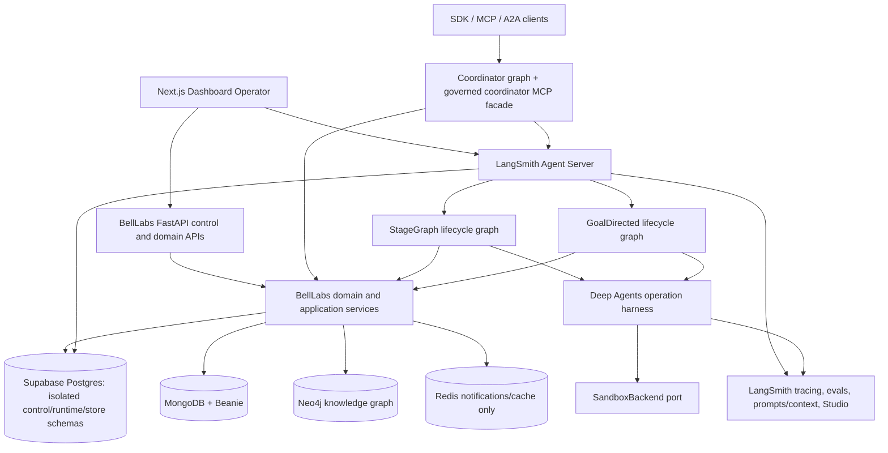

# FROM BELLLABS Owner : This is unsettled. Do not regard this as decided.

# BellLabs agent runtime migration: LangGraph, Deep Agents, and LangSmith

**Status:** engineering recommendation, not product authority  
**Date:** 2026-08-01  
**Scope:** `biotech-research-ingestion-evaluation-system`  
**Decision horizon:** architecture through first managed deployment, followed by full runtime migration

## Executive decision

BellLabs should make LangGraph the durable agent-execution lifecycle manager, Deep Agents the
standard harness for open-ended agent work, LangChain the model/tool/middleware integration layer,
and LangSmith the deployment, tracing, evaluation, prompt/context, and operational surface.

This is a replacement of execution mechanics, not a rewrite of the BellLabs domain. Preserve the
existing control-plane compiler, immutable definitions and bindings, run-control reducer, budget
ledger, admission rules, composition links, schema-grounding boundary, and Neo4j authorization.
Those are stronger and more domain-specific than the generic state maintained by an Agent Server.

The recommended initial commercial and deployment decision is:

1. Buy **LangSmith Plus** and use its included small Serverless deployment for the development and
   acceptance environment. The current pricing page lists Plus at $39/seat/month, access to
   Deployment, and one included small Serverless deployment. Treat all pricing as changeable and
   re-check it before purchase. [LangSmith pricing](https://www.langchain.com/pricing)
2. Deploy a BellLabs Agent Server containing a StageGraph runtime graph, a GoalDirected runtime
   graph, a coordinator graph, and narrowly scoped custom FastAPI routes.
3. Start with **LangSmith Sandboxes** behind BellLabs' existing sandbox port. Keep the port provider
   neutral so Daytona can be qualified later without changing workflow contracts.
4. Use the existing Supabase PostgreSQL cluster only with isolated schemas and credentials. Point
   Agent Server to the custom Postgres connection only after a dedicated compatibility test. Do not
   mix runtime tables with BellLabs control tables and do not delete the whole Supabase project.
5. Run Temporal and the OpenAI Agents SDK in parallel only during migration. After parity and replay
   tests pass, remove them from agent execution; do not maintain two long-term workflow authorities.

LangSmith Cloud hosts and operates the control plane, data plane, Agent Server runtime, and backing
databases on AWS/GCP. Serverless scales to zero and is suitable for development, background, and
latency-tolerant work; Dedicated is the documented choice for customer-critical production with
always-on capacity, HA storage, and backups. [Cloud deployment overview](https://docs.langchain.com/langsmith/deploy-to-cloud-overview)

## Why this is the right migration shape

The repository already contains a coherent domain architecture:

- `app/domain/control_plane/contracts.py` defines Workflow Types, StageGraph and GoalDirected
  blueprints, Workflow Implementations, agentic assets, and Effective Run Configurations.
- `app/domain/orchestration/` owns deterministic scheduling, execution identities, stage cycles,
  workflow cycles, goal revisions, verification, handoffs, and termination semantics.
- `app/domain/run_control/` owns lifecycle commands, optimistic versions, budgets, waits, pauses,
  terminalization, and the outbox.
- `app/domain/operation_execution/` owns exact prompt/model/tool/MCP/skill/workspace bindings and
  sandbox snapshot contracts.
- PostgreSQL, MongoDB/Beanie, Neo4j, Redis, S3, the coordinator MCP server, and the FastAPI APIs
  already have explicit authority boundaries.

Re-expressing those concepts as raw LangGraph state would lose governance and create vendor-shaped
domain logic. The robust design is an anti-corruption layer:

> BellLabs definitions compile to LangGraph execution plans; LangGraph executes them; BellLabs
> services decide what is authorized, budgeted, accepted, promoted, and terminal.

## Target architecture



### Responsibility table

| Concern                                                       | System of record / owner                                      | LangGraph or LangSmith role                                              |
| ------------------------------------------------------------- | ------------------------------------------------------------- | ------------------------------------------------------------------------ |
| Workflow definitions, aliases, exact revisions, ERC           | MongoDB + BellLabs control plane                              | Receives frozen refs/digests; does not resolve mutable aliases           |
| Run admission, lifecycle, budgets, approvals, terminal result | BellLabs application PostgreSQL                               | Calls application commands and mirrors IDs/status in graph state         |
| Execution checkpoint and resumable thread state               | Agent Server checkpointer PostgreSQL                          | Durable execution mechanics                                              |
| Cross-thread agent memory                                     | LangGraph Store in an isolated namespace/schema               | Non-authoritative memory; never policy or scientific truth               |
| Canonical knowledge                                           | Neo4j through bounded BellLabs query ports                    | Agent calls typed tools; no arbitrary Cypher                             |
| Immutable payloads and artifacts                              | MongoDB metadata + S3 payloads                                | Graph state carries references, not large bodies                         |
| Notifications                                                 | Durable outbox in PostgreSQL; Redis fan-out                   | Custom stream events improve UX but are not durable business truth       |
| Prompts and context assets                                    | BellLabs catalog identity plus exact LangSmith commit/version | LangSmith authors, evaluates, and serves; BellLabs freezes exact binding |
| Sandboxes                                                     | BellLabs sandbox port and immutable snapshot contract         | LangSmith first; Daytona may be a later adapter                          |
| Tracing and evaluation                                        | LangSmith                                                     | Operational evidence, not run-control authority                          |

## Identity mapping and anti-duplication rules

There will be two legitimate state models. Make their mapping explicit and one-way:

| BellLabs identity                 | LangSmith identity                                       | Rule                                                          |
| --------------------------------- | -------------------------------------------------------- | ------------------------------------------------------------- |
| `run_id`                          | `thread_id` metadata and preferably the thread ID itself | One primary Agent Server thread per BellLabs run              |
| execution epoch                   | thread/run metadata                                      | Increment after sanctioned reset/fork; never silently reuse   |
| operation attempt                 | task/node attempt metadata                               | Technical retry count is separate from semantic attempt count |
| workflow/stage cycle              | graph state                                              | Remains a BellLabs semantic concept                           |
| workflow implementation exact ref | `assistant_id` + assistant version/config metadata       | Resolve before run admission; never use mutable latest        |
| forked run                        | new BellLabs run + new thread derived from checkpoint    | Original lineage is immutable                                 |
| lifecycle version                 | BellLabs command expected version                        | Agent Server status never bypasses optimistic concurrency     |

Persist a `RuntimeExecutionBinding` containing at least `run_id`, `thread_id`, `assistant_id`,
assistant/config version, deployment/revision ID, execution epoch, initial checkpoint ID, trace URL,
and timestamps. PostgreSQL should enforce uniqueness for active bindings. Every graph node must carry
`run_id`, request/tenant scope, ERC digest, blueprint digest, and correlation ID in trace metadata.

## Workflow architecture

### StageGraph

Do not turn `StageGraphInterpreter` into an unconstrained LLM planner. Preserve its deterministic
scheduler and contracts. Implement a thin LangGraph lifecycle around it:

```text
load_and_verify_binding
  -> reconcile_run_control
  -> compute_runnable_frontier
  -> dispatch_ready_stages (parallel Send operations)
  -> settle_stage_results
  -> evaluate_cycles_and_waits
  -> checkpoint_control_boundary
  -> repeat or finalize
```

Each dispatched stage receives the existing `StageExecutionIdentity`, semantic idempotency key,
reservation, input refs, workspace namespace, and contract refs. The stage implementation may be a
plain deterministic function, LangChain runnable, Deep Agent, subgraph, remote graph, MCP call, or
sandboxed job. The lifecycle graph must not care which mechanism executes the operation.

Use a two-tier compilation strategy:

- **Generic interpreter graph first:** a stable graph reads one frozen StageGraph blueprint and uses
  dynamic fan-out for its runnable frontier. This supports published data-defined workflows without
  deploying code for every definition.
- **Generated graph for promoted hot paths:** for stable, high-volume Workflow Implementations,
  compile named LangGraph nodes from the exact blueprint at build time. This improves Studio
  visualization and per-node tuning but creates a deployment/revision lifecycle. Generated code is
  an optimization, not the definition authority.

Parallelism must respect all three ceilings: blueprint `max_parallel_stages`, admitted run
concurrency, and Agent Server/deployment capacity. Preserve the current fairness cursor when more
work is runnable than the admitted slot budget. LangGraph parallel supersteps do not replace
BellLabs fairness and reservations.

### GoalDirected

The GoalDirected workflow should be an **outer deterministic LangGraph** containing an inner Deep
Agent operation:

```text
claim_iteration -> execute_deep_agent -> verify -> decide
       ^                                  |
       |---- revise / repair / handoff ---|
                    -> terminalize
```

Keep protected scope, goal revisions, verification actions, no-progress detection, repeated-blocker
count, rollover, handoff checkpoints, budgets, and terminal reasons in BellLabs contracts. Deep
Agents performs the bounded work; it does not decide that the governed run is complete. A verifier
node applies the accepted evaluation contract and then sends a versioned lifecycle command.

Deep Agents supplies the useful inner harness: filesystem backends, context offloading,
summarization, skills, memory, subagents, human approval, sandbox execution, and streaming.
[Deep Agents overview](https://docs.langchain.com/oss/python/deepagents/overview)

### Subagents and linked runs are different

- A **Deep Agents subagent** is an implementation detail inside one admitted operation. It inherits
  only deliberately propagated runtime context and returns a compact result to the parent.
- A **BellLabs linked run** is separately compiled, admitted, budgeted, authorized, evaluated, and
  represented in the run-control graph.

Use static subagents for reviewed specializations. Use dynamic subagents through the interpreter
only when the parent is authorized to select among an allowlisted set. Async subagents are useful
for independent research branches, but bound their fan-out and account for worker capacity; the
official production guidance warns that insufficient worker slots can deadlock async subagent
work. [Async subagents](https://docs.langchain.com/oss/python/deepagents/async-subagents)

Do not let an agent create arbitrary identities, tools, prompts, or subagent policies at runtime.
Dynamic selection means selection from frozen authorized candidates, not dynamic authority.

## Retry and fault model

Define four non-overlapping layers:

| Layer                   | Mechanism                                                      | Examples                       | Accounting rule                                                             |
| ----------------------- | -------------------------------------------------------------- | ------------------------------ | --------------------------------------------------------------------------- |
| Transport/model         | provider retry/fallback middleware with small transient limits | 429, timeout, connection reset | Same operation attempt; record provider attempt/usage                       |
| Tool call               | tool-specific retry policy                                     | idempotent search/read         | Same operation attempt; never auto-retry consequential writes without a key |
| LangGraph node          | `RetryPolicy` and timeout policy                               | transient DB/network failure   | Same semantic attempt; checkpoint before/after node                         |
| BellLabs semantic cycle | Stage cycle, workflow cycle, goal repair/revision              | result rejected by evaluator   | New semantic identity and new budget reservation                            |

LangGraph documents per-node retry policies and durable fault recovery. Configure policies by
exception class and node, not with one global count. [Fault tolerance](https://docs.langchain.com/oss/python/langgraph/fault-tolerance)

Rules for side effects:

1. Derive idempotency keys from the existing semantic execution identity.
2. Record intent/reservation before the effect and settlement after it.
3. Make tool adapters return external request IDs and pending usage when the outcome is uncertain.
4. Never retry a non-idempotent external mutation merely because the graph node restarted.
5. Do not count infrastructure retries as scientific/semantic cycles.

## Human intervention and live steering

LangGraph interrupts natively pause a graph and resume it with `Command(resume=...)`; they require
a checkpointer. A resumed node starts again from its beginning, so logic before an interrupt must be
idempotent or moved to a separate node. [Interrupts](https://docs.langchain.com/oss/python/langgraph/interrupts)

Use this BellLabs protocol:

1. A graph node creates a durable BellLabs `PauseDecision` or approval request with expected run
   version, scope, proposed action, evidence refs, allowed decisions, and expiry.
2. The node calls `interrupt()` with a compact serializable envelope containing the decision ID,
   run ID, version, display schema, and evidence links.
3. The Dashboard renders the interrupt from Agent Server streaming while also reading the
   authoritative decision from `/run-control/v1`.
4. A custom BellLabs endpoint validates Supabase identity, tenant scope, role, expected version,
   and decision payload; it records `ResumeDecision` in PostgreSQL.
5. Only then does the adapter resume the graph with the accepted decision ID and digest.
6. The resumed node re-reads the durable decision. It never trusts the resume payload alone.

For intervention while a node is actively running, do not use Redis to mutate graph state. Record a
lifecycle command durably, publish a Redis wake hint, and have long-running tools and graph boundary
nodes cooperatively poll/cancel. If immediate interruption is required, cancel or interrupt the
Agent Server run, then resume or fork only after the BellLabs lifecycle transition succeeds.

Redis remains an acceleration layer for Socket.IO/stream wakes. PostgreSQL and graph checkpoints
remain the durable records. Agent Server custom stream events should carry monotonic BellLabs outbox
positions so the Dashboard can deduplicate, reconnect, and fetch missed durable events.

## Time travel, replay, and forking

LangGraph checkpoints support replay and forking from earlier state. Re-execution after the fork
point is real execution, so it can repeat side effects unless fenced. [Time travel](https://docs.langchain.com/oss/python/langgraph/use-time-travel)

BellLabs policy should be:

- **Inspect:** read checkpoint state without changing either system.
- **Replay for diagnosis:** run in a no-side-effect evaluation environment using captured bindings.
- **Fork:** create a new BellLabs run, parent lineage link, execution epoch, thread, budget, and
  authority decision; seed it from an allowed checkpoint and optionally a cloned sandbox snapshot.
- **Retry:** stay in the same run only when the domain retry policy permits the same semantic input.
- **Rollback:** never rewrite authoritative lifecycle history. Compensate or fork.

Store checkpoint IDs and deployment revisions in BellLabs audit records, but do not copy whole graph
state into the run-control tables.

## Agent Server and API design

The Agent Server API already exposes Assistants, Threads, Thread Runs, Stateless Runs, Crons,
Store, A2A, MCP, health, and server information. [Agent Server API](https://docs.langchain.com/langsmith/server-api-ref)
It also supports background runs, multiple stream modes, resumable streams, subgraph streaming, and
concurrent-run strategies such as enqueue, reject, interrupt, and rollback.

Custom FastAPI/Starlette routes are supported through the `http.app` entry in `langgraph.json`, and
custom routes can shadow defaults. [Custom routes](https://docs.langchain.com/langsmith/custom-routes)

Recommended boundary:

- Keep the existing BellLabs FastAPI application as the public control/domain API during migration.
- Put only runtime-adjacent endpoints in Agent Server initially: auth callback, decision resume,
  signed artifact handoff, health/readiness, and provider webhook endpoints.
- Never shadow a default Agent Server route unless an accepted ADR proves why.
- After operational parity, co-deploying BellLabs routers in the Agent Server is technically
  possible, but independent services are preferable when scaling, release cadence, or failure
  isolation differ.
- The Next.js Operator should use the LangGraph SDK for thread/run streams and BellLabs APIs for
  authoritative run cards, budgets, decisions, artifacts, and catalog data.

Treat `assistant_id` as a deployed configuration pointer, not a BellLabs Workflow Type. An
Assistant can vary graph configuration, model, prompt, tools, and context, but a BellLabs admitted
run must bind an exact assistant/config revision and deployment revision.

Crons are appropriate for scheduled graph runs. Keep schedules as governed BellLabs definitions
and reconcile them to Agent Server crons; do not make an untracked cron the source of business
schedule truth.

## Coordinator and MCP strategy

Keep the existing coordinator MCP server. Agent Server's native MCP endpoint and the BellLabs
coordinator MCP serve different purposes:

- Native Agent Server MCP exposes deployed agents for protocol interoperability.
- BellLabs coordinator MCP exposes governed discovery, exact definition/resource retrieval,
  validation, launch preparation, authorized launch, and result retrieval.

Refactor the deterministic `CoordinatorFacade` into tools used by a coordinator LangGraph/Deep
Agent. The coordinator graph reasons and proposes; the facade verifies and effects. Mount the same
facade behind FastMCP and, where useful, custom Agent Server routes. There must be one launch path
and one authorization implementation, not separate MCP and HTTP behavior.

The coordinator graph should follow:

```text
bootstrap -> understand intent -> search reviewed catalog -> resolve exact refs
 -> propose topology -> deterministic validate -> prepare immutable launch ticket
 -> interrupt for required approval -> launch -> monitor -> retrieve typed result
```

A2A is useful between independently deployed trusted agents, but it must not bypass Workflow Type
admission or create ungoverned child work. MCP tools discovered from outside remain quarantined
until reviewed and promoted under the existing catalog rules.

## PostgreSQL, Supabase, MongoDB, Neo4j, and Redis

### Supabase PostgreSQL

Agent Server uses PostgreSQL for threads, runs, assistants, crons, Store, and—by default—graph
checkpoints. It supports `POSTGRES_URI_CUSTOM` for a custom PostgreSQL instance.
[Checkpointer backend configuration](https://docs.langchain.com/langsmith/configure-checkpointer)
Open-source LangGraph also supports `AsyncPostgresSaver` and `AsyncPostgresStore` directly.
[LangGraph persistence](https://docs.langchain.com/oss/python/langgraph/persistence)

Use the same Supabase project only with hard isolation:

| Schema              | Owner role                                      | Contents                                                         |
| ------------------- | ----------------------------------------------- | ---------------------------------------------------------------- |
| `belllabs_control`  | BellLabs migration owner/runtime role           | Existing authoritative lifecycle, budgets, outbox, links, audits |
| `langgraph_runtime` | Agent Server role                               | Threads/runs/checkpoints/assistants/crons and server metadata    |
| `langgraph_store`   | Restricted Agent Server/store role if supported | Namespaced non-authoritative long-term memory                    |

If Agent Server cannot safely separate its tables by schema in the managed Cloud configuration,
use a separate Supabase project or managed Agent Server database. Do not compromise control-plane
table ownership merely to reuse a cluster. Validate direct/session-pooled connectivity, prepared
statements, SSL, connection limits, migrations, backup/restore, and scale-to-zero reconnects. Avoid
a transaction-pooler mode until the official client behavior is proven with an integration test.

Never store secrets, raw large research corpora, or authoritative KG claims in graph state. Persist
references and digests; use S3/MongoDB/Neo4j for their existing roles.

### Safe clean-reset plan

No database was wiped while producing this recommendation. A whole-project wipe would risk the
authoritative BellLabs control plane and requires a separately approved destructive runbook.

For the intended fresh LangGraph runtime:

1. Inventory schemas, extensions, roles, grants, storage buckets, and row counts; identify every
   external consumer.
2. Take a restorable Supabase backup and export schema-only DDL plus required seed/catalog data.
3. Stop Agent Server deployments, workers, webhook writers, and realtime consumers.
4. Confirm the exact schemas to reset. Default target: only `langgraph_runtime` and
   `langgraph_store`; preserve `belllabs_control`.
5. Revoke runtime connections, drop/recreate only the approved schemas with explicit literal names,
   and reapply least-privilege roles. Do not use broad wildcard deletion.
6. Let the pinned Agent Server/checkpointer version create its own runtime schema, then apply
   BellLabs-owned migrations separately.
7. Run tenant-isolation, checkpoint/resume, Store namespace, fork, backup, and restore acceptance
   tests before reconnecting production callers.
8. Record who approved the reset, backup ID, object inventory, commands, checksums, and results.

### MongoDB + Beanie

Keep MongoDB authoritative for immutable definitions, ERCs, exact operation bindings/settlements,
sandbox snapshot metadata, workspace manifests, schema-grounding records, and artifact metadata.
Do not move those documents into LangGraph Store. Optionally use MongoDB as the Agent Server
checkpointer only if it materially reduces operations; the current goal explicitly prefers
Supabase Postgres, so this is not the default.

### Neo4j

Keep the graph boundary unchanged: agents receive typed, purpose-bound query tools; the host
validates graph authority, catalog deployment, workspace binding, query kind, result shape, and
limits. LangChain's Neo4j integrations are adapters, not authorization. Generated Cypher remains
default-deny for production research workflows.

### Redis

Use Redis for Agent Server mechanics when self-hosting, cache, queueing, notification fan-out,
cooperative cancellation wakes, and realtime acceleration. It must not own lifecycle, approvals,
budget, checkpoint truth, or recoverability. LangSmith Cloud manages the backing Redis required by
its data plane; the BellLabs Redis remains separate unless an explicit topology change is accepted.

## Sandboxes and interpreters

Deep Agents distinguishes:

- **Sandbox backend:** isolated OS filesystem and shell execution; suitable for packages, tests,
  CLIs, browsers, and research workspaces.
- **Interpreter:** scoped QuickJS `eval` for loops, batching, deterministic transforms, and
  programmatic tool/subagent calls; it has no shell, package install, filesystem, or network access.

[Deep Agents sandboxes](https://docs.langchain.com/oss/python/deepagents/sandboxes) and
[interpreters](https://docs.langchain.com/oss/python/deepagents/interpreters) document these
separate roles. Prefer the interpreter for cheap in-process orchestration and a sandbox only when
OS capabilities are required.

### Provider decision

Use LangSmith Sandboxes first because they integrate with the chosen runtime, SDK, lifecycle,
snapshots, mounts, auth proxy, workspace permissions, and observability. They now expose lifecycle,
file operations, command execution/reconnect, snapshots, services/tunnels, resource sizing, and
access controls. [LangSmith Sandboxes](https://docs.langchain.com/langsmith/sandboxes)

Daytona is a credible secondary provider and Deep Agents lists Daytona among supported sandbox
backends. Daytona documents container/VM/GPU sandboxes, lifecycle APIs, snapshots, custom images,
network limits, telemetry, and per-second resource pricing. [Daytona](https://www.daytona.io/docs/en/sandboxes)

They are partial substitutes, not an either/or platform choice: LangSmith supplies the Agent Server
and agent operations platform; Daytona can supply execution environments. Add Daytona only after a
qualification matrix proves a need in isolation, GPU, startup/restore latency, long-run survival,
regional placement, egress policy, or total cost.

Define a BellLabs `SandboxProvider` port with create/start/stop/delete, snapshot/restore, file
transfer, execute/reconnect, resource limits, network policy, mount manifest, health, and usage
settlement. Map both vendors into the existing immutable snapshot and workspace contracts.

For biotech workloads, require default-deny egress where possible, domain allowlists, no ambient
cloud credentials, per-run identities, malware/package scanning, read-only reference mounts,
write-only artifact destinations, CPU/RAM/disk/time limits, automatic cleanup, and full audit.
Research data is not automatically safe merely because code runs in a sandbox.

## Prompts, context, skills, memory, tracing, and evaluation

### Prompts and context

Use LangSmith Prompt & Context Hub for authoring, collaboration, evaluation, and promotion, while
retaining BellLabs immutable catalog identity. Compilation resolves a mutable alias to an exact
LangSmith commit/version, captures its digest and source URL in `OperationExecutionBinding`, and
never re-resolves it during a run. [Prompt & Context Hub](https://docs.langchain.com/langsmith/prompt-context-hub)

Use Deep Agents context deliberately:

- system prompt: short invariant role and safety behavior;
- runtime context: authenticated IDs, connections, and per-run configuration, propagated narrowly;
- skills: on-demand procedural packages selected from exact reviewed revisions;
- memory: non-authoritative preferences and learned working context;
- Store: namespaced by tenant, user, agent profile, and purpose;
- subagents: isolate context-heavy work and return schema-validated summaries;
- summarization/offloading: manage context windows, never discard required evidence refs.

[Context engineering](https://docs.langchain.com/oss/python/deepagents/context-engineering) and
[skills](https://docs.langchain.com/oss/python/deepagents/skills) provide the harness mechanics.
The BellLabs catalog remains responsible for trust, compatibility, promotion, and revocation.

### Observability

Adopt one trace taxonomy from day one:

- trace: BellLabs run or stateless administrative operation;
- child runs/spans: workflow cycle, stage, model call, tool call, sandbox command, evaluator;
- tags: environment, tenant pseudonym, Workflow Type/ref, implementation ref, deployment revision;
- metadata: run/thread IDs, exact binding digests, idempotency key, retry layer, sandbox snapshot ref;
- feedback: domain evaluation outcome, citation validity, operator decision, latency, cost, safety.

Enable input/output masking and avoid sending PHI, credentials, raw private corpora, or unrestricted
sandbox output to traces. LangSmith supports OpenTelemetry ingestion/export and trace masking.
[OpenTelemetry tracing](https://docs.langchain.com/langsmith/trace-with-opentelemetry) and
[trace masking](https://docs.langchain.com/langsmith/mask-inputs-outputs)

### Evaluation and release gates

Create LangSmith datasets from existing coordinator retrieval, schema-grounding, Viome StageGraph,
and web-research acceptance cases. Every graph/prompt/model/tool revision should run:

- deterministic contract and schema checks;
- offline trajectory, tool-selection, citation, evidence, and final-result evaluators;
- adversarial prompt/tool/tenant-boundary tests;
- replay comparisons against current Temporal/OpenAI baselines;
- online sampled evaluators with alert thresholds;
- human review for scientific correctness and promotion.

LangSmith scores inform promotion; BellLabs policy makes the promotion decision. Never let an
online evaluator automatically publish a new authoritative definition.

## Security and operability baseline

- Separate development, staging, and production LangSmith workspaces/deployments and data stores.
- Use Supabase JWT identity at BellLabs boundaries; configure Agent Server custom auth/authorization
  so thread, assistant, Store, and custom-route access are tenant-scoped.
- Give model code no raw database credentials. Expose narrow tools or use sandbox auth proxy.
- Use separate DB roles for migration, Agent Server runtime, BellLabs runtime, and read-only ops.
- Encrypt checkpoint serialization where required; verify key rotation and restore behavior.
- Pin Python, LangGraph, LangChain, Deep Agents, Agent Server API, checkpointer, and SDK versions.
  Several Deep Agents capabilities—including interpreters and some managed/runtime surfaces—are
  marked beta or private beta in current documentation.
- Set checkpoint/Store/thread TTL policies only after legal, audit, replay, and cost requirements
  are explicit. Run cleanup as a governed job.
- Export deployment logs/metrics/traces; alert on queue age, run error/timeout rate, checkpoint
  failures, interrupt age, retry storms, sandbox leaks, DB saturation, and outbox lag.
- Maintain backup/restore drills and a runbook for provider/API outage, DB failover, stuck run,
  orphan sandbox, lost stream, and rollback to the prior deployment revision.

## Migration plan BELL LABS OWNER: Do not see this in time units. This will be made up of specifications and issues. We need to get up to the point we are at in the application, albeit an enhanced version with the langgraph-langchain-deepagents ecosystem, and continue on.

### Phase 0 — decisions and spikes (1–2 weeks)

- Accept this architecture as a checkpoint/ADR; update `biotech-meta` before contracts change.
- Purchase Plus and create separate development/staging workspaces.
- Build a minimal Agent Server from pinned dependencies and run it locally with `langgraph dev`.
- Prove custom auth, custom FastAPI route, Postgres custom URI, checkpoint/resume, Store namespace,
  interrupt, fork, streaming reconnect, one sandbox, and one trace/evaluator.
- Measure whether Supabase direct/session connectivity is safe. Decide managed DB vs isolated
  Supabase schemas based on evidence, not preference.

**Exit gate:** all persistence and tenant-boundary tests pass; no destructive production reset.

### Phase 1 — compatibility layer and observability (1–2 weeks)

- Add LangChain/LangGraph/Deep Agents/LangSmith dependencies without removing current runtime.
- Introduce `AgentExecutionRuntime`, `GraphRuntimeClient`, `SandboxProvider`, `PromptResolver`, and
  trace/evaluation ports.
- Implement the runtime execution binding and ID mapping.
- Trace current Temporal/OpenAI executions into LangSmith to establish parity baselines.
- Freeze new features in `openai_agents_runtime.py`; only correctness fixes continue.

**Exit gate:** one domain operation runs through either runtime with identical contracts/results.

### Phase 2 — StageGraph vertical slice (2–4 weeks)

- Wrap the existing interpreter with the generic LangGraph lifecycle.
- Implement parallel frontier dispatch, fairness, reservations, waits, cycle evaluation, typed result
  materialization, custom events, and technical retry policies.
- Port the Viome/web-research acceptance workflow first.
- Run shadow mode: same immutable input/bindings, no duplicate external writes, compare results.

**Exit gate:** lifecycle, budget, retry, pause/resume, crash recovery, and result parity tests pass.

### Phase 3 — GoalDirected + Deep Agents (2–4 weeks)

- Build the outer claim/execute/verify/revise/handoff lifecycle graph.
- Port tools and model bindings to LangChain with structured outputs.
- Add reviewed skills, context isolation, static subagents, bounded async fan-out, interpreter use,
  sandbox lifecycle, snapshots, and verifier gates.
- Test rollover, no-progress, repeated blockers, authority breach, and budget exhaustion.

**Exit gate:** only BellLabs verification can terminalize; every subagent/tool/sandbox use is bound.

### Phase 4 — coordinator, APIs, and Dashboard (2–3 weeks)

- Make the coordinator graph consume the existing deterministic facade.
- Expose native Agent Server streams plus the governed coordinator MCP surface.
- Add Next.js run timeline, parallel stage lanes, token/tool streams, approval cards, budget state,
  artifacts/evidence, trace links, fork controls, and retry-layer labels.
- Reconcile schedules to Agent Server crons and prove missed-run behavior.

**Exit gate:** one operator can discover, approve, launch, intervene, fork, and retrieve a typed result.

### Phase 5 — managed deployment and cutover (2–4 weeks)

- Deploy Serverless to staging; qualify cold-start and maximum long-run behavior.
- Use Dedicated for a customer-critical production path or when Serverless latency/concurrency is
  unacceptable.
- Canary by Workflow Type/Implementation alias, not a global flag.
- Stop new Temporal agent runs, drain existing executions, reconcile all terminal states, retain
  read-only historical evidence, and remove Temporal/OpenAI SDK execution plugins.
- Remove old schemas/services only under a separately approved, backed-up decommission runbook.

**Exit gate:** sustained SLOs, restore drill, security review, cost review, and rollback drill pass.

## Initial implementation backlog

1. ADR: domain authority versus Agent Server execution state.
2. ADR/spike: Supabase schema/role/connection compatibility with `POSTGRES_URI_CUSTOM`.
3. Contract: `RuntimeExecutionBinding` and exact identity mapping.
4. Port: `GraphRuntimeClient` using the Python SDK/RemoteGraph.
5. Graph: generic StageGraph lifecycle with dynamic frontier dispatch.
6. Graph: GoalDirected lifecycle with a bounded Deep Agent node.
7. Adapter: LangSmith Sandbox behind `SandboxProvider`.
8. Protocol: durable interrupt/resume and cooperative cancellation.
9. Adapter: exact LangSmith prompt/context revision resolver.
10. Coordinator: reuse deterministic facade from graph, MCP, and HTTP.
11. Evaluation: baseline datasets, evaluators, and promotion gates.
12. Dashboard: resumable streams joined to authoritative BellLabs run projections.
13. Operations: metrics, alerts, TTL, backup/restore, orphan cleanup, and rollback runbooks.
14. Optional qualification: Daytona adapter and benchmark after the LangSmith path is stable.

## Go/no-go criteria

Do not cut over until all are true:

- no mutable alias or prompt is resolved after admission;
- crash/restart resumes without duplicate consequential effects;
- thread/run/checkpoint data cannot authorize lifecycle or budget changes by itself;
- concurrent stages respect dependencies, fairness, reservations, tenant boundaries, and caps;
- interrupts survive process loss and resume only after a durable authorized decision;
- forks create new run/thread identity and cannot mutate original lineage;
- model, tool, node, and semantic retries are distinguishable and correctly accounted;
- sandbox egress, secrets, limits, cleanup, snapshots, and usage settlement are tested;
- trace redaction is verified with representative sensitive payloads;
- Supabase backup and restore are proven before any clean reset;
- current acceptance datasets meet or exceed the Temporal/OpenAI baseline;
- rollback to the prior deployment revision has been rehearsed.

## Final recommendation

Proceed with the ecosystem transition. The strongest architecture is not “LangSmith owns
everything”; it is **LangSmith operates the agent runtime while BellLabs retains governed domain
authority**. That yields the production capabilities sought—durable execution, parallel graphs,
interrupts, streaming, time travel, managed deployment, sandboxes, subagents, stores, prompts,
tracing, and evaluation—without discarding the difficult control-plane engineering already built.

Start with Plus + LangSmith Cloud + LangSmith Sandboxes, validate Supabase isolation, port one
StageGraph end to end, then add GoalDirected/Deep Agents and the coordinator. Keep Daytona as a
provider-neutral option. Retire Temporal and the OpenAI Agents SDK only after measured parity and a
rehearsed rollback.

## Primary references

- [LangSmith Deployment](https://docs.langchain.com/langsmith/deployment)
- [Deploy to LangSmith Cloud](https://docs.langchain.com/langsmith/deploy-to-cloud-overview)
- [Agent Server overview](https://docs.langchain.com/langsmith/agent-server-overview)
- [Agent Server API](https://docs.langchain.com/langsmith/server-api-ref)
- [Custom Agent Server routes](https://docs.langchain.com/langsmith/custom-routes)
- [Assistants](https://docs.langchain.com/langsmith/assistants)
- [Event streaming](https://docs.langchain.com/langsmith/event-streaming)
- [RemoteGraph](https://reference.langchain.com/python/langgraph/pregel/remote/RemoteGraph)
- [LangGraph persistence](https://docs.langchain.com/oss/python/langgraph/persistence)
- [Checkpointer backend configuration](https://docs.langchain.com/langsmith/configure-checkpointer)
- [LangGraph interrupts](https://docs.langchain.com/oss/python/langgraph/interrupts)
- [LangGraph time travel](https://docs.langchain.com/oss/python/langgraph/use-time-travel)
- [LangGraph fault tolerance](https://docs.langchain.com/oss/python/langgraph/fault-tolerance)
- [Deep Agents overview](https://docs.langchain.com/oss/python/deepagents/overview)
- [Deep Agents production guidance](https://docs.langchain.com/oss/python/deepagents/going-to-production)
- [Deep Agents subagents](https://docs.langchain.com/oss/python/deepagents/subagents)
- [Dynamic subagents](https://docs.langchain.com/oss/python/deepagents/dynamic-subagents)
- [Async subagents](https://docs.langchain.com/oss/python/deepagents/async-subagents)
- [Deep Agents sandboxes](https://docs.langchain.com/oss/python/deepagents/sandboxes)
- [Deep Agents interpreters](https://docs.langchain.com/oss/python/deepagents/interpreters)
- [Deep Agents context engineering](https://docs.langchain.com/oss/python/deepagents/context-engineering)
- [Deep Agents skills](https://docs.langchain.com/oss/python/deepagents/skills)
- [LangSmith Sandboxes](https://docs.langchain.com/langsmith/sandboxes)
- [LangSmith sandbox snapshots](https://docs.langchain.com/langsmith/sandbox-snapshots)
- [Prompt & Context Hub](https://docs.langchain.com/langsmith/prompt-context-hub)
- [OpenTelemetry tracing](https://docs.langchain.com/langsmith/trace-with-opentelemetry)
- [Trace masking](https://docs.langchain.com/langsmith/mask-inputs-outputs)
- [LangSmith pricing](https://www.langchain.com/pricing)
- [Daytona sandboxes](https://www.daytona.io/docs/en/sandboxes)
- [Daytona architecture](https://www.daytona.io/docs/en/architecture)
- [Daytona pricing](https://www.daytona.io/pricing)
