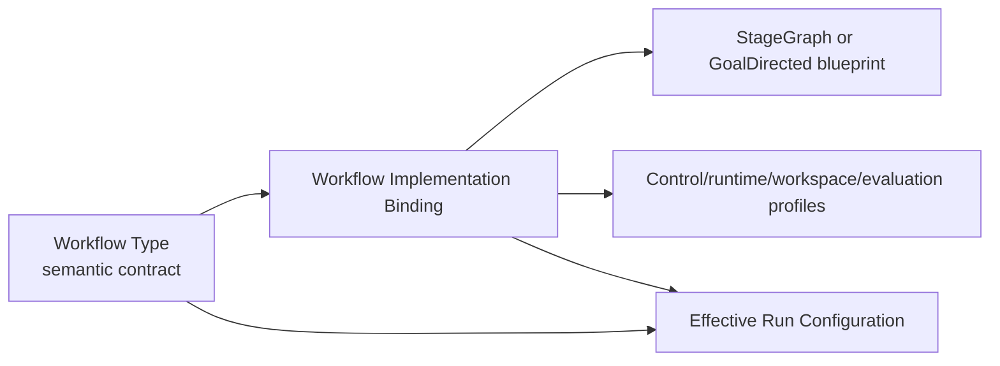

# Workflow Implementation Bindings prototype

This document records the first executable prototype that separates a semantic
**Workflow Type** from its default and alternative execution implementations.

The prototype uses `supporting-graph-reconciliation` because its accepted experiment already
contained two useful execution behaviors:

- a fixed, host-owned set of five required graph-read intents; and
- a bounded agent query planner that must execute those same seed intents before it may add
  further admitted work.

The first is now the default staged implementation. The second is the GoalDirected alternative.
Both retain the same semantic Workflow Type, input admission contract, invariants, obligations,
output contract, schema lineage, selection/review process, graph gate, and evaluation gates.

## 1. Contract model

[`WorkflowImplementationBindingDefinition`](../app/domain/control_plane/contracts.py) is a new
immutable control-plane definition. It binds one exact Workflow Type revision to:

- one exact StageGraph or GoalDirected blueprint;
- control, runtime, workspace, and evaluation profiles;
- an optional workflow-specific configuration;
- typed obligation realizations;
- typed output-contract realizations; and
- conformance evidence references.

The binding is the unit of implementation approval. The Workflow Type remains the semantic
contract.



The compiler supports three invocation forms:

1. **Default implementation:** select only the Workflow Type. The service resolves
   `<workflow-type>.implementation@default`.
2. **Named/exact implementation:** select the Workflow Type and one implementation selector.
3. **Legacy components:** select the Workflow Type and the original individual blueprint/profile
   selectors.

The component path remains temporarily available for backward compatibility. New callers should
select an implementation binding atomically.

The resolved binding reference is added to `EffectiveRunConfiguration.source_refs`, and alias
resolution is preserved in `alias_evidence`. The ERC model shape was not changed, avoiding
historical ERC digest invalidation.

## 2. Default selection

A default is not embedded in the Workflow Type. Doing that would create a publication cycle:

```text
Workflow Type digest → implementation reference
implementation digest → exact Workflow Type reference
```

Instead, the existing alias mechanism supplies the movable default:

```text
workflow implementation logical ID:
    supporting-graph-reconciliation.implementation

aliases:
    default       → exact staged implementation revision
    goal-directed → exact GoalDirected implementation revision
```

Moving `default` affects only later compilations. An existing run retains the exact binding,
component definitions, and alias-resolution evidence captured in its ERC.

`schema_grounding_definitions()` returns the bindings in safe publication order after their
Workflow Types and assets. A deployment/bootstrap process must still publish them and create the
aliases; server startup does not currently do that automatically.

## 3. Conformance validation

Publication and compilation reject an implementation when:

- its exact Workflow Type or component references do not match;
- its control profile selects another blueprint;
- its configuration targets another Workflow Type;
- it omits a Workflow Type obligation or output contract;
- a staged obligation maps to a missing stage or to a stage that does not declare the obligation;
- a staged output maps to an undeclared output slot;
- a GoalDirected obligation does not map to its objective or acceptance contract;
- its workspace does not satisfy the Workflow Type’s logical workspace contract;
- its required capabilities exceed the Workflow Type’s authority ceiling; or
- the normal environment, secret, runtime-binding, authority, and overlay checks fail.

The schema StageGraphs now declare their obligation ownership and non-empty operation-attempt
reservations. Previously, their empty reservations made them descriptive but not dispatchable by
the generic `StageGraphInterpreter`.

## 4. The two reconciliation implementations

### Default: staged required intents

Implementation ID:

```text
supporting-graph-reconciliation.stagegraph-required-intents@1
```

After the shared `gpt-5-mini` selector and independent reviewer accept a Schema Context
Selection, the host:

1. derives the Expanded Schema Slice and Schema Operation Projection;
2. checks schema compatibility and opens the bounded Neo4j executor;
3. executes the five host-compiled required intents in exact order;
4. persists every intent and result;
5. requires every result to succeed; and
6. deterministically builds observational evidence from those exact results.

No agent chooses query order or claims evidence in this phase. This is the optimal current
default because the accepted workload has repeatedly demonstrated that the five required intents
fully satisfy the reconciliation question.

### Alternative: GoalDirected planner

Implementation ID:

```text
supporting-graph-reconciliation.goal-directed-planner@1
```

The same selection, review, derivation, projection, and graph gate run first. A bounded
`gpt-5-mini` planner then:

1. must execute the five host seed intents in exact order through a typed tool;
2. may propose additional intents within the admitted labels, relationships, properties, query
   kinds, depth, result, iteration, and budget bounds;
3. cannot submit arbitrary Cypher;
4. must reference every actual persisted intent/result pair in final evidence; and
5. receives at most one retry when required successful seed evidence is missing.

This is genuinely goal-directed at the application/experiment boundary, while deterministic
host gates remain authoritative.

## 5. Live `gpt-5-mini` results

All runs used the exact accepted workload:

| Input | Digest |
| --- | --- |
| Schema Definition | `sha256:86b5e0b5d11d203bd75b69b4507b0aad97d5df2495d3897ca64272068ea5f112` |
| Schema Catalog | `sha256:94cd791e4daa058a5135b50a31641ca1476a7f820d7f0e3294105d42726a267e` |
| Report | `sha256:2a67cfa5220ea6f38377643f309061bf0404d1984453a67a8a1eb3a26b7a893b` |
| Structured candidates | `sha256:8a65ecff82682c4d1fa220599241d3e318bf66f30faf912606a60e8de80e96d9` |

Successful-run comparison:

| Metric | Accepted prior baseline | Staged default | GoalDirected alternative |
| --- | ---: | ---: | ---: |
| Status | completed | completed | completed |
| Independent review | accepted | accepted | accepted |
| Selection revisions | 2 | 1 | 1 |
| Successful queries | 5/5 | 5/5 | 5/5 |
| Oracle entity recall | 1.0 | 1.0 | 1.0 |
| Query records | 32 | 32 | 32 |
| Input tokens | 235,409 | 195,019 | 244,482 |
| Output tokens | 22,626 | 3,153 | 7,226 |
| Total tokens | 258,035 | 198,172 | 251,708 |
| Total elapsed | 291.4 s | 82.9 s | 132.4 s |
| Query/planner elapsed | 192.8 s | 1.1 s | 71.1 s |

Both successful candidates passed all nine comparison gates:

1. identical workload inputs;
2. completed status;
3. independently accepted selection;
4. required core semantic membership;
5. exact `Product.implementsPlatforms → IMPLEMENTS` discrimination;
6. preserved 1.0 oracle recall;
7. all offered products recovered;
8. five successful, zero rejected, zero failed query results; and
9. exact deployed-schema compatibility.

Comparison artifacts:

- `.scratch/schema-context-selection-runs/comparisons/execution-binding-stagegraph`
- `.scratch/schema-context-selection-runs/comparisons/execution-binding-goal-directed`

Live run artifacts:

- `.scratch/schema-context-selection-runs/execution-binding-stagegraph-gpt5mini`
- `.scratch/schema-context-selection-runs/execution-binding-goal-directed-gpt5mini-2`

The first GoalDirected attempt is intentionally preserved at
`.scratch/schema-context-selection-runs/execution-binding-goal-directed-gpt5mini`. It was rejected
before graph access because the second selector revision retained `FROM_TEXT_VERSION` without a
selected endpoint node. Deterministic validation and independent review correctly refused
acceptance. This is evidence that implementation choice does not bypass shared Workflow Type
invariants.

## 6. What this prototype proves

- A semantic Workflow Type can have a movable default and named alternatives without changing
  its identity.
- Compilation can resolve one implementation atomically while preserving exact reproducibility.
- StageGraph and GoalDirected implementations can share admission, invariants, outputs, and
  evaluation.
- The cheaper deterministic staged implementation is a better default for this known workload.
- The GoalDirected alternative remains useful when seed queries may be insufficient.
- Failed semantic selection remains a valid rejected run and cannot be forced through by choosing
  another execution implementation.

## 7. GoalDirected runtime status

The generic GoalDirected runtime is now implemented alongside StageGraph:

- `GoalDirectedLaunchService` resolves the exact admitted configuration and protected launch
  envelope;
- `WorkflowLaunchDispatcher` selects execution only from the frozen blueprint family;
- `GoalDirectedWorkflow` coordinates deterministic bounded iterations, stable retry identities,
  budget reservation/reconciliation, token-triggered fresh sessions, typed handoffs, independent
  verification, and terminalization through `RunControlService`;
- `GoalWorkspaceService` regenerates read-only `goal/GOAL.md` and `goal/state.json`, enforces a
  single sequential writer, and persists immutable checkpoints and accepted handoffs; and
- the live acceptance runner publishes, compiles, admits, dispatches, and executes the same
  general path with `gpt-5-mini`. Its Dave mode additionally binds the exact immutable Tavily
  skill and a retained sequential Docker sandbox.

Run the bounded live proofs with:

```powershell
uv run python -m app.temporal.run_goal_directed_live --mode smoke
uv run python -m app.temporal.run_goal_directed_live --mode dave
```

Both modes require the already configured secret references at runtime. Secret values are
resolved just in time and are not written into Temporal input, configuration, workspace truth,
logs, snapshots, or committed artifacts. StageGraph remains the cheaper default for known static
graphs; GoalDirected is the alternative when discovery and repair require bounded adaptive work.
