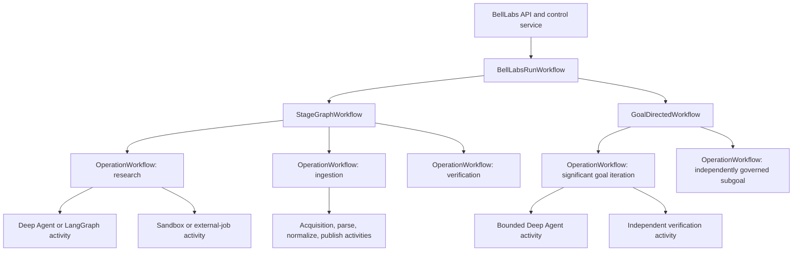
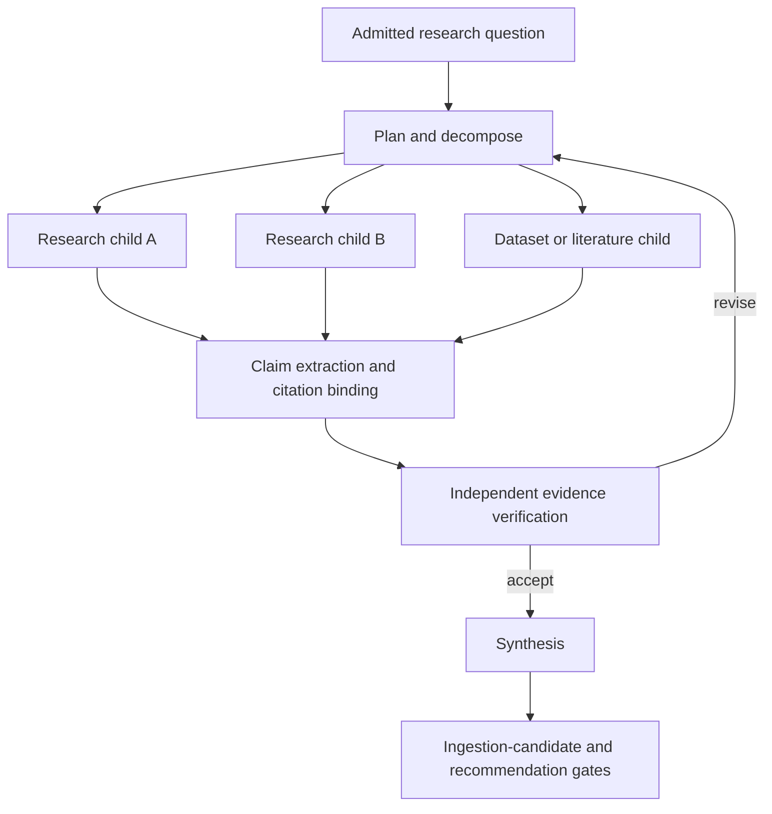
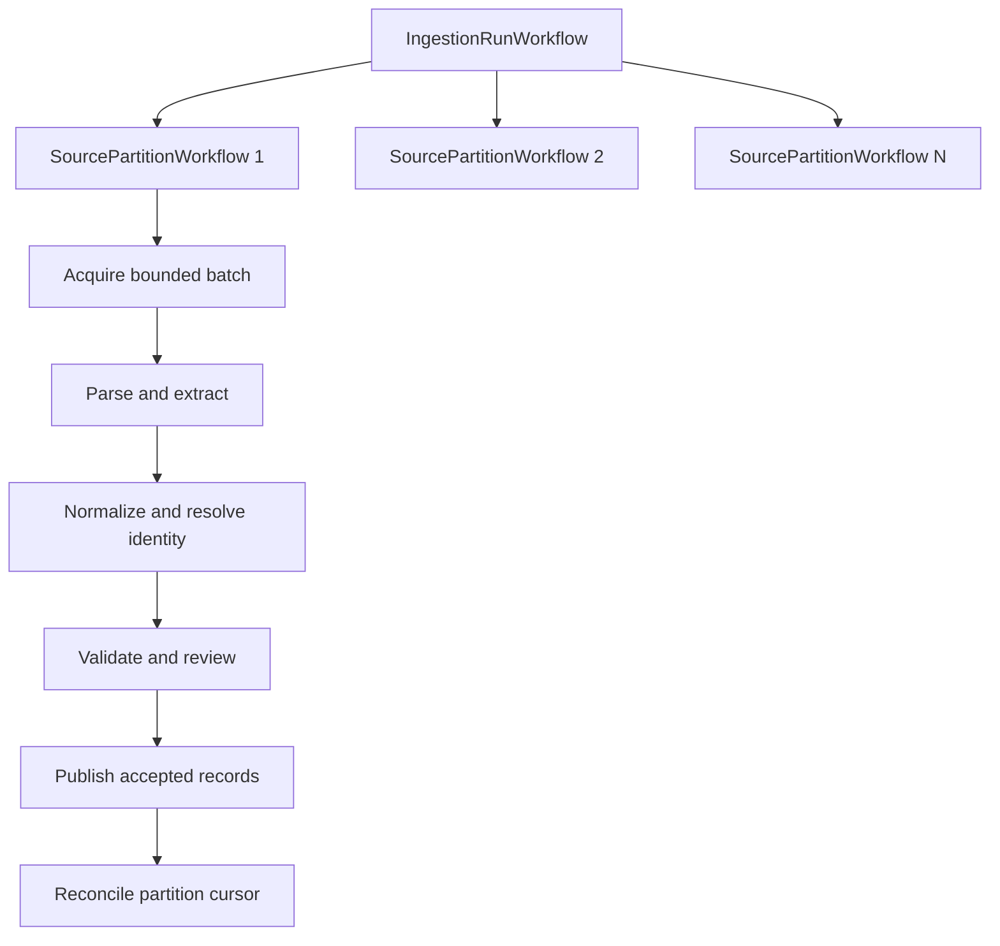
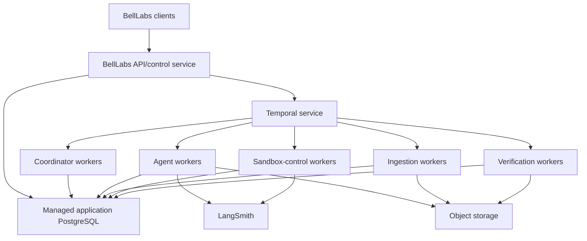

# Temporal, LangSmith, and Deep Agents BellLabs backend architecture proposal

Status: accepted target architecture; implementation sequencing is authoritative for subsequent planning
Decision maturity: architecture interview decisions accepted on 2026-08-08
Scope: `biotech-research-ingestion-evaluation-system` research, ingestion, evaluation, and workflow services
Recorded: 2026-08-08

## 1. Executive decision

BellLabs should use **Temporal as its production macro-workflow execution runtime** for long-running
research, ingestion, evaluation, and content-production processes. BellLabs workflows are expected
to run for hours or days, execute heterogeneous work on independently scalable background workers,
wait durably for people and external systems, and continue making dependency-safe progress when
one sibling operation is slower than another. These are first-class Temporal concerns.

The optimal synthesis is:

> Temporal is the sole macro runtime and durably executes the plan. BellLabs pure interpreters and
> application services decide semantic transitions; PostgreSQL owns run, command, effect, and
> settlement authority. LangGraph and Deep Agents own bounded operation cognition and checkpoints.
> LangSmith is required for tracing, evaluation, sandboxes, and selected bounded remote graph
> deployments; Studio and the local Graph API are development conveniences.

This is not a rejection of LangGraph, Deep Agents, or LangSmith. It gives each system a narrower and
more defensible responsibility:

- **Temporal** is the durable nervous system.
- **Deep Agents and LangGraph** are the cognitive and agent-execution workspace.
- **BellLabs PostgreSQL and immutable artifacts** are the institutional memory.
- **LangSmith** is the observability, evaluation, sandbox, graph-development, and interaction plane.

The production StageGraph and GoalDirected macro lifecycle must have one execution authority.
BellLabs should not operate an Agent Server StageGraph and a Temporal StageGraph as competing
authoritative schedulers for the same run.

## 2. Relationship to the current migration direction

When first drafted, this proposal deliberately conflicted with the then-current primary migration
goal in
[`00_MAIN_GOAL_AND_INDEX.md`](../migrations_instructions/implementation_work_packages/00_MAIN_GOAL_AND_INDEX.md),
which directed BellLabs to migrate macro execution from Temporal to a standard LangSmith Deployment
and Agent Server scheduler. It also changed the then-current production target of
[`07_STAGE_4_STAGEGRAPH_PARITY_VERTICAL_SLICE.md`](../migrations_instructions/implementation_work_packages/07_STAGE_4_STAGEGRAPH_PARITY_VERTICAL_SLICE.md).

As of 2026-08-08, that conflict is resolved: the index and Stage 4 package were rewritten to accept
this proposal's Temporal-primary architecture. They are now the normative implementation
sequencing and gate authorities for that accepted direction; this proposal remains the accepted
architecture decision and preserves why the direction changed.

That earlier direction was reasonable while the expected workload and deployment question were
still being evaluated. Two findings justified reopening it:

1. BellLabs expects research and ingestion workflows to run for hours or days soon, not merely as a
   distant scale scenario.
2. The completed LangGraph plus Temporal experiment proved that independently durable operation
   executions can satisfy an `any(1)` dependency and launch downstream work before a slow sibling
   completes. See
   [`latest_report.md`](../../app/experiments/langgraph_temporal_stagegraph/artifacts/latest_report.md).

The experiment proves a required execution boundary rather than a vendor preference: the parent
scheduler must durably start or reconnect to an independently executing operation and return after
the launch acknowledgement. It must not await all operation results in one LangGraph `Send`
superstep.

**Decision history and supersession.** The former Agent Server-primary macro-runtime direction
recorded in earlier revisions of the migration index and Stage 4 package remains useful evidence of
the evaluated alternative, but was superseded by the 2026-08-08 architecture interview. The current
index and Stage 4 package already incorporate that supersession; future changes must use their
explicit amendment process. Agent Server remains eligible only as a bounded operation runtime or
interactive development surface; it is not a competing macro scheduler.

## 3. Goals

The target architecture must support:

- workflows lasting hours, days, or longer without holding an API request or process-local task;
- StageGraph `all`, `any`, and `minimum(k)` joins with prompt downstream scheduling;
- independently running, cancellable, retryable, and observable stages;
- GoalDirected iterations, revisions, independent verification, subgoals, and convergence;
- Deep Agents, LangGraph subgraphs, native Python services, MCP, sandboxes, and external jobs behind
  exact operation bindings;
- large ingestion programs with bounded partitioning, backpressure, and deterministic settlement;
- pause, resume, cancel, update, reconcile, repair, and orphan handling;
- application-level forks from semantic checkpoints and starts from validated edited state;
- controlled reuse and descendant invalidation;
- Continue-As-New for long Temporal histories;
- stable semantic identities across technical retries;
- complete lineage from final BellLabs results to every operation, artifact, provider effect, agent
  session, Temporal execution, and LangSmith trace;
- worker-pool isolation and independent scaling by workload class;
- deployment freedom without allowing deployment mechanics to redefine workflow functionality.

## 4. Non-goals and rejected shortcuts

This architecture does not:

- put BellLabs lifecycle authority in Temporal Event History;
- make Temporal workflow state the application database;
- make LangGraph checkpoints authoritative run state;
- translate every LangGraph node into a Temporal activity;
- place an entire days-long mission in one opaque activity;
- replace the deterministic StageGraph or GoalDirected interpreters with model planning;
- make every stage a Deep Agent;
- treat Temporal retries as exactly-once external effects;
- store raw corpora, transcripts, large documents, secrets, or PHI in Temporal payloads;
- use Temporal Reset as the normal BellLabs user-facing fork mechanism;
- require the final cloud, container, or Kubernetes topology to be decided before semantic contracts
  are implemented;
- remove LangSmith Deployment, Studio, tracing, evaluation, sandboxes, or graph registration from
  the BellLabs toolchain.

## 5. Governing invariant

The existing BellLabs invariant remains valid:

> Discover broadly, select narrowly, compile exactly, admit authoritatively, execute from frozen
> bindings, reconcile continuously, and terminalize only from accepted evidence.

The direction of control becomes:

```mermaid
flowchart LR
    Intent["Operator or coordinator intent"] --> Compile["BellLabs exact compilation"]
    Compile --> Admission["PostgreSQL admission and reservation"]
    Admission --> Temporal["Temporal run workflow"]
    Temporal --> Interpreter["Pure StageGraph or GoalDirected interpreter"]
    Interpreter --> Child["Temporal operation child workflows"]
    Child --> Agent["Deep Agents, LangGraph, native, MCP, sandbox"]
    Agent --> Evidence["Immutable result and evidence refs"]
    Evidence --> Settlement["BellLabs CAS settlement"]
    Settlement --> Temporal
    Settlement --> Terminality["BellLabs typed terminal result"]
```

Execution produces evidence. BellLabs accepts, rejects, settles, and terminalizes it.

## 6. Authority and state ownership

The architecture is robust only if every kind of state has one declared authority.

| State or concern | Authoritative owner | Other systems may hold |
|---|---|---|
| Workflow Type, Implementation, blueprint, ERC, RunPlan | BellLabs control plane | immutable digests and refs |
| BellLabs run, command, effect, and settlement authority | BellLabs PostgreSQL/application services | cached version and refs |
| Stage or goal semantic projection | BellLabs application/domain state | deterministic workflow cache |
| Budgets, leases, quotas, approvals, effect claims | BellLabs PostgreSQL | reservation and claim refs |
| Scheduling semantics | pure StageGraph or GoalDirected interpreter | no provider-authored mutations |
| Durable execution progress | Temporal | workflow and activity history |
| Agent session cognition | LangGraph checkpointer or Deep Agent backend | checkpoint refs in BellLabs |
| Documents, reports, corpora, transcripts, datasets | object storage | immutable content-addressed refs |
| Evidence, claims, citations, ingestion candidates | BellLabs semantic repositories | compact refs and digests |
| Traces, evaluations, experiments | LangSmith | trace/evaluation refs in lineage |
| Sandbox filesystem/process state | sandbox provider | snapshot/artifact refs only |
| UI read model | BellLabs APIs and projections | Temporal Query for diagnostics only |

### 6.1 Temporal state

A Temporal workflow may retain the compact deterministic state required to replay its control flow:

- BellLabs run ID and execution epoch;
- exact configuration and blueprint digests;
- current authoritative projection ref/version;
- semantic operation identities;
- child workflow handles and dispositions;
- received command IDs;
- wait conditions and cancellation intent;
- compact continuation state.

It must not retain large model outputs, raw documents, unrestricted transcripts, secrets, or the only
copy of a business decision. At workflow start, repair, or Continue-As-New, an activity rehydrates and
reconciles the authoritative BellLabs projection.

### 6.2 Temporal Event History

Event History is the durable execution record that allows deterministic replay. It is not the
BellLabs query model or semantic source of truth. BellLabs must remain able to explain a run from its
own lifecycle, operation, evidence, usage, and artifact records, while linking to Temporal workflow
and run IDs as runtime lineage.

### 6.3 LangGraph state

LangGraph state is scoped to an agent operation or reusable agent subgraph. It may contain bounded
agent messages, plans, tool-call state, middleware state, and compact artifact refs. BellLabs stores
the exact agent thread/checkpoint binding as lineage, but a LangGraph checkpoint cannot reserve a
budget, widen authority, settle an effect, accept scientific evidence, or terminalize a BellLabs run.

## 7. Target service and workflow hierarchy

### 7.1 `BellLabsRunWorkflow`

Exactly one distinct root workflow is the stable lifecycle shell for one admitted BellLabs run. It
owns commands, execution epochs, cancellation, continuation, and the selected family-child
lifecycle. It owns execution mechanics for:

- starting the selected workflow family;
- routing pause, resume, cancellation, and approved updates;
- enforcing overall deadlines and inactivity policies;
- coordinating execution epochs and Continue-As-New;
- recording parent/fork lineage refs;
- applying parent close and child cancellation policies;
- reconciling final family results with BellLabs terminality;
- exposing compact diagnostic Queries.

The root does not decide StageGraph readiness or GoalDirected convergence. It delegates those
semantics to the exact family interpreter and authoritative application services.

Continue-As-New preserves the BellLabs run ID and execution epoch. It creates a new technical
segment and Temporal Run ID only. A product fork is different: it creates a new BellLabs run at
epoch `1` with explicit parent lineage.

### 7.2 `StageGraphWorkflow`

The production StageGraph workflow should:

1. hydrate the frozen blueprint, RunPlan, execution bindings, and authoritative projection;
2. call the pure `StageGraphInterpreter` to compute the fair admitted frontier;
3. acquire hierarchical resource, budget, and effect reservations before dispatch;
4. start one `OperationWorkflow` child per admitted semantic operation;
5. wait for child completions, external facts, or control commands without blocking unrelated work;
6. reconcile each newly available result through BellLabs application services;
7. apply results in deterministic semantic order when several become available together;
8. call the interpreter again after every settlement;
9. immediately start downstream work when `any` or `minimum(k)` becomes satisfied;
10. let slow siblings continue, request cancellation, or abandon them according to the frozen policy;
11. evaluate cycles, reuse, invalidation, waits, and terminality;
12. Continue-As-New before Event History becomes unhealthy.

The existing Temporal StageGraph is useful prior art, but its current frontier execution uses
`asyncio.gather()` over direct activities. That waits for the whole admitted frontier and therefore
preserves the same barrier that motivated the experiment. The target implementation should start
child workflows, retain their handles, and process a deterministic completion set incrementally.

### 7.3 `OperationWorkflow`

One operation child workflow corresponds to one stable BellLabs semantic operation attempt. Any
semantic work that is independently messageable, cancellable, resumable, waiting, reusable, or
effect-reconciling must be a Temporal child workflow. A technical activity retry does not create a
new semantic attempt. A policy-authorized semantic retry or stage cycle does.

An operation workflow may execute one or more activities:

1. revalidate exact binding and resource lease;
2. hydrate a bounded context manifest;
3. run or resume the selected operation adapter;
4. coordinate sandbox, provider, MCP, or external-job waits;
5. persist immutable output, error, evidence, and usage artifacts;
6. independently verify the operation result when required;
7. return a compact typed outcome manifest.

The outcome remains the runtime-neutral discriminated union already required by
[`06A_STAGES_3_TO_6_OPERATION_ASSEMBLY_CONCURRENCY_AND_LINEAGE_CONTRACT.md`](../migrations_instructions/implementation_work_packages/06A_STAGES_3_TO_6_OPERATION_ASSEMBLY_CONCURRENCY_AND_LINEAGE_CONTRACT.md):

- `completed`;
- `waiting`;
- `paused`;
- `degraded`;
- `failed`;
- `cancelled`.

### 7.4 `GoalDirectedWorkflow`

The production GoalDirected workflow retains `GoalDirectedInterpreter` as the convergence and
transition authority. Each significant goal iteration is a generic `OperationWorkflow` child; the
architecture defines no separate workflow type for goal iterations or subgoals:

1. claim the exact Goal Revision and operation class;
2. reserve budget and capacity;
3. start a bounded Deep Agent session;
4. capture output, usage, evidence, and handoff refs;
5. run an independently bound verifier without hidden worker-session authority;
6. apply the interpreter transition;
7. accept, revise, fork, pause, escalate, degrade, or terminate;
8. roll to a fresh agent session when context or token policy requires it.

Independently progressing subgoals pass through the custom BellLabs delegation classifier. The
classifier uses the subgoal's authority, lifecycle, addressability, budget, reuse, and settlement
requirements to select either a generic `OperationWorkflow` child in the current run or a linked,
independently admitted `BellLabsRunWorkflow`. Both routes carry explicit ContextSlices, budgets,
capabilities, cancellation policies, and result manifests. Subgoals must not become distinct
canonical workflow types, process-local background tasks, or ungoverned Deep Agent delegation.

Built-in synchronous Deep Agents subagents remain operation-local and non-addressable. When a
delegated unit needs independent governance, the custom BellLabs delegation tool applies that
classifier and starts the selected generic operation child or linked run. Provider asynchronous
subagents may be used only as subordinate adapters behind that BellLabs-owned lifecycle.

## 8. Deep Agents and LangGraph execution boundary

Deep Agents remain a primary BellLabs capability. Temporal should not attempt to reproduce agent
planning, context management, filesystem use, skills, tool selection, subagent harnesses, or model
interaction.

The rule is:

> Temporal orchestrates a bounded agent operation; Deep Agents and LangGraph perform the cognition
> inside that operation.

A Deep Agent or LangGraph operation must have:

- one stable semantic operation identity;
- one exact `OperationAssemblySpec` and `StageExecutionBinding`;
- a stable agent thread/checkpoint binding when resumability is required;
- bounded model, prompt, tool, skill, MCP, filesystem, sandbox, and delegation surfaces;
- a resource envelope and cancellation context;
- BellLabs effect/idempotency claims for consequential external calls;
- compact heartbeat or progress facts;
- immutable output and evidence refs;
- complete LangSmith trace correlation;
- one typed `OperationExecutionOutcome`.

An agent thread defaults to one semantic operation attempt. A disruptive restart keeps that attempt
identity but increments an execution/intervention generation and creates new provider thread/run
lineage. Local in-worker cognition and remote deployed-graph cognition are exact, separate adapter
variants; a run may not silently move between them.

### 8.1 When one activity is appropriate

A Deep Agent or compiled LangGraph may run inside one Temporal activity when that invocation is one
coherent retry boundary and can:

- make progress without an unbounded human or external wait;
- heartbeat while it is active;
- respond to cancellation;
- reconnect to stable provider, checkpoint, sandbox, and effect identities after retry;
- avoid returning large payloads through Temporal.

The duration alone does not decide the boundary. A long activity can be valid if it heartbeats and is
recoverable, but a single opaque days-long agent mission is a poor operational and retry boundary.

### 8.2 When to split into multiple activities or a child workflow

Split work when:

- different steps need different retry policies;
- a sandbox or provider job will continue after a worker is released;
- the operation waits for a person, external callback, quota, or future time;
- partial progress should be independently durable and inspectable;
- cancellation must target a subordinate execution;
- the operation can Continue-As-New;
- one activity retry would repeat too much expensive or consequential work.

Temporal asynchronous activity completion may be used when an external system naturally receives a
task token or stable activity identity and later heartbeats or completes it. Otherwise, persist an
external-work binding and let the operation child workflow wait for a Signal, Update, polling timer,
or reconciliation activity.

## 9. Stage and subgoal communication

The minimal initial path is a BellLabs-authoritative command/message ledger, inbox, and transactional
outbox. The durable delivery target is the semantic operation attempt. Every target has a monotonic
sequence; delivery uses ordered bounded batches and never silently retargets stale messages.

The receipt lifecycle is explicit: `accepted`, `routed`, `runtime_observed`, `model_visible`,
`applied`, and `rejected`, `expired`, or `superseded`. `applied` means the checkpoint containing the
injected message committed; observing or placing a message in transient model input is not
sufficient.

The runtime CAS-claims batches through an authorized BellLabs inbox service using leases. A crash
redelivers the same immutable message IDs idempotently. Temporal carries message IDs and compact
status, never message payloads. Agent-to-agent waiting is represented only by an explicit durable
wait/dependency. A peer message is candidate typed input and cannot satisfy a StageGraph dependency
without authoritative settlement. Only privileged actors may change user, system, or developer
prompt authority.

### Queries

Use Queries for compact operational diagnostics such as active child identities, current wait class,
last reconciled projection version, and pending command IDs. The product API should normally read
BellLabs PostgreSQL projections instead, because a Temporal Worker must be available to answer a
Query and the workflow cache is not authoritative domain state.

### Signals

Use Signals for durable, fire-and-forget facts:

- external job completed;
- artifact became available;
- cancellation requested;
- wait condition may now be satisfied;
- subordinate workflow emitted a progress fact.

A Signal handler should record a compact deduplicated fact and wake the main workflow loop. It
should not apply BellLabs lifecycle or settlement mutations directly.

### Updates

Use Updates for commands where the caller needs acceptance, rejection, or a result:

- request pause or resume;
- approve a human decision;
- request a validated priority or deadline change;
- request a goal revision;
- request cancellation;
- request a semantic snapshot or fork preparation.

Update validators may reject structurally invalid or unauthorized commands. Consequential
application transitions must still pass through BellLabs authorization and compare-and-set services.
Async handler concurrency must be serialized or explicitly guarded, and all handlers must quiesce
before Continue-As-New.

### Child workflow results

A child returns a compact terminal manifest. The parent must not trust the return value alone. It
performs a fresh authoritative result query, validates identity and digests, and settles through
BellLabs application services.

### Certified exact injection and disruptive intervention

The only certified precise injection point is post-model and pre-tool: checkpoint the model response,
drain the inbox before executing proposed tools or effects, then revalidate or supersede pending tool
calls. Remote deployments may execute bounded operations, but only BellLabs-certified graphs may
advertise this guarantee.

Disruptive intervention is a saga, not an atomic cancellation-plus-injection operation:

1. request best-effort cancellation;
2. reconcile the effect frontier and last committed checkpoint;
3. resume the same semantic attempt under a new execution/intervention generation;
4. quarantine late output from the old generation;
5. permit orphan overlap only under an explicit policy.

## 10. Failure, retry, heartbeat, and effect model

### 10.1 Workflow failures

Unexpected deterministic-code failures are repairable Workflow Task failures. Deploying compatible
fixed code should allow replay to proceed. An explicit BellLabs business or policy failure should be
represented as a typed outcome or deliberate application failure, not an accidental Python
exception.

### 10.2 Activity failures

Activities execute at least once. Every activity that can create an external effect must use stable
BellLabs effect claims and idempotency identities. Temporal retry policy does not replace exactly-once
settlement logic.

Retry policies should distinguish:

- transient transport or service failures;
- rate limits and provider backoff;
- ambiguous external effects requiring reconciliation;
- permanent validation, capability, schema, or authorization failures;
- model or provider unavailability with explicitly authored fallback/degradation policy;
- cancellation.

Unlimited retries must never be a default for expensive model or tool work. They may be appropriate
for narrow idempotent completion-recording or reconciliation activities with bounded backoff and an
operator escape path.

### 10.3 Heartbeats

Long-running activities must heartbeat. Heartbeat details should be compact, non-sensitive, and
useful for retry recovery, for example:

- phase name;
- artifact or checkpoint ref;
- provider job ID by typed field;
- processed partition cursor;
- observed usage summary;
- last safe cancellation point.

Heartbeats are runtime progress, not accepted BellLabs evidence. Cancellation delivery depends on
heartbeating for long activities.

### 10.4 Timeouts

Use distinct timeout meanings:

- Schedule-To-Start detects insufficient or misrouted worker capacity;
- Start-To-Close bounds one technical activity attempt;
- Schedule-To-Close bounds the complete activity execution including retries;
- Heartbeat Timeout detects a lost or wedged long-running worker;
- Workflow Execution or Run Timeout is used only when the product contract has a real outer bound;
- durable Temporal timers implement delays, backoff, deadlines, and periodic reconciliation.

The current five-minute `OperationExecutionWorkflow` timeout is prototype behavior and must become
policy-driven by the exact operation resource/deadline contract.

## 11. Forking and edited-state execution

BellLabs needs application-level semantic branching, not Temporal-history mutation.

### 11.1 Semantic checkpoint

A forkable checkpoint should be an immutable `RunSnapshotManifest` containing at least:

- parent BellLabs run ID and execution epoch;
- snapshot identity and creation decision;
- authoritative projection ref, version, and digest;
- exact Workflow Implementation, blueprint, RunPlan, and assembly digests;
- workflow/stage cycles or active Goal Revision;
- accepted output, evidence, obligation, and citation refs;
- settled budget, usage, reservation, and effect summaries;
- active, completed, abandoned, or cancelled child bindings;
- agent thread/checkpoint and sandbox snapshot refs;
- compatibility manifest and deployment revision refs;
- pending waits, decisions, and external jobs;
- artifact frontier and invalidation metadata;
- complete parent lineage.

Snapshots may be created only at declared safe semantic boundaries or through a quiescence protocol
that classifies every active operation and external effect.

The classification also covers pending messages. Parent active children remain parent-owned; a fork
does not transfer them. A fork may reuse only settled, compatible results, and pending messages are
not copied implicitly.

### 11.2 Fork algorithm

1. Authorize the fork request.
2. Select and freeze the base semantic snapshot.
3. Validate the proposed state patch against protected fields and schemas.
4. Compute the descendant or goal invalidation frontier.
5. Decide which settled immutable artifacts and results remain compatible and reusable.
6. Leave active parent children parent-owned and classify their parent-side continuation/cancellation.
7. Create a new BellLabs run ID at execution epoch `1` and a parent/fork lineage record.
8. Compile and admit the derived exact run configuration.
9. Start a new `BellLabsRunWorkflow` using the derived snapshot manifest.
10. Rehydrate and reconcile before scheduling new work.

Consequential provider effects are never blindly cloned. Reuse requires an exact compatibility key
and accepted immutable result. Otherwise the fork creates new semantic and effect identities.

### 11.3 Edited-state start

"Start through this point from edited state" is the same controlled derivation mechanism with an
explicit state patch. It is not a raw framework `update_state` endpoint. Protected authority,
identity, evidence, budget, effect, and terminality fields cannot be edited by an ordinary caller.

### 11.4 Temporal Reset versus BellLabs fork

Temporal Reset should be reserved for operational recovery from bad workflow code or an incident at
a chosen history event. A BellLabs fork is a product/domain action that creates a new run with
explicit lineage and independently validated state. The two operations must have different APIs,
permissions, audit events, and user language.

### 11.5 Agent-session branching

When a Deep Agent or LangGraph session is forked, BellLabs creates a new agent-thread identity whose
initial state references an immutable base checkpoint plus a validated patch. The parent checkpoint
remains immutable. The new agent session is subordinate to the new BellLabs operation/run and cannot
inherit undeclared authority merely because it inherited cognitive context.

A sandbox is owned by the semantic operation attempt and execution generation. A snapshot is
immutable historical state; restoring it always reacquires current live authority.

## 12. Continue-As-New and long histories

Continue-As-New is required for workflows that may run for days, accumulate many child completions,
or receive many messages. It closes one Temporal Workflow Execution successfully and starts another
execution in the same chain with the same Workflow ID, a new Temporal Run ID, and fresh Event
History.

Continue-As-New is not a BellLabs fork. It preserves the same BellLabs run identity and execution
epoch, and increments only a technical segment while Temporal assigns a new Run ID.

The continuation payload should contain compact refs and digests, not the full application state:

- BellLabs run and continuity identity;
- latest authoritative projection ref/version;
- active child bindings that the next execution must reconcile;
- processed message IDs;
- pending wait and cancellation intent;
- exact compatibility and assembly refs.

The main workflow loop should check Temporal's Continue-As-New suggestion and BellLabs policy at safe
points. It must wait for active Signal/Update handlers to finish before continuing as new.
The new segment reattaches to or reconciles every active child workflow rather than treating it as
new semantic work.

## 13. Research workflow shape

A representative research workflow may compose:

Each research child may use a Deep Agent with a different exact capability assembly. `any` or
`minimum(k)` policies may allow claim extraction or preliminary synthesis to begin before every
sibling finishes, while late results are settled according to authored admission and reuse policy.

## 14. Ingestion workflow shape

Large ingestion must use hierarchical batching rather than one unbounded parent with one child per
document or row.

Partition and batch sizes are compiled policy. Individual artifacts still receive semantic
identities, claims, evidence, and exactly-once settlement identities. The hierarchy bounds:

- parent Event History;
- child workflow counts;
- memory and payload size;
- provider and database pressure;
- cancellation fan-out;
- retry blast radius.

Partition workflows Continue-As-New as their cursors advance. Large payloads remain in object
storage and content-addressed repositories.

## 15. LangSmith's continuing role

LangSmith is a required BellLabs platform component for tracing, evaluation, sandboxes, and selected
bounded remote graph deployments.

### Tracing

Every workflow, child workflow, activity, agent run, model call, tool call, MCP invocation, sandbox
job, verifier, and settlement should carry correlated typed identifiers:

- BellLabs run ID;
- execution epoch/segment;
- StageGraph stage or Goal Revision identity;
- semantic operation attempt ID;
- Temporal Workflow ID and Run ID;
- Activity ID and attempt;
- agent thread/run/checkpoint IDs;
- sandbox and external-job IDs;
- exact assembly, prompt, model, tool, and schema digests.

Tracing failure must not fail scientific work or lifecycle settlement. Trace refs are evidence for
debugging and evaluation, not authority.

### Evaluation

LangSmith datasets, experiments, online evaluators, and human review support:

- operation-adapter qualification;
- model/prompt/tool comparison;
- evidence-quality evaluation;
- retrieval and citation evaluation;
- regression detection;
- promotion gates and canary evidence.

An evaluator may recommend or record evidence. BellLabs application services accept, reject, or
terminalize.

### Sandboxes

LangSmith sandboxes may execute isolated code, browser, filesystem, package, or analysis workloads
for exact operation assemblies. Temporal operation workflows coordinate their lifecycle. Sandbox
snapshots and files are runtime artifacts; restoring one requires cloning and revalidating live
capabilities, secrets, mounts, and effect authority.

### Graph registration, Studio, and personal interaction

LangGraph graphs should continue to be registered and deployed where useful for:

- developing and inspecting bounded agent graphs;
- Studio interaction and debugging;
- personal research sessions;
- internal or customer-facing interactive endpoints;
- reusable operation implementations;
- evaluation targets;
- streaming agent-session output.

Registration does not make a graph the macro BellLabs workflow authority. A deployed graph is
invoked from a Temporal activity or operation adapter under a frozen BellLabs binding, or it serves
an explicitly separate interactive Workflow Implementation.

Studio and a local Graph API are conveniences for development and diagnosis, not required production
control-plane components.

## 16. Logical deployment model

Exact infrastructure is deliberately deferred, but functionality implies the following logical
services:

Recommended initial posture:

- self-host Temporal initially on the AWS path with a separate Temporal persistence database and
  credentials from the BellLabs application database;
- run coordinator workers as lightweight continuously polling containers with protected capacity;
- run distinct coordinator, agent, ingestion-I/O, sandbox-control, and
  verification/reconciliation worker pools;
- autoscale activity workers by backlog and resource profile without scaling coordinators to zero;
- use managed PostgreSQL and object storage;
- use LangSmith Cloud for tracing, evaluation, sandboxes, graph registration, Studio, and available
  deployments;
- keep the BellLabs API/control service independent of any one worker pool;
- do not require Kubernetes until worker diversity or scale demonstrates the need.

The exact ECS, EKS, or EC2 topology is deferred to Stage 8 evidence. One modular BellLabs API/control
service is the sole governed external API and MCP façade; provider APIs are internal and restricted.
The persistence model remains polyglot: PostgreSQL owns run authority, existing Mongo and
content-addressed catalogs remain where designed, and object storage owns artifacts.

Sandbox access goes through a provider-neutral gateway supporting LangSmith, Daytona, and custom
containers. External callbacks enter an authenticated BellLabs endpoint that persists and
deduplicates the fact before a transactional outbox signals Temporal. A remote graph lifecycle is
always start-bind-wait/reconcile; asynchronous activity completion is optional only for callbacks
qualified for it. The BellLabs durable event stream, not Temporal or provider streaming, is product
status authority.

Possible task-queue families:

- `belllabs.coordinator.stagegraph`;
- `belllabs.coordinator.goal-directed`;
- `belllabs.operation.agent`;
- `belllabs.operation.ingestion-io`;
- `belllabs.operation.sandbox`;
- `belllabs.operation.verification`;
- `belllabs.operation.external-provider`;
- `belllabs.maintenance.reconciliation`.

Task queue selection is compiled from the exact operation binding and deployment compatibility
manifest. A workflow or model cannot choose an undeclared queue at runtime.

## 17. Security and data handling

- Never place secrets or PHI in Temporal workflow/activity inputs, Event History, memo, search
  attributes, logs, traces, or heartbeats.
- Pass secret references and resolve them only inside authorized workers.
- Use a Temporal payload codec/encryption strategy where required, but do not treat encryption as
  permission to copy unnecessary sensitive payloads into history.
- Store large and sensitive content in governed application stores and pass immutable refs.
- Keep model-visible context bounded and stage-specific.
- Keep sandbox, MCP, filesystem, and network authority exact and revocable.
- Authenticate and authorize every public command before sending a Temporal Signal or Update.
- Map tenant, run, child, agent, and provider identities through typed fields that cannot be confused.
- Preserve research-versus-medical-advice boundaries and evidence-quality labels.

## 18. Versioning and safe deployment

Long-lived Temporal workflows will replay against newer worker code. Safe deployment is therefore a
first-class product requirement.

The implementation must define:

- workflow code versioning and replay tests;
- pinned activity and child workflow type contracts;
- worker build/deployment compatibility policy;
- checkpoint and snapshot schema versions;
- N/N+1 routing and rollback behavior;
- patching versus versioned behavior changes;
- replay qualification using captured histories;
- Continue-As-New upgrade boundaries;
- retirement policy for old workers and exact operation assemblies.

Temporal worker versions and operation-assembly versions are independent and are joined by an exact
compatibility manifest.

A new deployment revision cannot silently change a model, prompt, tool, skill, MCP schema, sandbox
image, verifier, task queue, retry policy, or fallback for a previously admitted operation.

## 19. Observability and operations

The operations plane should expose:

- BellLabs run and lifecycle state;
- current workflow family and execution segment;
- Temporal Workflow ID/Run ID and child tree;
- active, waiting, retrying, cancelled, and orphaned operations;
- task queue backlog, pollers, schedule-to-start latency, and worker saturation;
- heartbeat age and activity attempt;
- budget reservation, observed usage, and unsettled liability;
- external job and sandbox status;
- artifact/evidence frontier;
- LangSmith trace and evaluation refs;
- Continue-As-New and version compatibility state;
- actionable typed failure and reconciliation guidance.

Alerts should distinguish control-plane outage, Temporal service failure, missing workflow pollers,
missing activity workers, provider degradation, database failure, object-store failure, quota
exhaustion, heartbeat timeout, and application-policy rejection.

## 20. Required code and plan changes

### Preserve

- pure `StageGraphInterpreter` and `GoalDirectedInterpreter`;
- control-plane compilation, immutable definitions, ERCs, RunPlans, and exact bindings;
- run-control reducer and PostgreSQL lifecycle authority;
- operation assembly, resource envelope, lineage, journal, effect-claim, and settlement contracts;
- typed result materialization;
- LangSmith/Deep Agents/Agent Server work that implements bounded operation capabilities;
- the completed LangGraph plus Temporal experiment as timing and durability evidence;
- existing Temporal StageGraph, GoalDirected, operation, and linked-run code as prior art.

### Change

- make Temporal the selected production macro runtime in the main architecture index;
- make Agent Server graphs operation runtimes, interactive surfaces, or façades rather than a second
  macro scheduler;
- replace direct StageGraph frontier `asyncio.gather()` with child-workflow launch and incremental
  completion reconciliation;
- evolve `OperationExecutionWorkflow` from a five-minute single-activity wrapper into a typed,
  policy-driven operation child workflow;
- evolve GoalDirected iterations into explicit recoverable operation/child boundaries;
- implement Queries, Signals, and Updates through a typed command/fact layer;
- implement Continue-As-New continuity contracts;
- implement `RunSnapshotManifest`, safe-point snapshotting, forks, edited-state starts, reuse, and
  invalidation;
- implement heartbeat, timeout, cancellation, and typed retry profiles per operation kind;
- split worker registrations and task queues by workload class;
- add Temporal replay and N/N+1 deployment qualification;
- revise Stage 4 through Stage 6 acceptance gates around the Temporal-native composition path.

### Retire or repurpose

The unfinished `app/agent_server/stagegraph/` package should not become a parallel production
StageGraph scheduler. After acceptance, choose one explicit role:

- a read/control façade over the Temporal-backed BellLabs run;
- a qualification-only graph;
- an interactive visualization or development graph;
- a bounded operation implementation;
- removal after preserved evidence and migration references are updated.

## 21. Implementation sequence

### Phase 0: record the accepted architecture

- record Temporal as the sole production macro runtime;
- add supersession notes to the current Agent Server-primary migration plan;
- freeze the authority matrix and workflow hierarchy;
- define acceptance evidence and rollback posture.

### Phase 1: contracts before orchestration rewrite

- publish root/family/operation workflow input and result contracts;
- publish the ledger, inbox, outbox, receipts, sequencing, claim, and command/fact contracts;
- publish task-queue and timeout/retry profiles;
- publish `RunSnapshotManifest` and fork contracts;
- publish Continue-As-New run/epoch/segment continuity and active-child reconciliation state;
- publish local and remote cognitive adapter variants plus their compatibility manifest;
- map every contract field to one model, repository, service, API, workflow, and test.

### Phase 2: operation child workflow

- implement one generic `OperationWorkflow` around the existing `OperationExecutor` port;
- support native, typed test, and Deep Agent adapters first;
- add stable attempt identity, execution generations, idempotency, inbox claims, heartbeats,
  cancellation, manifests, and lineage;
- implement the certified post-model/pre-tool injection point and disruptive-intervention saga;
- prove crash recovery before/after every consequential boundary.

### Phase 3: Temporal-native StageGraph frontier

- start operation children for the admitted frontier;
- process completion sets incrementally;
- prove `any(1)` and `minimum(k)` early progress;
- prove slow siblings continue or cancel by policy;
- prove fairness, reservations, deterministic settlement, cycles, waits, and reuse;
- remove the direct-activity gather barrier.

### Phase 4: GoalDirected child execution

- move goal iterations behind the generic operation child boundary;
- add independent verification, handoff checkpoints, subgoals, and cancellation;
- implement fork-request projection without allowing the model to create the fork directly;
- prove context rollover and Continue-As-New.

### Phase 5: research and ingestion composition

- qualify heterogeneous research workflows using Deep Agents, MCP, sandboxes, and verifiers;
- qualify local and selected remote graph variants without fallback substitution;
- qualify partitioned ingestion with backpressure and Continue-As-New;
- prove artifact, citation, claim, schema, and knowledge-graph lineage;
- perform live hours-long and injected-failure runs.

### Phase 6: callbacks, messaging, and status

- expose one governed BellLabs API/MCP façade and restrict provider APIs;
- persist/deduplicate authenticated callbacks before outbox signaling;
- prove ordered bounded delivery, full receipts, claim expiry, and immutable-ID redelivery;
- prove peer input cannot satisfy dependencies without settlement;
- prove the BellLabs durable event stream is product status authority.

### Phase 7: fork, continuation, and intervention qualification

- prove safe-point/quiescence classification of children, effects, and messages;
- prove forks create a new run at epoch `1`, keep active children parent-owned, and copy no pending
  messages implicitly;
- prove Continue-As-New preserves run and epoch while reattaching/reconciling children;
- prove cancellation/injection saga behavior, late-output quarantine, and orphan-overlap policy.

### Phase 8: deployment and scale qualification

- self-host Temporal on AWS with separate persistence credentials and select ECS, EKS, or EC2 from
  measured evidence;
- deploy isolated worker pools and autoscaling;
- qualify the provider-neutral sandbox gateway across selected providers;
- load-test queue fairness, resumption capacity, provider limits, and database pressure;
- qualify observability, alerts, recovery, canary, rollback, and worker versioning;
- promote selected Workflow Implementations only after evidence gates pass.

## 22. Acceptance gates

The architecture is ready for production promotion only when:

- Temporal is the sole macro runtime for every admitted Workflow Implementation and exactly one
  `BellLabsRunWorkflow` owns each run's family lifecycle;
- application truth remains reconstructable from BellLabs stores without treating Temporal history or
  LangGraph state as domain authority;
- an `any(1)` downstream operation starts before a controlled slow sibling completes;
- all eligible operation classes survive worker/process loss;
- long activities heartbeat and receive cancellation;
- external effects are not duplicated under activity retry or ambiguous completion;
- every independently messageable/cancellable/resumable/waiting/reusable/effect-reconciling unit is
  a Temporal child workflow, including each goal iteration;
- per-attempt messages are monotonic, ordered, lease-claimed, idempotently redelivered, and expose
  complete receipts through checkpoint-committed application;
- certified graphs prove post-model/pre-tool injection and pending tool revalidation;
- disruptive intervention preserves attempt identity, advances generation, reconciles effects,
  quarantines late output, and makes no atomic cancellation-plus-injection claim;
- forks create new run identities at epoch `1`, retain complete parent lineage, reuse only settled
  compatible results, and do not copy active children or pending messages;
- Continue-As-New preserves run and epoch, advances the technical segment/Temporal Run ID,
  deduplicates messages, and reconciles active children;
- StageGraph and GoalDirected interpreters pass parity and recovery suites;
- heterogeneous workers respect run, tenant, provider, task-queue, sandbox, and deployment ceilings;
- large ingestion stays within history, payload, memory, and database limits;
- every final result recovers complete execution, agent, artifact, evidence, usage, and trace lineage;
- local and remote cognitive variants, Temporal worker versions, and operation assembly versions are
  joined only by qualified compatibility manifests;
- authenticated callback persistence precedes outbox signaling, and the BellLabs durable event
  stream remains product status authority;
- N/N+1 replay, canary, rollback, and old-worker retirement policies pass;
- no secrets, PHI, raw corpora, or large transcripts appear in prohibited runtime surfaces.

## 23. Decisions intentionally deferred

The following do not block acceptance of the functional architecture:

- ECS, EKS, or EC2 for the accepted initial self-hosted AWS Temporal path, pending Stage 8 evidence;
- exact number and size of worker pools;
- which operation assemblies select the exact local variant versus a separately qualified remote
  deployment variant;
- which interactive graphs are deployed on the included LangSmith serverless capacity;
- exact object-storage, PostgreSQL, and retained Mongo products;
- the point at which Kubernetes becomes justified;
- final production regions and disaster-recovery topology.

These choices must conform to the workflow, authority, security, recovery, and isolation contracts;
they must not weaken them.

## 24. Closed interview decisions and remaining design work

The 2026-08-08 interview closed the former questions about the distinct root workflow, child-workflow
boundary, fork identity, Continue-As-New continuity, local/remote adapter separation, messaging,
injection, deployment posture, and version compatibility. Those answers are normative in this
document and must not be reopened implicitly by implementation convenience.

Remaining design work is subordinate: exact contract schemas, safe-point classes, batching limits,
timeout values, worker sizing, provider qualification evidence, and the Stage 8 ECS/EKS/EC2 choice.

## 25. Primary local evidence and references

- [LangGraph plus Temporal StageGraph experiment handoff](../../app/experiments/LANGGRAPH_TEMPORAL_DEEPAGENTS_STAGEGRAPH_EXPERIMENT_HANDOFF.md)
- [Latest experiment acceptance report](../../app/experiments/langgraph_temporal_stagegraph/artifacts/latest_report.md)
- [Shared operation, concurrency, and lineage contract](../migrations_instructions/implementation_work_packages/06A_STAGES_3_TO_6_OPERATION_ASSEMBLY_CONCURRENCY_AND_LINEAGE_CONTRACT.md)
- [Current StageGraph Agent Server work package](../migrations_instructions/implementation_work_packages/07_STAGE_4_STAGEGRAPH_PARITY_VERTICAL_SLICE.md)
- [Current heterogeneous StageGraph proof](../migrations_instructions/implementation_work_packages/09A_STAGE_6_HETEROGENEOUS_STAGEGRAPH_COMPOSITION_PROOF.md)
- [Existing Temporal StageGraph workflow](../../app/temporal/stagegraph_workflow.py)
- [Existing Temporal GoalDirected workflow](../../app/temporal/goal_directed_workflow.py)
- [Existing Temporal operation workflow](../../app/temporal/operation_workflow.py)
- [Existing linked-run and child workflow prior art](../../app/temporal/linked_run_workflow.py)
- [BellLabs agent-framework coexistence strategy](AGENT_FRAMEWORK_COEXISTENCE_STRATEGY.md)
- [BellLabs agent workflow contract architecture](BELLLABS_AGENT_WORKFLOW_CONTRACT_ARCHITECTURE.md)

Current external primitives referenced by the proposal:

- [Temporal Python child workflows](https://docs.temporal.io/develop/python/workflows/child-workflows)
- [Temporal Python Continue-As-New](https://docs.temporal.io/develop/python/workflows/continue-as-new)
- [Temporal Python workflow message passing](https://docs.temporal.io/develop/python/workflows/message-passing)
- [Temporal Python activity timeouts and heartbeats](https://docs.temporal.io/develop/python/activities/timeouts)
- [Temporal Python asynchronous activity completion](https://docs.temporal.io/develop/python/activities/asynchronous-activity)
- [Temporal Python activity and retry error handling](https://docs.temporal.io/develop/python/best-practices/error-handling)
- [LangSmith Agent Server architecture](https://docs.langchain.com/langsmith/agent-server)
- [LangSmith Deployment](https://docs.langchain.com/langsmith/deployment)

## 26. Accepted decision statement

Record the architecture decision as:

> BellLabs adopts Temporal as the single production macro-workflow execution runtime for StageGraph,
> GoalDirected, research, ingestion, evaluation, and linked long-running processes. BellLabs domain
> pure interpreters and application services retain authoritative semantic transitions, while
> PostgreSQL owns run, command, effect, settlement, evidence, and terminality authority. Temporal
> coordinates deterministic execution through workflows,
> activities, child workflows, messages, timers, retries, and Continue-As-New. LangGraph and Deep
> Agents execute bounded cognitive operations under exact BellLabs bindings. LangSmith remains the
> required platform for tracing, evaluation, sandboxes, and selected bounded remote graph
> deployments; Studio and local Graph API use are conveniences. Product-level forks create new
> BellLabs runs at epoch `1` from immutable semantic snapshots; Temporal Continue-As-New preserves
> run and epoch while creating a technical segment and new Temporal Run ID.
