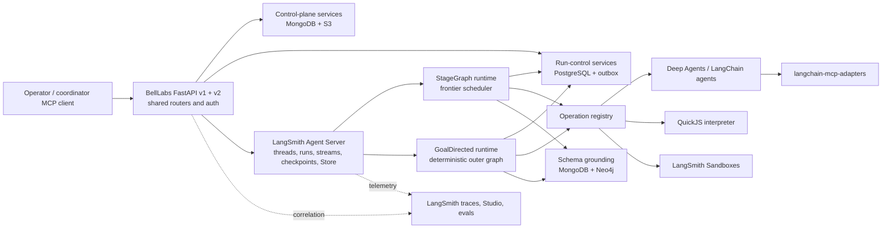
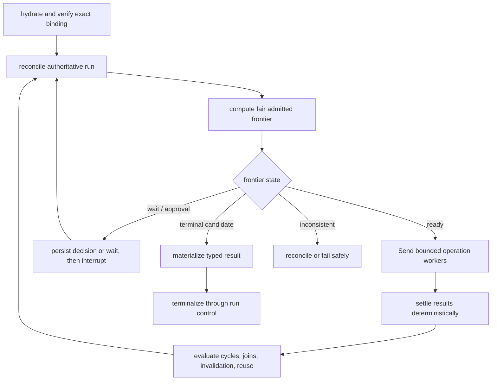
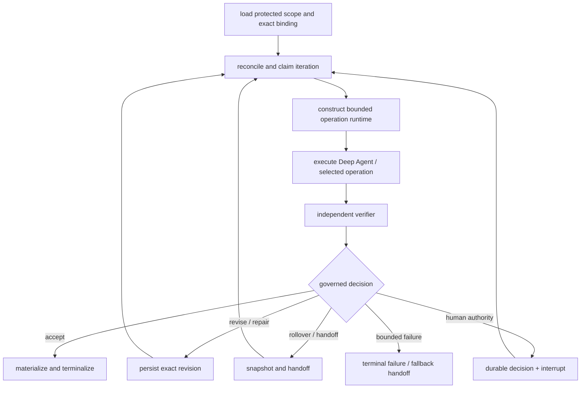

# LangGraph, Deep Agents, and LangSmith control-plane migration plan

Status: **proposed implementation plan; not yet an accepted architecture contract**  
Date: 2026-08-01  
Scope: control plane, run control, schema grounding, StageGraph, GoalDirected, operation execution, coordinator launch/result integration, and LangSmith Agent Server deployment  
End state: the LangSmith-deployed API and graphs are usable, observable, resumable, and ready for the coordinator-agent MCP server to orchestrate.

Research round 2 amendment: this revision incorporates the evidence and readiness verdict in `[LANGGRAPH_DEEPAGENTS_RESEARCH_ROUND_2.md](./LANGGRAPH_DEEPAGENTS_RESEARCH_ROUND_2.md)`, including runtime graph rebuilding, first-class context policy, delegation modes, MongoDB/PostgreSQL boundaries, async execution, naming, and coordinator capability composition.

## 1. Outcome and recommendation

Adopt a **standard LangSmith Deployment / Agent Server application containing custom LangGraphs**. Use Deep Agents inside the operation nodes that benefit from its planning, filesystem, context-management, skill, and subagent harness. Do not make Managed Deep Agents the primary runtime, and do not translate Temporal workflows node-for-node.

The target ownership boundary is:


| Concern                                                           | Owner after migration                                | Authority                               |
| ----------------------------------------------------------------- | ---------------------------------------------------- | --------------------------------------- |
| Immutable definitions, aliases, compilation, ERCs                 | BellLabs control plane                               | Authoritative                           |
| Admission, lifecycle CAS, budgets, decisions, terminality, outbox | BellLabs run control in PostgreSQL                   | Authoritative                           |
| Schema/KG bindings, evidence, reconciliation                      | BellLabs schema grounding, MongoDB, Neo4j            | Authoritative                           |
| Workflow execution, suspension, checkpointing, replay, streaming  | LangGraph on Agent Server                            | Execution mechanics                     |
| Operation-level agent loop                                        | LangChain agent or Deep Agent                        | Produces governed evidence/results      |
| Models and tools                                                  | LangChain integrations and middleware                | Capability mechanics                    |
| Outbound MCP clients                                              | `langchain-mcp-adapters`                             | Capability mechanics                    |
| Shell/filesystem/browser isolation                                | LangSmith Sandboxes through a BellLabs provider port | Execution mechanics                     |
| Bounded in-process JavaScript                                     | Deep Agents QuickJS interpreter                      | Execution mechanics                     |
| Traces, Studio, datasets, evaluators, online evaluation           | LangSmith                                            | Observability/evaluation evidence       |
| Cross-thread agent memory                                         | LangGraph Store                                      | Non-authoritative memory only           |
| Large artifacts and snapshots                                     | S3 or governed artifact store                        | Authoritative by BellLabs record/digest |


This produces a deliberate hybrid:

- **LangGraph** is the outer durable workflow runtime.
- **Deep Agents** is a selected inner operation harness, not the lifecycle authority.
- **BellLabs domain/application services** remain the source of truth.
- **LangSmith Agent Server** hosts graphs, threads, runs, streams, persistence, Studio integration, and custom HTTP routes.

### 1.1 Decisions this plan proposes for acceptance


| ID   | Proposal                                                                                                                                                                                                         | Reason                                                                                                                                                                                        |
| ---- | ---------------------------------------------------------------------------------------------------------------------------------------------------------------------------------------------------------------- | --------------------------------------------------------------------------------------------------------------------------------------------------------------------------------------------- |
| D-01 | Use standard Agent Server, not Managed Deep Agents, as the primary deployment.                                                                                                                                   | Custom state, reducers, domain APIs, exact bindings, and outer graphs are required.                                                                                                           |
| D-02 | Implement StageGraph as a generic frontier-scheduler graph first.                                                                                                                                                | Existing semantics include fairness, joins, cycles, invalidation, waits, and reuse; they are not a static DAG.                                                                                |
| D-03 | Add generated native LangGraphs only later for stable, measured hot paths.                                                                                                                                       | Keeps the initial migration behaviorally equivalent without forbidding optimization.                                                                                                          |
| D-04 | Implement GoalDirected as a deterministic outer graph around a bounded Deep Agent and independent verifier.                                                                                                      | Deep Agent output is evidence; BellLabs decides acceptance and terminality.                                                                                                                   |
| D-05 | Use one parent Agent Server thread per `(request_scope, BellLabs run_id, execution_epoch)`; bind linked runs and async subagents to explicit child threads.                                                         | Epoch rollover or fork cannot contaminate an earlier checkpoint lineage, while delegated work retains separate ownership, capacity, and recovery identity.                                    |
| D-06 | Keep the existing public FastAPI deployable independently during coexistence, while making the same routers mountable as Agent Server custom routes.                                                             | Enables safe migration and the requested single Agent Server API end state without duplicating domain logic.                                                                                  |
| D-07 | Let Agent Server provide production checkpointer/Store; use async PostgreSQL saver/store explicitly only in standalone integration tests or self-hosted mode.                                                    | Avoids competing persistence layers inside a managed deployment.                                                                                                                              |
| D-08 | Persist an authoritative `RuntimeExecutionBinding` in BellLabs PostgreSQL.                                                                                                                                       | Agent Server IDs and checkpoints are runtime facts that must be correlated to governed runs.                                                                                                  |
| D-09 | Use typed interventions only; do not expose arbitrary `update_state` to normal callers.                                                                                                                          | Checkpoint editing invokes reducers and is not a lifecycle authorization mechanism.                                                                                                           |
| D-10 | Put messages only in operation-agent subgraphs, not the top-level lifecycle state.                                                                                                                               | Prevents checkpoint bloat and keeps lifecycle replay deterministic.                                                                                                                           |
| D-11 | Use an async graph factory as the governed graph-assembly boundary when per-run resources or harness composition differ; keep a static compiled graph for families that do not require runtime assembly.         | Agent Server can rebuild a graph for each run, but also calls factories for state reads, updates, and schema inspection. The factory therefore needs an explicit introspection-safe protocol. |
| D-12 | Make all I/O-bearing application, graph, middleware, tool, MCP, sandbox, and Store paths natively async; keep pure domain reducers/interpreters synchronous.                                                     | Native async avoids thread-pool indirection, permits structured cancellation, and matches the current project ports and production Deep Agents guidance.                                      |
| D-13 | Move authoritative operation claims, dispatch attempts, and settlements into BellLabs PostgreSQL; retain MongoDB for definitions, compiled semantic records, evidence metadata, and immutable context manifests. | External-effect identity must coordinate transactionally with run lifecycle, budgets, and outbox. The current Mongo operation claim documents cannot provide that atomic boundary.            |
| D-14 | Publish a first-class `ContextPolicyDefinition` and compile an immutable `ContextAssemblySpec` into the ERC.                                                                                                     | Context compression, retrieval, provenance, quarantine, expiry, and reconstruction are governed behavior, not incidental middleware settings.                                                 |
| D-15 | Model synchronous, dynamic-interpreter, asynchronous, and linked-run delegation as four distinct execution modes.                                                                                                | They have different state, recovery, authority, capacity, and compatibility semantics; a single `subagents` flag is insufficient.                                                             |
| D-16 | Freeze a canonical vocabulary and identifier grammar before new schemas are published.                                                                                                                           | Workflow Types, runtime graphs, assistants, threads, Agent Server runs, operations, subagents, async tasks, and linked runs must not share overloaded names or IDs.                           |


### 1.2 Explicit non-goals

- Do not replace PostgreSQL lifecycle authority with checkpoint state.
- Do not store ERC bodies, transition histories, raw corpora, large artifacts, or full model transcripts in top-level graph state.
- Do not use every stage as a Deep Agent. Deterministic functions remain deterministic nodes.
- Do not allow a model, tool, MCP server, subagent, or QuickJS program to grant itself authority.
- Do not equate Agent Server assistants with BellLabs Workflow Types.
- Do not treat a LangGraph checkpoint ID as a BellLabs goal-handoff checkpoint ID.
- Do not remove Temporal/OpenAI Agents dependencies before parity, canary, and rollback gates pass.
- Do not move secrets, PHI, or raw sensitive payloads into state, Store, traces, prompts, or stream events.
- Do not wipe or reinterpret existing run-control, definition, schema-grounding, artifact, or result data.

## 2. Target system




### 2.1 Runtime boundaries

1. A coordinator or REST caller prepares a launch using exact immutable refs.
2. BellLabs compiles and verifies the ERC and freezes semantic/runtime bindings.
3. Run control performs authoritative admission and creates the BellLabs run.
4. A transactional outbox record requests graph execution.
5. A graph dispatcher creates or reuses the exact Agent Server thread and run, then records their IDs in `RuntimeExecutionBinding`.
6. Graph nodes repeatedly reconcile with BellLabs run control. They never assume checkpoint state is fresher or more authoritative.
7. Parallel operation workers return immutable result refs to a single deterministic settlement node.
8. The settlement node applies domain interpreter transitions through run-control CAS.
9. Human decisions are durable BellLabs records. `interrupt()` suspends execution; resume carries only a decision reference/digest.
10. The terminalizer validates BellLabs terminal state, writes the typed family result, and exposes it through the shared result facade.

### 2.2 Deployment topology

Use two process shapes from one codebase during migration:


| Shape                              | Purpose                                     | Routes/runtime                                                     |
| ---------------------------------- | ------------------------------------------- | ------------------------------------------------------------------ |
| Existing standalone FastAPI        | Current production/coexistence and rollback | v1 APIs, coordinator MCP, optionally v2 proxy routes               |
| LangSmith Agent Server application | New runtime and final serverless endpoint   | registered graphs, Agent Server defaults, custom BellLabs HTTP app |


The custom Agent Server HTTP app imports router factories and shared dependencies. It must not import the existing `app.server` lifespan because that composition assumes Temporal/OpenAI workers and currently has incomplete REST principal injection. Route-shadowing tests must prove that custom routes do not collide with Agent Server default endpoints.

## 3. Identity, persistence, and authority model

### 3.1 Identity map


| Identity              | Meaning                                              | Lifecycle                                  |
| --------------------- | ---------------------------------------------------- | ------------------------------------------ |
| `request_scope`       | Tenant/project governance boundary                   | Existing, authoritative                    |
| `run_id`              | BellLabs governed workflow run                       | Existing, authoritative                    |
| `execution_epoch`     | Continuity boundary within a BellLabs run            | Existing concept; implement beyond epoch 1 |
| `thread_id`           | Agent Server checkpoint lineage                      | One per run and epoch                      |
| Agent Server `run_id` | One invocation/resume/steering execution on a thread | Many per thread                            |
| `assistant_id`        | Deployed graph/config pointer                        | Runtime configuration, not Workflow Type   |
| `deployment_revision` | Exact Agent Server code/config revision              | Frozen into runtime binding                |
| `checkpoint_id`       | Runtime checkpoint position                          | Runtime fact, never a domain handoff ID    |
| `trace_id`            | LangSmith trace correlation                          | Evidence/observability                     |
| `semantic_key`        | Stable stage/iteration/attempt identity              | Existing BellLabs idempotency identity     |


Create a thread using deterministic metadata, but let Agent Server own the actual thread identifier. Persist the binding before considering launch complete. A fork creates a new BellLabs run and thread. A sanctioned epoch rollover creates a new thread and a compact handoff input containing only verified refs/digests.

### 3.2 Authoritative `RuntimeExecutionBinding`

Add a PostgreSQL-backed immutable/versioned record with at least:

```text
request_scope
belllabs_run_id
execution_epoch
graph_family                  # stagegraph | goal_directed
graph_id
assistant_id
assistant_config_revision
deployment_id
deployment_revision
agent_server_url_ref          # configuration ref, not secret value
thread_id
initial_agent_server_run_id
latest_agent_server_run_id
initial_checkpoint_id
latest_checkpoint_id
submission_key
status                        # requested | dispatching | active | interrupted | terminal | failed_reconciliation
trace_id / trace_url
created_at / updated_at
expected_run_control_version
parent_binding_id             # fork/epoch lineage
```

Constraints:

- Unique `(request_scope, belllabs_run_id, execution_epoch)`.
- Unique `submission_key` within the request scope.
- Only one active binding for an epoch.
- Same submission key plus same payload is idempotent.
- Same submission key plus different payload is a durable conflict.
- Agent Server identifiers are never accepted from an untrusted caller.
- A dispatch ambiguity is reconciled by querying Agent Server using persisted metadata before retrying.

### 3.3 Persistence boundary


| Data                                                     | Storage                          | Rule                                 |
| -------------------------------------------------------- | -------------------------------- | ------------------------------------ |
| Graph execution state                                    | Agent Server checkpointer        | Compact, replayable, ref-oriented    |
| Cross-thread agent memory/preferences                    | Agent Server Store               | Non-authoritative and revocable      |
| Run lifecycle, budgets, approvals, interventions, outbox | BellLabs PostgreSQL              | Authoritative                        |
| Definitions, ERCs, semantic records                      | MongoDB, external payloads in S3 | Immutable/content-addressed          |
| Large outputs, snapshots, transcripts                    | S3/governed artifact storage     | State carries only ref/digest        |
| Knowledge graph                                          | Neo4j                            | Governed scientific/schema authority |
| Trace/evaluation evidence                                | LangSmith                        | Not lifecycle authority              |
| Wakeups/cache                                            | Redis if retained                | Reconstructable acceleration only    |


In Serverless, use platform-managed checkpointer and Store. In local unit tests use in-memory persistence. In production-like standalone integration tests, create `AsyncPostgresSaver` and `AsyncPostgresStore` in an async lifespan and run their setup migrations once. Never construct a new saver/store per graph invocation.

### 3.4 Store namespaces

Use typed namespace construction, for example:

```text
("belllabs", environment, tenant_pseudonym,
 "agent_memory", agent_profile_digest,
 subject_kind, subject_id, purpose)
```

Rules:

- Tenant and environment are mandatory namespace segments.
- Store records include schema version, source, timestamps, expiry, sensitivity class, and digest.
- Memory can influence prompts only when a frozen policy allows that purpose.
- Memory cannot authorize, satisfy an approval, alter a protected goal, prove a scientific claim, or terminalize a run.
- Deletion/retention policy must work independently of checkpoint retention.

Checkpoint namespaces are a LangGraph runtime concern. Do not encode BellLabs workspace namespaces into `checkpoint_ns`. Stable graph and node names matter for resume compatibility; parallel stateful subgraph reuse must be proven in a spike or avoided through invocation-scoped subgraphs.

## 4. Graph state and reducer contracts

Use separate lifecycle state schemas for StageGraph and GoalDirected, plus operation-agent state local to each agent/subgraph. Every top-level field must declare its writer, parallelism, reducer, authority, trace policy, and retention.

### 4.1 Common lifecycle channels


| Channel                    | Writer           | Parallel writes | Reducer/update rule                          | Authority                       | Trace/retention                |
| -------------------------- | ---------------- | --------------- | -------------------------------------------- | ------------------------------- | ------------------------------ |
| `identity`                 | bootstrap        | No              | Immutable single assignment                  | Reference to BellLabs IDs       | Metadata only; thread lifetime |
| `runtime_binding_ref`      | bootstrap        | No              | Immutable single assignment                  | Ref to authoritative row        | Safe ref/digests only          |
| `definition_digests`       | bootstrap        | No              | Immutable single assignment                  | Exact control-plane refs        | Trace-safe digests             |
| `lifecycle_projection_ref` | reconcile/settle | No              | Replace only after successful CAS            | Ref/version authoritative in PG | Compact; thread lifetime       |
| `pending_decisions`        | decision nodes   | Yes             | Conflict-detecting keyed state-machine merge | Decision rows authoritative     | IDs/status only                |
| `outbox_position`          | boundary nodes   | Yes             | Monotonic maximum                            | PG cursor authoritative         | Safe integer                   |
| `diagnostics`              | nodes            | Yes             | Keyed union by stable diagnostic ID          | Non-authoritative               | Redacted and TTL-bound         |
| `final_result_ref`         | finalizer        | No              | Single assignment; equality permits replay   | Result repository authoritative | Ref/digest only                |


### 4.2 StageGraph state


| Channel              | Writer                       | Parallel writes | Rule                                                            |
| -------------------- | ---------------------------- | --------------- | --------------------------------------------------------------- |
| `stage_projection`   | reconcile/settle             | No              | Whole typed projection replacement after domain interpreter/CAS |
| `workflow_cycle`     | settle/evaluate              | No              | Monotonic validated replacement                                 |
| `fairness_cursor`    | scheduler/settle             | No              | Scheduler-owned replacement                                     |
| `dispatch_batch`     | scheduler                    | No              | Replace with exact batch ID and semantic keys                   |
| `pending_results`    | operation workers            | Yes             | Conflict-detecting keyed union by semantic key                  |
| `pending_failures`   | operation workers            | Yes             | Same keyed union semantics                                      |
| `pending_async_jobs` | operation workers/reconciler | Yes             | Keyed state-machine merge by durable job ID                     |
| `wait_projection`    | wait/reconcile               | No              | Replace from authoritative wait/pause record                    |
| `reuse_candidates`   | scheduler                    | No              | Replace with immutable refs                                     |


The keyed union reducer must be associative, commutative, and idempotent:

1. A new key is added.
2. Same key plus same canonical digest is an idempotent duplicate.
3. Same key plus different digest fails closed and emits a reconciliation incident.
4. There is no last-writer-wins path.

Parallel workers never mutate `stage_projection`. A single settlement node sorts results by semantic identity and invokes the existing deterministic StageGraph interpreter/domain service. This is the central mechanism that keeps replay, fairness, lifecycle CAS, and reducers tractable.

### 4.3 GoalDirected state


| Channel                   | Writer               | Parallel writes  | Rule                                         |
| ------------------------- | -------------------- | ---------------- | -------------------------------------------- |
| `protected_scope_ref`     | bootstrap            | No               | Immutable exact ref/digest                   |
| `goal_revision_ref`       | decision/settle      | No               | Parent-linked monotonic revision             |
| `iteration_projection`    | claim/settle         | No               | Replace after CAS                            |
| `agent_session_ref`       | session manager      | No               | Replace only at declared rollover            |
| `workspace_snapshot_ref`  | workspace manager    | No               | Immutable refs, parent-linked                |
| `agent_result_ref`        | agent operation      | No per iteration | Single assignment per semantic iteration key |
| `verification_result_ref` | independent verifier | No per iteration | Single assignment per verifier key           |
| `blockers`                | operation/verifier   | Potentially      | Keyed union by blocker ID/digest             |
| `no_progress_projection`  | convergence node     | No               | Deterministic replacement                    |
| `handoff_ref`             | handoff node         | No               | Single assignment per rollover               |
| `messages`                | **not top-level**    | N/A              | Kept in the bounded agent subgraph only      |


`messages` uses `add_messages` only inside an agent or Deep Agent subgraph. The outer GoalDirected graph carries compact session, result, evidence, and summary refs.

### 4.4 Checkpoint editing

Reducers also run during `update_state`. Therefore:

- Normal callers receive only typed intervention commands.
- Replacement of a reducer-backed value requires explicit `Overwrite` semantics in an operator-only repair tool.
- Repairs require expected checkpoint ID, expected BellLabs lifecycle version, actor, reason, and an audit record.
- Repairs cannot bypass a BellLabs admission, budget, approval, or terminality rule.
- Time-travel/fork operations produce a new BellLabs run and thread when execution will continue from edited history.

## 5. StageGraph target runtime

### 5.1 Graph shape




Suggested nodes:

1. `hydrate_runtime_binding`: load by authoritative ref and verify every digest.
2. `reconcile_run_control`: compare checkpoint projection version to PostgreSQL; replay/rebuild compact projection if needed.
3. `compute_frontier`: call the existing pure interpreter using budget/concurrency/fairness facts.
4. `reserve_frontier`: reserve authoritative budget/capacity and persist semantic attempt identities before side effects.
5. `dispatch_ready`: return bounded `Send` tasks, one per admitted stage execution.
6. `execute_operation`: resolve the exact operation implementation and return a result/failure/async-job ref.
7. `settle_frontier`: sort, verify, settle usage, and apply interpreter transitions through CAS.
8. `evaluate_cycles_and_reuse`: perform stage/workflow cycle policy, descendant invalidation, and immutable output reuse.
9. `wait_or_interrupt`: represent external wait, pause, or approval with durable BellLabs state plus `interrupt()`.
10. `materialize_result`: build the existing typed `StageGraphWorkflowResult` from verified refs.
11. `terminalize`: call the terminal completion service and record final result binding.

### 5.2 Operation implementation registry

Replace vendor dispatch with an exact registry keyed by the frozen implementation binding:


| Kind                     | Runtime                                                      |
| ------------------------ | ------------------------------------------------------------ |
| `deterministic_function` | Plain async Python node/service                              |
| `langchain_agent`        | `create_agent` with ordered middleware                       |
| `deep_agent`             | Deep Agent with bound backend, skills, subagents, middleware |
| `langgraph_subgraph`     | Invocation-scoped subgraph or remote graph                   |
| `mcp_operation`          | Reviewed tools through `langchain-mcp-adapters`              |
| `quickjs_interpreter`    | Bounded QuickJS with exact injected capabilities             |
| `sandbox_job`            | LangSmith Sandbox via provider port                          |
| `human_decision`         | BellLabs decision plus `interrupt()`                         |


The registry does not choose mutable aliases at runtime. It consumes an exact, compiled `StageImplementationBinding` and rejects an unregistered kind, schema drift, or missing capability.

### 5.3 StageGraph parity requirements

- All dependency/join modes have equivalent tests.
- Fair scheduling is deterministic across replay.
- Global and per-stage concurrency ceilings are enforced before `Send` fan-out.
- Reservations precede side effects; settlement is idempotent.
- Stage/workflow cycles preserve current ceilings and outcome semantics.
- Wait, pause, resume, cancel, and readiness transitions use run control plus graph interrupts/wakeups.
- Output invalidation and reuse retain exact semantic keys and lineage.
- Duplicate node execution cannot duplicate an external effect.
- Graph restart from any checkpoint produces the same authoritative transitions.
- Execution epoch greater than one is implemented or explicitly rejected at admission until its phase is complete.

## 6. GoalDirected target runtime

### 6.1 Graph shape




The outer graph owns iteration, reservations, protected fields, convergence, rollover, independent verification, and terminality. The Deep Agent receives a bounded operation contract and returns structured evidence/result refs. It cannot mark the governed run successful.

### 6.2 Deep Agent construction

Construct each Deep Agent from the frozen `OperationExecutionBinding`:

- exact model binding and fallback policy;
- exact prompt revision plus dynamic prompt slots;
- exact tool and MCP allowlists;
- exact skill refs;
- allowed static/dynamic subagent definitions;
- delegation depth, count, concurrency, model, tool, data, network, and budget ceilings;
- workspace/sandbox backend and retention policy;
- session reuse/rollover mode;
- context compaction/offloading policy;
- trace/redaction policy;
- output schema and independent verification contract.

Use the Deep Agents native harness for its filesystem/todo/subagent/context behavior. Do not stack a second generic summarization middleware on top of native Deep Agent compaction unless a test proves the combination is deliberate. Plain LangChain agents may use summarization/context-editing middleware directly.

### 6.3 GoalDirected parity requirements

- Initial goal and protected scope remain immutable except through the existing bounded revision contract.
- Every iteration and agent run has a stable semantic identity.
- Independent verifier uses a separately bound implementation and evidence set.
- No-progress and repeated-blocker detection remain deterministic.
- Session and workspace reuse/fresh/fresh-from-handoff policies survive checkpoint resume.
- Rollover snapshots are content-addressed and linked.
- A resumed interrupt re-runs the node safely from its beginning.
- Final acceptance requires the verifier action and BellLabs terminal transition to agree.

## 7. Operation harness enhancements

### 7.1 Ordered middleware stack

Publish an exact ordered middleware manifest. Recommended logical order:


| Hook              | Responsibility                                                                                                               |
| ----------------- | ---------------------------------------------------------------------------------------------------------------------------- |
| `before_agent`    | Verify binding, tenant/scope, lifecycle phase, remaining budgets; attach trace taxonomy.                                     |
| `dynamic_prompt`  | Render exact base prompt plus typed, permitted state/runtime/store context; record rendered digest.                          |
| `before_model`    | Retrieve allowed memory, redact, compact/offload context, preserve evidence refs, enforce token ceiling.                     |
| `wrap_model_call` | Select only authorized model, apply timeout/retry/fallback, trace, capture usage.                                            |
| `after_model`     | Validate structured output and tool calls; detect policy/budget/evidence violations.                                         |
| `wrap_tool_call`  | Capability check, canonical identity, approval, idempotency, timeout/retry, cancellation, trace/redaction, usage settlement. |
| `after_agent`     | Persist compact result refs, settle usage, snapshot/cleanup workspace, emit events.                                          |


Middleware ordering is contract data because wrapper hooks nest and after-hooks execute in reverse. Each middleware entry needs an exact implementation ref/version, configuration digest, allowed state channels, failure policy, and trace/redaction class.

### 7.2 Dynamic prompts and context engineering

Dynamic prompts may use:

- current declared objective/iteration/stage;
- exact prompt commit and trusted prompt segments;
- approved evidence/artifact refs;
- remaining budget projection;
- current schema/context projection;
- workspace/sandbox refs;
- allowed non-authoritative memory;
- verifier feedback and bounded prior summary.

They may not use mutable aliases, secrets, raw auth tokens, unapproved cross-tenant memory, or unbounded checkpoint history. Persist the base prompt exact ref, rendered-input digest, rendered-prompt digest, and redaction class. A summary that affects a later governed decision must have a schema version, source refs, and digest.

Context placement:


| Context                                          | Location                                                       |
| ------------------------------------------------ | -------------------------------------------------------------- |
| Immutable instructions and policy                | Exact prompt/binding refs                                      |
| Auth identity, secrets handles, request metadata | Runtime context, never serializable state                      |
| Current operation messages                       | Agent subgraph state                                           |
| Lifecycle projection                             | Compact outer graph state refs/versions                        |
| Cross-thread preferences/memory                  | Store under tenant-scoped namespace                            |
| Large tool output                                | Artifact/filesystem backend with compact ref in messages/state |
| Files and shell workspace                        | LangSmith Sandbox                                              |


### 7.3 First-class context policy

Add a published `ContextPolicyDefinition` and compile a `ContextAssemblySpec` into each ERC. The compiled spec is exact, immutable, and operation-class-specific; it is not a mutable assistant preference. It must contain:


| Field group            | Required semantics                                                                                                                                        |
| ---------------------- | --------------------------------------------------------------------------------------------------------------------------------------------------------- |
| Identity/compatibility | policy exact ref/digest, schema version, minimum harness/runtime versions, applicable operation classes                                                   |
| Trust and admission    | allowed source kinds, trust class per source, prompt-injection quarantine, schema validation, tenant/purpose filters                                      |
| Budget                 | total input ceiling, reserved instruction/evidence/output tokens, parent/child allocation, overflow action                                                |
| Retrieval              | namespace, query construction policy, filters, top-k/score ceilings, diversity/recency policy, deterministic tie-breaker                                  |
| Preservation           | immutable goal/protected scope, exact instructions, citations, claim/evidence links, unresolved contradictions, approvals, budget facts, artifact digests |
| Compression            | trigger, selected middleware, target size, maximum generations, refresh/reconstruction cadence, summary schema                                            |
| Mutation               | which actor/hook may add, replace, summarize, expire, or delete each context class; expected-version rule                                                 |
| Provenance             | source refs/digests, transformation lineage, model/prompt binding for generated summaries, creation time                                                  |
| Retention/privacy      | sensitivity class, trace policy, Store/checkpoint/artifact TTL, deletion/tombstone behavior                                                               |
| Evaluation             | invariant-retention, citation recall, contradiction retention, contamination, retrieval utility, and compaction-drift thresholds                          |


Never summarize or model-rewrite exact instructions, protected goals, authority and approval facts, budget/attempt identities, source locators/digests, citation edges, or final accepted evidence. Model-written summaries are derived context only. Store them as a structured manifest that points to immutable source material; they never replace it.

Context reconstruction after compaction or epoch rollover is deterministic at the manifest level:

1. load the exact prompt, policy, protected scope, and current authoritative lifecycle projection;
2. load the latest accepted context manifest and verify every source digest;
3. rehydrate the bounded evidence/citation/contradiction projection;
4. retrieve only purpose-compatible non-authoritative Store items;
5. add the bounded working summary and verifier feedback;
6. render the prompt and record the assembly digest;
7. fail closed or request a rollover when mandatory evidence cannot fit.

Subagents receive a `ContextSlice`: an exact task, ceilings, allowed source/artifact refs, tool/skill grants, and required structured return schema. They do not inherit the parent's full messages, secrets, filesystem, Store namespace, skills, or authority. Their result is admitted back through a `SubagentResultManifest` with provenance and size limits. Cross-thread Store is disabled by default for scientific claims and enabled only for low-risk procedural preferences or reviewed reusable memory with purpose, expiry, contradiction, and deletion semantics.

## 8. MCP, subagents, QuickJS, and sandboxes

### 8.1 Outbound MCP adaptation

Use `MultiServerMCPClient` from `langchain-mcp-adapters` as an adapter behind BellLabs exact bindings.

Per-operation sequence:

1. Load exact `MCPServerBinding` and secret references.
2. Construct transport configuration without serializing credentials.
3. Discover tools outside model-visible context.
4. Compare server/tool names and schemas to the frozen allowlist and digest.
5. Canonicalize names, for example `mcp__{server_id}__{tool_name}`.
6. Wrap every tool in BellLabs authorization, idempotency, budget, timeout, retry, cancellation, approval, and tracing middleware.
7. Fail closed on tool disappearance, extra requested tool, or schema drift.
8. Close explicit sessions in `finally`/async context cleanup.

Session policy:

- Stateless/read-only tools: adapter default short-lived session.
- Stateful server: explicit operation- or stage-scoped session.
- No deployment-global session that carries tenant credentials.
- Streamable HTTP for deployed servers.
- SSE only for pinned legacy compatibility.
- `stdio` only locally or inside a controlled sandbox; never assume Serverless permits arbitrary subprocesses.

Map progress/logging to non-authoritative custom stream events. Map MCP elicitation to a durable BellLabs decision plus graph interrupt. Tool-returned state updates remain bounded by middleware and reducers.

Keep three surfaces distinct:

1. outbound tool consumption through adapters;
2. Agent Server's inbound protocol endpoints;
3. the existing BellLabs coordinator MCP server.

### 8.2 Dynamic and asynchronous subagents

Dynamic subagents select from a frozen `DelegationBinding`; they do not synthesize authority. The spawning middleware must:

- reserve parent budget and concurrency first;
- enforce max depth, count, concurrency, model/tool/MCP/data/network ceilings;
- propagate only explicit runtime context;
- validate structured child output and artifact refs;
- correlate child trace/thread/run/job IDs;
- cascade cancellation or produce an orphan reconciliation record;
- settle child usage exactly once;
- prevent a child from terminalizing the parent.

Deep Agents async subagents are preview functionality and require a feature flag and version-pinned spike. For long-running child work:

1. launch the async job after reservation;
2. persist a compact durable job binding;
3. return the parent stage/iteration to a waiting state instead of consuming a worker indefinitely;
4. resume on callback/poll/reconciliation;
5. expose typed update/cancel actions;
6. reconcile job state after process or network failure.

Outer StageGraph `Send` is the primary parallelism mechanism for independent stages. Work that needs independent admission, recovery, lineage, or authority is a linked BellLabs run with its own thread, not merely a subagent.

Freeze delegation by mode rather than by a generic enablement flag:


| Mode                           | Native mechanism                                 | Continuity                                                            | BellLabs contract                                                                                                                    |
| ------------------------------ | ------------------------------------------------ | --------------------------------------------------------------------- | ------------------------------------------------------------------------------------------------------------------------------------ |
| `synchronous_subagent`         | Deep Agents/LangChain `task`                     | Parent blocks; custom child invocation is otherwise fresh/stateless   | Exact subagent profile, context slice, output schema, depth/count/budget ceiling                                                     |
| `dynamic_interpreter_subagent` | QuickJS `task()` with interpreter middleware     | Bounded to interpreter call/turn/thread mode                          | All synchronous controls plus interpreter profile, PTC allowlist, source digest, resource limits; beta feature flag                  |
| `asynchronous_subagent`        | Deep Agents async task tools over Agent Protocol | Stateful child on its own thread; task status must be freshly queried | Durable async-task binding, child thread/run correlation, update/cancel/reconcile policy, capacity reservation; preview feature flag |
| `linked_workflow_run`          | Coordinator/run-composition service              | Independent admitted run and thread                                   | Declared linked-run slot, child Workflow Type admission, separate budget/authority, dependency class                                 |


The coordinator may choose only among modes allowed by the exact Workflow Type and implementation binding. A recognized Workflow Type boundary, durable independent wait, materially distinct authority, reusable governed output, or substantial separate budget forces `linked_workflow_run`. Never depend on the current coincidence that an async Deep Agents task ID is also a thread ID; persist both typed fields and an observed relationship.

### 8.3 QuickJS interpreter

Use `CodeInterpreterMiddleware`/the pinned Deep Agents interpreter integration only for bounded JavaScript transforms, batching, aggregation, and programmatic calls to explicitly injected tools/subagents.

Default policy:

- state mode `call`;
- `turn` only for an explicitly bound multi-step operation;
- `thread` only after checkpoint-size, snapshot, and resume tests pass;
- programmatic tool calling disabled unless an exact allowlist enables it;
- no ambient network, shell, filesystem, secrets, clock, or environment access;
- explicit CPU/time, memory, output, call-count, and fan-out limits;
- exact source/script digest and output schema;
- mutating or sensitive programmatic tool calling is disabled unless each injected capability is independently wrapped with BellLabs authorization, idempotency, budget, approval, cancellation, and tracing guards.

Programmatic tool calls do not follow the ordinary model tool-call path, and ordinary `interrupt_on` approval is not automatically enforced for every programmatic call. Therefore PTC cannot rely on normal tool middleware by assumption. Qualification tests must prove that a guarded injected tool cannot bypass authorization/approval or duplicate an effect; otherwise leave PTC disabled for that tool class.

QuickJS is not a security sandbox. A program that invokes models/tools/subagents is orchestration, not a pure deterministic transform.

### 8.4 LangSmith Sandboxes

Use `SandboxClient` and `deepagents.backends.LangSmithSandbox` behind the existing BellLabs `SandboxProvider` port. A sandbox binding must define:

- tenant/run/epoch/stage or iteration identity;
- thread- or assistant-scoped lifetime;
- base image/runtime and package policy;
- network egress policy;
- secrets proxy/mount policy;
- filesystem mounts and input artifact digests;
- CPU/memory/time/storage limits;
- snapshot/retention/cleanup policy;
- trace and redaction policy.

Choose thread-scoped sandboxes for workflow workspaces. Use assistant-scoped sandboxes only for immutable, non-tenant-shared assets. Snapshot before declared rollover/handoff, store the governed snapshot externally, and make cleanup idempotent. QuickJS handles bounded in-process computation; Sandboxes handle real files, shell, packages, browser, or OS isolation.

### 8.5 Runtime graph rebuilding and assembly

Agent Server supports a graph factory that returns a compiled graph for each new run. The factory may be async and may accept typed `ServerRuntime` or `RunnableConfig`. This is useful for per-thread sandboxes, exact middleware/tool sets, and assistant configuration, but it is not a license to discover mutable capabilities or recompile semantic authority at execution time.

The factory is called not only for execution but also for state update, state read/history, and assistant schema/graph inspection. Implement a `GraphAssemblyFactory` with these rules:

1. Treat `ServerRuntime` behind a BellLabs adapter because that API is beta.
2. Branch on access context. Schema/read/update paths return an introspection-safe graph and never create a sandbox, open an MCP session, resolve secrets, reserve budget, or mutate BellLabs state.
3. Execution paths load one already-compiled `GraphAssemblySpec` by exact digest from assistant/config metadata, then verify it against the authoritative `RuntimeExecutionBinding` during the first graph node.
4. The factory may assemble middleware, tools, subagents, backends, and sandbox handles; it may not resolve mutable aliases, change topology family, widen authority, or choose a new Workflow Type.
5. Return `builder.compile()` without an explicit checkpointer or Store in managed Agent Server. Use the runtime-provided Store where required.
6. Use an async context-manager factory when construction opens per-run resources; guarantee close/cleanup on success, interruption, cancellation, and failure.
7. Cache only immutable, secret-free compiled graph structure by `graph_assembly_digest`. Do not cache tenant credentials, MCP sessions, sandbox handles, runtime context, or Store-derived memory in a process-global graph.
8. Node names, state channels, reducer identities, subgraph namespaces, and interrupt IDs are compatibility-sensitive. A changed compatibility surface creates a new `state_schema_version` and normally a blue/green deployment binding.

`GraphAssemblySpec` contains at least:

```text
graph_family
graph_id
graph_assembly_digest
state_schema_version / state_schema_digest
topology_version / stable_node_manifest
reducer_manifest_digest
operation_registry_digest
agent_harness_profile_refs
middleware_stack_refs
context_policy_refs
delegation_policy_refs
MCP/interpreter/sandbox profile refs
feature_maturity_snapshot
required_runtime/package compatibility
introspection_profile
```

Prefer a static generic StageGraph factory unless a per-run resource truly affects construction. GoalDirected/Deep Agent graphs may use runtime assembly for thread-scoped sandboxes and exact harness manifests. Even there, keep lifecycle topology stable and vary only declared operation-harness bindings. Record `graph_assembly_digest`, not just deployment revision, in `RuntimeExecutionBinding` and every trace root.

## 9. Human-in-the-loop, steering, cancellation, and forks

Treat these as distinct contracts:


| Mechanism              | Purpose                        | Runtime action                                                   | Authority                    |
| ---------------------- | ------------------------------ | ---------------------------------------------------------------- | ---------------------------- |
| Approval/decision      | Known human authority boundary | `interrupt()` then `Command(resume=decision_ref)`                | Durable BellLabs decision    |
| Message/input steering | Add authorized information     | Enqueue or interrupt/restart run with typed input                | Intervention record + policy |
| Async-subagent update  | Refine active child work       | Preview job update API                                           | Parent binding + ceiling     |
| Cancellation           | Stop/cooperatively unwind work | Run-control cancel, Agent Server cancel/interrupt, child cascade | BellLabs lifecycle command   |
| Checkpoint repair      | Operator recovery              | Controlled `update_state`/`Overwrite`                            | Audited admin repair         |
| Fork/time travel       | Explore alternate continuation | New BellLabs run + new thread                                    | New admission and lineage    |


### 9.1 Durable interrupt protocol

1. Node creates a durable decision request with ID, type, choices/schema, evidence refs, expiry, expected lifecycle version, and authorization policy.
2. Node calls `interrupt()` with compact display data and decision ID only.
3. API authenticates the actor and request scope and loads the decision.
4. API validates action, schema, expiry, expected version, and policy.
5. API persists the response idempotently.
6. API resumes the same thread with `Command(resume={decision_id, response_digest})`.
7. The node re-executes from its beginning, reloads the durable decision, verifies the digest/version, and continues.

All code before `interrupt()` must be idempotent because a resumed node restarts. Parallel interrupts use an interrupt-ID-to-resume-value map.

### 9.2 Steering policy

Default concurrent-run policy for governed workflows is `reject`. Allow `enqueue` for operator follow-ups that do not need to preempt. Allow Agent Server's interrupt strategy only through a typed BellLabs intervention that first records the accepted lifecycle transition. Do not use `rollback` for authoritative external side effects.

Supported typed interventions should include:

- `append_input`
- `satisfy_wait`
- `resume_pause`
- `respond_to_interrupt`
- `update_async_task`
- `cancel_async_task`
- `cancel_run`
- `fork_from_checkpoint`
- `operator_reconcile` (privileged)

Each carries `command_id`, expected run version, expected checkpoint when relevant, actor, reason, idempotency key, typed payload, and correlation ID.

## 10. Contract evolution

Preserve the strict/frozen/content-addressed style of existing Pydantic contracts. Add LangChain ecosystem concepts as exact BellLabs definitions rather than passing loose dictionaries.

### 10.1 New or enhanced definition kinds


| Contract                        | Key fields                                                                                                                                                                                      |
| ------------------------------- | ----------------------------------------------------------------------------------------------------------------------------------------------------------------------------------------------- |
| `GraphRuntimeProfileDefinition` | graph family/ID, compatible state schema digest, reducer spec ref, durability, store/TTL, stream policy, concurrency strategy, retry layers, interrupt/steering policy, runtime revision policy |
| `AgentHarnessProfileDefinition` | harness kind, model/profile refs, middleware manifest, context policy, filesystem backend, skill refs, subagent policy, output schema                                                           |
| `MiddlewareStackDefinition`     | ordered exact middleware refs/config digests, hooks, allowed state/context channels, failure/redaction policies                                                                                 |
| `MCPServerDefinition`           | transport, endpoint SecretRef/config ref, session policy, auth strategy, timeouts, retry, allowed tools and schema digests                                                                      |
| `PromptContextBinding`          | exact prompt commit/ref, trusted segments, dynamic slot schema, permitted sources, rendered digest policy                                                                                       |
| `StageImplementationBinding`    | implementation kind plus exact function/agent/subgraph/MCP/interpreter/sandbox/human binding                                                                                                    |
| `InterpreterProfileDefinition`  | engine/version, source digest, state mode, PTC allowlist, limits, output schema                                                                                                                 |
| `SandboxProfileDefinition`      | backend/image, scope, mounts, egress, limits, snapshot, retention, cleanup                                                                                                                      |
| `EvaluationProfileDefinition`   | datasets, evaluator refs/versions, thresholds, online sampling, feedback policy                                                                                                                 |


Enhance the current operation binding rather than replace it. Existing exact prompt, model, tool, MCP, workspace, delegation, capability, budget, trace, session, and snapshot contracts are the anti-corruption layer for LangChain/Deep Agents.

Rename vendor-specific result fields such as `temporal_activity_attempt` to a provider-neutral `runtime_transport_attempt` or a structured `RuntimeAttemptMetadata`. Strongly distinguish `GoalHandoffCheckpointId` from `LangGraphCheckpointId`.

### 10.2 Runtime API contracts

Add:

- `GraphExecutionSubmission`
- `GraphExecutionReceipt`
- `RuntimeExecutionProjection`
- `RuntimeExecutionBindingView`
- `InterventionCommand` discriminated union
- `InterruptEnvelope` and `InterruptResponse`
- `AsyncTaskBinding` and `AsyncTaskProjection`
- `BellLabsStreamEvent`
- `ForkRequest` and `ForkReceipt`
- `CheckpointSummary` for operator views
- `GraphRuntimeHealth` and dependency readiness details

Standard BellLabs v2 envelope:

```json
{
  "ok": true,
  "schema_version": "belllabs.api.v2",
  "correlation_id": "...",
  "data": {}
}
```

or:

```json
{
  "ok": false,
  "schema_version": "belllabs.api.v2",
  "correlation_id": "...",
  "error": {
    "code": "...",
    "message": "...",
    "retryable": false,
    "details": {}
  }
}
```

This same envelope is used by REST and coordinator MCP facade methods. Agent Server's native endpoints keep their native schema; custom BellLabs routes wrap only BellLabs APIs.

### 10.3 MongoDB and PostgreSQL target model

Use storage according to authority and transaction boundaries, not framework ownership.

#### MongoDB: immutable definitions and semantic records

Continue using the existing generic control-plane collections rather than creating one collection per LangChain feature:


| Collection/model                                                 | Target use                                                                                                                                                                                                              |
| ---------------------------------------------------------------- | ----------------------------------------------------------------------------------------------------------------------------------------------------------------------------------------------------------------------- |
| `control_plane_definition_heads`                                 | Mutable authoring head only; optimistic revision; never selected at execution                                                                                                                                           |
| `control_plane_published_definitions`                            | New exact kinds including `graph_runtime_profile`, `agent_harness_profile`, `middleware_stack`, `context_policy`, `delegation_policy`, `mcp_server`, `interpreter_profile`, `sandbox_profile`, and `evaluation_profile` |
| `control_plane_effective_run_configurations`                     | ERC plus inline or external content-addressed `GraphAssemblySpec` and `ContextAssemblySpec` refs/digests                                                                                                                |
| `schema_grounding_records` and existing semantic collections     | Immutable scientific/schema/evidence records with execution-binding lineage and deterministic ordering                                                                                                                  |
| new `context_manifests` only if query/access patterns justify it | Immutable derived-context metadata: source refs/digests, summary ref, transformation binding, sensitivity, expiry, and parent manifest; large content remains in the artifact store                                     |


Published definition payloads remain strict Pydantic discriminated unions in domain code even though Mongo stores a common document shape. Add compound unique indexes for every logical identity and query indexes for lifecycle/status lookups. Do not put secrets, mutable runtime status, leases, side-effect claims, budget balances, or Agent Server checkpoint bodies in Mongo.

#### PostgreSQL: authoritative coordination and execution journal

Add a forward-only migration with RLS and least-privilege grants for:


| Table                                                        | Cardinality and purpose                                                                                                                                                |
| ------------------------------------------------------------ | ---------------------------------------------------------------------------------------------------------------------------------------------------------------------- |
| `runtime_execution_bindings`                                 | One row per `(request_scope, belllabs_run_id, execution_epoch)`; exact deployment/graph/assembly/thread binding and reconciliation status                              |
| `runtime_execution_attempts`                                 | Append-only row per Agent Server invocation/resume/steer/cancel submission; provider run ID, submission key, request digest, status, retry layer, timestamps, trace ID |
| `runtime_checkpoint_observations`                            | Optional append-only compact observation/cursor only; never checkpoint state; unique provider checkpoint identity per binding                                          |
| `runtime_intervention_commands`                              | Idempotent typed intervention request/result with expected run/checkpoint versions and actor/reason                                                                    |
| `runtime_interrupt_requests` / `runtime_interrupt_decisions` | Generalized durable decision protocol; can supersede legacy agent-runtime approval tables after compatibility migration                                                |
| `runtime_async_tasks`                                        | Parent binding, mode, task ID, child thread/run IDs, exact subagent binding, reservation, state-machine status, heartbeat/reconcile fields, result/error refs          |
| `operation_effect_claims`                                    | Unique provider-effect/idempotency claim acquired transactionally before an external effect                                                                            |
| `operation_execution_attempts`                               | Append-only infrastructure/model/tool/MCP/sandbox attempts and usage evidence; references the immutable Mongo-authoritative semantic binding by stable identity/digest |
| `operation_settlements`                                      | Exactly-once result/usage settlement connected to budget ledger and outbox                                                                                             |


The claim/attempt/settlement migration is mandatory before claiming exactly-once external-effect behavior. The immutable semantic `OperationExecutionBinding` remains MongoDB/Beanie-authoritative under accepted `biotech-meta`; PostgreSQL stores only its stable identity and canonical digest reference. During coexistence, dual-read of the migrating journal records is allowed only behind a migration repository; authoritative writes go to one store selected by schema version. Do not dual-write without a transactionally recoverable journal. Backfill verifies canonical payload digests, records source document IDs, and leaves migrated Mongo claim/settlement records read-only until the rollback window expires.

Every PostgreSQL table includes `request_scope` directly or reaches it through a non-deferrable foreign key to `workflow_runs`, enables and forces RLS, and has indexes for pending reconciliation (`status`, `next_attempt_at`, lease expiry), run lineage, provider IDs, and idempotency keys. JSONB holds versioned payload details; identity, lifecycle, uniqueness, timestamps, expected versions, and reconciliation fields remain typed columns.

### 10.4 Contract field governance

Every newly published or runtime contract must include a field-governance appendix generated from the Pydantic schema with: writer, readers, authority class (`authoritative`, `immutable semantic`, `runtime fact`, `derived projection`, or `debug-only`), mutation rule, retention, sensitivity, compatibility behavior, and trace policy. CI fails if a field is added without this metadata.

### 10.5 Naming and identity conventions

Use this vocabulary consistently:


| Term             | Meaning                                                                              |
| ---------------- | ------------------------------------------------------------------------------------ |
| Workflow Type    | Reusable BellLabs domain contract                                                    |
| Workflow Run     | One admitted execution of exactly one Workflow Type                                  |
| graph family     | `stagegraph` or `goal_directed`; lifecycle topology class                            |
| graph ID         | Stable Agent Server registration key, for example `belllabs_stagegraph`              |
| graph assembly   | Exact compiled runtime composition for one compatibility class/binding               |
| assistant        | Agent Server configuration pointer; never a Workflow Type or governed agent identity |
| thread           | Agent Server checkpoint lineage for one BellLabs run epoch                           |
| Agent Server run | One invocation/resume/steer execution on a thread                                    |
| operation        | Bounded unit inside a Workflow Run                                                   |
| subagent         | Operation-local delegated agent under the parent ceiling                             |
| async task       | Durable runtime fact for a stateful background subagent thread                       |
| linked run       | Independently admitted child Workflow Run across a Workflow Type boundary            |


Conventions:

- Python modules/functions/fields, JSON fields, SQL columns/tables, graph IDs, graph node names, enum values, and capability IDs use lowercase `snake_case`; capability IDs use dot-separated snake-case segments.
- Pydantic/domain classes use `PascalCase`; environment variables use `UPPER_SNAKE_CASE` with the existing `BELLLABS_` namespace for project settings.
- Preserve existing accepted definition `logical_id` grammar and human naming bundles from `biotech-meta`; do not bulk-rename published refs. New display names are never identity.
- Opaque entity IDs use one project-selected UUID/ULID representation. Provider IDs are stored in explicitly provider-qualified fields and never substituted for BellLabs IDs.
- Stable semantic keys and artifact paths are created only by typed builders with a version prefix. Do not add new hand-written `f"..."` identity strings. Preserve current key grammar through coexistence; a grammar change is a versioned migration, not cleanup.
- Graph node names, state channel names, reducer IDs, and interrupt namespaces are compatibility surfaces. Renaming one requires an explicit state-schema compatibility decision and generally a new blue/green graph assembly/deployment.
- Use suffixes deliberately: `_id` for opaque identity, `_ref` for resolvable exact/content address, `_digest` for canonical content hash, `_key` for idempotency/semantic identity, `_version` for optimistic/domain version, `_revision` for immutable publication/deployment revision, and `_projection` for derived state.
- Never use unqualified `run_id`, `checkpoint_id`, or `agent_id` where both BellLabs and provider identities can occur. Use `belllabs_run_id`, `agent_server_run_id`, `langgraph_checkpoint_id`, `subagent_profile_ref`, and `child_thread_id`.

## 11. API migration

### 11.0 Current-to-target surface map


| Current surface                                                                 | Preserve                                                                         | Change/add                                                                                               |
| ------------------------------------------------------------------------------- | -------------------------------------------------------------------------------- | -------------------------------------------------------------------------------------------------------- |
| `POST /control-plane/v1/definitions`, drafts, publish, aliases, compile, retire | Existing domain services, exact refs, immutable revisions, compiler authority    | Shared auth/envelope; v2 exact-definition discovery and LangGraph ecosystem definition kinds             |
| `GET /control-plane/v1/effective-run-configurations/{digest}`                   | Digest verification and admission retrieval                                      | Authenticate/authorize appropriately; expose redacted compiled runtime preview in v2                     |
| `GET /control-plane/v1/schemas`                                                 | Schema discoverability                                                           | Complete bundle for every request/response/error contract                                                |
| `POST /run-control/v1/run-requests`                                             | Admission policy, deterministic identity, accepted/rejected durability           | v2 envelope and runtime-binding request integration                                                      |
| `POST /run-control/v1/runs/{id}/commands`                                       | Optimistic lifecycle reducer and idempotent command results                      | Add typed graph interventions that first pass lifecycle authority                                        |
| `POST /run-control/v1/runs/{id}/operations`                                     | Reservation/current-version/config guards                                        | Deprecate Temporal submitter; replace with v2 `/executions` and operation registry                       |
| run/budget/transitions/outbox reads                                             | PostgreSQL authority and tenant scope                                            | Add correlated runtime projection, resumable events, compact checkpoint/operator views                   |
| schema-grounding v1 read endpoints                                              | Immutable record repository, grants, evidence, reconciliation                    | v2 envelope, deterministic latest ordering, runtime lineage/status; no generic memory mutation API       |
| coordinator MCP `prepare_workflow_launch`                                       | Exact compile, preview admission, frozen semantic plan, redacted expiring ticket | Runtime-neutral dispatcher and REST wrapper                                                              |
| coordinator MCP `launch_workflow`                                               | Revalidation, authoritative admission, semantic input binding, idempotency       | Agent Server outbox/dispatcher instead of Temporal start                                                 |
| coordinator MCP `get_workflow_result`                                           | Typed family result and terminal consistency                                     | Shared REST/MCP result facade plus runtime correlation                                                   |
| Socket.IO operation approval                                                    | Durable approval record concepts                                                 | Converge on BellLabs decision + LangGraph interrupt/resume; keep compatibility bridge during coexistence |


The v1 surface remains callable through coexistence. A v2 route is not allowed to implement a second compiler, admission path, lifecycle reducer, semantic-record repository, or result service.

### 11.1 Shared composition and authentication

Create one identity service for REST, coordinator MCP, and Agent Server custom auth. Implement Agent Server custom auth using `langgraph_sdk.Auth`:

- `@auth.authenticate` verifies the external JWT and returns subject, tenant/request scope, roles, and safe metadata.
- authorization handlers scope threads, runs, assistants, Store, and crons by tenant metadata;
- deny unhandled protected resources by default;
- expose the authenticated identity to graph runtime context, never serializable state;
- reuse the same principal-to-BellLabs-authority mapper in custom FastAPI dependencies.

This fixes the current REST principal dependency that otherwise returns 503 and removes the three different REST error shapes.

### 11.2 Control plane

Keep `/control-plane/v1` stable during coexistence. Add `/control-plane/v2` with:

- current draft/publication/alias/compile/retire functions backed by the same services;
- exact published-definition lookup and typed discovery;
- complete schema bundle/OpenAPI coverage;
- publication/retrieval for graph runtime, agent harness, middleware, MCP, interpreter, sandbox, prompt context, and evaluation definitions;
- compile preview that shows the resolved graph/harness/middleware/MCP/sandbox binding without secrets;
- launch-contract validation against registered deployment graph revisions.

Do not model mutable Agent Server assistants as Workflow Types. Compilation freezes an assistant/config/deployment-compatible runtime binding that can be checked again at dispatch.

### 11.3 Run control

Keep v1 reads/commands and deprecate the Temporal-only operation submission after parity. Add:


| Method/path                                                             | Purpose                                                               |
| ----------------------------------------------------------------------- | --------------------------------------------------------------------- |
| `POST /run-control/v2/run-requests`                                     | Existing authoritative admission with v2 envelope                     |
| `POST /run-control/v2/runs/{run_id}/executions`                         | Idempotently request Agent Server execution through outbox/dispatcher |
| `GET /run-control/v2/runs/{run_id}/runtime`                             | Correlated BellLabs and Agent Server projection                       |
| `POST /run-control/v2/runs/{run_id}/interventions`                      | Typed steering/cancel/wait/fork/reconcile command                     |
| `GET /run-control/v2/runs/{run_id}/interrupts`                          | Authorized pending/durable decisions                                  |
| `POST /run-control/v2/runs/{run_id}/interrupts/{decision_id}/responses` | Idempotent decision and resume                                        |
| `GET /run-control/v2/runs/{run_id}/events`                              | Resumable stream by BellLabs outbox cursor                            |
| `GET /run-control/v2/runs/{run_id}/checkpoints`                         | Redacted operator-only summaries                                      |
| `GET /run-control/v2/runs/{run_id}/result`                              | Existing typed family result                                          |


`POST /executions` writes an outbox request in the same transaction as the authoritative execution-binding request. A dispatcher owns Agent Server calls. If submission returns ambiguously, it reconciles by binding metadata before retry. The graph cannot become active until the binding row contains a thread ID.

### 11.4 Schema grounding

Keep schema grounding a governed read model and application service, not generic agent memory. Preserve `/schema-grounding/v1`. Add v2 envelope/schema completeness and optional runtime correlation:

- exact execution/binding lineage on generated records;
- deterministic latest-record ordering (`created_at`, stable record identity);
- run-scoped grounding status and evidence refs;
- operator diagnostics without raw query/data leakage;
- initiation through the same workflow prepare/launch route, not a second unaudited mutation API.

Both StageGraph and GoalDirected call the current schema-grounding services through typed operation nodes. Neo4j grants, query plans, reconciliation, and scientific evidence remain authoritative domain contracts.

### 11.5 Coordinator facade and MCP convergence

Add REST wrappers for the existing coordinator operations:

- `POST /coordinator/v2/workflow-launches:prepare`
- `POST /coordinator/v2/workflow-launches/{ticket_id}:launch`
- `GET /coordinator/v2/runs/{run_id}/result`

Both REST and MCP call one `CoordinatorFacade`. Replace its Temporal dispatcher with a runtime-neutral `WorkflowLaunchDispatcher` backed by the graph execution outbox. Preserve prepared-ticket idempotency, exact semantic input binding, 15-minute expiry, redaction, and typed results.

### 11.6 Retry, idempotency, and side-effect ownership

Retries exist at different layers and must not multiply one another invisibly:


| Layer                     | May retry                                | Stable identity / guard                                                                     |
| ------------------------- | ---------------------------------------- | ------------------------------------------------------------------------------------------- |
| API client                | Safe request transport                   | BellLabs idempotency key and canonical request digest                                       |
| Outbox dispatcher         | Ambiguous thread/run submission          | `submission_key`, execution-binding unique constraint, Agent Server metadata reconciliation |
| LangGraph node            | Node replay after checkpoint/resume      | Semantic operation identity and pre-existing reservation/claim                              |
| Model middleware          | Transient model attempt                  | Bound retry policy and usage attempt ID; no external side effect                            |
| Tool/MCP middleware       | Only declared transient/idempotent calls | Exact tool identity plus provider-effect idempotency key                                    |
| Domain semantic retry     | New governed stage/goal attempt          | New semantic attempt identity and budget reservation                                        |
| Async subagent reconciler | Query/update/cancel transport            | Durable job binding and child operation identity                                            |


Rules:

- A runtime retry is not a semantic retry.
- Side-effect claims are acquired in BellLabs authority before the call.
- A provider lacking idempotency support must use a durable claim plus result reconciliation, or be marked non-retryable.
- Model/tool retry counts and usage are settled even when a later semantic attempt occurs.
- Resuming an interrupt cannot repeat an effect that occurred before the interrupt.
- Shadow execution never holds the active provider-effect claim.

## 12. Proposed source layout

```text
app/
  agent_server/
    graphs.py                   # graph registry exports
    http_app.py                 # custom Agent Server FastAPI app
    auth.py                     # Agent Server auth and resource filters
    context.py                  # non-serializable runtime context
    runtime_client.py           # SDK client adapter for standalone API
    streams.py                  # BellLabs event translation
    stagegraph/
      graph.py
      state.py
      reducers.py
      nodes.py
    goal_directed/
      graph.py
      state.py
      reducers.py
      nodes.py
    operations/
      registry.py
      langchain_agent.py
      deep_agent.py
      mcp.py
      interpreter.py
      sandbox.py
      human.py
    middleware/
      binding_guard.py
      dynamic_prompt.py
      context_policy.py
      model_policy.py
      tool_policy.py
      usage.py
      tracing.py
  api/
    dependencies.py             # shared identity/error composition
    control_plane_v2.py
    run_control_v2.py
    schema_grounding_v2.py
    coordinator_v2.py
  application/
    graph_runtime_dispatch.py
    runtime_execution_bindings.py
    runtime_interventions.py
    runtime_reconciliation.py
  domain/
    graph_runtime/
      contracts.py
      reducers.py
      errors.py
  integrations/
    langgraph_runtime_client.py
    langsmith_sandbox_provider.py
    langchain_mcp_runtime.py
langgraph.json
```

The graph package calls existing domain/application ports. It must not import Temporal modules. Temporal and LangGraph adapters coexist behind the launch/operation ports until cutover.

## 13. Dependencies, configuration, and packaging

### 13.1 Dependency change

Add target packages in one version-qualification change and regenerate `uv.lock`:

```text
langchain >=1,<2
langchain-core >=1,<2
langgraph >=1,<2
deepagents ==<qualified exact version>
langgraph-sdk ==<qualified compatible version>
langchain-openai ==<qualified version>
langchain-anthropic ==<qualified version, only if provider policy enables it>
langchain-mcp-adapters ==<qualified version>
langchain-quickjs >=0.2,<0.3
langsmith[sandbox] ==<qualified runtime version>
```

Development/local deployment:

```text
langsmith[pytest] ==<qualified dev/evaluation version>
langgraph-cli[inmem] ==<qualified compatible version>
langgraph-checkpoint-postgres ==<qualified version, standalone integration only>
```

Keep `openai-agents`, `temporalio`, and the current trace bridge temporarily behind the legacy runtime path. Do not let both agent SDKs register overlapping global tracing hooks. Remove legacy packages only after the drain and rollback window.

Before locking versions, run a compatibility spike that imports and minimally executes:

- `create_agent` and middleware hooks;
- `create_deep_agent` plus filesystem/subagents;
- async subagent preview APIs;
- `CodeInterpreterMiddleware` and state modes;
- `MultiServerMCPClient` and interceptors;
- `SandboxClient` and `LangSmithSandbox`;
- Agent Server SDK thread/run/stream/interrupt/state APIs.

### 13.2 Configuration matrix

Add names, never values, to the example environment contract:


| Setting                                            | Purpose                                                      |
| -------------------------------------------------- | ------------------------------------------------------------ |
| `BELLLABS_RUNTIME_MODE`                            | `legacy`, `shadow`, or `langgraph`                           |
| `BELLLABS_ENVIRONMENT`                             | dev/staging/prod trace and namespace dimension               |
| `AGENT_SERVER_URL`                                 | runtime endpoint for standalone API dispatcher               |
| `AGENT_SERVER_API_KEY`                             | Secret in standalone caller only                             |
| `STAGEGRAPH_GRAPH_ID`                              | deployed graph ID                                            |
| `GOAL_DIRECTED_GRAPH_ID`                           | deployed graph ID                                            |
| `AGENT_SERVER_DEPLOYMENT_ID`                       | expected deployment identity                                 |
| `AGENT_SERVER_DEPLOYMENT_REVISION`                 | optional exact compatibility guard                           |
| `LANGSMITH_API_KEY`                                | deployment/tracing secret                                    |
| `LANGSMITH_PROJECT`                                | local/standalone trace project                               |
| `LANGSMITH_TRACING`                                | tracing switch                                               |
| `LANGSMITH_HIDE_INPUTS` / `LANGSMITH_HIDE_OUTPUTS` | baseline redaction posture                                   |
| `APPLICATION_POSTGRES_DSN`                         | BellLabs runtime DB credentials, not migration owner         |
| `APPLICATION_MIGRATION_DATABASE_DIRECT`            | CI/release only; never Agent Server runtime                  |
| `MONGODB_URI`                                      | control plane/schema record authority                        |
| `SANDBOX_*` policy settings                        | entitlement, timeouts, TTL, snapshots, egress, resource caps |
| `MCP_*` endpoint/auth refs                         | remote reviewed server bindings; credentials remain secrets  |


Do not upload the broad local `.env` to LangSmith. Configure the narrow staging/production secret set in deployment settings. Do not use `AWS_PROFILE` in Cloud; use workload credentials, presigned operations, or a governed tool boundary. Make provider keys conditional on the compiled model policy.

### 13.3 Agent Server configuration

Production `langgraph.json` should be structurally similar to:

```json
{
  "dependencies": ["."],
  "graphs": {
    "belllabs_stagegraph": "./app/agent_server/stagegraph/graph.py:graph",
    "belllabs_goal_directed": "./app/agent_server/goal_directed/graph.py:graph"
  },
  "python_version": "3.12",
  "auth": {
    "path": "./app/agent_server/auth.py:auth",
    "disable_studio_auth": true
  },
  "http": {
    "app": "./app/agent_server/http_app.py:app",
    "enable_custom_route_auth": true,
    "middleware_order": "auth_first"
  }
}
```

Exact keys must be validated against the pinned CLI during Phase 1; this snippet is the target contract, not permission to copy unverified syntax.

Use a separate development config that permits authenticated Studio development. Export an already compiled graph (the recommended form) using `builder.compile()` **without** an explicit checkpointer or Store, or use a lightweight graph factory only when per-run construction is required. Agent Server then injects its persistence. Add a graph import/load conformance test. Do not set `POSTGRES_URI_CUSTOM` initially. Agent Server's database and BellLabs application PostgreSQL are separate authorities.

### 13.4 Build hygiene

- Run migrations in a release job, not on every Serverless cold start or replica startup.
- Runtime containers receive non-owner application DB credentials.
- Exclude personal/experimental code, scratch data, local tools, and legacy worker-only assets from the Agent Server artifact.
- Do not rely on executables at `PROJECT_ROOT.parent/.tools`; deployed MCP should use reviewed remote HTTP services or artifacts included deliberately.
- Run tests before the image build because tests are excluded from the current Docker context.
- Make graph import side-effect free: no network, DB, tracing bootstrap, worker startup, or secret resolution at module import.

### 13.5 Async execution policy

Use async at every I/O boundary and preserve synchronous pure domain logic:


| Layer                                                                        | Policy                                                                                                    |
| ---------------------------------------------------------------------------- | --------------------------------------------------------------------------------------------------------- |
| Domain contracts, reducers, StageGraph interpreter, canonicalization/digests | Synchronous and side-effect free                                                                          |
| Application services and repository/provider ports                           | `async def`; no hidden event loop creation                                                                |
| FastAPI and coordinator MCP handlers                                         | Await application services; propagate request cancellation/deadline                                       |
| LangGraph nodes/routers                                                      | Pure routers may be sync; any DB, network, model, Store, artifact, or runtime call is async               |
| LangChain/Deep Agents tools                                                  | Native async tools; sync CPU work only when bounded or explicitly offloaded                               |
| Middleware                                                                   | Implement async hook variants (`abefore_`*, `aafter_*`, async wrappers) whenever downstream work is async |
| Graph factories/resources                                                    | Async factory/context manager; one resource lifetime per declared run/thread scope                        |
| MCP, Sandbox, Neo4j, Mongo, PostgreSQL, S3, model clients                    | Async clients/context managers with deadlines and explicit close                                          |
| Streaming/reconciliation                                                     | Async iterators, bounded queues, backpressure, cooperative cancellation, and heartbeat/lease renewal      |


Prohibit `asyncio.run()` inside application/runtime code, blocking SDK calls on the event loop, unbounded `gather`, fire-and-forget tasks without a durable task binding, and background tasks whose ownership ends with an HTTP request. Use `TaskGroup` or bounded semaphores for in-process concurrency; use LangGraph `Send`, async subagent tasks, or linked runs when work must survive process loss. Convert blocking libraries through a narrow adapter using a bounded executor only until a native async integration is qualified.

Every external call accepts or derives a deadline, maps cancellation distinctly from failure, and records retry-layer metadata. Repository transactions set `belllabs.request_scope` and perform related lifecycle/budget/claim/outbox writes on the same acquired asyncpg connection. Tests include event-loop blocking detection, cancellation during each side-effect boundary, resource-close assertions, and maximum fan-out/backpressure cases.

## 14. Observability and evaluation

### 14.1 Trace taxonomy


| Span                            | Required metadata                                                                           |
| ------------------------------- | ------------------------------------------------------------------------------------------- |
| BellLabs run root               | pseudonymous scope, run ID, family, Workflow Type exact ref, deployment revision, thread ID |
| Workflow cycle / goal iteration | semantic identity, lifecycle version, budget projection                                     |
| Stage / operation               | stage/iteration key, implementation ref, binding digest, retry layer                        |
| Model                           | model binding ref, prompt rendered digest, token/usage summary                              |
| Tool/MCP                        | canonical server/tool identity, schema digest, idempotency key, approval ID                 |
| Subagent                        | parent identity, allowed subagent ref, job/thread/run ID, delegation depth                  |
| Interpreter                     | engine/version, source digest, limits, injected capability names                            |
| Sandbox                         | sandbox/snapshot ref, command class, resource usage; no command secrets                     |
| Verifier                        | verification contract ref, evidence refs, action and reason code                            |


Use LangGraph `messages`, `updates`, and `custom` stream modes for consumers. Expose values/debug/checkpoint details only to authorized operators. Custom BellLabs events include a monotonic outbox cursor so reconnecting clients can deduplicate and resume independently of transient Agent Server stream positions.

Redaction requirements:

- pseudonymize tenant/request scope in LangSmith metadata when policy requires it;
- suppress auth headers, secret values, signed URLs, raw environment, and model/provider credentials;
- default to refs/digests for scientific corpora, PHI, sandbox files, and tool outputs;
- add sentinel-secret and synthetic-PHI tests for graph, model, MCP, interpreter, sandbox, error, and interrupt paths;
- treat traces as evidence, never admission or terminality authority.

### 14.2 Datasets and evaluators

Convert the current coordinator evaluation fixtures and representative StageGraph, GoalDirected, schema-grounding, and research cases into versioned LangSmith datasets. Maintain separate suites:

1. deterministic contract and routing cases;
2. StageGraph scheduling/replay/idempotency trajectories;
3. GoalDirected convergence, revision, handoff, and verifier cases;
4. MCP selection/schema/auth/error cases;
5. context compaction and evidence-preservation cases;
6. sandbox/QuickJS capability containment cases;
7. adversarial tenant, prompt-injection, approval, and tool-escalation cases;
8. quality/citation/scientific-grounding cases.

Prefer one evaluator per metric. Include deterministic code evaluators for invariants and model evaluators only for genuinely semantic judgments. Pin evaluator prompt/model versions, inspect raw outputs before trusting aggregate scores, and record confidence intervals for sampled online evaluation.

Release gates:

- zero authorization, cross-tenant, approval-bypass, idempotency, or duplicate-effect failures;
- deterministic/replay tests are exact, not score-based;
- quality metrics meet or exceed the accepted legacy baseline;
- latency/cost budgets are defined by workflow family and stage class;
- redaction suite has zero sentinel leakage;
- online evaluators sample production-safe metadata/results only.

### 14.3 Health and operations

Expose distinct health views:

- liveness: process/event loop responds;
- dependency readiness: application PostgreSQL, MongoDB, required artifact service, and Agent Server SDK connectivity;
- runtime capability readiness: locally registered/importable graphs, expected configuration metadata, and non-mutating optional sandbox/MCP configuration checks;
- degraded capabilities: optional provider or sandbox unavailable without lying that all workflow kinds are ready.

Readiness must be non-mutating and must not call back into the same Agent Server endpoint during cold start. Run checkpoint/Store round trips in an isolated post-deploy canary or scheduled monitor using a dedicated test thread/namespace and cleanup policy. The existing unconditional ready response is not sufficient for deployment promotion.

## 15. Migration phases and gates

No phase advances on calendar time alone. Each phase ends with evidence and an explicit gate decision.

### Phase 0 — accept architecture and freeze the baseline

Deliverables:

- accept or amend D-01 through D-10;
- ADRs for authority boundary, thread/epoch identity, StageGraph generic-first strategy, API topology, Store/checkpointer boundary, and revision compatibility;
- correct the current default-model mismatch;
- resolve or explicitly baseline Ruff and mypy findings;
- define which Mongo/PostgreSQL integration tests are mandatory in CI rather than silently skipped;
- record the 403-test baseline and all expected skips;
- define redaction, PHI, and deployment data-classification policy;
- define deployable-package exclusions.

Gate:

- all required baseline tests and static checks pass;
- no unexplained integration-test skips;
- decision table is accepted;
- dirty user work remains untouched.

### Phase 1 — disposable ecosystem qualification spikes

Build isolated spikes, not production abstractions:

1. async graph factory access contexts, introspection safety, exact assembly, context-manager cleanup, and secret-free compilation cache;
2. Serverless custom routes/auth/platform persistence/cold start/stream reconnect plus exact organization entitlement and limits;
3. PostgreSQL operation reserve/effect-claim/settle/outbox atomicity, crash recovery, Mongo backfill, and rollback;
4. old-checkpoint/state-schema behavior across graph code/deployment revisions, including blue/green N-on-N resume;
5. repeated context compaction/reconstruction with protected-goal, citation, evidence, contradiction, and deletion retention metrics;
6. end-to-end async cancellation, deadlines, backpressure, bounded fan-out, and resource closure;
7. frontier plus `Send` with two roots, a join, bounded concurrency, duplicate replay, and conflict reducer;
8. invocation-scoped parallel subgraphs and sequential stateful subgraph resume;
9. interrupt/resume after process restart, including parallel interrupts and idempotent pre-interrupt effects;
10. typed `update_state`, `Overwrite`, fork, and concurrent-run strategies;
11. MCP Streamable HTTP auth, explicit persistent session, schema drift, progress, timeout/cancel, and elicitation;
12. QuickJS exact package/API, state modes, limits, PTC interception, trace behavior, cancellation, dynamic subagents, and Serverless support;
13. async subagent launch/update/cancel/crash recovery/orphan reconciliation/capacity deadlock behavior;
14. Store contamination, purpose isolation, expiry, contradiction, deletion, and scientific retraction handling;
15. Sandbox create/execute/files/snapshot/reconnect/timeout/delete and entitlement;
16. middleware hook order, Deep Agents built-in duplication, call-limit scope, and failure propagation.

Gate:

- a pinned compatibility matrix and lock proposal exists;
- every preview/beta capability has a feature flag and fallback;
- reducer laws pass property/concurrency tests;
- Serverless entitlement and operational limits are measured, not assumed;
- graph factory introspection is proven side-effect free;
- the authoritative operation-journal transaction and migration direction are accepted;
- context reconstruction meets the accepted preservation thresholds;
- async cancellation and resource cleanup are proven at every I/O boundary.

### Phase 2 — runtime-neutral seams and contracts

Deliverables:

- `RuntimeExecutionBinding` domain/application/repository plus SQL/RLS migration;
- execution-attempt, intervention, interrupt, async-task, and authoritative operation-journal SQL/RLS migrations;
- runtime-neutral `WorkflowLaunchDispatcher` and `GraphRuntimeClient` ports;
- intervention, decision, async-task, stream, and fork contracts;
- provider-neutral attempt metadata;
- exact graph/harness/middleware/context/delegation/MCP/interpreter/sandbox definition types and compiled assembly specs;
- canonical naming/identity builders and compatibility manifests;
- shared API error envelope and principal mapper;
- release-job database migration path;
- runtime selector at exact Workflow Implementation binding granularity.

Gate:

- one no-op operation can execute through either legacy or graph adapter with the same frozen binding and result contract;
- launch ambiguity/idempotency tests pass;
- tenant RLS and cross-scope tests pass;
- generated schemas contain every new request/response contract.

### Phase 3 — minimal Agent Server vertical slice

Deliverables:

- version-pinned dependencies and lockfile;
- `langgraph.json` and side-effect-free graph exports;
- minimal StageGraph and GoalDirected conformance graphs;
- Agent Server custom auth and tenant resource filters;
- thin custom FastAPI app using shared router factories;
- `/ok`, readiness, docs, and v1/v2 route coexistence;
- native LangSmith traces with the proposed taxonomy.

Local verification:

```powershell
uv sync --frozen
uv run langgraph dev --config langgraph.json --no-browser
```

Gate:

- Studio can inspect both graphs;
- authenticated native thread/run APIs work;
- all three BellLabs router families use the same authenticated principal;
- custom routes do not shadow Agent Server defaults;
- no database/network access happens at graph import.

### Phase 4 — persistence, HITL, steering, and recovery foundation

Deliverables:

- typed state/reducers from Section 4;
- authoritative execution bindings with thread/run/checkpoint correlation;
- outbox dispatcher and reconciliation loop;
- durable decision/interrupt bridge;
- typed steering/cancel/fork endpoints;
- stream translation and outbox cursor reconnect;
- local AsyncPostgres saver/store test fixture, but no explicit production saver in exported graphs;
- checkpoint/revision compatibility policy: resume, fork, migrate, or fail safely.

Gate:

- crash/restart resume loses no accepted transition;
- duplicate replay creates no duplicate side effect;
- cross-tenant thread, run, Store, interrupt, and checkpoint access is denied;
- state reducers are deterministic under randomized merge order;
- fork creates a new BellLabs run/thread and preserves lineage;
- resume after interrupt rereads the durable decision.

### Phase 5 — StageGraph parity vertical slice

Port the existing interpreter, not its Temporal mechanics.

Deliverables:

- hydrate/reconcile/frontier/reserve/Send/settle/cycle/wait/finalize nodes;
- exact operation registry with deterministic and initial agent/MCP kinds;
- budget reservation and settlement through run control;
- wait/pause/resume/cancel and readiness propagation;
- stage/workflow cycle, invalidation, reuse, join, fairness, and failure parity;
- typed result materialization and schema-grounding record lineage;
- shadow comparison tool against legacy StageGraph.

Gate:

- all existing pure-interpreter and StageGraph behavioral tests pass against the graph runtime;
- Agent Server E2E proves joins, concurrency, fairness, cycles, wait/resume, crash recovery, invalidation/reuse, cancellation, and exactly-once effects;
- schema-grounding StageGraph outputs match accepted records/digests;
- no top-level checkpoint contains large payloads or full transcripts.

### Phase 6 — GoalDirected and Deep Agents

Deliverables:

- deterministic outer GoalDirected graph;
- bounded Deep Agent factory from exact `OperationExecutionBinding`;
- independent verifier node and terminal gate;
- dynamic prompt and ordered middleware manifests;
- context compaction/offloading and filesystem backend policy;
- session/workspace reuse and rollover/snapshot/handoff behavior;
- LangSmith Sandbox adapter;
- QuickJS interpreter behind an approved binding and feature flag;
- static/dynamic subagents with delegation ceilings.

Gate:

- only BellLabs verifier plus lifecycle transition can terminalize;
- goal protection, bounded revisions, no-progress, blocker, rollover, and handoff tests pass;
- context compaction preserves every required evidence ref;
- sandbox secrets/egress/limits/cleanup/snapshot lineage pass;
- QuickJS cannot access unbound capabilities;
- Deep Agent checkpoint size and recovery remain within limits.

### Phase 7 — asynchronous subagents and advanced steering

Deliverables:

- async job binding/reconciliation state machine;
- bounded launch/update/cancel tools and API commands;
- parent wait/resume without indefinite worker occupation;
- capacity planning and deadlock prevention;
- orphan detection/cancellation/settlement;
- linked-run escalation when child work needs independent governance.

Gate:

- cancellation and crash tests leave no unaccounted child usage;
- parent and child cannot deadlock at minimum configured capacity;
- tenant/context/authority isolation holds across child threads;
- feature can be disabled without invalidating other workflow kinds.

### Phase 8 — API and coordinator convergence

Deliverables:

- v2 control-plane/run-control/schema-grounding/coordinator routes;
- complete schema bundles and OpenAPI snapshot tests;
- one shared auth/error envelope;
- coordinator REST wrappers and MCP methods using the same facade;
- Temporal dispatcher replaced by runtime-neutral graph outbox for selected bindings;
- typed results, runtime status, interrupts, interventions, and resumable events;
- deterministic latest schema-record ordering;
- backward-compatible v1 behavior through coexistence.

Gate:

- discover, prepare, launch, stream, interrupt, resume, steer, cancel, and result retrieval pass end to end;
- MCP and REST envelopes contain equivalent data/error semantics;
- authorization tests cover every route and resource type;
- no launch path bypasses exact compilation/admission/binding.

### Phase 9 — evaluation, security, and production-like local validation

Deliverables:

- LangSmith datasets/experiments and CI evaluator thresholds;
- trace redaction and sentinel leakage tests;
- fault injection for DB, Agent Server, MCP, sandbox, model, and stream disconnects;
- concurrency/load/cold-start/checkpoint-size/cost measurements;
- `langgraph build` and production-like `langgraph up` validation;
- security review of custom auth, resource filters, tool interception, secret flow, sandbox egress, and Store namespaces;
- backup/restore drills for BellLabs-owned PostgreSQL/MongoDB/artifact authorities, plus managed Agent Server thread recovery/export/fork and deployment-compatibility drills.

Suggested local production-like command after Docker is available:

```powershell
uv run langgraph up --config langgraph.json --recreate --wait --port 8123
```

Gate:

- reproducible build from lockfile;
- no host `.tools`, local AWS profile, localhost-only service, or migration-owner dependency;
- quality, latency, cost, recovery, and redaction thresholds pass;
- BellLabs-owned authority backup/restore drills and Agent Server thread recovery/export/fork plus known-good deployment drills succeed.

### Phase 10 — Serverless staging deployment

Choose one ownership path and keep it consistent: CLI-managed deployment, or GitHub/UI-managed deployment. Do not create through one and update through another without confirming current platform rules.

Recommended CI stages:

1. secret-free lint/type/unit/schema checks;
2. PostgreSQL/Mongo integration suite with required services;
3. `langgraph dev` authenticated API/E2E;
4. image build and `langgraph up` production-like E2E;
5. LangSmith offline experiment/evaluation;
6. staging deployment and revision-status wait;
7. authenticated staging smoke, sandbox/MCP, cold-start, stream-reconnect, and eval suite;
8. manual production approval.

Gate:

- staging revision is deployed and exact revision is recorded;
- auth/resource isolation, external connectivity, longest supported run, sandbox/MCP, traces, streams, and cold start meet SLOs;
- rollback to a known-good endpoint/revision is rehearsed;
- plan entitlement/capacity is confirmed for expected concurrency.

### Phase 11 — shadow, canary, and cutover

Shadow the same immutable bindings through both runtimes, but allow only one runtime to hold the provider-effect claim for consequential external writes. Compare schedule/result/evidence/usage projections, not incidental trace ordering.

Canary progression:

1. internal deterministic StageGraph workflows;
2. selected schema-grounding StageGraph implementation;
3. agentic StageGraph implementations;
4. bounded GoalDirected workflows;
5. broader tenant/workflow canary;
6. LangGraph default for new admissions.

Bind each in-flight run to its runtime **deployment endpoint/ID** and observed revision. A revision value is audit metadata, not a router to old code: revisions within one deployment share its database and future resumes may execute the newly deployed code. For any checkpoint-incompatible release, use a separate blue/green deployment endpoint/ID, leave old threads on the old endpoint, and test that an N thread resumes on N after N+1 is live. Never migrate an active thread implicitly.

Gate:

- sustained parity, security, recovery, SLO, cost, and quality evidence;
- no duplicate external effects in shadow/canary;
- operator and incident runbooks exercised;
- coordinator MCP integration works solely through the shared facade/API.

### Phase 12 — drain and decommission legacy runtime

Deliverables:

- stop admitting new Temporal runs;
- drain or explicitly terminate/reconcile existing runs;
- retain historical Temporal evidence read-only for the required period;
- remove Temporal worker/service topology and OpenAI Agents runtime only in a separate approved change;
- remove legacy-only settings, trace bridge, tests, and dependencies after rollback expiry;
- update domain documentation without rewriting historical records.

Gate:

- zero active legacy executions;
- budgets, results, artifacts, decisions, and terminal states reconciled;
- retention/legal/operations sign-off;
- no current client depends on removed v1/legacy behavior.

## 16. Test and acceptance matrix


| Area             | Required evidence                                                                                                                                     |
| ---------------- | ----------------------------------------------------------------------------------------------------------------------------------------------------- |
| Contracts        | Strict parsing, schema snapshots, digest round trips, unknown-field rejection, v1 compatibility                                                       |
| Reducers         | Associative/commutative/idempotent property tests; conflict fail-closed; randomized `Send` merge order                                                |
| Persistence      | restart/resume, checkpoint lineage, namespace isolation, Store TTL/delete, old-revision policy                                                        |
| Idempotency      | ambiguous submission, duplicate node, duplicate resume, duplicate tool/MCP call, duplicate terminalization                                            |
| StageGraph       | joins, fairness, concurrency, cycles, waits, pause/resume, invalidation/reuse, degradation/failure                                                    |
| GoalDirected     | protected scope, revisions, independent verification, convergence, rollover, handoff, terminal agreement                                              |
| HITL/steering    | restart across interrupt, parallel interrupt IDs, stale/expired/unauthorized responses, cancel/fork/update                                            |
| Subagents        | ceiling enforcement, context isolation, cancellation, orphan reconciliation, capacity deadlock                                                        |
| MCP              | exact allowlist/schema, auth, sessions, errors, timeout/cancel, progress, elicitation, tenant denial                                                  |
| QuickJS          | resource limits, PTC allowlist, state modes, checkpoint size, cancellation, no ambient capability                                                     |
| Sandbox          | isolation, egress, secrets, limits, files/snapshot, reconnect, cleanup, tenant denial                                                                 |
| API/auth         | all routes, native Agent Server resources, error envelope, OpenAPI, resource filters, RLS                                                             |
| Schema grounding | immutable records, deterministic latest, grants, bounded query plans, reconciliation, result parity                                                   |
| Observability    | correlation, nested spans, deployment/binding metadata, stream cursor, no secret/PHI leakage                                                          |
| Evaluation       | baseline comparison, deterministic invariant metrics, quality/citation, adversarial injection/escalation                                              |
| Deployment       | cold start, max duration, concurrency, scale-to-zero recovery, build reproducibility, BellLabs DB backup/restore, managed thread recovery/export/fork |
| Rollback         | route new admissions to legacy/known-good deployment; preserve in-flight bindings and authority                                                       |


### 16.1 Final Definition of Done

The migration is complete when all of the following are true:

- both registered graph families import and run locally in `langgraph dev` and production-like `langgraph up`;
- the Serverless staging/production deployment revision is healthy and recorded in BellLabs bindings;
- control-plane, run-control, schema-grounding, and coordinator APIs work under one authentication/error model;
- prepare/launch/result behavior preserves current exact-binding and idempotency contracts;
- StageGraph parity and GoalDirected governance tests pass;
- checkpoint resume, interrupts, typed steering, cancellation, fork, and epoch behavior are documented and tested;
- async Store/checkpointer use follows the managed-versus-standalone boundary;
- MCP, QuickJS, Sandboxes, dynamic prompts, middleware, context editing/compaction, and subagents are bound by exact contracts and ceilings;
- traces appear in LangSmith with the expected hierarchy and no prohibited data;
- versioned datasets/evaluators run in CI and staging with accepted thresholds;
- shadow/canary evidence passes and rollback has been rehearsed;
- new runs use LangGraph by exact implementation binding and legacy runs remain recoverable until drained;
- the coordinator-agent MCP server can call discover, prepare, launch, observe/steer, and get-result surfaces without vendor-specific knowledge.

## 17. Rollback and incident strategy

Do not assume a Cloud revision can be atomically rolled back or that recording a revision pins execution to its old code. Use blue/green deployment endpoints/IDs for checkpoint-incompatible changes (or redeploy a known-good commit when compatibility permits), and record the selected endpoint, deployment ID, and observed revision in each `RuntimeExecutionBinding`.

Rollback means:

- route **new admissions** back to the legacy runtime or known-good Agent Server deployment;
- keep existing threads routed to their original blue/green deployment endpoint/ID; the revision remains audit metadata;
- interrupt, inspect, or let active graph runs finish according to policy;
- avoid Agent Server run rollback semantics for governed work when they delete run/checkpoint evidence;
- never delete BellLabs lifecycle authority, claims, budgets, decisions, outbox, artifacts, or audit evidence;
- retain the prior deployment and Temporal workers for the full rollback window.

Reconciliation jobs must detect:

- binding requested but thread not created;
- thread created but initial run ID not persisted;
- Agent Server run active while BellLabs is paused/cancelled/terminal;
- BellLabs active while Agent Server run is missing/failed/interrupted;
- completed operation with unsettled usage/result;
- orphan async subagent or sandbox;
- terminal BellLabs run without typed result;
- checkpoint on an incompatible deployment revision.

Every reconciliation action is idempotent, version-checked, tenant-scoped, traced, and auditable.

## 18. Principal risks and mitigations


| Risk                                                    | Mitigation/gate                                                                                                                             |
| ------------------------------------------------------- | ------------------------------------------------------------------------------------------------------------------------------------------- |
| Checkpoint state becomes a second lifecycle authority   | Reconcile nodes, authoritative PG CAS, refs/versions only, invariant tests                                                                  |
| Serverless persistence is incorrectly double-configured | Export `builder.compile()` without explicit checkpointer/Store; graph-load and platform-injection spike; standalone saver isolated to tests |
| Custom auth diverges from REST/MCP auth                 | One principal mapper; Agent Server resource filters; shared adversarial auth suite                                                          |
| Startup migrations race across replicas                 | Release-job migrations; non-owner runtime credentials                                                                                       |
| Parallel reducers silently lose/conflict data           | Conflict-detecting keyed reducers and randomized merge property tests                                                                       |
| New code cannot resume old checkpoint                   | Blue/green deployment endpoint binding for incompatible changes; compatibility policy; fork/fail-safe; N-on-N after N+1 drill               |
| Shadow runtime duplicates external effects              | One shared provider-effect claim; passive shadow where claims unavailable                                                                   |
| Preview async subagents/QuickJS are unstable            | Pin versions, feature flags, fallback to synchronous/ordinary nodes, qualification spikes                                                   |
| Parent and async children deadlock worker capacity      | Reservation/capacity model; parent wait state; load tests                                                                                   |
| MCP schema/auth drift grants capability                 | Exact tool/schema digest and fail-closed interceptors                                                                                       |
| Local stdio tools are missing in Cloud                  | Remote Streamable HTTP or deliberately packaged sandbox artifacts                                                                           |
| Sandbox/Store leaks tenants or secrets                  | Typed namespaces, auth filters, narrow credentials, egress policy, sentinel tests                                                           |
| Checkpoints/traces grow without bound                   | Refs/digests, agent-local messages, compaction/offload, TTL/retention tests                                                                 |
| Serverless cold start/max duration misses workflow SLO  | Measure in staging; use async waits/jobs; move to Dedicated only with evidence                                                              |
| Managed plan entitlement is assumed                     | Verify actual organization entitlements/capacity during Phase 1                                                                             |
| Personal/experimental code ships                        | Narrow package/build context and artifact manifest test                                                                                     |


## 19. Operator/developer runbook target

After implementation, the happy path should be:

```powershell
# Install the pinned environment.
uv sync --frozen

# Run static and unit verification.
uv run ruff check .
uv run mypy app
uv run pytest -q

# Start local Agent Server and open Studio using the printed URL.
uv run langgraph dev --config langgraph.json

# When Docker is available, run the production-like server locally.
uv run langgraph up --config langgraph.json --recreate --wait --port 8123
```

Deployment runbook:

1. run release migrations with migration-owner credentials;
2. build/test the exact lockfile artifact;
3. deploy the staging revision using the chosen single ownership path;
4. wait for deployed status and record deployment revision;
5. run authenticated smoke, evaluation, recovery, MCP, and sandbox suites;
6. approve production revision;
7. canary exact Workflow Implementation bindings;
8. monitor LangSmith traces/evals plus BellLabs lifecycle/outbox reconciliation;
9. promote or execute the known-good rollback route.

## 20. Coordinator-agent MCP readiness handoff

This plan intentionally ends at a clean coordinator boundary. The future coordinator agent needs only governed tools/resources such as:

- discover exact selectable definitions and implementation capabilities;
- compile/preview an exact runtime binding;
- prepare a workflow launch;
- launch idempotently;
- read the combined BellLabs/runtime projection;
- subscribe to resumable events;
- list/respond to interrupts;
- issue allowed typed interventions;
- retrieve the typed result and evidence refs.

The coordinator must not know Agent Server thread/run mechanics, LangGraph reducers, sandbox credentials, MCP auth, or provider SDK details. Those remain behind the shared `CoordinatorFacade`, run-control API, and runtime adapters.

The coordinator does need a granular, versioned capability vocabulary so it can compose permitted operation harnesses without depending on vendor class names. Publish capabilities such as:

```text
planning.todo
context.filesystem_state
context.filesystem_store
context.compaction
context.retrieval
delegation.synchronous
delegation.dynamic_interpreter
delegation.asynchronous
delegation.linked_run
interpreter.quickjs
execution.shell
execution.file_search
execution.sandbox
tool.mcp
approval.tool_call
evaluation.rubric
```

Each capability record reports exact implementation refs, runtime/package compatibility, maturity (`stable`, `beta`, `preview`, `disabled`), availability, authority prerequisites, resource needs, incompatible combinations, fallback, and required qualification evidence. Capabilities describe mechanics only; selecting one never grants it. `prepare_workflow_launch` compiles the requested set through the Workflow Type/Implementation ceilings into exact `AgentHarnessProfileDefinition`, `MiddlewareStackDefinition`, `ContextPolicyDefinition`, `DelegationPolicyDefinition`, and operation bindings. The launch ticket freezes their refs/digests and the resulting `graph_assembly_digest`.

Add coordinator validation rules for:

- no duplicate Deep Agents built-in middleware or conflicting summarization/context editing;
- skills explicitly bound to every custom subagent that requires them;
- filesystem backend compatible with skills and deployment environment;
- checkpointer/thread continuity present for interrupts and declared persistence;
- async subagents available only with Agent Protocol endpoint, capacity reservation, and reconciliation;
- QuickJS dynamic delegation available only with interpreter middleware, Python/runtime compatibility, and independent PTC guards;
- shell/file tools routed to an approved sandbox for deployed web workloads;
- known child Workflow Types represented through declared linked-run slots, never hidden as subagents.

## 21. Current baseline observations to resolve

At plan creation time:

- the project has no LangChain, LangGraph, Deep Agents, MCP-adapter, QuickJS, Sandbox, Agent Server SDK/CLI dependencies or `langgraph.json`;
- 403 tests collect; 394 pass, 8 skip, and 1 fails because the default OpenAI model in settings differs from the example/test contract;
- Ruff reports an import-order issue in the current Temporal StageGraph module;
- mypy reports existing errors, including personal-code imports and the legacy LangSmith processor protocol;
- Docker Desktop is unavailable in the current workstation session, so `langgraph build/up` cannot yet be executed;
- current authenticated REST composition lacks a deployed principal override;
- the current readiness endpoint does not test dependencies;
- current operation launch and tracing are explicitly Temporal/OpenAI Agents-specific.

These are migration inputs, not permission to modify unrelated dirty work. Baseline cleanup should be a scoped first implementation change.

## 22. Sources and verification notes

Local authority and analysis:

- `docs/LANGGRAPH_DEEPAGENTS_RESEARCH_ROUND_2.md`
- `.scratch/handoffs/2026-08-01-langgraph-deepagents-architecture-discussion/HANDOFF.md`
- `docs/LANGGRAPH_LANGSMITH_MIGRATION_RECOMMENDATIONS.md`
- `docs/workflow-control-plane-current-state-and-next-slices.md`
- `docs/CODEBASE_DOMAIN_WORKFLOW_GUIDE.md`
- current control-plane, run-control, schema-grounding, coordinator, orchestration, operation-execution, migration, and test code
- project-local LangChain/LangGraph/Deep Agents/LangSmith skill references under `.agents/skills`

Official documentation checked on 2026-08-01:

- [LangSmith Cloud deployment](https://docs.langchain.com/langsmith/deploy-to-cloud)
- [Deployment overview](https://docs.langchain.com/langsmith/deploy-to-cloud-overview)
- [Agent Server API reference](https://docs.langchain.com/langsmith/server-api-ref)
- [Agent Server application structure](https://docs.langchain.com/langsmith/application-structure)
- [Custom routes](https://docs.langchain.com/langsmith/custom-routes)
- [Custom authentication and authorization](https://docs.langchain.com/langsmith/custom-auth)
- [Agent Server authentication](https://docs.langchain.com/langsmith/auth)
- [Checkpointer backend configuration](https://docs.langchain.com/langsmith/configure-checkpointer)
- [LangGraph persistence](https://docs.langchain.com/oss/python/langgraph/persistence)
- [Concurrent-run interrupt strategies](https://docs.langchain.com/langsmith/interrupt-concurrent)
- [LangChain MCP adapters](https://docs.langchain.com/oss/python/langchain/mcp)
- [Deep Agents dynamic subagents](https://docs.langchain.com/oss/python/deepagents/dynamic-subagents)
- [Deep Agents async subagents](https://docs.langchain.com/oss/python/deepagents/async-subagents)
- [Deep Agents interpreters](https://docs.langchain.com/oss/python/deepagents/interpreters)
- [Deep Agents context engineering](https://docs.langchain.com/oss/python/deepagents/context-engineering)
- [LangChain custom middleware](https://docs.langchain.com/oss/python/langchain/middleware/custom)
- [LangSmith Sandboxes](https://docs.langchain.com/langsmith/sandboxes)
- [Deep Agents sandbox backends](https://docs.langchain.com/oss/python/deepagents/sandboxes)
- [Rebuild graph at runtime](https://docs.langchain.com/langsmith/graph-rebuild)
- [Deep Agents going to production](https://docs.langchain.com/oss/python/deepagents/going-to-production)
- [Deep Agents subagents](https://docs.langchain.com/oss/python/deepagents/subagents)
- [LangChain prebuilt middleware](https://docs.langchain.com/oss/python/langchain/middleware/built-in)

Additional long-horizon/context evidence checked on 2026-08-01:

- [Anthropic: Effective context engineering for AI agents](https://www.anthropic.com/engineering/effective-context-engineering-for-ai-agents)
- [Anthropic: How we built our multi-agent research system](https://www.anthropic.com/engineering/multi-agent-research-system)
- [Google Developers: context-aware multi-agent architecture](https://developers.googleblog.com/architecting-efficient-context-aware-multi-agent-framework-for-production)
- [AMA-Bench: Evaluating Long-Horizon Memory for Agentic Applications](https://arxiv.org/abs/2602.22769)

Preview/beta APIs, plan entitlements, Cloud limits, deployment ownership rules, and exact configuration keys must be rechecked when dependencies are pinned. Documentation links establish the design direction but do not replace qualification against the exact installed versions.