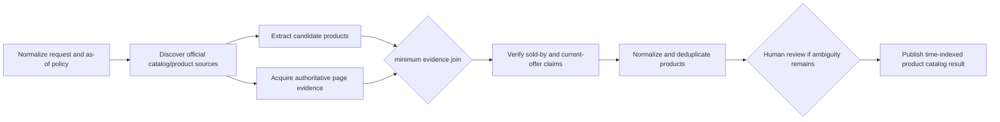
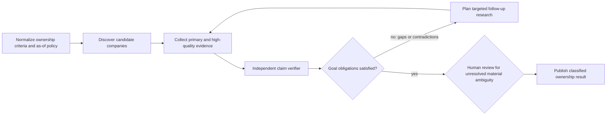

# Reference research blueprints and incremental vertical proofs

Status: accepted normative cross-stage execution contract
Recorded: 2026-08-08
Scope: all implementation work packages in this directory

## 1. Purpose

BellLabs does not build the API, contracts, Temporal workflows, workers, agent adapters, and
capability catalog as disconnected horizontal layers. Every implementation stage advances and
actually executes versioned increments of two reference research Workflow Blueprints:

1. **Qualia product catalog research** — find supplement products currently sold by Qualia Life.
2. **Dave Asprey current-company ownership research** — find companies Dave Asprey currently owns,
   distinguishing ownership from founding, advising, investing, endorsing, or former association.

These are research qualification workflows, not medical advice or investment/legal conclusions.
Results are time-indexed evidence claims. A changing live result is not automatically a regression.

The governing development loop is:

```text
publish immutable blueprint increment
  -> compile exact requirements and bindings
  -> execute deterministic fixture proof
  -> execute bounded live canary when configured
  -> inspect evidence, lineage, cost, and failures
  -> qualify only the exact observed capability surface
  -> publish the next immutable increment
```

No stage may report only schemas, mocks, imports, or unit tests when its package defines an
executable increment. The increment must run through the most production-shaped API, contracts,
workers, stores, and runtime available at that stage.

## 2. Immutable identity and evolution

The stable blueprint family IDs are:

```text
reference.qualia-life.current-supplement-products
reference.dave-asprey.current-company-ownership
```

Every material semantic change publishes a new immutable `workflow_blueprint_version`. Every
runtime composition publishes a new immutable `workflow_implementation_version` with an exact
`graph_assembly_digest`. An admitted run never follows a mutable alias and never changes blueprint
or implementation version in place.

Across stages, later versions may replace fixtures with real operations while preserving:

- stable family identity and explicit version lineage;
- versioned input, result, failure, command, evidence, and evaluation schemas;
- canonical semantic-stage keys where the semantic role is unchanged;
- explicit migration or supersession for changed semantics;
- reproducible fixture datasets and expected invariants;
- comparable live-canary result manifests without assuming the web is static.

## 3. Blueprint Q — current Qualia Life supplement products

### 3.1 Research question

As of an explicit `as_of` time, which supplement products are offered for sale by Qualia Life on
its governed official commerce/catalog surfaces?

The result must not silently mix currently sold products with articles, ingredient pages, bundles
that are unavailable, discontinued products, third-party resale listings, or historical mentions.

### 3.2 Target StageGraph semantics



Minimum result fields include product name, canonical product URL, seller/brand evidence,
availability classification, observation time, supporting evidence refs, confidence, and explicit
unknown/ambiguous reasons. The blueprint must define whether bundles, subscriptions, digital goods,
and out-of-stock pages are included.

## 4. Blueprint D — Dave Asprey current-company ownership

### 4.1 Research question

As of an explicit `as_of` time, which companies does Dave Asprey currently own or control according
to accepted evidence?

The result must distinguish:

```text
currently_owns_or_controls
founder_but_current_ownership_unverified
investor_or_shareholder_extent_unknown
advisor_or_board_role
brand_endorsement_or_affiliation
former_or_historical_association
conflicting_or_insufficient_evidence
```

“Founded by” or “associated with” is never automatically accepted as “currently owns.”

### 4.2 Target GoalDirected semantics



Minimum result fields include company, claimed relationship class, current-status conclusion,
observation time, jurisdiction/context when relevant, evidence refs, contrary evidence refs,
confidence, and unresolved limitations. Absence of public ownership evidence must remain unknown,
not become a negative ownership claim.

## 5. Stage-by-stage executable increments

| Stage | Required executable increment | What becomes real in this increment |
|---|---|---|
| 0 | qualification spikes over tiny sanitized snapshots and optional one-call provider probes | source/tool/SDK observations, result-shape hypotheses, redaction and cost baselines |
| 1 | runtime-neutral in-process fixture execution for both blueprints | immutable blueprint/implementation contracts, operation journal, evidence claims, typed results/failures |
| 2 | bounded LangGraph/Deep Agents operation canary, never macro scheduling | exact local agent binding, tiny structured extraction/classification call, checkpoint/trace observations |
| 3 | Temporal durable skeleton versions of both blueprints using deterministic/small operations | BellLabs API start/query/command/cancel path, root/family-fixture/operation workflows, workers, waits, replay, recovery, command transport |
| 4 | production `StageGraphWorkflow` for Blueprint Q plus a small compatibility slice of Blueprint D | real interpreter scheduling, joins, native + local-agent composition, first exact same-generation safe-point steering proof |
| 5 | production `GoalDirectedWorkflow` for Blueprint D and full local agent harness; rerun Q | convergence, verifier, tool HITL, context rollover, disruptive restart and generation fencing |
| 6 | heterogeneous exact implementations of Q and D | remote adapter, MCP/sandbox/external jobs where justified, remote steering qualification, mixed-capability composition |
| 7 | both workflows exclusively through the governed public API | coordinator, streams, observability, evaluation, security, quotas, operator surfaces |
| 8 | shadow/canary executions of both workflows in selected AWS topology | deployment, rollback, replay compatibility, worker loss, cutover and decommission evidence |

“Small” is acceptable; “not executed” is not. Early increments may use a three-record catalog
fixture, a four-company ownership fixture, deterministic fake clocks, and a single bounded LLM call.
They must still traverse the real contracts and worker/runtime boundaries claimed by that stage.

## 6. Deterministic proof and live canary

Every executable increment has two evidence classes:

### 6.1 Deterministic fixture gate

- checked-in, sanitized source snapshots and expected invariant assertions;
- fake clock with explicit `as_of`;
- deterministic provider/tool stubs where replay requires them;
- crash, duplicate delivery, stale target, and compatibility injection appropriate to the stage;
- stable cost/usage fixtures and complete semantic/runtime lineage;
- required for package acceptance and CI.

### 6.2 Bounded live canary

- uses configured secret references, never secret values in code, prompts, logs, histories, traces,
  artifacts, or evidence manifests;
- prefers authoritative first-party sources, then records why secondary sources were necessary;
- sets explicit request, page, token, cost, tool-call, and wall-clock ceilings;
- stores retrieved content only under the accepted retention/redaction policy;
- records provider/model/tool/source versions and observation timestamps;
- evaluates schema validity, citation support, classification discipline, lineage completeness, and
  safety—not exact equality with an old changing-web result;
- may be skipped only with an explicit reason and cannot substitute for the deterministic gate.

Configured `OPENAI_API_KEY`, `TAVILY_API_KEY`, or `ANTHROPIC_API_KEY` values are runtime secrets.
Presence may be detected safely; values must never be read into evidence or printed. A package uses
only the providers declared by its exact implementation and has no silent provider fallback.

## 7. Capability qualification and composability

A capability is composable only after an exact implementation has produced accepted evidence. The
capability record binds at least:

```text
capability_id and semantic version
adapter variant and implementation version
supported operation/result schemas
supported safe points and intervention modes
durability, wait, cancellation, and recovery behavior
effect and idempotency class
resource and deadline envelope
security, tenant, data, and redaction constraints
provider/model/tool/skill/MCP compatibility keys
fixture and live-canary evidence manifests
known limitations and unsupported combinations
```

The compiler selects only compatible `qualified` records and freezes them into an
`OperationAssemblySpec`. Installed packages, environment variables, mutable aliases, prompts,
provider availability, or success in a different adapter never grant capability.

Capability maturity is monotonic only for the exact compatibility key:

```text
declared -> fixture_proven -> live_canary_proven -> qualified -> production_observed
```

A code, model, prompt, tool, policy, safe-point, or provider change creates a new candidate key or
requires explicit compatibility evidence. Failure or drift may demote readiness without rewriting
historical evidence.

## 8. API, contract, and worker evolution rule

Each stage must state, implement, and test its delta across all applicable planes:

| Plane | Required stage evidence |
|---|---|
| Blueprint/domain | immutable definition/version and semantic parity assertions |
| API/control | actual command/query/result surface used by the reference run |
| Persistence | migrations, repositories, authoritative versions, inbox/outbox/journal records |
| Workflow | deterministic workflow types, histories, replay/compatibility evidence |
| Activity/adapter | registered exact implementations, failure and cancellation behavior |
| Worker | queue/type manifest, startup proof, capacity and loss behavior |
| Agent/provider | exact configuration, bounded call evidence, safe points and limitations |
| Evaluation/security | citations, claim checks, redaction, tenant isolation, costs and traces |

Do not create a second “demo path.” The reference workflows must use the same application ports,
contracts, compiler, persistence, workers, and runtime path intended for production at that stage.

## 9. Drift and comparability controls

Every reference execution publishes a comparison manifest containing:

- blueprint and implementation identities/digests;
- input and `as_of` policy;
- source snapshot or live observation manifest;
- exact operation assemblies and capability records;
- stage-by-stage typed outcomes and accepted evidence;
- commands/interventions and their dispositions;
- semantic and technical lineage;
- usage, latency, cost, retries, and failures;
- evaluation results and explicit unknowns;
- comparison against the previous accepted blueprint increment.

The comparison classifies differences as semantic-version change, implementation change, live-web
change, provider nondeterminism, expected improvement, regression, or unresolved. No stage may
silently redefine success to accommodate its current implementation.

## 10. Cross-package gate

Every work-package handoff must name:

1. the exact Q and D blueprint/implementation versions it executed;
2. deterministic fixture commands and evidence paths;
3. bounded live-canary commands and evidence paths, or explicit skip reasons;
4. API, contract, migration, workflow, activity, worker, and adapter deltas exercised;
5. capabilities promoted, retained, demoted, or still unsupported;
6. comparison findings against the preceding accepted increment;
7. shortcuts or alternate paths found and removed or explicitly blocked.

Failure of a reference run blocks any capability claim exercised by that run. It does not permit a
stage to weaken the blueprint silently; repair the implementation or publish an explicit versioned
semantic change with owner acceptance.
