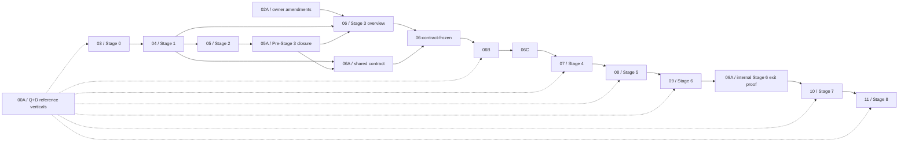

# FROZEN — BellLabs Stage 0–8 implementation goal and index

> **Superseded planning history (2026-08-09).** No package in this Stage 0–8 system may authorize
> new implementation. The program reached Stage 3 planning with the entry ledger still at
> `05A = REWORK_REQUIRED`; no active agent owns these packages. The owner accepted replacement by
> requirement-derived `WP-*` packages governed by `ADR-0003` and the canonical specifications in
> `biotech-meta/docs/specs/control-plane-foundations/` and
> `biotech-meta/docs/specs/workflow-blueprints/`. See
> [the replacement work-package index](../implementation_work_packages_v2/README.md) and
> [the freeze record](FROZEN_STAGE_SYSTEM.md). The content below is preserved unchanged as
> architecture and migration provenance.

Status: frozen and superseded; historical provenance only
Recorded: 2026-08-08
Scope: `biotech-research-ingestion-evaluation-system`
Planning unit: evidence-gated implementation stages, not calendar estimates

## 1. Accepted target

BellLabs will retain and enhance its research, ingestion, evaluation, and content-production backend under this division of responsibility:

- **Temporal is the sole production macro-workflow runtime.** It supplies durable workflows, child workflows, activities, messages, timers, retries, cancellation, replay, and Continue-As-New.
- **BellLabs application services and pure interpreters are semantic authority.** PostgreSQL/run control owns lifecycle, admission, budgets, approvals, claims, effects, settlements, and terminality. `StageGraphInterpreter` and `GoalDirectedInterpreter` own deterministic scheduling and convergence semantics.
- **LangGraph and Deep Agents provide bounded operation cognition.** They may plan, use exact tools and skills, manage bounded context/filesystems, and perform operation-local delegation only under frozen BellLabs bindings.
- **LangSmith provides tracing, evaluation, sandboxes, graph development/registration, Studio, and selected bounded deployments.** A LangSmith deployment never becomes a competing macro scheduler.
- **The BellLabs API is the sole governed public facade.** Clients and the coordinator do not call Temporal, Agent Server, providers, sandboxes, or worker-specific endpoints as alternate product APIs.

The hierarchy is:

```text
BellLabs API/control service
  -> BellLabsRunWorkflow                         # distinct stable root
       -> StageGraphWorkflow | GoalDirectedWorkflow | other family child
            -> OperationWorkflow                 # generic policy-driven child
                 -> native | Deep Agent/LangGraph | MCP | sandbox | external-job adapter
```

`BellLabsRunWorkflow` owns macro lifecycle mechanics but not family semantics. Family workflows apply the exact pure interpreter. `OperationWorkflow` owns one independently durable operation lifecycle and delegates cognition or provider work through an exact `OperationAssemblySpec`.

Self-hosted Temporal is the initial implementation and qualification target. Stage 8 selects and proves the final AWS topology; no earlier package may silently hard-code that final topology.

## 2. Governing invariant and preserved contracts

> Discover broadly, select narrowly, compile exactly, admit authoritatively, execute from frozen bindings, reconcile continuously, and terminalize only from accepted evidence.

Every stage must preserve or deliberately version, migrate, and prove compatibility for:

- immutable Workflow Types, Workflow Implementations, blueprints, ERCs, RunPlans, and exact runtime bindings;
- `StageCapabilityRequirement`, `StageExecutionBinding`, `OperationAssemblySpec`, resource/deadline envelopes, and capability maturity;
- canonical semantic and runtime lineage;
- authoritative operation journals, attempt inboxes, ledgers, outboxes, effect claims, usage, evidence acceptance, and exactly-once settlement identities;
- typed results, failures, commands, facts, interventions, and readiness projections;
- tenant isolation, authorization, redaction, secret references, and research-versus-medical-advice boundaries.

Execution produces evidence. BellLabs authorizes, accepts, rejects, settles, and terminalizes it.

Implementation is vertical and cumulative. Every stage executes immutable increments of the two
normative [reference research blueprints](00A_REFERENCE_RESEARCH_BLUEPRINTS_AND_INCREMENTAL_PROOFS.md):
Qualia Life current supplement products (`Q`) and Dave Asprey current company ownership (`D`).
Early increments may be deterministic and tiny, but they must exercise the real API, contracts,
stores, workers, and runtime boundaries claimed by that stage. Later increments replace fixtures
with qualified capabilities; they do not create a parallel demo path.

## 3. Non-negotiable boundaries

- There is exactly one macro scheduler for an admitted implementation: Temporal. Do not run a production Agent Server StageGraph or GoalDirected graph beside it.
- Do not replace pure interpreter semantics with model planning, Temporal workflow code, provider state, or graph checkpoint state.
- Do not bypass the BellLabs API or application ports to call a provider, Temporal command surface, Agent Server, or sandbox as an alternative public control path.
- Do not let runtime discovery, mutable aliases, installed packages, prompts, models, tools, MCP servers, skills, subagents, checkpoints, traces, or deployments grant authority.
- Do not claim exactly-once provider execution. Use stable claims, idempotency identities, reconciliation, and exactly-once BellLabs settlement.
- Do not place secrets, PHI, raw corpora, unrestricted transcripts, or large artifacts in Temporal histories, graph state, prompts, traces, logs, heartbeats, or handoffs.
- Do not expose arbitrary graph-state mutation or Temporal Reset as a normal product intervention or fork.
- Do not make preview provider-async or interpreter features critical-path dependencies.
- Do not hand off a stage on code completion alone. Its package-specific gate and evidence manifest must pass.
- Unfinished Agent Server macro graphs must be repurposed as bounded operation implementations, qualification/development graphs, visualizations, or governed facade internals, or removed with preserved evidence. They must not be completed as a production fallback macro scheduler.
- Never commit secrets or PHI. Research output is not medical advice.

## 4. Authority and runtime ownership

| Concern | Owner |
|---|---|
| Definitions, exact compilation, ERCs, RunPlans, assemblies | BellLabs control plane |
| Admission, lifecycle, budgets, approvals, claims, effects, settlement, terminality | BellLabs PostgreSQL/application services |
| StageGraph readiness and GoalDirected convergence | BellLabs pure interpreters |
| Durable macro execution and independently durable operation coordination | Temporal |
| Bounded planning, agent sessions, tools, skills, operation-local delegation | LangGraph/Deep Agents under exact bindings |
| Traces, datasets, experiments, online evaluators | LangSmith as non-authoritative evidence |
| Sandboxes and selected remote graph deployments | LangSmith/provider ports under exact bindings |
| Public commands, queries, streams, and typed results | BellLabs API |
| Product-facing durable progress/events | BellLabs journal/outbox/projections |

Temporal Event History is execution truth for replay, not the BellLabs product query model. Product durable events are authoritative for clients and downstream consumers. Temporal Queries are diagnostics only.

## 5. Communication and continuity decisions

The accepted communication model is:

1. BellLabs owns an authoritative per-attempt **inbox, ledger, and outbox**. Temporal Signals/Updates and provider callbacks transport typed commands or facts; handlers deduplicate and reconcile through those stores.
2. Exact **post-model/pre-tool** communication injection is required where an implementation
   advertises it. Stage 3 defines the contract and certifies authoritative transport/durable waits;
   Stage 4 certifies the first local adapter, Stage 5 the reusable/disruptive local harness, and
   Stage 6 each selected remote LangSmith placement.
3. A disruptive intervention is a governed saga: authorize, journal intent, pause/cancel or quiesce subordinate work, reconcile ambiguous effects, apply the typed change, resume/rebind, and emit durable outcome facts.
4. Peer/subordinate communication is typed input. A message cannot alter StageGraph readiness or GoalDirected convergence until accepted evidence is settled and the pure interpreter consumes the resulting authoritative fact.
5. Built-in synchronous Deep Agents subagents are operation-local. Independent lifecycle, cancellation, capacity, lineage, or settlement requires custom Temporal delegation. Provider-async execution is a subordinate adapter, not macro orchestration.
6. Remote execution follows **start -> bind -> wait/reconcile**. Asynchronous provider completion is optional; polling or callback completion must converge through the same journal and settlement contracts.
7. Continue-As-New preserves the same BellLabs run and execution epoch while creating a new technical execution segment. A product fork creates a new BellLabs run at epoch `1` with explicit parent/snapshot lineage.

## 6. Five worker-pool classes

The logical worker isolation classes are fixed; exact queues, counts, sizes, and AWS services are Stage 8 decisions:

1. coordinator/family-workflow workers;
2. agent/cognitive-operation workers;
3. ingestion/I/O workers;
4. sandbox-control/external-job workers;
5. verification/reconciliation workers.

Queue selection is compiled from exact operation and deployment compatibility bindings. A model or provider cannot choose an undeclared queue.

## 7. Work-package index and dependency graph

Package `00A` is a cross-stage normative execution contract consumed by every package below. It
does not add a product stage or weaken direct dependencies.

The file numbering is historical. New Stage 3 subpackages refine package `06`; they do not create extra product stages.

| Package | Mission | Direct dependencies | Exit gate |
|---|---|---|---|
| [00A — reference verticals](00A_REFERENCE_RESEARCH_BLUEPRINTS_AND_INCREMENTAL_PROOFS.md) | Define immutable Q/D blueprint families, deterministic/live evidence, capability promotion, and drift controls | This index | Cross-stage normative contract |
| [03 — Stage 0](03_STAGE_0_ARCHITECTURE_BASELINE_AND_QUALIFICATION.md) | Historical baseline/qualification plus tiny Q/D ecosystem probes; interpreted under this accepted index and architecture | 00A | Supersession and still-valid evidence recorded |
| [04 — Stage 1](04_STAGE_1_RUNTIME_NEUTRAL_CONTRACTS_AND_OPERATION_JOURNAL.md) | Preserve/version runtime-neutral contracts, exact assemblies, journals, claims, effects, settlement, and lineage | Stage 0 amendments | Contract/migration compatibility evidence |
| [05 — Stage 2](05_STAGE_2_AGENT_SERVER_FOUNDATION.md) | Preserve bounded Agent Server/LangGraph operation assets; prevent macro-runtime promotion | Stages 0–1 | Import-safe bounded assets and explicit repurpose/remove disposition |
| [05A — Pre-Stage 3 closure](05A_PRE_STAGE_3_ENTRY_GATE_CLOSURE.md) | Reconcile earlier evidence with accepted Temporal architecture and publish compact entry handoff | Stages 0–2 | Accepted pre-Stage 3 manifest |
| [06 — Stage 3 overview/contracts](06_STAGE_3_DURABILITY_HITL_STEERING_AND_RECOVERY.md) | Run durable Q/D skeletons while governing root/family/operation contracts, command transport, continuity, and recovery | `02A`, 04, 05A, 00A | Contributes `06` contract sections to `06-contract-frozen`; aggregate Stage 3 acceptance waits for 06B/06C core transport gate |
| [06A — Cross-stage assembly/concurrency/lineage](06A_STAGES_3_TO_6_OPERATION_ASSEMBLY_CONCURRENCY_AND_LINEAGE_CONTRACT.md) | Preserve exact operation assembly, hierarchical capacity, journals/effects/settlement, and canonical lineage across Stages 3–6 | 04, 05A | Contributes shared contract conformance to `06-contract-frozen` |
| [06B — Temporal workflow foundation](06B_STAGE_3_TEMPORAL_WORKFLOW_FOUNDATION.md) | Implement self-hosted Temporal foundation, `BellLabsRunWorkflow`, family children, generic `OperationWorkflow`, five worker classes, replay/recovery/Continue-As-New | `06-contract-frozen` | Crash/replay/continuity and independent-operation proof |
| [06C — Communication/intervention qualification](06C_STAGE_3_COMMUNICATION_AND_INTERVENTION_QUALIFICATION.md) | Qualify authoritative command transport and durable waits; define later adapter-safe-point and disruptive-recovery gates without prematurely claiming them | `06-contract-frozen`, passed 06B implementation gate | Core transport gate; adapter qualification completes incrementally in Stages 4–6 |
| [07 — Stage 4](07_STAGE_4_STAGEGRAPH_PARITY_VERTICAL_SLICE.md) | Implement Temporal-native StageGraph family workflow around the pure interpreter and generic operation child | Entire Stage 3 package | Small heterogeneous `all`/`any`/`minimum(k)` vertical passes |
| [08 — Stage 5](08_STAGE_5_GOAL_DIRECTED_DEEP_AGENTS_HARNESS.md) | Implement GoalDirected family workflow plus reusable bounded Deep Agents operation harness | Stage 4 | GoalDirected research vertical, verifier, context rollover, and recovery pass |
| [09 — Stage 6](09_STAGE_6_ADVANCED_CAPABILITY_ASSEMBLY.md) | Qualify advanced capabilities, remote LangSmith start-bind-wait/reconcile, sandboxes, provider async adapter, and heterogeneous composition | Stage 5 | Aggregate Stage 6 gate, including internal 09A exit proof |
| [09A — Stage 6 proof](09A_STAGE_6_HETEROGENEOUS_STAGEGRAPH_COMPOSITION_PROOF.md) | Required heterogeneous StageGraph composition evidence internal to Stage 6 | Stage 4 baseline plus stable candidate adapters completed within 09 | Exact mixed-capability proof accepted for aggregate Stage 6 exit |
| [10 — Stage 7](10_STAGE_7_API_COORDINATOR_OBSERVABILITY_EVALUATION_AND_SECURITY.md) | Deliver modular BellLabs API facade, coordinator integration, product events, observability/evaluation, and security | Aggregate Stage 6 acceptance after 09A | Governed E2E API, trace/eval, security, and operability gates |
| [11 — Stage 8](11_STAGE_8_DEPLOYMENT_SHADOW_CANARY_CUTOVER_AND_DECOMMISSION.md) | Select final AWS self-host topology; deploy, shadow/canary, cut over, recover, and drain superseded runtime paths | Stage 7 | Hours-long failure, rollback, replay/versioning, SLO, and cutover gates |

The Q/D continuity artifact
[`REFERENCE_BLUEPRINT_STAGE3_MAPPING.md`](../stage2_evidence/REFERENCE_BLUEPRINT_STAGE3_MAPPING.md)
is **not an additional package**. It is the supporting input for package `06B` §11 (the Q/D durable
skeleton), under the aggregate package `06` §7.4 slice. Package `06A` supplies its frozen shared
contracts; package `06C` owns the subsequent persisted-command and durable-wait qualification.

For execution, use
[`STAGE_3_EXECUTION_PROMPTS_AND_DIRECTIONS.md`](STAGE_3_EXECUTION_PROMPTS_AND_DIRECTIONS.md) as the
ordered prompt dispatcher and
[`STAGE_3_EXECUTION_LEDGER.md`](../stage3_evidence/STAGE_3_EXECUTION_LEDGER.md) as the current-state
pointer. Neither document overrides the numbered packages or grants a gate.

Explicit dependency graph:



`02A` feeds package `06`; it is not a dependency of Stage 0 package `03`.

No package may begin implementation merely because an upstream stage number exists. It needs every direct dependency's accepted handoff, exact evidence paths, requirement-matrix digest, and unresolved-risk disposition.

`06-contract-frozen` is an internal Stage 3 implementation-entry gate, not acceptance of package
`06` or Stage 3. Aggregate Stage 3 acceptance occurs only after the `06B` and `06C` implementation
and proof gates pass. Likewise, `09A` consumes stable candidate adapters produced during `09`; it is
an internal Stage 6 exit proof and never an entry dependency of `09`.

## 8. Vertical-slice order and mandatory long-run gates

Before the first production StageGraph, Stage 3 runs durable skeleton increments of both reference
blueprints through the Temporal root/family-fixture/operation hierarchy. Deterministic fixtures are
the replay/CI oracle; bounded live canaries prove configured source and provider surfaces.

The first production-shaped vertical is Blueprint Q as a **small heterogeneous StageGraph**: at
least two materially different exact operation assemblies, independently durable execution,
controlled slow sibling, early downstream release, deterministic settlement, command injection,
and complete lineage. A small D compatibility slice remains green.

The second vertical is Blueprint D as **GoalDirected research**: bounded Deep Agents cognition,
independent verifier, revision/convergence semantics from the pure interpreter, context rollover,
typed interventions, and durable recovery. Blueprint Q is rerun with the completed local harness.

Stage 6 must execute hours-long remote/capability runs with worker loss, callback/poll ambiguity, cancellation, provider failure, reconciliation, and no duplicate effective settlement. Stage 8 repeats hours-long tests in the selected AWS topology and adds service/worker loss, N/N+1 replay, backlog recovery, rollback, and region/topology-specific drills.

## 9. Decision history and supersession

Earlier package drafts proposed Agent Server as the primary macro runtime. That history is retained, but the accepted 2026-08-08 architecture supersedes its runtime meaning:

| Decision | Historical meaning | Accepted supersession |
|---|---|---|
| D-01 | Standard Agent Server is primary | Temporal is the sole macro runtime. Agent Server/LangSmith deployments are bounded operation, development, evaluation, or interaction surfaces only. |
| D-05 | One parent Agent Server thread per BellLabs run/epoch | `BellLabsRunWorkflow` is the distinct root. Agent threads/checkpoints are subordinate operation lineage. Continue-As-New uses the same epoch/new segment; fork uses a new run/epoch 1. |
| D-07 | Managed Agent Server persistence is primary production durability | Self-hosted Temporal provides initial macro durability; Stage 8 selects the final AWS self-host topology. Agent/checkpoint persistence remains subordinate cognition state. |

D-02 through D-04 and D-08 through D-23 are amended, not erased: references to Agent Server or LangGraph scheduling now mean a Temporal family workflow applying the same pure semantic interpreter; thread/run/checkpoint facts become subordinate lineage; async subagents become provider adapters or custom Temporal delegation according to lifecycle; deployment references mean selected bounded LangSmith deployments. Exact contracts, authority, effects, evidence, and acceptance criteria remain in force unless an explicit row in `02A` says otherwise.

## 10. Stage start, handoff, and completion

Before implementation, read in order: this index; [reference blueprint contract](00A_REFERENCE_RESEARCH_BLUEPRINTS_AND_INCREMENTAL_PROOFS.md); [global gates](01_GLOBAL_HANDOFF_AND_STAGE_GATE_RULES.md);
[owner amendments](02A_OWNER_AMENDMENTS_FOR_STAGES_3_TO_6.md) when applicable; the
[canonical application codebase organization](../../interview_and_research_result_documentation/CANONICAL_APPLICATION_CODEBASE_ORGANIZATION.md);
the complete active package, its declared dependencies, and direct-dependency handoffs; accepted
architecture proposals and contract documents; then the as-built guide, exact code, and tests named
by the package. The canonical organization governs projected target paths and incremental move
timing, but the active package remains implementation authority when a projected path differs.

Each package must:

- publish its requirements-to-evidence matrix before substantive implementation;
- preserve unrelated worktree changes;
- list exact changed paths, migrations, commands, versions, artifacts, traces, and failures;
- demonstrate that optional capabilities remain disabled unless qualified;
- produce an evidence manifest with stable repository-relative paths;
- obtain the package gate disposition before authorizing a dependent package.

The whole migration is done only when both workflow families pass semantic parity and recovery; the BellLabs API is the only public facade; no dual macro scheduler or provider bypass exists; exact assemblies and full lineage remain queryable; Stage 6 and Stage 8 hours-long failure gates pass; the AWS self-host topology, rollback, replay, worker versioning, and cutover pass; and superseded Agent Server macro paths are repurposed or removed without loss of historical evidence.

## 11. Reference index

Normative:

- [Reference research blueprints and incremental proofs](00A_REFERENCE_RESEARCH_BLUEPRINTS_AND_INCREMENTAL_PROOFS.md)
- [Canonical application codebase organization](../../interview_and_research_result_documentation/CANONICAL_APPLICATION_CODEBASE_ORGANIZATION.md)
- [Global handoff and stage-gate rules](01_GLOBAL_HANDOFF_AND_STAGE_GATE_RULES.md)
- [Architecture traceability matrix](02_ARCHITECTURE_TRACEABILITY_MATRIX.md)
- [Owner amendments for Stages 3–6](02A_OWNER_AMENDMENTS_FOR_STAGES_3_TO_6.md)
- [Pre-Stage 3 entry-gate closure](05A_PRE_STAGE_3_ENTRY_GATE_CLOSURE.md)
- [Cross-stage operation assembly, concurrency, and lineage contract](06A_STAGES_3_TO_6_OPERATION_ASSEMBLY_CONCURRENCY_AND_LINEAGE_CONTRACT.md)
- [Stage 6 heterogeneous composition proof](09A_STAGE_6_HETEROGENEOUS_STAGEGRAPH_COMPOSITION_PROOF.md)

Compact implementation supplements (navigation aids; non-authorizing):

- [Codebase organization compass](SUPPLEMENT_CODEBASE_ORGANIZATION.md)
- [Application and domain contract enhancement compass](SUPPLEMENT_APPLICATION_CONTRACT_ENHANCEMENTS.md)
- [Agent implementation-session prompt template](AGENT_IMPLEMENTATION_SESSION_PROMPT_TEMPLATE.md)

Accepted architecture source and decision history:

- [Temporal, LangSmith, and Deep Agents BellLabs backend architecture proposal](../../interview_and_research_result_documentation/TEMPORAL_LANGSMITH_DEEPAGENTS_BELLLABS_BACKEND_ARCHITECTURE_PROPOSAL.md)
- [Controlled-run proof](../../interview_and_research_result_documentation/architectural_documents/CONTROLLED_RUN_PROOF_OF_REPRESENTATION.md)
- [Round-two research](../../interview_and_research_result_documentation/architectural_documents/LANGGRAPH_DEEPAGENTS_RESEARCH_ROUND_2.md)
- [Prior Agent Server migration plan](../../interview_and_research_result_documentation/architectural_documents/LANGGRAPH_DEEPAGENTS_CONTROL_PLANE_MIGRATION_PLAN.md)
- [Prior unsettled recommendations](../../interview_and_research_result_documentation/architectural_documents/LANGGRAPH_LANGSMITH_MIGRATION_RECOMMENDATIONS.md)
