# BellLabs LangGraph, Deep Agents, and LangSmith migration implementation goal and index

Status: implementation work-package index; architecture proposals remain subject to owner acceptance  
Scope: `biotech-research-ingestion-evaluation-system`  
Planning unit: evidence-gated implementation stages, not calendar estimates  
Primary outcome: restore and then exceed the current BellLabs research-backend capability on a governed LangGraph and Agent Server runtime without replacing BellLabs domain authority

Implementation companion: [App runtime porting reference](../APP_RUNTIME_PORTING_REFERENCE.md) extracts the reusable workflow, operation, skill, MCP, sandbox, snapshot, schema-selection, and API contracts from the legacy app without treating its provider adapters as target architecture.

## 1. Main goal

Migrate the BellLabs research, ingestion, evaluation, and content-production backend from Temporal/OpenAI Agents execution mechanics to a standard LangSmith Deployment running custom LangGraph graphs, with Deep Agents used selectively as the bounded operation harness and LangSmith used for deployment, tracing, evaluation, Studio, prompts/context, and runtime operations.

The migration is successful only when:

1. BellLabs retains authority for immutable definitions, exact compilation, admission, lifecycle compare-and-set, budgets, approvals, effect claims, evidence acceptance, and terminality.
2. LangGraph supplies durable execution, checkpoints, interrupts, resume, replay mechanics, streaming, and graph scheduling without becoming a second domain authority.
3. Deep Agents supplies selected planning, filesystem, skill, context, synchronous delegation, and optional interpreter/async-task mechanics inside exact operation bindings.
4. Agent Server exposes both graph families and the required custom authenticated BellLabs routes, and can be built, tested, deployed, observed, recovered, and rolled back.
5. The existing coordinator can discover, compile, prepare, launch, observe, intervene, and retrieve typed results through one runtime-neutral facade without learning vendor IDs or credentials.
6. StageGraph and GoalDirected behavior reaches accepted parity with the current system before legacy execution is drained.
7. MCP servers, tools, prompts, skills, subagents, async subagents, QuickJS, sandboxes, snapshots, memory, and middleware are exact compiled capabilities with maturity, authority, budget, isolation, and fallback contracts.
8. Shadow and canary operation cannot duplicate consequential provider effects.
9. Traces and evaluations provide evidence for promotion but never authorize or terminalize a workflow.

## 2. Governing system invariant

> Discover broadly, select narrowly, compile exactly, admit authoritatively, execute from frozen bindings, reconcile continuously, and terminalize only from accepted evidence.

The implementation must preserve this direction of control:

```mermaid
flowchart LR
    Intent["Operator or coordinator intent"] --> Catalog["BellLabs discovery and exact definitions"]
    Catalog --> Compile["Pure compilation to ERC and RunPlan"]
    Compile --> Admission["Run-control admission and budget authority"]
    Admission --> Dispatch["Transactional execution request and runtime binding"]
    Dispatch --> AgentServer["Agent Server and LangGraph execution"]
    AgentServer --> Harness["Bound operation harness"]
    Harness --> Evidence["Immutable result, usage, and evidence refs"]
    Evidence --> Settlement["BellLabs settlement and verification"]
    Settlement --> Terminality["BellLabs terminal result"]
```



Execution produces evidence. BellLabs accepts, rejects, settles, and terminalizes it.

## 3. Authority and source precedence

When sources disagree, use this order:

1. accepted product/domain specifications in `../../../../biotech-meta`;
2. current domain and application code plus its tests;
3. owner decisions recorded during a stage;
4. [LANGGRAPH_DEEPAGENTS_RESEARCH_ROUND_2.md](../architectural_documents/LANGGRAPH_DEEPAGENTS_RESEARCH_ROUND_2.md);
5. [LANGGRAPH_DEEPAGENTS_CONTROL_PLANE_MIGRATION_PLAN.md](../architectural_documents/LANGGRAPH_DEEPAGENTS_CONTROL_PLANE_MIGRATION_PLAN.md);
6. [CONTROLLED_RUN_PROOF_OF_REPRESENTATION.md](../architectural_documents/CONTROLLED_RUN_PROOF_OF_REPRESENTATION.md);
7. [LANGGRAPH_LANGSMITH_MIGRATION_RECOMMENDATIONS.md](../architectural_documents/LANGGRAPH_LANGSMITH_MIGRATION_RECOMMENDATIONS.md), which is explicitly unsettled;
8. project-local `.agents/skills` for the exact installed or proposed ecosystem behavior;
9. current official LangChain/LangSmith documentation;
10. inference, which must be labeled and verified before it becomes a contract.

Current live documentation is authoritative for current API shape, not for the version eventually pinned. The exact dependency-lock qualification in Stage 0 is the final authority for callable APIs, defaults, maturity labels, configuration keys, and platform behavior.

## 4. Non-negotiable boundaries

- Do not translate Temporal workflows node-for-node.
- Do not replace the pure StageGraph or GoalDirected interpreters with unconstrained model planning.
- Do not put lifecycle authority, budgets, approvals, terminality, secrets, PHI, raw corpora, or large artifacts in graph state, Store, prompts, skills, traces, or stream events.
- Do not resolve mutable aliases after preparation/admission.
- Do not let a model, prompt, skill, MCP server, tool, subagent, interpreter program, sandbox, checkpoint, assistant, or trace grant authority.
- Do not treat `assistant_id` as a Workflow Type, a LangGraph checkpoint as a goal handoff checkpoint, or a framework run ID as a BellLabs run ID.
- Do not claim exactly-once arbitrary provider execution. Implement at-least-once runtime execution with stable claims and exactly-once settlement identities.
- Do not expose arbitrary `update_state` to normal callers.
- Do not use a sandbox snapshot as current authority; restore by cloning and reacquiring live resources.
- Do not use deployment-global credential-bearing MCP sessions.
- Do not rely on local `stdio` MCP servers or host `.tools` paths in Cloud.
- Do not add duplicate Deep Agents core middleware or ambiguous filesystem/search tools.
- Do not make QuickJS a security sandbox.
- Do not make preview async subagents or beta interpreter features critical-path dependencies.
- Do not remove Temporal/OpenAI Agents execution until parity, canary, recovery, and rollback gates pass.
- Do not reset broad PostgreSQL/Supabase scopes. Any reset needs a separate approved, backed-up destructive runbook with literal schema targets.
- Never commit secrets or PHI. Research output is not medical advice.

## 5. Target ownership model

| Concern | Post-migration owner | Classification |
|---|---|---|
| Workflow Types, implementations, aliases, ERCs, RunPlans | BellLabs control plane | Authoritative |
| Admission, lifecycle, budgets, decisions, effect claims, settlements, outbox | BellLabs PostgreSQL/run control | Authoritative |
| Definitions, semantic records, context manifests, schema-grounding evidence | BellLabs MongoDB/S3/Neo4j boundaries | Authoritative or immutable semantic |
| Threads, Agent Server runs, checkpoints, suspension, runtime streaming | LangGraph Agent Server | Execution mechanics/runtime facts |
| Agent loop, planning, bounded filesystem, skills, sync delegation | LangChain/Deep Agents | Capability mechanics |
| Cross-thread Store memory | Agent Server Store | Non-authoritative and revocable |
| Outbound MCP | `langchain-mcp-adapters` behind BellLabs wrappers | Capability mechanics |
| QuickJS interpreter and dynamic delegation | Feature-gated Deep Agents integration | Beta mechanics |
| Async subagents | Feature-gated Agent Protocol integration | Preview runtime facts |
| Shell, packages, browser, mutable files | Sandbox provider port, LangSmith first | Isolated execution mechanics |
| Tracing, datasets, experiments, online evaluators | LangSmith | Observability/evaluation evidence |
| Typed final result and readiness | BellLabs result/run-control services | Authoritative |

## 6. Migration stage map

The stages are deliberately larger units of work suitable for a frontier coding model with a large context window. They are not time estimates. A stage may be split during execution only when its accepted handoff records the split and preserves the gate.

| Stage | Mission | Depends on | May proceed when |
|---|---|---|---|
| [Stage 0](03_STAGE_0_ARCHITECTURE_BASELINE_AND_QUALIFICATION.md) | Accept/amend architecture, reconcile baseline, and qualify the exact ecosystem/deployment matrix | None | Owner decisions and architecture-invalidating spikes are accepted |
| [Stage 1](04_STAGE_1_RUNTIME_NEUTRAL_CONTRACTS_AND_OPERATION_JOURNAL.md) | Add runtime-neutral contracts, exact assembly definitions, SQL/RLS runtime binding and operation journal | Stage 0 | Critical contracts, transaction boundary, naming, and schemas pass |
| [Stage 2](05_STAGE_2_AGENT_SERVER_FOUNDATION.md) | Add pinned dependencies and a side-effect-free standard Agent Server app with auth, graphs, routes, and tracing | Stages 0–1 | Both graphs import/inspect/run locally and resource auth is proven |
| [Pre-Stage 3 entry closure](05A_PRE_STAGE_3_ENTRY_GATE_CLOSURE.md) | Amend Stage 1/2 contracts for D-17–D-23, prove isolated database authority and pinned durability/restart mechanics, and produce one compact Stage 3 handoff | Stage 2 local foundation | Blocks A–D pass and `PRE_STAGE_3_ENTRY_HANDOFF.md` is `ACCEPTED` |
| [Stage 3](06_STAGE_3_DURABILITY_HITL_STEERING_AND_RECOVERY.md) | Implement the durable runtime kernel: dispatch/binding, canonical lineage, hierarchical resource leases, operation-executor contracts, interrupts, steering, cancellation, forks, streams, and reconciliation | Stages 1–2 | Crash/restart, lineage, resources, and intervention proofs pass without duplicate effects or leaked capacity |
| [Stage 4](07_STAGE_4_STAGEGRAPH_PARITY_VERTICAL_SLICE.md) | Port the capability-aware generic StageGraph scheduler around the existing interpreter and prove a deterministic/native parity slice | Stages 1–3 | Scheduler, binding, concurrency, authority, effect, lineage, and schema-grounding parity pass without temporary agent/MCP mechanics |
| [Stage 5](08_STAGE_5_GOAL_DIRECTED_DEEP_AGENTS_HARNESS.md) | Build the stable capability compiler and reusable Deep Agents/LangChain operation harness, compose it into StageGraph, then port GoalDirected | Stages 1–4 | Exact stable surface, StageGraph harness composition, Goal protection, verifier terminality, context, sync delegation, sandbox, lineage, and recovery pass |
| [Stage 6](09_STAGE_6_ADVANCED_CAPABILITY_ASSEMBLY.md) | Complete stable MCP/skills/context/sandbox providers, prove heterogeneous StageGraph composition, qualify required default-off async subagents, and optionally qualify QuickJS/dynamic delegation | Stage 5; feature-specific Stage 0 spikes | Stable providers, heterogeneous composition, and async gates pass; only QuickJS/PTC/dynamic may remain deferred |
| [Stage 7](10_STAGE_7_API_COORDINATOR_OBSERVABILITY_EVALUATION_AND_SECURITY.md) | Converge APIs/coordinator/MCP and establish trace, evaluation, security, operability, and production-like gates | Stages 3–6 | Full operator/coordinator path and release evidence pass |
| [Stage 8](11_STAGE_8_DEPLOYMENT_SHADOW_CANARY_CUTOVER_AND_DECOMMISSION.md) | Deploy staging, shadow/canary exact bindings, cut over safely, then drain legacy runtime | Stage 7 | Staging, rollback, parity, SLO, recovery, and final drain gates pass |

## 7. Critical path and optional tracks

Critical path:

```text
Stage 0 -> Stage 1 -> Stage 2
        -> Pre-Stage 3 entry closure and compact accepted handoff
        -> Stage 3 durable kernel
        -> Stage 4 generic scheduler/native parity
        -> Stage 5A stable compiler/harness
        -> Stage 5B StageGraph harness composition
        -> Stage 5C GoalDirected
        -> Stage 6A stable provider completion
        -> Stage 6B required async-subagent implementation
        -> Stage 6C heterogeneous StageGraph proof and async qualification
        -> Stage 7 -> Stage 8
```

Optional, independently gated tracks:

- QuickJS pure `call`-mode transforms may join the stable path only after containment and replay tests.
- QuickJS `turn`/`thread`, programmatic tool calling, and dynamic subagents remain disabled until their additional gates pass.
- Bounded optimistic/speculative StageGraph execution remains default-off; if enabled, it is limited to published pure/read-only policies with quarantined outputs, deterministic commit barriers, invalidation, wasted-budget ceilings, and no consequential effective capabilities.
- Async subagents are a required Stage 6 migration track under the accepted Stage 0 decision and remain default-off until their preview API, capacity, crash/orphan, update/cancel, tenant, lineage, StageGraph wait/resume, and reconciliation gates pass. They are not a deferable optional track unless the owner amends that decision.
- Daytona or another sandbox provider remains a later adapter qualification. LangSmith Sandbox is the first target behind the provider-neutral port.
- Generated native LangGraphs for hot StageGraph paths are a post-parity optimization.
- Dedicated deployment is chosen only when Serverless measurements or business criticality justify it.
- [Stages 3–6 shared execution contract](06A_STAGES_3_TO_6_OPERATION_ASSEMBLY_CONCURRENCY_AND_LINEAGE_CONTRACT.md) governs per-stage capability assembly, resource hierarchy, optimistic execution, failure taxonomy, and end-to-end lineage.
- [Stage 6 heterogeneous composition proof](09A_STAGE_6_HETEROGENEOUS_STAGEGRAPH_COMPOSITION_PROOF.md) is required evidence that a coordinator-authored graph can compose different operation capabilities concurrently.

A deferred optional track must have a recorded feature flag, fallback, unsupported-capability response, and no hidden dependency from a critical-path workflow.

## 8. Decisions that Stage 0 must accept or amend

| ID | Proposed decision | Primary implementation stage |
|---|---|---|
| D-01 | Standard Agent Server is primary; Managed Deep Agents is not | 0, 2, 8 |
| D-02 | Generic frontier-scheduler StageGraph first | 0, 4 |
| D-03 | Generated graphs only after measured parity | 4, post-migration |
| D-04 | Deterministic GoalDirected outer graph, bounded agent, independent verifier | 0, 5 |
| D-05 | One parent thread per `(request_scope, belllabs_run_id, execution_epoch)`; explicitly bound child threads for linked runs/async subagents | 0, 1, 3 |
| D-06 | Shared router factories support standalone FastAPI and Agent Server coexistence | 0, 2, 7 |
| D-07 | Managed Agent Server persistence in Cloud; explicit async saver/store only in standalone tests/self-hosting | 0, 2, 3 |
| D-08 | Authoritative PostgreSQL `RuntimeExecutionBinding`, compatibility digests, and one-to-many attempt/task history | 1, 3 |
| D-09 | Typed interventions only; privileged audited repair for `update_state` | 1, 3, 7 |
| D-10 | Top-level lifecycle state remains compact; messages stay in agent subgraphs | 1, 4, 5 |
| D-11 | Async, introspection-safe graph assembly factory only when required | 0, 2, 5, 6 |
| D-12 | Async I/O boundaries; synchronous pure domain logic | All implementation stages |
| D-13 | Authoritative operation claims/attempts/settlements move to PostgreSQL | 0, 1, 4–6 |
| D-14 | First-class context policy and immutable context assembly | 1, 5, 6 |
| D-15 | Sync, dynamic-interpreter, async, and linked-run delegation are distinct | 1, 5, 6 |
| D-16 | Canonical vocabulary and provider-qualified identity grammar | 0, 1, all later stages |

Owner amendments recorded after the Stage 0 package are normative for Stages 3–6: [02A_OWNER_AMENDMENTS_FOR_STAGES_3_TO_6.md](02A_OWNER_AMENDMENTS_FOR_STAGES_3_TO_6.md). They add D-17–D-23 for model/provider freedom, granular stage capability authorship, compiler ordering, reusable harness composition, hierarchical concurrency, bounded speculation, and end-to-end lineage without weakening D-01–D-16.

## 9. Rules for starting any stage

The implementing agent may and should clarify before starting. It may conduct a structured interview with the owner. This is explicitly permitted and encouraged when a decision changes contracts, data authority, deployment topology, feature maturity, destructive operations, rollout posture, or acceptance thresholds.

Before editing, the agent must:

1. read [01_GLOBAL_HANDOFF_AND_STAGE_GATE_RULES.md](01_GLOBAL_HANDOFF_AND_STAGE_GATE_RULES.md), this index, the entire stage mission, and the accepted handoff from the previous stage;
2. inspect the current worktree and preserve unrelated user changes;
3. inspect the exact code/tests named by the stage rather than assuming this planning snapshot is current;
4. identify owner decisions, discoverable facts, safe assumptions, and blockers separately;
5. offer or run a pre-stage interview when useful;
6. publish a working plan and a requirements-to-evidence checklist;
7. confirm that optional features not accepted for the stage remain feature-disabled;
8. avoid editing `biotech-meta` unless the stage has explicit owner authorization.

Clarification is not failure. A stage starts implementation only after blocking decisions are answered or the owner explicitly accepts a documented assumption. Non-blocking questions may remain in the decision log while safe work continues.

## 10. Rules for executing a large-context stage

- Load context progressively: governing docs, prior handoff, target code, tests, then exact live/version docs.
- Use existing pure domain functions and ports before introducing new abstractions.
- Maintain a stage evidence map while working; do not reconstruct it from memory at the end.
- Record exact commands, versions, migrations, test results, known skips, trace/experiment IDs, and artifacts.
- Use subagents only when the active execution environment and user instructions permit them; never make a delegated report the sole basis for an authority or destructive decision.
- Keep previews, spikes, fixtures, and production abstractions separate.
- If context compaction occurs, reconstruct from the stage mission, accepted decisions, current diff, test output, and handoff draft; do not rely on a model-written summary alone.
- If the stage becomes too broad, stop at a coherent evidence boundary and propose a formally named substage. Do not silently reduce acceptance criteria.

## 11. Global completion conditions

No stage is complete merely because code was written. It is complete only when:

- all required deliverables exist;
- required checks pass or each failure is explicitly accepted with a follow-up owner and gate effect;
- schema, migrations, auth, tenant, idempotency, recovery, and redaction evidence appropriate to the stage exists;
- documentation and runbooks match the actual implementation;
- the outgoing handoff is complete;
- the gate reviewer or owner records `ACCEPTED`, `ACCEPTED_WITH_DEFERRED_OPTIONAL_TRACKS`, or `REWORK_REQUIRED`;
- the next stage's entry criteria are explicitly evaluated.

The implementing agent may recommend acceptance but must not manufacture owner acceptance for architecture decisions, risk exceptions, data migrations, destructive actions, or production rollout.

## 12. Final definition of done

The whole goal is complete only when all criteria in Stage 8 and the architecture plan's final definition of done are satisfied, including:

- both graph families work in `langgraph dev`, production-like `langgraph up`, and the selected LangSmith deployment;
- current exact compilation, launch idempotency, run control, StageGraph, GoalDirected, schema-grounding, and typed result behavior is preserved or intentionally enhanced;
- checkpoint resume, durable interrupts, steering, cancellation, forks, epoch handling, recovery, and deployment compatibility are proven;
- MCP, skills, middleware, context assembly, filesystem, sandbox, snapshots, and enabled delegation modes are exact, bounded, isolated, traced, and evaluated;
- API/MCP/coordinator callers share one authorization and application facade;
- trace redaction and cross-tenant protection pass;
- offline and online evaluation gates are versioned and operational;
- staging, shadow, canary, rollback, backup/restore, and incident drills pass;
- new admissions use LangGraph by exact implementation binding;
- all legacy runs are drained or explicitly reconciled before legacy removal;
- historical evidence remains readable for the accepted retention period.

## 13. Reference index

Normative implementation-package amendments and shared contracts:

- [Owner amendments for Stages 3–6](02A_OWNER_AMENDMENTS_FOR_STAGES_3_TO_6.md)
- [Pre-Stage 3 entry-gate closure](05A_PRE_STAGE_3_ENTRY_GATE_CLOSURE.md)
- [Stages 3–6 operation assembly, concurrency, and lineage contract](06A_STAGES_3_TO_6_OPERATION_ASSEMBLY_CONCURRENCY_AND_LINEAGE_CONTRACT.md)
- [Stage 6 heterogeneous StageGraph composition proof](09A_STAGE_6_HETEROGENEOUS_STAGEGRAPH_COMPOSITION_PROOF.md)

Local architecture:

- [Controlled-run proof](../architectural_documents/CONTROLLED_RUN_PROOF_OF_REPRESENTATION.md)
- [Round-two research](../architectural_documents/LANGGRAPH_DEEPAGENTS_RESEARCH_ROUND_2.md)
- [Migration recommendations — unsettled](../architectural_documents/LANGGRAPH_LANGSMITH_MIGRATION_RECOMMENDATIONS.md)
- [Large migration plan](../architectural_documents/LANGGRAPH_DEEPAGENTS_CONTROL_PLANE_MIGRATION_PLAN.md)
- [Current-state workflow guide](../../CODEBASE_DOMAIN_WORKFLOW_GUIDE.md)
- [Workflow implementation binding prototype](../../WORKFLOW_IMPLEMENTATION_BINDINGS_PROTOTYPE.md)
- [Workflow control-plane next slices](../../workflow-control-plane-current-state-and-next-slices.md)
- [BellLabs coordinator skill](../../../.agents/skills/belllabs-workflow-coordinator/SKILL.md)

Project-local ecosystem skills:

- `../../../.agents/skills/deep-agents-core/SKILL.md`
- `../../../.agents/skills/deep-agents-orchestration/SKILL.md`
- `../../../.agents/skills/deep-agents-memory/SKILL.md`
- `../../../.agents/skills/managed-deep-agents/SKILL.md`
- `../../../.agents/skills/langgraph-persistence/SKILL.md`
- `../../../.agents/skills/langgraph-human-in-the-loop/SKILL.md`
- `../../../.agents/skills/langgraph-cli/SKILL.md`
- `../../../.agents/skills/langchain-middleware/SKILL.md`
- `../../../.agents/skills/langsmith-trace/SKILL.md`
- `../../../.agents/skills/langsmith-evaluator/SKILL.md`
- `../../../.agents/skills/langsmith-online-eval-engineering/SKILL.md`

Current official documentation to recheck at Stage 0 and before deployment:

- [Agent Server](https://docs.langchain.com/langsmith/agent-server-overview)
- [Application structure](https://docs.langchain.com/langsmith/application-structure)
- [Runtime graph rebuilding](https://docs.langchain.com/langsmith/graph-rebuild)
- [Custom authentication](https://docs.langchain.com/langsmith/custom-auth)
- [Custom routes](https://docs.langchain.com/langsmith/custom-routes)
- [Deploy to Cloud](https://docs.langchain.com/langsmith/deploy-to-cloud)
- [Deep Agents production](https://docs.langchain.com/oss/python/deepagents/going-to-production)
- [Synchronous subagents](https://docs.langchain.com/oss/python/deepagents/subagents)
- [Async subagents](https://docs.langchain.com/oss/python/deepagents/async-subagents)
- [Dynamic subagents](https://docs.langchain.com/oss/python/deepagents/dynamic-subagents)
- [Interpreters](https://docs.langchain.com/oss/python/deepagents/interpreters)
- [Skills](https://docs.langchain.com/oss/python/deepagents/skills)
- [Sandboxes](https://docs.langchain.com/oss/python/deepagents/sandboxes)
- [LangChain MCP](https://docs.langchain.com/oss/python/langchain/mcp)
- [LangSmith evaluation concepts](https://docs.langchain.com/langsmith/evaluation-concepts)
