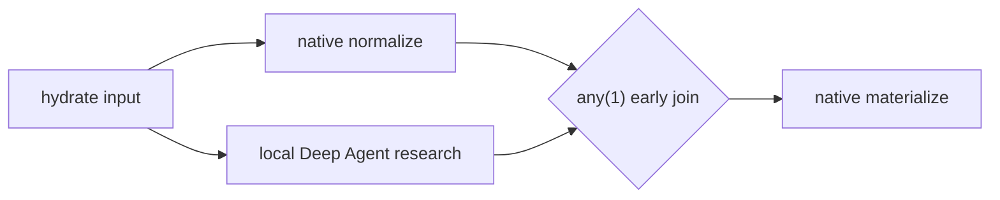

# Stage 4 — Temporal StageGraph parity and heterogeneous vertical slice

Status: `NOT_STARTED`
Document role: normative Stage 4 implementation and parity-qualification package
Mission type: production Temporal workflow-family implementation and parity qualification
Depends on: accepted Stages 1–3, [06A_STAGES_3_TO_6_OPERATION_ASSEMBLY_CONCURRENCY_AND_LINEAGE_CONTRACT.md](06A_STAGES_3_TO_6_OPERATION_ASSEMBLY_CONCURRENCY_AND_LINEAGE_CONTRACT.md), [06B_STAGE_3_TEMPORAL_WORKFLOW_FOUNDATION.md](06B_STAGE_3_TEMPORAL_WORKFLOW_FOUNDATION.md), and [06C_STAGE_3_COMMUNICATION_AND_INTERVENTION_QUALIFICATION.md](06C_STAGE_3_COMMUNICATION_AND_INTERVENTION_QUALIFICATION.md)

## 1. Mission and accepted architecture

Implement production StageGraph as a Temporal workflow family rooted at `BellLabsRunWorkflow`.
BellLabs PostgreSQL and application services own admission, lifecycle authority, accepted command
facts, settlement, and terminality. `BellLabsRunWorkflow` is the stable internal execution handle:
it coordinates and routes already-authorized commands, supervises the family child, and reconciles
runtime observations against BellLabs authority. It does not admit, authorize, settle, or
terminalize by itself. The StageGraph family workflow calls the existing pure
`StageGraphInterpreter` to decide runnable work and starts one `OperationWorkflow` child per
semantic operation attempt.

Temporal is the durable macro-scheduler. LangGraph/Deep Agents may exist only inside bounded
operation runtimes. There is no Agent Server or LangGraph macro-scheduler, no LangGraph `Send`
fan-out, and no gather barrier. The StageGraph workflow processes child completions incrementally,
requests authoritative CAS settlement through BellLabs application services, and recomputes the
frontier from the resulting accepted projection after every settlement or intervention.

The first proof is deliberately heterogeneous: a small StageGraph containing a native operation and a local Deep Agent operation, an early join, inbox command injection, and cancellation. This pulls the smallest exact Deep Agents operation adapter needed for composition into Stage 4; the full reusable harness and GoalDirected proof remain Stage 5.

## 2. Authority and topology

```text
BellLabsRunWorkflow
└── StageGraphWorkflow (family workflow; pure interpreter loop)
    ├── OperationWorkflow(native)
    ├── OperationWorkflow(local_deep_agent)
    └── later OperationWorkflow children selected by the interpreter
```

Required ownership:

- PostgreSQL BellLabs lifecycle, operation journal, effects, usage, evidence, and result bindings remain authoritative.
- Temporal history is durable execution evidence and replay state, not an alternate business database.
- The pure interpreter alone decides frontier membership, joins, cycles, invalidation, reuse, and semantic retries.
- `OperationWorkflow` owns one semantic operation attempt and its bounded technical attempts.
- Activities perform I/O and provider calls; workflow code remains deterministic and replay-safe.
- Only authoritative application services using expected-version CAS settle stage and run transitions.
- `BellLabsRunWorkflow` is the stable target for signals, updates, queries, and cancellation.

Do not copy legacy Temporal mechanics blindly. Reuse domain contracts and accepted behavior while implementing the Stage 3 Temporal foundation.

## 3. Family workflow state

Keep compact deterministic state sufficient to replay orchestration:

- run/epoch, Workflow Type/Implementation, RunPlan, graph, and assembly digests;
- authoritative stage-projection ref/version and fairness cursor;
- active child map keyed by semantic operation attempt identity;
- child Workflow ID, first-run ID, current-run ID when known, operation binding digest, and cancellation state;
- ordered completion inbox containing compact immutable result/error manifest refs;
- pending decision, communication, provider wait, and reconciliation refs;
- retained/released resource-lease refs;
- Continue-As-New generation and predecessor history link;
- terminal result ref or typed terminal failure.

Never place full transcripts, large artifacts, secrets, PHI, provider SDK objects, sandbox handles, or mutable domain projections in workflow state.

## 4. Deterministic scheduling loop

For every activation:

1. Reconcile the compact workflow projection with authoritative PostgreSQL versions.
2. Drain accepted signals/updates and classify them through the Stage 3 communication/intervention contracts.
3. Drain child completion notifications in canonical order.
4. For each completion individually, validate identity and digests, settle effects/usage/result exactly once through expected-version CAS, and update the compact projection.
5. After each accepted settlement, call the pure interpreter immediately.
6. Reserve the interpreter-selected operation and subordinate capacity in canonical order.
7. Start newly admitted `OperationWorkflow` children idempotently with stable Workflow IDs.
8. Apply wait, slow-sibling, cancellation, invalidation, and reuse policy.
9. Continue waiting on child completions, timers, or signals; terminalize only through BellLabs authority.

Canonical same-activation ordering is:

```text
(authoritative completion time bucket,
 stage semantic key,
 cycle,
 semantic attempt,
 child workflow ID,
 manifest digest)
```

Do not depend on Temporal event arrival order for business ordering. If two completions have the same authoritative logical timestamp, the canonical semantic ordering above determines settlement and resulting frontier decisions.

## 5. Incremental joins and slow siblings

Implement all declared dependency modes, including:

- `all`;
- `any(1)`;
- `minimum(k)`;
- optional/soft dependencies;
- cycle-local and cross-cycle dependencies;
- reusable results and invalidated descendants.

`any(1)` and `minimum(k)` must advance as soon as their threshold is authoritatively satisfied. They must not wait for unrelated or unnecessary siblings. Tests must prove the downstream child starts before the slow sibling completes.

Every join declares a slow-sibling policy:

- `allow_to_finish`: retain the sibling for possible reuse/evidence;
- `cancel_when_unneeded`: request child cancellation after the join commits;
- `detach_from_join`: keep supervision and accounting but remove it from join blocking;
- `required_for_terminal_obligation`: allow early downstream progress but prevent terminality until the obligation settles.

Late sibling results are never silently attached. The interpreter and authoritative version decide whether they are accepted, reused, quarantined, or rejected as stale.

## 6. OperationWorkflow boundary

Every `OperationWorkflow`:

1. verifies the exact `StageCapabilityRequirement`, `StageExecutionBinding`, `OperationAssemblySpec`, compatibility key, and resource lease;
2. records one stable semantic attempt and distinct technical/runtime attempts;
3. derives timeout, heartbeat, retry, and cancellation from the frozen binding;
4. invokes only registered activities/adapters;
5. persists immutable output/error/usage/evidence manifests;
6. returns a compact typed completion manifest;
7. never mutates StageGraph or run lifecycle directly.

The shared adapter contract includes completed, waiting-on-decision, waiting-on-external, paused, degraded, failed, and cancelled outcomes. Unknown or unavailable capability returns the shared typed failure; there is no plain-agent fallback.

Runtime replay preserves semantic identity. A new semantic retry exists only when the pure interpreter and authoritative domain transition create it.

## 7. First heterogeneous vertical proof

Publish a small production-shaped Workflow Implementation:



Requirements:

- `N` is a deterministic/native operation.
- `D` uses an exact local Deep Agents binding with bounded model turns, context, middleware, tools, reviewed skill refs, filesystem policy, and typed output.
- `N` and `D` overlap under controlled clocks.
- The fast branch satisfies `any(1)` and starts `M` while the slow branch remains active.
- An inbox command is sent to `BellLabsRunWorkflow`, durably classified, authorized, deduplicated, and routed to the addressable target.
- A cancellation case proves cooperative child cancellation, late-completion handling, observed-usage settlement, and stable terminal lineage.
- The Deep Agent remains operation-local; it does not own StageGraph scheduling or BellLabs terminality.

## 8. Communication and intervention

Use the exact message envelope, target identity, dedupe key, authorization, and disposition contracts from `06C`.

- Signals carry notifications or commands that do not require synchronous acceptance.
- Updates validate commands requiring an accepted/rejected response.
- Queries are non-mutating and read compact workflow state.
- Every accepted command is journaled before consequential action.
- Unsupported target, stale generation, invalid authority, conflicting duplicate, and terminal-run intervention fail with typed dispositions.
- Operation-addressed injection is delivered through a durable child signal/update or authoritative inbox ref; it is never appended directly to an agent transcript.
- Pause, resume, cancel, revise, evidence injection, and decision response retain distinct command types.

## 9. Waits, cycles, reuse, and invalidation

Prove:

- durable timers and external-decision waits survive worker/process loss;
- cycles obey exact ceilings and semantic identities;
- fairness cursor persists across wakeups and Continue-As-New;
- reuse verifies implementation, input, policy, evidence, and authority compatibility;
- accepted upstream revision invalidates descendants deterministically;
- active invalidated children receive policy-driven cancellation and late results cannot settle stale versions;
- no wait occupies an activity worker;
- resumption capacity is protected from frontier saturation.

## 10. Continue-As-New and active-child reconciliation

Continue-As-New is mandatory before configured history/event/size thresholds. Before continuation:

1. persist an immutable continuation manifest;
2. record every active child identity and binding digest;
3. record pending completions, waits, timers, commands, leases, and authoritative versions;
4. reconcile child start ambiguity using stable Workflow IDs;
5. carry only compact state into the new run.

The new run must reconcile active children before starting replacements. It must handle:

- child still running;
- child completed before continuation;
- completion signal duplicated across generations;
- child Continue-As-New with changed current-run ID;
- parent cancellation during handoff;
- child not found after ambiguous start;
- authoritative operation already settled;
- binding or deployment incompatibility.

No child is duplicated merely because the parent continued. Parent Close Policy and child cancellation policy must be explicit and tested.

## 11. Required tests

### Interpreter and scheduling

- all existing `StageGraphInterpreter` cases;
- roots, joins, fairness, cycles, ceilings, waits, reuse, and invalidation;
- `any(1)` and `minimum(k)` threshold progress before slow siblings finish;
- each slow-sibling policy;
- recomputation after each completion rather than after frontier exhaustion;
- same-time completion canonical ordering and replay equality;
- randomized arrival with deterministic final projection.

### Durability and effects

- crash before/after reserve, child start, activity effect, manifest persistence, CAS settlement, and terminal binding;
- duplicate start, duplicate completion, conflicting manifest, stale CAS, and ambiguous provider result;
- no duplicate consequential effect;
- wait/resume and cancellation across worker loss;
- Continue-As-New at multiple loop points with active-child reconciliation;
- history and payload thresholds remain bounded.

### Concurrency and capacity

- controlled-clock proof of actual native/Deep Agent overlap;
- run, operation, tenant, deployment, model, and tool ceilings;
- canonical lease acquisition/release and protected resumption slots;
- cancellation mid-frontier and no leaked lease;
- no activity or child worker starvation at minimum supported capacity.

### Communication and vertical E2E

- prepare/admit/start/signal/update/query/stream/cancel/result through authenticated APIs;
- accepted, duplicate, stale, unauthorized, and conflicting inbox commands;
- local Deep Agent injection at a declared safe boundary;
- native plus Deep Agent early-join proof;
- typed result and complete execution lineage;
- trace hierarchy/redaction and prohibited-payload inspection.

## 12. Gate

Stage 4 passes when:

- production StageGraph runs as a Temporal family under `BellLabsRunWorkflow`;
- pure interpreter decisions and authoritative CAS settlement remain the only scheduling/business authority;
- no LangGraph `Send`, gather barrier, or Agent Server macro-scheduler exists;
- incremental completion handling proves early `any(1)`/`minimum(k)` progress;
- deterministic same-time ordering, slow siblings, waits, cycles, reuse, invalidation, cancellation, and Continue-As-New reconciliation pass;
- the native + local Deep Agent + early join + inbox injection/cancellation proof passes;
- exact bindings, resource envelopes, effect ownership, compact state, and full lineage pass;
- outgoing handoff is accepted.

## 13. Explicit non-goals and handoff

Do not make every stage an agent, place provider SDK state in workflow history, let activities choose scheduling, or add remote agent/sandbox/MCP provider mechanics. Do not enable QuickJS, dynamic delegation, or speculative execution.

Handoff includes workflow/event topology, compatibility and task-queue manifest, interpreter parity matrix, early-join timing evidence, same-time ordering vectors, slow-sibling matrix, Continue-As-New recovery matrix, communication qualification evidence, Deep Agent slice assembly, measured capacity, effect/crash matrix, checkpoint/history sizes, and end-to-end lineage report. Stage 5 must reuse this Temporal family and `OperationWorkflow`; it may not replace it with a LangGraph macro lifecycle.
