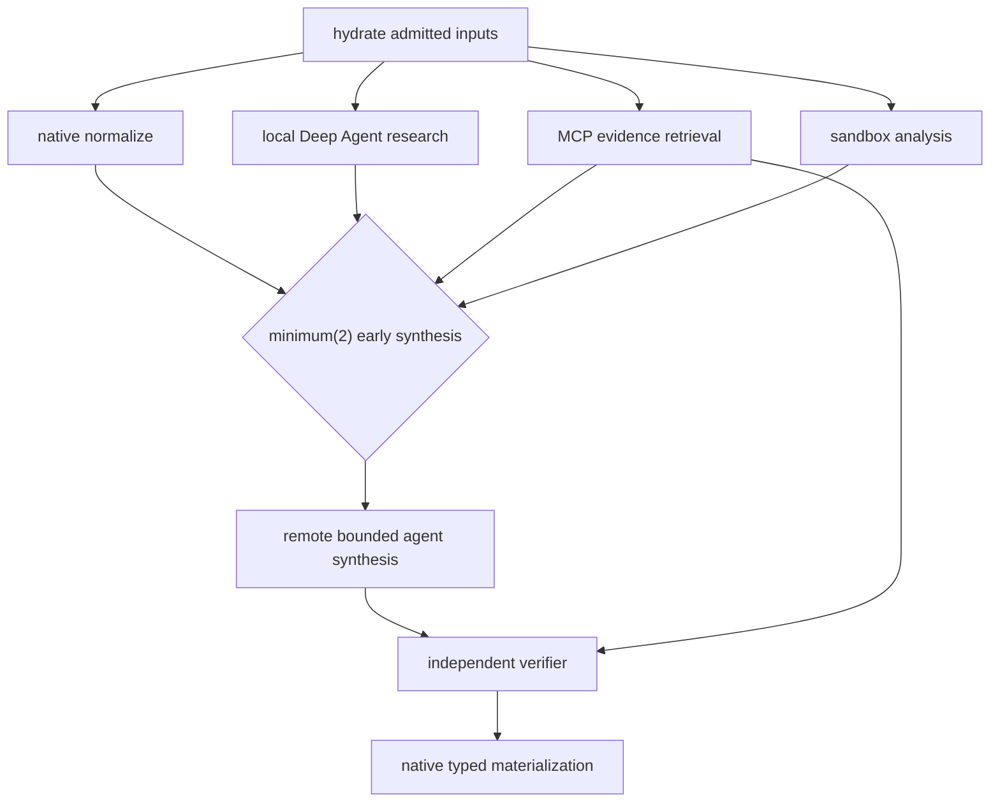

# Stage 6 required proof — heterogeneous Temporal StageGraph composition

Status: `NOT_STARTED`
Document role: required internal Stage 6 integration and exit-certification proof
Depends on: accepted Stages 3–5, [06B_STAGE_3_TEMPORAL_WORKFLOW_FOUNDATION.md](06B_STAGE_3_TEMPORAL_WORKFLOW_FOUNDATION.md), [06C_STAGE_3_COMMUNICATION_AND_INTERVENTION_QUALIFICATION.md](06C_STAGE_3_COMMUNICATION_AND_INTERVENTION_QUALIFICATION.md), and stable candidate provider/capability adapters completed within [`09`](09_STAGE_6_ADVANCED_CAPABILITY_ASSEMBLY.md); does not depend on accepted Stage 6
Purpose: prove that exact heterogeneous capabilities compose through production Temporal `OperationWorkflow` children without moving scheduler authority into an agent platform

## 1. Non-negotiable topology

The proof runs as:

```text
BellLabsRunWorkflow
└── StageGraphWorkflow
    ├── OperationWorkflow(native)
    ├── OperationWorkflow(local Deep Agent)
    ├── OperationWorkflow(MCP-backed)
    ├── OperationWorkflow(sandbox-backed)
    ├── OperationWorkflow(remote bounded agent adapter)
    ├── OperationWorkflow(independent verifier)
    └── further children admitted incrementally by the pure interpreter
```

It must use the production definitions, compiler, pure `StageGraphInterpreter`, Temporal family workflows, operation journal, resource leases, communication contracts, adapters, authoritative CAS settlement, and typed result materializer.

There is no Agent Server macro-scheduler. LangSmith-hosted graphs are bounded remote operation implementations. They cannot compute the StageGraph frontier, own joins/cycles, terminalize the BellLabs run, or create undeclared independent lifecycle.

## 2. Required workflow

Publish one test Workflow Implementation with this minimum shape:



At least one branch must remain deliberately slow after the `minimum(2)` threshold is met. The StageGraph workflow must settle each completion and start `R` before the slow sibling finishes, according to the declared slow-sibling policy.

Required profiles:

- **hydrate/native:** immutable inputs, no model/network.
- **normalize/native:** deterministic application service with typed refs.
- **local Deep Agent:** exact model/prompt/context/middleware/tools/reviewed skills/filesystem and operation-local sync specialist.
- **MCP:** exact wrapped server/tool/schema/session binding and effect policy.
- **sandbox:** provider-neutral gateway using a qualified LangSmith, Daytona, or custom-container adapter; immutable snapshot evidence.
- **remote agent adapter:** exact LangSmith bounded graph deployment, idempotent remote lifecycle, timer/signal/poll reconciliation, and certified command boundary.
- **verifier:** independently bound model/runtime with no worker session or hidden authority.
- **materialize/native:** deterministic typed BellLabs result and terminal request.

Provider async subagents may be exercised inside one designated operation as subordinate adapters. Any requested child with independent lifecycle must use the custom BellLabs Temporal delegation tool and appear as a Temporal child or linked `BellLabsRunWorkflow`.

## 3. Compilation and admission evidence

Persist before launch:

- Workflow Type/Implementation, StageGraph blueprint, RunPlan, and assembly digests;
- one `StageCapabilityRequirement` and exact `StageExecutionBinding` per stage/variant;
- complete `OperationAssemblySpec`, compatibility key, and lineage root;
- local/remote deployment variant and certification level;
- predicted model-visible tools, MCP, skills, filesystem, sandbox, and child surfaces;
- MCP transport/tool/schema/session manifest;
- context, workspace, mount, secret-ref, and Store projections;
- sandbox provider/image/egress/snapshot policy;
- verifier and output contracts;
- hierarchical resource envelopes and effective concurrency intersections;
- authored fallback/degradation and readiness facts;
- communication/intervention capabilities per addressable target.

Compilation fails for missing or duplicate bindings, mutable aliases, ambiguous names, unreviewed assets, unsupported transport, undeclared inheritance, maturity violation, hidden linked-run boundary, uncertified intervention claim, or resource request above authority.

## 4. Scheduling, overlap, and early joins

Use controlled clocks/barriers and authoritative timestamps to prove:

1. `N`, `L`, `M`, and `S` become one admitted frontier.
2. Reservations precede child start.
3. At least three differently assembled operations overlap in wall-clock execution.
4. Operation, run, tenant, deployment, model, MCP, sandbox, and subordinate ceilings are never exceeded.
5. `minimum(2)` starts `R` immediately after the second accepted settlement, while a slow sibling remains active.
6. The configured slow-sibling allow/cancel/detach/terminal-obligation behavior is exact.
7. Resumption/supervisor capacity remains available under saturation.
8. Every completion is settled individually; no frontier gather barrier exists.
9. Same-time completions use canonical semantic ordering.
10. Randomized arrival does not change the authoritative result or lineage.
11. No operation worker mutates the authoritative stage projection.

Include timing evidence identifying reserve, child start, operation start/end, settlement, frontier recomputation, early-join commit, downstream start, and slow-sibling completion/cancel.

## 5. Capability and tenant isolation

Prove:

- each operation sees only its compiled model, tools, MCP, skills, mounts, context, secrets-by-ref, Store namespaces, sandbox, verifier, and child catalog;
- local Deep Agent cannot use MCP/sandbox/private files assigned to another stage;
- MCP stage cannot invoke undisclosed tools or retain deployment-global credentials;
- sandbox stage cannot escape roots/egress/quota or reacquire revoked authority from a snapshot;
- remote graph cannot widen its surface, schedule a stage, or terminalize;
- sync/provider-async children receive bounded ContextSlices;
- independent lifecycle is promoted to BellLabs Temporal delegation;
- verifier cannot access mutable worker memory;
- skill text, tool output, MCP response, provider state, checkpoint, snapshot, and trace cannot widen authority;
- observed model-visible names exactly match compiler prediction.

Run cross-tenant negative tests against credentials, Store, MCP sessions, sandboxes, provider threads, callbacks, traces, and commands.

## 6. Remote lifecycle and command-injection certification

For the remote operation prove:

1. start uses a stable semantic idempotency key;
2. provider thread/run/deployment IDs are bound in separately typed fields;
3. the start activity returns and releases its worker;
4. workflow timers, signals, and bounded polls reconcile fresh status;
5. duplicate starts and ambiguous responses recover one logical remote run;
6. result, usage, trace, and artifact manifests validate before CAS settlement;
7. cancellation races and late results have deterministic disposition.

For post-model/pre-tool certification:

- arm an observable safe boundary after a model proposes a consequential tool call;
- inject an authorized BellLabs command through `BellLabsRunWorkflow`;
- prove the command is journaled, routed, acknowledged, and applied before the tool effect;
- exercise reject/replace/pause/cancel and bounded-context injection as supported;
- test duplicate, stale, unauthorized, conflicting, late, and wrong-generation commands;
- lose the worker/transport at the boundary and prove no duplicate effect.

If async activity completion callback optimization is enabled, test authentication, dedupe, lost/late/forged callback, callback-after-cancel, and fallback polling. Callback evidence is additional; the proof must still pass with callbacks disabled.

## 7. Sandbox proof

Exercise at least one real qualified adapter and the provider-neutral conformance suite for all selected adapters:

- operation-owned create/start/execute/upload/download/stop/delete;
- exact image/runtime/egress/secret/quota policy;
- worker loss and reconnect;
- immutable snapshot plus clone/restore;
- authority, leases, secrets, MCP sessions, and compatibility reacquired after restore;
- snapshot cannot resurrect revoked capability;
- usage settlement, idempotent cleanup, and orphan reconciliation;
- explicit distinction among sandbox snapshot, Temporal generation, agent checkpoint, context manifest, and environment snapshot.

## 8. Complete lineage proof

From the final typed result, one query/report must recover:

- BellLabs run and epoch;
- Workflow Type/Implementation, graph, RunPlan, and assembly;
- parent and every Temporal Continue-As-New run generation;
- every stage/cycle/semantic operation attempt;
- each `OperationWorkflow` ID/run chain and technical runtime attempt;
- exact local/remote operation and deployment variants;
- model, prompt, middleware, context, tool, MCP, skill, filesystem, sandbox, and verifier digests;
- model/tool/MCP/effect calls and settlements;
- sync child, provider-async subordinate, delegated Temporal child, and linked-run edges where exercised;
- provider task/thread/run and callback identities without type confusion;
- sandbox resource generations and immutable snapshots;
- input/output artifacts, citations, evidence, budgets, and usage;
- command IDs, target/disposition/acknowledgement, and safe-boundary evidence;
- LangSmith trace/evaluation refs;
- final BellLabs lifecycle CAS and result binding.

Schemas and APIs must prevent confusion among BellLabs run ID, Temporal Workflow ID/run ID, operation attempt ID, provider task/thread/run ID, sandbox ID, command ID, and trace ID.

## 9. Continue-As-New and recovery matrix

Force parent Continue-As-New while native, local agent, MCP, sandbox, and remote children are in representative active/waiting states. The new generation must reconcile active children before any replacement start and preserve pending completions, waits, commands, leases, cancellations, and canonical ordering.

Inject failure:

- after reservation and before child start;
- after child start and before binding observation;
- before/after model, tool, MCP, sandbox, and remote invocation;
- after consequential effect and before response/settlement;
- during sync/provider-async subordinate work;
- while remote operation waits;
- after remote completion and before parent wake/settlement;
- during command safe boundary;
- during sandbox snapshot/restore;
- before/after early-join settlement;
- before/after parent Continue-As-New;
- before terminal result binding.

Also inject worker loss, activity heartbeat timeout, provider 429/5xx/partition, duplicate/lost callback, MCP drift, skill mismatch, model unavailability, sandbox incompatibility/orphan, remote graph revision drift, stale CAS, cancellation/completion race, and task-queue rollout.

For each fault assert semantic retry ownership, exact effects/usage, lease disposition, child reconciliation, no silent capability substitution, terminal behavior, and lineage completeness.

## 10. Hours-long campaign

Run the workflow and repeated variants for multiple hours. The campaign must include multiple Temporal worker restarts, polling cycles, provider backoffs, sandbox reconciliations, command injections, cancellations, at least one active-child Continue-As-New, and trace/evaluation export.

Measure:

- maximum observed concurrency by resource dimension;
- operation/activity/remote wait duration;
- Temporal history events/bytes and continuation thresholds;
- PostgreSQL journal/CAS conflicts;
- duplicate suppressions and reconciliation latency;
- provider/model/tool/MCP/sandbox usage and cost;
- callback/poll counts;
- command acknowledgement/application latency;
- orphan and cleanup latency;
- final trace and lineage completeness.

No leaked worker, lease, session, sandbox, remote run, effect claim, or unresolved required operation may remain.

## 11. Cancellation, failures, and typed degradation

Cancel while each operation is starting, active, waiting, settling, and crossing Continue-As-New. Verify cascade/allow-to-finish policy, provider cancellation, session/sandbox cleanup, delegated-child policy, orphan incident creation, late-result rejection, observed usage settlement, and preserved lineage.

Exercise every shared failure class with authored retry/wait/fallback/degrade/escalate behavior. Missing optional capability affects only implementations requiring it. Required heterogeneous surfaces cannot silently collapse to a plain agent, local substitute, or ungoverned background task.

## 12. Acceptance gate and evidence bundle

This is the internal exit proof consumed by package `09`. Passing it supplies evidence for the
aggregate Stage 6 gate; it does not presuppose or separately create an already-accepted Stage 6.

This proof passes only when:

- all stages execute through Temporal `OperationWorkflow` children under `BellLabsRunWorkflow`;
- pure interpreter and authoritative CAS settlement retain all StageGraph authority;
- native, local Deep Agent, MCP, sandbox, remote adapter, verifier, and native materializer profiles all execute;
- measured overlap and `minimum(2)` early progress occur without a gather barrier;
- resource ceilings, slow siblings, same-time ordering, isolation, effects, cancellation, and typed degradation pass;
- remote command injection passes at its advertised post-model/pre-tool boundary;
- callback dedupe passes when enabled and callback-free reconciliation also passes;
- Continue-As-New reconciles active heterogeneous children without duplication;
- hours-long and injected-failure campaigns pass;
- the full lineage query is complete and digest-consistent;
- no Agent Server macro scheduler exists;
- QuickJS/PTC/dynamic status is separate and may remain disabled.

The evidence bundle includes frozen definitions, compilation manifests, controlled-clock timeline, resource measurements, early-join and slow-sibling records, isolation negatives, remote lifecycle and injection certification, callback matrix, sandbox conformance, Continue-As-New matrix, hours-long report, injected-failure ledger, LangSmith experiments/traces, typed final result, and executable lineage report.
