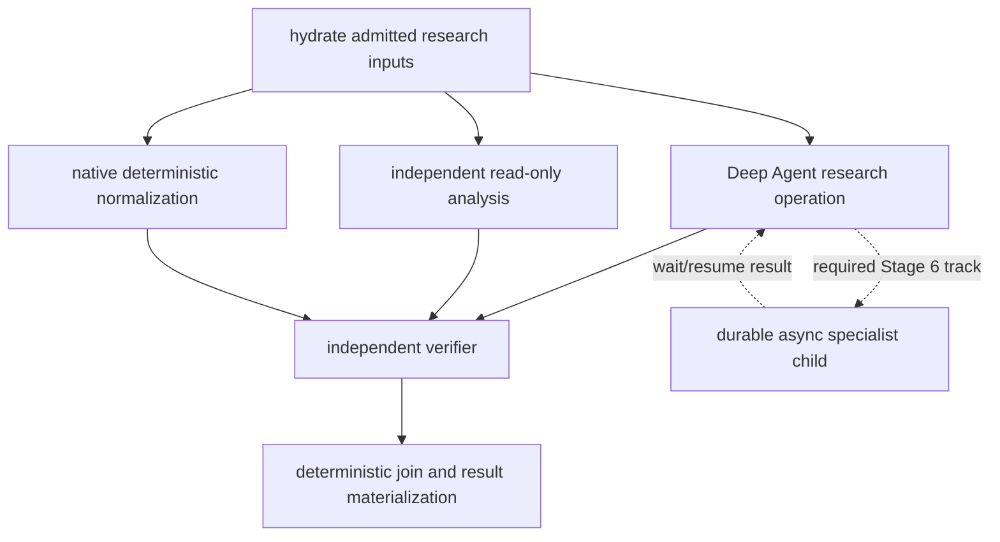

# Stage 6 required proof — heterogeneous capability-aware StageGraph composition

Status: required Stage 6 integration proof  
Depends on: accepted Stages 3–5, stable Stage 6 provider adapters, and the Stage 6B default-off async-child implementation  
Purpose: prove that granular operation capabilities compose inside the generic StageGraph without changing scheduler authority or topology

## 1. Why this proof exists

Separate tests of the StageGraph scheduler and Deep Agents harness do not prove that a coordinator can compile and run a heterogeneous workflow. This proof is the migration evidence that differently capable stages can be authored, compiled, admitted, scheduled concurrently, recovered, and traced as one BellLabs Workflow Implementation.

The proof is not a showcase fixture detached from production contracts. It must use the same definitions, compiler, operation executor, runtime binding, journals, adapters, reducers, and result materialization path intended for staging.

## 2. Required workflow shape

Publish one test Workflow Implementation with at least these logical operations. Domain-appropriate names may replace the labels, but every execution class must remain represented.

Required execution profiles:

| Stage | Implementation | Required distinct surface |
|---|---|---|
| hydrate | native | immutable inputs, no model/network |
| normalize | native async application service | deterministic output schema, bounded read/write refs |
| research | Deep Agent harness | exact non-legacy model policy, reviewed skills, bounded context/filesystem, at least one wrapped outbound MCP server, explicit synchronous specialist catalog |
| analysis | Deep Agent or compiled subgraph | different model/tool/context profile from `research`; read-only and eligible for concurrent execution |
| async specialist | async subagent | separate task/thread/run IDs, explicit ContextSlice, capacity reservation, durable wait/resume, cancel/update/reconcile |
| verify | independently bound verifier | no worker session memory or hidden worker authority |
| materialize | native | deterministic settlement and typed BellLabs result |

The model policies are selected for the new Workflow Implementation. They are not constrained to match the legacy OpenAI Agents SDK models. The frozen binding, evaluation evidence, budgets, and owner-approved semantic thresholds determine acceptance.

## 3. Compilation evidence

Before launch, produce and persist:

- exact Workflow Type and Workflow Implementation refs;
- StageGraph blueprint and digest;
- one `StageCapabilityRequirement` per stage;
- one exact `StageExecutionBinding` per stage/variant;
- complete `OperationAssemblySpec` for every implementation;
- predicted model-visible tool, filesystem, skill, and subagent surfaces;
- MCP server/tool/schema/session manifest;
- context and workspace mount projections per stage;
- resource envelopes and effective concurrency intersection;
- verifier and output contracts;
- fallbacks/degradations and capability readiness;
- graph assembly and RunPlan digests.

Compilation fails before admission for any missing binding, ambiguous tool name, mutable alias, maturity violation, unreviewed skill, unsupported MCP transport, undeclared inheritance, or resource request above authority.

## 4. Scheduling and concurrency evidence

The proof must demonstrate, with barriers or controlled clocks:

1. `normalize`, `research`, and `analysis` become one admitted frontier when their prerequisites are satisfied.
2. Reservations are acquired before fan-out.
3. At least two eligible operations overlap in wall-clock execution.
4. Observed concurrency never exceeds stage, run, tenant, provider, subagent, or deployment ceilings.
5. The Deep Agent may run allowed synchronous specialists concurrently only after reserving aggregate subordinate capacity.
6. The async specialist releases the parent operation worker and moves the stage to `WAITING_ON_ASYNC_CHILD`.
7. Resumption capacity remains available even when child capacity is saturated.
8. Completion order does not affect deterministic settlement or final lineage.
9. No parallel worker mutates the authoritative stage projection.

If optimistic execution is enabled for the fixture, add a pure/read-only speculative stage and prove quarantine, commit-barrier admission, invalidation, discarded-cost settlement, and zero consequential effects. Optimistic execution is not otherwise required for Stage 6 acceptance.

## 5. Capability isolation evidence

Prove that:

- each stage sees only its compiled tools, MCP servers, skills, mounts, context, secrets-by-ref, Store namespaces, and child catalog;
- `analysis` cannot call the `research` MCP tools or read its private working files;
- sync and async children receive bounded ContextSlices rather than parent transcripts;
- skill text cannot add network, tools, writes, credentials, budgets, or delegation;
- verifier cannot access mutable worker memory or terminalize;
- no model, tool, MCP response, child, checkpoint, or trace widens authority;
- all model-visible names match the compiler prediction.

## 6. Lineage proof

From the final typed result, one query/report must recover:

- BellLabs run and epoch;
- Workflow Implementation and graph assembly;
- every stage/cycle/semantic attempt;
- all technical runtime attempts;
- exact operation assembly and context manifests;
- model and prompt revisions;
- tool/MCP calls and effect claims;
- synchronous child invocations;
- async task, child thread, and child run identities;
- input/output artifacts and citations;
- verifier decision/evidence;
- budget/usage/effect settlements;
- trace refs and terminal BellLabs lifecycle transition.

The proof must also show that task ID, child thread ID, child run ID, Agent Server run ID, semantic operation attempt ID, and BellLabs run ID cannot be confused by schema or API.

## 7. Recovery and incompatibility matrix

Inject process loss or transport ambiguity at each boundary:

- after reservation, before worker dispatch;
- before and after model/tool/MCP invocation;
- after external effect, before effect settlement;
- during synchronous child fan-out;
- after async child launch, before binding persistence response is observed;
- while parent waits;
- after child completion, before parent resume;
- before and after deterministic settlement;
- before terminal result binding.

Also test MCP schema drift, skill digest mismatch, model unavailability, sandbox-image incompatibility, async-target revision mismatch, and checkpoint routing to N after N+1 deployment. Runtime revalidation must not silently substitute capabilities.

## 8. Cancellation and failure proof

Test cancellation while every operation class is active or waiting. Verify typed cancellation, cascade/allow-to-finish policy, session/sandbox cleanup, child cancellation or orphan incident creation, late-result rejection, observed-usage settlement, and preserved lineage.

Exercise every shared failure class with its authored wait/retry/fallback/degrade/escalate behavior. A missing optional capability may affect only implementations that require it. The required async track cannot silently degrade to an ungoverned background task.

## 9. Acceptance gate

This proof passes only when:

- the stable generic StageGraph topology is unchanged from Stage 4 except for a deliberately versioned compatibility change;
- every stage is assembled exclusively from its exact binding;
- heterogeneous operations overlap within all resource ceilings;
- the required async-subagent lifecycle passes launch/wait/resume/update/cancel/crash/orphan/capacity/tenant tests while remaining default-off outside accepted implementations;
- deterministic settlement and final typed results survive randomized completion and injected crashes;
- the full lineage query is complete and digest-consistent;
- capability isolation, drift, redaction, checkpoint-size, effect, and terminality invariants pass;
- QuickJS/dynamic status is reported separately and may remain disabled;
- evidence artifacts and commands are included in the Stage 6 outgoing handoff.
