# Stage 3 execution prompts and directions

Status: operator dispatch guide; decomposes but does not override packages `06`, `06A`, `06B`, or `06C`  
Prepared: 2026-08-08  
Scope: remaining Stage 3 work after package `05A` is accepted

This guide does not define additional implementation packages. The `S3-*` labels below are
ordered execution units used to dispatch manageable prompts against exact sections of the
authoritative numbered packages. If this guide conflicts with a numbered package, the numbered
package wins and the conflict must be recorded before implementation continues.

## 1. Entry condition

Do not start `S3-00`, record `06-contract-frozen`, or implement Stage 3 while the
[`PRE_STAGE_3_ENTRY_HANDOFF.md`](../stage2_evidence/PRE_STAGE_3_ENTRY_HANDOFF.md) status is
`REWORK_REQUIRED`. Entry closure is governed by
[`05A_PRE_STAGE_3_ENTRY_GATE_CLOSURE.md`](05A_PRE_STAGE_3_ENTRY_GATE_CLOSURE.md); it is prerequisite
work, not one of the Stage 3 execution units.

Close the remaining entry rows in this order:

1. Supply test-only licensed Agent Server N/N+1 endpoint and authentication material in the process
   environment. Never commit it.
2. Run every test in `tests/test_agent_server_block_c_persistent.py` non-skipped against the exact
   isolated persistence topology. Preserve sanitized endpoint/build/checkpoint/restart evidence.
3. Update the pre-Stage 3 command log, evidence manifest, requirements matrix, and compact handoff.
4. Obtain the gate authority's durable acceptance record. An implementing agent cannot self-grant it.

The exact environment-variable names, two `langgraph up` commands, restart phases, and N/N+1
deployment drill are documented in `tests/fixtures/agent_server_block_c.py`. Use disposable database
`belllabs_langgraph_stage3` only.

## 2. Authoritative package map and required sequence

The authoritative package relationship is:

- [`06_STAGE_3_DURABILITY_HITL_STEERING_AND_RECOVERY.md`](06_STAGE_3_DURABILITY_HITL_STEERING_AND_RECOVERY.md)
  owns aggregate Stage 3 scope, ordering, acceptance, and outgoing handoff.
- [`06A_STAGES_3_TO_6_OPERATION_ASSEMBLY_CONCURRENCY_AND_LINEAGE_CONTRACT.md`](06A_STAGES_3_TO_6_OPERATION_ASSEMBLY_CONCURRENCY_AND_LINEAGE_CONTRACT.md)
  owns the shared contract that must be frozen before Temporal implementation begins.
- [`06B_STAGE_3_TEMPORAL_WORKFLOW_FOUNDATION.md`](06B_STAGE_3_TEMPORAL_WORKFLOW_FOUNDATION.md)
  owns the Temporal kernel, Q/D durable skeletons, replay, recovery, and the `06B` gate.
- [`06C_STAGE_3_COMMUNICATION_AND_INTERVENTION_QUALIFICATION.md`](06C_STAGE_3_COMMUNICATION_AND_INTERVENTION_QUALIFICATION.md)
  owns the authoritative ledger, runtime delivery, durable waits, intervention recovery, and the
  `06C` gate.

The prompt units must execute in this exact order:

```mermaid
flowchart LR
    E0["Entry: 05A accepted"] --> U0["S3-00: freeze 06/06A"]
    U0 --> G0["06-contract-frozen"]
    G0 --> U1["S3-01: 06B kernel"]
    U1 --> U2["S3-02: 06B Q/D verticals"]
    U2 --> U3["S3-03: 06B continuity"]
    U3 --> G1["06B accepted"]
    G1 --> U4["S3-04: 06C ledger"]
    U4 --> U5["S3-05: 06C transport/waits"]
    U5 --> U6["S3-06: 06C recovery + aggregate"]
    U6 --> G2["Aggregate Stage 3 accepted"]
    G2 --> S4["Package 07 / Stage 4"]
```



| Order | Dispatch unit | Exact authoritative sections | Required entry record | Required exit record | Only permitted next unit |
|---:|---|---|---|---|---|
| Entry | Pre-Stage-3 closure | `05A` entire package; current Pre-Stage-3 handoff | Accepted `05A` requirements/evidence | Gate-authority acceptance of the Pre-Stage-3 handoff | `S3-00` |
| 1 | `S3-00` — contract freeze | `06` §§1–6; `06A` §§1–11 | Accepted Pre-Stage-3 handoff | Gate-authority `06-contract-frozen` record | `S3-01` |
| 2 | `S3-01` — deterministic Temporal kernel | `06` §§7.1–7.2; `06B` §§1–6 | `06-contract-frozen` | Kernel/registration evidence and completed unit handoff | `S3-02` |
| 3 | `S3-02` — durable Q/D verticals | `06` §7.4; `06B` §11; `00A`; Q/D continuity input | Accepted `S3-01` handoff | Q/D execution/comparison evidence and completed unit handoff | `S3-03` |
| 4 | `S3-03` — `06B` continuity gate | `06` §§7.5 and 8–9; `06B` §§7–10 and 12–13 | Accepted `S3-02` handoff | Gate-authority acceptance of `06B` | `S3-04` |
| 5 | `S3-04` — authoritative ledger | `06` §§7.1 and 7.3; `06C` §§1–5 | Accepted `06B` gate | Ledger/migration/security evidence and completed unit handoff | `S3-05` |
| 6 | `S3-05` — runtime transport and waits | `06` §7.3; `06C` §§6–8 and applicable §11 assertions | Accepted `S3-04` handoff | Transport/wait/receipt evidence and completed unit handoff | `S3-06` |
| 7 | `S3-06` — recovery and aggregate gate | `06` §§7.5 and 8–11; `06C` §§9–12 | Accepted `S3-05` handoff | Accepted `06C` record plus gate-authority aggregate Stage 3 acceptance | Package `07` / Stage 4 |

The Q/D continuity file
[`REFERENCE_BLUEPRINT_STAGE3_MAPPING.md`](../stage2_evidence/REFERENCE_BLUEPRINT_STAGE3_MAPPING.md)
is an input specifically to `S3-02` / package `06B` §11. It is not an eighth Stage 3 unit.

Do not combine units across an unmet dependency. A unit-level implementation result is not the
same as gate-authority acceptance. Stage 4 is authorized only by the final aggregate Stage 3
acceptance record.

## 3. How to dispatch one unit

Use the live [`STAGE_3_EXECUTION_LEDGER.md`](../stage3_evidence/STAGE_3_EXECUTION_LEDGER.md) to find
the first unit whose dependency is accepted and whose status is `READY`. Then:

1. Copy the common prompt below.
2. Append exactly one unit-specific block from section 5; never append multiple unit blocks.
3. Give the implementing agent the authoritative package links and predecessor handoff named in
   that unit's dispatch header.
4. Store evidence under the unit directory named in the execution ledger and update its handoff.
5. Change the ledger only from recorded evidence: `NOT_STARTED -> READY -> IN_PROGRESS ->
   READY_FOR_REVIEW -> ACCEPTED`, or to `REWORK_REQUIRED`/`BLOCKED` with an exact reason.
6. Mark the next unit `READY` only after the required gate-authority or predecessor acceptance
   record exists. Implementation completion alone is insufficient where the table requires gate
   acceptance.

The current repository state remains at the Pre-Stage-3 entry row. Therefore the next action is
entry closure under package `05A`, not dispatch of `S3-00`.

## 4. Common copyable prompt

Copy this prompt for every unit and append the unit-specific block from section 5.

```text
Implement one evidence-gated BellLabs Stage 3 work unit in
biotech-research-ingestion-evaluation-system. Continue until the unit is genuinely complete or a
concrete external/decision blocker is recorded; do not stop after planning.

Before editing:
- read the repository AGENTS.md and inspect git status; preserve unrelated dirty-worktree changes;
- read, in full and in order: `00_MAIN_GOAL_AND_INDEX.md`,
  `00A_REFERENCE_RESEARCH_BLUEPRINTS_AND_INCREMENTAL_PROOFS.md`,
  `01_GLOBAL_HANDOFF_AND_STAGE_GATE_RULES.md`,
  `02A_OWNER_AMENDMENTS_FOR_STAGES_3_TO_6.md`,
  `06_STAGE_3_DURABILITY_HITL_STEERING_AND_RECOVERY.md`,
  `06A_STAGES_3_TO_6_OPERATION_ASSEMBLY_CONCURRENCY_AND_LINEAGE_CONTRACT.md`, the exact active
  package and sections named by the dispatch table, every direct-dependency handoff, and current
  target code/tests;
- verify the direct dependency has a durable accepted gate record; if not, stop implementation and
  return REWORK_REQUIRED or BLOCKED with the exact missing row;
- atomize this unit into requirements-to-evidence rows before substantive edits.

Architecture invariants:
- Temporal is the sole production macro runtime.
- BellLabs application services/PostgreSQL own admission, lifecycle, budgets, approvals, claims,
  accepted evidence, settlement, product events, and terminality.
- Pure interpreters own StageGraph readiness and GoalDirected convergence.
- LangGraph/Deep Agents/Agent Server are bounded operation adapters only.
- BellLabs API/application ports are the governed facade; do not add provider or Temporal bypasses.
- Workflow code is deterministic; all I/O occurs through typed Activities/application ports.
- Histories contain compact IDs/refs/digests only—no secrets, PHI, raw corpora, transcripts, or
  large artifacts.
- Do not claim exactly-once transport/provider effects; prove stable claims, reconciliation, and
  exactly-once BellLabs settlement.
- Use immutable Q/D versions and production-shaped seams; do not build a demo path.

Implementation discipline:
- search for current owners before adding contracts or versioned duplicates;
- preserve published schema/digest readability or publish an explicit versioned incompatibility;
- test negative authority, tenant, drift, duplicate, cancellation, and failure paths;
- keep later-stage capabilities disabled and report them as unsupported;
- update the unit requirement matrix, evidence manifest, command log, changed-path manifest,
  compatibility/migration record, Q/D comparison, and handoff.

Verification:
- run focused tests first, then package-required real-service/replay/failure drills;
- run `uv run ruff check app tests`, `uv run mypy app`, and the full accepted pytest baseline;
- record exact pass/fail/skip counts and sanitized reproduction commands;
- never represent a skipped or historical live test as current acceptance evidence.

At completion report the gate recommendation, exact changed paths, compatibility and migrations,
Q/D versions and runtime path, recovery/replay/idempotency/lineage/settlement/security evidence,
all skips/blockers, and the next unit's first safe action. Do not self-grant owner/gate acceptance.
```

## 5. Unit-specific prompt blocks

### `S3-00` — freeze `06`/`06A` contracts

- **Read/implement against:** package [`06`](06_STAGE_3_DURABILITY_HITL_STEERING_AND_RECOVERY.md)
  §§1–6 and package [`06A`](06A_STAGES_3_TO_6_OPERATION_ASSEMBLY_CONCURRENCY_AND_LINEAGE_CONTRACT.md)
  §§1–11.
- **May start only when:** the package `05A` Pre-Stage-3 handoff has gate-authority acceptance.
- **Finishes only with:** a durable gate-authority `06-contract-frozen` record.
- **Then dispatch:** `S3-01`; no `06B` implementation may begin earlier.

```text
Execution unit: S3-00 of 7. Previous unit: accepted 05A entry gate. Next unit: S3-01.
Active authority: package 06 sections 1-6 and package 06A sections 1-11.
Objective: produce the reviewed conformance record that can authorize `06-contract-frozen` without
implementing Temporal workflow behavior.

Map every root/family/operation input/result, identity, resource, lease, executor outcome, parent
lifecycle action, journal/effect/settlement, failure, compatibility, and lineage field to exactly
one authoritative model/owner. Prove schema versioning, exact digests, Q/D expressibility, and no
competing authority. Reconcile contradictions between 06 and 06A explicitly.

Out of scope: 06B workflow implementation, 06C ledger implementation, StageGraph scheduling,
GoalDirected convergence, production Deep Agents, deployment, and cutover.

Exit evidence: contract ownership matrix, schema/compatibility digests, shared conformance tests,
Q/D compilation proof, reviewed contradiction log, and a gate-authority `06-contract-frozen`
record. Do not begin S3-01 until that record exists.
```

### `S3-01` — implement the `06B` deterministic kernel

- **Read/implement against:** package [`06`](06_STAGE_3_DURABILITY_HITL_STEERING_AND_RECOVERY.md)
  §§7.1–7.2 and package [`06B`](06B_STAGE_3_TEMPORAL_WORKFLOW_FOUNDATION.md) §§1–6.
- **May start only when:** the durable `06-contract-frozen` record exists.
- **Finishes only with:** kernel, registration, deterministic-workflow, and negative-routing
  evidence plus an explicit `S3-01` handoff.
- **Then dispatch:** `S3-02`; this unit does not run the Q/D verticals.

```text
Execution unit: S3-01 of 7. Previous unit: S3-00/06-contract-frozen. Next unit: S3-02.
Active authority: package 06 sections 7.1-7.2 and package 06B sections 1-6.
Objective: implement deterministic BellLabsRunWorkflow, explicit fixture-family workflow types,
generic OperationWorkflow, stable Workflow ID builders, compact Query/Signal/Update contracts,
exact retry/timeout/heartbeat profiles, and the queue/type registration manifest.

Keep family fixtures semantic-free: they prove common lifecycle mechanics and cannot become a
second StageGraph or GoalDirected scheduler. Put database/provider/object-store access in
Activities. Fail closed on duplicate IDs, digest/profile drift, undeclared queues, and wrong typed
identities.

Exit evidence: workflow sandbox/unit tests, import/replay determinism checks, registration-manifest
negative tests, compact-payload/redaction tests, and exact Q/D Stage 3 implementation definitions.
```

### `S3-02` — run the durable Q/D verticals

- **Read/implement against:** package [`06`](06_STAGE_3_DURABILITY_HITL_STEERING_AND_RECOVERY.md)
  §7.4, package [`06B`](06B_STAGE_3_TEMPORAL_WORKFLOW_FOUNDATION.md) §11, package
  [`00A`](00A_REFERENCE_RESEARCH_BLUEPRINTS_AND_INCREMENTAL_PROOFS.md), and the exact
  [`Q/D continuity input`](../stage2_evidence/REFERENCE_BLUEPRINT_STAGE3_MAPPING.md).
- **May start only when:** the `S3-01` kernel handoff is complete and its registrations/profiles
  are the versions selected for the Q/D runs.
- **Finishes only with:** immutable Q/D execution/comparison evidence and an explicit `S3-02`
  handoff.
- **Then dispatch:** `S3-03`; Q/D success alone does not accept package `06B`.

```text
Execution unit: S3-02 of 7. Previous unit: S3-01. Next unit: S3-03.
Active authority: package 06 section 7.4, package 06B section 11, package 00A, and
REFERENCE_BLUEPRINT_STAGE3_MAPPING.md as a supporting input.
Objective: execute immutable Q and D Stage 3 skeleton implementations through the real BellLabs
admission/application command, PostgreSQL authority, BellLabsRunWorkflow, fixture family,
OperationWorkflow, deterministic Activity, journal/evidence/usage/result settlement, and typed
result reconstruction.

Across the two runs exercise a typed decision wait, an evidence/wake fact, Query, Update, Signal,
cancellation, sibling incremental observation, and exact adapter routing. Same identity/digest is
idempotent; different digest conflicts. Messages cannot satisfy semantic readiness before accepted
settlement.

Exit evidence: immutable Q/D manifests and comparison, deterministic commands/results, lineage
queries, journal/effect/usage/settlement records, no-bypass proof, and bounded live canary or exact
skip reason.
```

### `S3-03` — prove `06B` continuity and accept its gate

- **Read/implement against:** package [`06`](06_STAGE_3_DURABILITY_HITL_STEERING_AND_RECOVERY.md)
  §§7.5 and 8–9 and package [`06B`](06B_STAGE_3_TEMPORAL_WORKFLOW_FOUNDATION.md) §§7–10 and 12–13.
- **May start only when:** the `S3-02` Q/D handoff is complete.
- **Finishes only with:** replay/recovery evidence and gate-authority acceptance of package `06B`
  required by its §13 handoff gate.
- **Then dispatch:** `S3-04`; no `06C` persistence work may begin before `06B` is accepted.

```text
Execution unit: S3-03 of 7. Previous unit: S3-02. Next unit: S3-04 after 06B acceptance.
Active authority: package 06 sections 7.5 and 8-9 and package 06B sections 7-10 and 12-13.
Objective: prove open waits, active children, authoritative rehydration, and accepted progress
survive API/coordinator/Activity worker loss and Continue-As-New without duplicate effects or
settlement.

Capture sanitized histories for completion, wait, retry/ambiguity, cancellation/generation
restart, active child across Continue-As-New, and fork-derived start. Run N-on-N and compatible
N+1-on-N replay; incompatible histories must route or fail safely. Inspect history, memo, search
attributes, heartbeat, log, and error payloads for prohibited content.

Exit evidence: process-loss matrix, replay/history manifest, same-run/same-epoch/new-segment proof,
fork new-run/epoch-1 proof, active-child reattachment, reconciliation results, worker manifest, and
gate-authority acceptance of 06B. Do not begin S3-04 until 06B is accepted.
```

### `S3-04` — implement the `06C` authoritative ledger

- **Read/implement against:** package [`06`](06_STAGE_3_DURABILITY_HITL_STEERING_AND_RECOVERY.md)
  §§7.1 and 7.3 and package
  [`06C`](06C_STAGE_3_COMMUNICATION_AND_INTERVENTION_QUALIFICATION.md) §§1–5.
- **May start only when:** gate authority has accepted package `06B`.
- **Finishes only with:** ledger, migration, ordering, RLS, redelivery, and rollback evidence plus
  an explicit `S3-04` handoff.
- **Then dispatch:** `S3-05`; ledger persistence alone does not qualify Temporal delivery.

```text
Execution unit: S3-04 of 7. Previous unit: accepted 06B gate. Next unit: S3-05.
Active authority: package 06 sections 7.1 and 7.3 and package 06C sections 1-5.
Objective: implement the PostgreSQL-authoritative immutable command/message ledger, per-target
sequence, inbox, transactional outbox, router claims/leases/attempts, receipt events/projection,
RLS/grants, application services, and forward-only migrations.

Commit authorization, message, and outbox atomically before runtime delivery. Same ID/digest is
idempotent; conflicting digest is an incident. Concurrent producers preserve monotonic target
order; gaps, expiry, rejection, and supersession are explicit. Stale targets are never retargeted.

Exit evidence: clean/upgrade migration tests, non-owner and cross-tenant denial, atomic rollback,
concurrent sequencing, claim expiry/redelivery, receipt monotonicity, payload authorization, and
exact rollback boundary.
```

### `S3-05` — qualify `06C` Temporal transport and durable waits

- **Read/implement against:** package [`06`](06_STAGE_3_DURABILITY_HITL_STEERING_AND_RECOVERY.md)
  §7.3 and package [`06C`](06C_STAGE_3_COMMUNICATION_AND_INTERVENTION_QUALIFICATION.md) §§6–8 plus
  the applicable core assertions in §11.
- **May start only when:** the `S3-04` ledger handoff is complete and its migration/authority tests
  pass on the target topology.
- **Finishes only with:** persisted-command delivery, wait/resume, receipt, stale-target, restart,
  and explicit unsupported-capability evidence plus an `S3-05` handoff.
- **Then dispatch:** `S3-06`; this unit does not grant the `06C` or aggregate Stage 3 gate.

```text
Execution unit: S3-05 of 7. Previous unit: S3-04. Next unit: S3-06.
Active authority: package 06 section 7.3 and package 06C sections 6-8 plus applicable section 11
core assertions.
Objective: route already-persisted command IDs via Temporal Update, deliver authorized facts via
Signal, record accepted/routed/runtime_observed distinctly, and resume open OperationWorkflow waits
after every worker restart.

Prove API death before/after commit and delivery, duplicate/delayed/out-of-order delivery,
wrong-tenant/run/epoch/attempt/generation/thread/version/actor rejection, fork isolation, bounded
batches, and settlement-before-readiness. Fixture adapters must explicitly reject model_visible,
applied, post-model/pre-tool, and tool-HITL capability as unsupported.

Exit evidence: Q/D transport/wait runs on the accepted 06B environment, immutable receipt queries,
runtime-observation refs, stale-target negatives, restart evidence, and conformance vectors handed
to Stages 4-6.
```

### `S3-06` — qualify recovery and aggregate Stage 3

- **Read/implement against:** package [`06`](06_STAGE_3_DURABILITY_HITL_STEERING_AND_RECOVERY.md)
  §§7.5 and 8–11 and package
  [`06C`](06C_STAGE_3_COMMUNICATION_AND_INTERVENTION_QUALIFICATION.md) §§9–12.
- **May start only when:** the `S3-05` transport/wait handoff is complete.
- **Finishes only with:** accepted `06C` evidence and a separate gate-authority aggregate Stage 3
  acceptance record satisfying package `06` §9.
- **Then dispatch:** package [`07`](07_STAGE_4_STAGEGRAPH_PARITY_VERTICAL_SLICE.md); nothing in this
  guide independently authorizes Stage 4.

```text
Execution unit: S3-06 of 7. Previous unit: S3-05. Next unit: package 07 only after aggregate Stage
3 acceptance.
Active authority: package 06 sections 7.5 and 8-11 plus package 06C sections 9-12.
Objective: complete deterministic generation fencing, old-generation quarantine, cancellation and
completion race reconciliation, default-denied orphan overlap, payload/security inspection, and
aggregate Stage 3 evidence.

Do not claim the Stage 4/5/6 adapter gates. Stage 3 proves only generic deterministic generation,
fencing, quarantine, durable transport/waits, and explicit unsupported adapter-level steering.
Rerun both Q/D verticals, all process-loss/replay tests, real-store suites, static checks, and full
regression baseline.

Exit evidence: accepted 06C record; combined Stage 3 requirements matrix/evidence manifest/command
log/changed paths; Q/D comparison; histories and worker manifests; authority/bypass and sensitive
payload scans; explicit unsupported capabilities; recovery/rollback runbook; and gate-authority
aggregate Stage 3 acceptance. Only that final record authorizes Stage 4.
```

## 6. Operating notes

- Keep local application PostgreSQL, Temporal PostgreSQL, and MongoDB targets distinct. Resolve and
  sanitize literal hosts/databases before migration or destructive tests.
- Preserve replay histories and evidence artifacts before changing workflow code.
- A failed Q/D run blocks the capability claim it exercises; do not hide it by weakening the
  blueprint. Repair the implementation or publish an owner-accepted semantic version.
- If a unit ends blocked, leave the worktree runnable, mark exact requirement rows, record the
  missing credential/decision/service, and do not start its dependent unit.
