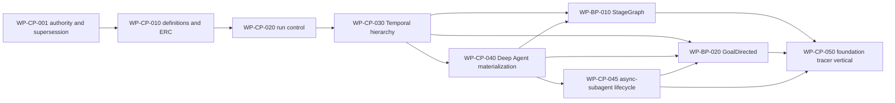

# Canonical implementation work packages

Status: active local planning index  
Planning unit: stable requirement-derived `WP-*`, not historical stage numbers  
GitHub publication: not authorized; these are local Markdown work packages

## Governing authority

- `ADR-0003` in `biotech-meta/docs/adr/0003-temporal-deepagents-control-plane-runtime.md`
- `SPEC-CP-*` in `biotech-meta/docs/specs/control-plane-foundations/`
- `SPEC-BP-*` in `biotech-meta/docs/specs/workflow-blueprints/`
- [Traceability projection](TRACEABILITY.md)

The prior Stage 0–8 package system is frozen historical provenance. It cannot authorize work.

## Dependency order

## Work-package index

| Work package | Outcome | Direct blockers | Status |
|---|---|---|---|
| [WP-CP-001](WP-CP-001-authority-supersession-and-contract-inventory.md) | Establish canonical authority, schema-version plan, and frozen-package migration inventory | None | ready |
| [WP-CP-010](WP-CP-010-versioned-definitions-and-effective-run-configuration.md) | Publish immutable definitions and compile deterministic ERCs with flattened capability bindings | WP-CP-001 | draft |
| [WP-CP-020](WP-CP-020-transactional-run-control.md) | Establish PostgreSQL admission, lifecycle, budgets, effects, settlement, and outbox authority | WP-CP-010 | draft |
| [WP-CP-030](WP-CP-030-temporal-root-operation-and-continuity.md) | Implement root/family/operation hierarchy, messages, cancellation, linked runs, and continuation | WP-CP-020 | draft |
| [WP-CP-040](WP-CP-040-deep-agent-profile-binding-and-materialization.md) | Materialize exact Deep Agents 0.7.5 profiles and placements through the operation seam | WP-CP-030 | draft |
| [WP-CP-045](WP-CP-045-async-subagent-parent-child-lifecycle.md) | Implement governed durable async-subagent parent/child behavior | WP-CP-040 | draft |
| [WP-BP-010](WP-BP-010-stagegraph-runtime.md) | Implement canonical StageGraph interpreter/workflow semantics | WP-CP-030, WP-CP-040 | draft |
| [WP-BP-020](WP-BP-020-goal-directed-runtime.md) | Implement canonical GoalDirected revisions, handoffs, verification, and convergence | WP-CP-030, WP-CP-040, WP-CP-045 | draft |
| [WP-CP-050](WP-CP-050-foundation-capability-materialization-vertical.md) | Prove the cohesive foundation with exact MCP, Skill, sandbox, sync/async subagents, both families, and recovery | WP-CP-045, WP-BP-010, WP-BP-020 | draft |

## Immediate implementation frontier

`WP-CP-001` is the only ready package. It must reconcile existing v1/v2/v3 contract models, current migrations, and still-valid Stage 3 evidence before schema implementation begins. No package may silently rename or mutate a published contract to match these documents.

## Handoff rule

Every package must publish:

- requirements-to-evidence mapping;
- exact changed paths and migrations;
- commands and sanitized outputs;
- compatibility and rollback posture;
- unresolved risks and drift checks;
- an explicit `ready_for_review`, `accepted`, or `rework_required` disposition.

