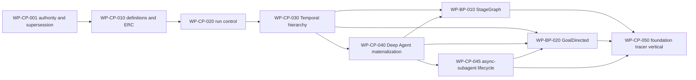

# Canonical implementation work packages

Status: active local planning index  
Planning unit: stable requirement-derived `WP-*`, not historical stage numbers  
GitHub publication: not authorized; these are local Markdown work packages

## Governing authority

- [ADR-0003](../../../../biotech-meta/docs/adr/0003-temporal-deepagents-control-plane-runtime.md)
- [Control-plane specifications](../../../../biotech-meta/docs/specs/control-plane-foundations/README.md)
- [Workflow-blueprint specifications](../../../../biotech-meta/docs/specs/workflow-blueprints/README.md)
- [Implementation readiness contract](IMPLEMENTATION_READINESS.md)
- [Codebase organization implementation supplement](SUPPLEMENT_CODEBASE_ORGANIZATION.md)
- [Recommended implementation order](RECOMMENDED_ORDER.md)
- [Traceability projection](TRACEABILITY.md)
- [Parallel worktree protocol](PARALLEL_WORKTREE_PROTOCOL.md)

The prior Stage 0–8 package system is frozen historical provenance. It cannot authorize work.

## Dependency order

## Work-package index

| Work package | Outcome | Direct blockers | Status |
|---|---|---|---|
| [WP-CP-001](WP-CP-001-authority-supersession-and-contract-inventory.md) | Establish canonical authority and the replacement/deletion boundary | None | accepted |
| [WP-CP-010](WP-CP-010-versioned-definitions-and-effective-run-configuration.md) | Publish immutable definitions and compile deterministic ERCs with flattened capability bindings | WP-CP-001 | accepted |
| [WP-CP-020](WP-CP-020-transactional-run-control.md) | Establish PostgreSQL admission, lifecycle, budgets, effects, settlement, and outbox authority | WP-CP-010 | accepted |
| [WP-CP-030](WP-CP-030-temporal-root-operation-and-continuity.md) | Implement root/family/operation hierarchy, messages, cancellation, linked runs, and continuation | WP-CP-020 | accepted |
| [WP-CP-040](WP-CP-040-deep-agent-profile-binding-and-materialization.md) | Materialize exact Deep Agents 0.7.5 profiles and placements through the operation seam | WP-CP-030 | accepted |
| [WP-CP-045](WP-CP-045-async-subagent-parent-child-lifecycle.md) | Implement governed durable async-subagent parent/child behavior | WP-CP-040 | accepted |
| [WP-BP-010](WP-BP-010-stagegraph-runtime.md) | Implement canonical StageGraph interpreter/workflow semantics | WP-CP-030, WP-CP-040 | accepted |
| [WP-BP-020](WP-BP-020-goal-directed-runtime.md) | Implement canonical GoalDirected revisions, handoffs, verification, and convergence | WP-CP-030, WP-CP-040, WP-CP-045 | ready |
| [WP-CP-050](WP-CP-050-foundation-capability-materialization-vertical.md) | Prove the cohesive foundation with exact MCP, Skill, sandbox, sync/async subagents, both families, and recovery | WP-CP-045, WP-BP-010, WP-BP-020 | ready when unblocked |

## Immediate implementation frontier

`WP-CP-001` through `WP-CP-045` and `WP-BP-010` are accepted. `WP-BP-020` remains on the blueprint
implementation frontier. `WP-CP-050` remains blocked until both blueprint runtimes are accepted.
BellLabs is pre-production, so new canonical schemas may replace local prototype persistence
directly. No package may silently mutate a published canonical `CON-*` meaning.

## Replacement posture

This plan does not preserve the OpenAI Agents SDK runtime, Agent Server macro schedulers, direct
family submission, or prototype persistence compatibility. Accepted behavior may be reused behind
the new contracts. Superseded executable paths are removed at the deletion gate named in the
[implementation readiness contract](IMPLEMENTATION_READINESS.md#9-replacement-and-deletion-rules).
Historical evidence may remain inert and clearly non-normative.

## Handoff rule

Every package must publish:

- requirements-to-evidence mapping;
- exact changed paths and migrations;
- commands and sanitized outputs;
- replacement/deletion and pre-production rollback posture;
- unresolved risks and drift checks;
- an explicit `ready_for_review`, `accepted`, or `rework_required` disposition.
