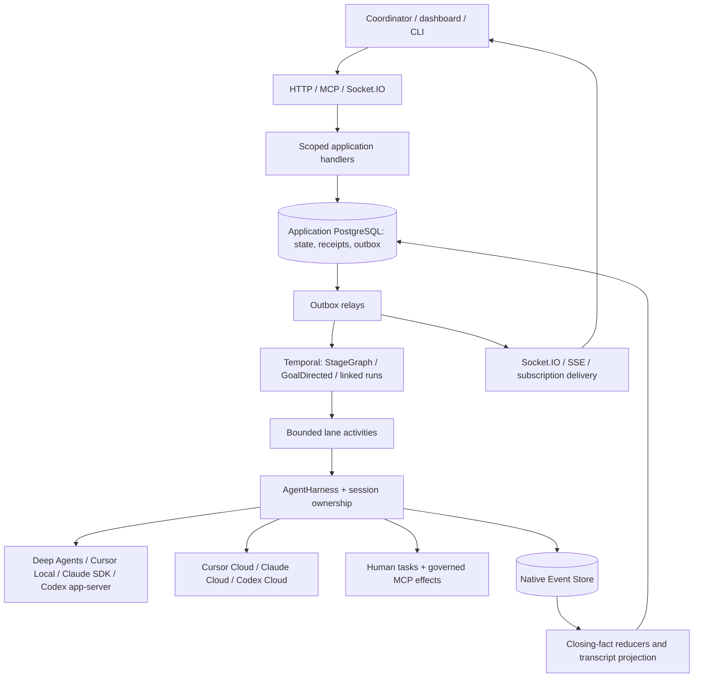

# Architecture

Use one mission execution model and provider-specific session adapters. Temporal decides when bounded work runs; application reducers decide what its result means; each provider owns its internal agent loop. An SDK completion is an execution result, never mission acceptance.

## Verified baseline

These are code observations at `7c9b755`, cross-checked with the current handoff. They are not a fresh execution of the runtime suite.

| Concern | Existing source | Gap for this increment |
| --- | --- | --- |
| Harness | `application/execution/harness/protocol.py`: ten operations plus `SessionLane` stage/status/closing-facts/cursor | Add adapters, not another orchestration interface |
| Runtime profile identity | `domain/execution/lanes.py`: three profiles and two lanes | Capability projection already has five IDs in `domain/capabilities/host_support.py`; runtime/projection/frames/manifest/SQL must agree |
| Claude/Codex projections | `application/agentic_components/projections.py`, `domain/capabilities/hooks.py` | Generated files exist; runnable adapters do not. Current shared hook mapping overstates SDK-language equivalence |
| Local and cloud Cursor | `adapters/cursor/`, `application/execution/harness/describe.py` | Both declared unqualified; complete controls/recovery proof, cloud materialization and effect-enforcement limits |
| Start | `application/authoring/manifest_submit.py::LaunchInputPort`; `bootstrap/manifests.py` defaults it to `None` | No production semantic family-input author passed by API composition; start remains unavailable |
| Chains | `application/chains/relay.py::ChainIntentRelay`, chain reducer/store/packet | Production chain launch author and running relay composition missing |
| Continuation | `application/context/continuation.py`, `adapters/temporal/activities/continuation.py` | Seal/transfer services exist; worker registration and family workflow call sites missing |
| Human Gate | `domain/authoring/manifest.py::HumanGateNode`, human-task SQL and runtime approval gateway | Authoring shape and run waits exist; no executable general Human Gate program node found in program domain/application |
| Socket.IO | `bootstrap/technical_api.py`: connect, subscribe_operation, answer_runtime_approval | Separate technical bootstrap is not the public application-scoped mission stream. Add shared composition and mission handlers |
| Durable streams | `application/subscriptions/`, `interfaces/http/subscriptions.py` | Alias mismatch: manifests request completion/opened names but kernel emits lifecycle/set-wait/terminalize names |
| Workspaces | `application/execution/harness/leases.py`, Cursor workspace adapter | Leases and Git support exist; expose explicit policy and generalize ownership to other local providers |
| Frame/inspection | `application/frames/`, `interfaces/http/transcript.py` | Full body reader uncomposed, transcript projection not scheduled; add provider mappings and subordinate lineage |

Read [pre-fixture handoff](../fast-track-2026-10/HANDOFF-PRE-FIXTURE.md) for B1–B7. Its earlier test totals and infrastructure state are historical observations, not reverified here. The read-only Linear snapshot confirms OVE-55 is In Review; fixture tickets OVE-59–61 are Backlog. Keep those tickets; this packet supplies their missing prerequisites and new provider scope.

Initial dirty state: root `AGENTS.md` and fast-track `README.md` modified; `app/.cursor/rules/user_subagent_preference.mdc` deleted; pre-fixture handoff and `experiments/docs_retrieval/results/` untracked. Preserve all. Regenerate only the documented index region of `AGENTS.md`.

## Profile identity and capability admission

| Runtime profile | Placement | Integration boundary |
| --- | --- | --- |
| `deep_agents` | Existing admitted placement | Existing harness and Agent Server integration |
| `cursor_local` | Local worker | Pinned Python SDK + bridge |
| `cursor_cloud` | Cursor-hosted | Pinned SDK/cloud API |
| `claude_agent_sdk` | Local worker | Pinned Python SDK and bundled/selected CLI |
| `codex` | Local worker | Pinned app-server JSON-RPC schema; SDK wrapper only if it preserves required methods |
| `claude_cloud` | Anthropic-hosted | Documented cloud product integration only; full lifecycle unqualified |
| `codex_cloud` | OpenAI-hosted Codex product | Documented cloud product integration only; full lifecycle unqualified |

No new self-hosted cloud execution target. Local profile names are deliberately compatible with existing catalog projection IDs. UI labels may say “Claude Code Local” and “Codex Local.” Provider-hosted environment selection is not a model-provider selector.

Keep `native | emulated | unsupported | unqualified` but attach evidence **per feature**, including transport, SDK language/version, provider/account scope, OS, deployment digest and qualification timestamp. Separate “implemented,” “account enabled” and “qualified.” No one boolean can prove everything. New describe fields require a versioned contract; old describes remain readable.

Admission computes the intersection of workflow requirements, lane support, capability host support, environment policy, actor grants and live revocations. A required feature missing anywhere is a pointed compile/admission error. Optional unsupported observability features become explicit omissions. A human-gated external write must reject a lane that cannot enforce the gate. Never drop hooks/MCP capabilities silently.

## Contract delta

These are proposed contracts for MP-01, not existing symbols:

| Contract | Purpose and essential fields |
| --- | --- |
| `mc.lane_describe.v2` | Existing operations plus feature evidence, approval modes, compaction control, subordinate visibility, control/enforcement coverage |
| `mc.execution_binding.v2` | Profile, model/auth/environment pins, effective permissions, repo commit, materialization digest, workflow requirements and policy digest; discriminated provider binding |
| `mc.environment_binding.v1` | `local_workspace` or `provider_hosted`; provider environment ID/revision, setup pins, network/secret policy, readiness evidence |
| `mc.workspace_snapshot.v1` | Base commit, branch, patch and untracked-file artifacts, manifest digest, producer lease/generation |
| `mc.approval_binding.v1` | Existing human task plus origin, native correlation, generation, tool/input digest, policy digest and deadline |
| `mc.stream_subscription.v1` | Scope, targets, filters, stream cursors and visibility; browser subscription distinct from durable callback registration |

Use Pydantic as contract authority, generated JSON Schema/OpenAPI/TypeScript and SQL constraints as checked derivatives. Keep unknown executable fields rejected. Do not create a free-form provider-options bypass; provider-specific settings must be validated against the pinned adapter schema. Secrets remain references.

Do not mutate existing `mission/v1` semantics in place. Introduce `mission/v2` for the new environment/continuation/requirements fields and preserve the v1 parser and its exact lowering behavior. Both lower into shared immutable mission definitions. Do not rewrite previously compiled digests, rows or Temporal inputs. MP-01 must specify explicit read/write versions and migration fixtures before parallel coding.

## Ownership and persistence

Extend existing human-task, command/mailbox, lane-execution, workspace-lease, frame and subscription records where their meaning already fits. Add approval correlation and environment/materialization receipts through the common DB package only. New table names and migration numbers are allocated by the integrator after checking the current migration head; do not reuse or assume that 0031 is free.

State transition + durable notification intent commit together. Provider create/send are external effects: write a dispatch intent first, persist the native handle as soon as acknowledged, and reconcile ambiguous outcomes. No transaction can make a vendor call exactly once; providers without idempotency/readback must produce `in_doubt` rather than blindly resend.

The macro workflow stores identifiers and compact control facts. Token streams, tool output, script output and native session files live outside Temporal history. PostgreSQL and Temporal persistence stay separate. Preserve the existing Agent Server/runtime persistence policy and report conflicts between older sibling prose and ADR-0017 rather than moving it as part of this increment.

## Delivery milestones

1. **Contract and hosted feasibility:** freeze shared shapes; run read-only documentation/schema investigations for both hosted products immediately.
2. **Runnable local vertical:** production launch binding, local Claude/Codex adapters, explicit workspaces, Human Gate, controls and event observation; preserve Deep Agents/Cursor behavior.
3. **Workflow parity:** GoalDirected iterations, Stage Graph handoffs, linked releases, context rollover, MCP/tool approval and crash recovery on each admissible lane.
4. **Hosted completion:** qualify each hosted product's required lifecycle and materialization. Limited launch-only integration remains visibly partial and does not close the all-provider objective.
5. **Dashboard-ready transport and release:** authenticated replayable Socket.IO, inspection/lineage, callback outbox, local Temporal recovery runbook and per-profile evidence.

No calendar or guessed dollar estimate is needed to dispatch these milestones. Dependencies and proof gates determine the frontier.
