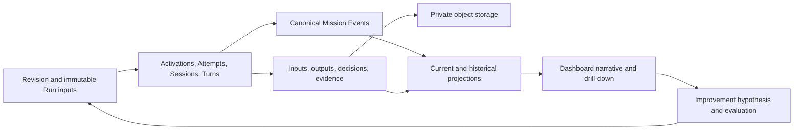

# Mission storage and retrieval projection

> **Historical input — superseded as architecture authority (2026-10-02).** Use the [canonical specification](general-mission-control/SPECIFICATION.md), [new system proposal](general-mission-control/MISSION_CONTROL_SYSTEM_PROPOSAL.md), and [cleanup plan](general-mission-control/DOCUMENTATION-CLEANUP.md). The retained text below records earlier work; conflicting runtime, storage, ownership or sequencing instructions do not govern new implementation.

**Status:** proposed for discussion, 2026-09-28. Not accepted architecture or an implementation specification.  
**Implementation:** no migrations, buckets, services, or dashboard behavior changed.  
**Purpose:** project the storage and retrieval structure needed to reconstruct a Mission's history and use its evidence to evaluate improvements.  
**Authority:** the [system proposal](MISSION_CONTROL_SYSTEM_PROPOSAL.md), [architecture](MISSION_CONTROL_ARCHITECTURE.md), and [workflow contracts](workflow-types/index.md) remain their respective proposed/accepted authorities. Shared schema implementation belongs to `ai-engineer-db-contract`; verification algorithms and admission remain with Knowledge Services.

## 1. Design target

A completed Mission should answer: what was intended; what ran; what each execution received; what it produced; why recorded decisions were made; what failed or waited; what changed; what was accepted; what was promoted; and what evidence supports a proposed improvement.

The design combines a relational execution spine, an append-only canonical event timeline, immutable Artifact content, explicit causal/data lineage, and rebuildable read models. Current rows answer "where are we?" Events and versioned records answer "how did we get here?" Artifact bodies answer "show the actual evidence." A generated narrative cites these records and is itself a versioned derived Artifact.

This is a logical target, not a requirement to immediately create every listed table. Proposed names and fields follow the proposal's lower_snake convention. Existing artifact and receipt storage must be extended or adapted through the shared contract; a second artifact authority must not be created.



## 2. Relational structure

Every tenant-owned row carries `tenant_id`. Foreign keys enforce tenant consistency, not just matching UUIDs. Events and immutable records have attributed creation identities. Mutable aggregate rows carry a version and last applied Mission sequence. JSON holds versioned typed detail, never an undocumented substitute for frequently queried relationships.

### 2.1 Intent, topology, and execution

| Table | Record and important fields | History rule |
|---|---|---|
| `mission` | Identity, title, owner, lifecycle, scheduling head, closure | Current aggregate; changes have events |
| `revision_proposal` | Base revision, proposed definition, semantic change set, author, rationale, disposition | Preserve submissions and decision history |
| `mission_revision` | Immutable revision identity, definition/program digests and Artifact refs, parent revision | Never overwrite committed intent |
| `goal`, `objective` | Revision-scoped desired outcomes, criteria, importance, parent relationships | Version with the revision; preserve stable logical keys |
| `compiled_program`, `program_node` | Revision-scoped compiled topology, node behavior, contracts, bindings, executor declarations | Immutable executable definition, not runtime state |
| `input_snapshot` | Run input manifest ref and digest | Immutable; resolved before Run starts |
| `mission_run` | Mission, revision, input snapshot, lifecycle, terminal outcome, start/end | Distinct from Mission closure |
| `activation` | Run, node, parent activation, repetition identity, lifecycle, phase, terminal outcome | One instance of a node; current state plus events |
| `attempt` | Activation, attempt number, failure class, execution outcome, execution configuration ref | Infrastructure attempts remain distinct from remediation activations |
| `harness_execution`, `agent_session`, `session_turn` | Attempt-to-provider mapping, native IDs, turn numbers, start/end | Preserve exact execution identity and relationships |
| `mission_relationship` | Parent/child, dependency, reuse or successor relation, source invocation, projected output refs | Explicit lineage; no fabricated global order across Missions |

An execution configuration Artifact pins resolved instruction, Operating Contract, skills, tools, model/provider identity as actually exposed, parameters, compiler/worker/executor build, environment image, repository revision, and relevant policy versions. It records unavailable provider details explicitly. A replayable request does not promise identical model output.

### 2.2 Timeline and recorded decisions

| Table | Record and important fields | Why it exists |
|---|---|---|
| `ledger_commit` | Idempotency key, request digest, expected aggregate versions, assigned sequence range, result ref | Retried transactions return their original result without applying effects again |
| `mission_event` | Mission sequence, type/version, execution scope, subject, actor, occurred/recorded times, causation, bounded payload | Canonical ordering and transitions |
| `event_relation` | Source/target event IDs and relation (`caused_by`, `responds_to`, `supersedes`) | Multiple causes, including across Mission boundaries |
| `decision_record` | Decision kind, maker, considered options ref, selected option, concise stated rationale, evidence refs, policy version | Records attributed reasons while they are available |
| `state_snapshot` | Mission, through-sequence, reducer/schema version, state Artifact ref/digest | Fast historical reconstruction; derived and replaceable |

Proposed event envelope:

```text
mission_event {
  tenant_id, mission_id, event_id, seq, ledger_commit_id,
  event_type, event_version,
  run_id?, revision_id?, activation_id?, attempt_id?, session_turn_id?,
  subject_kind, subject_id,
  actor_kind, actor_ref,
  occurred_at, recorded_at,
  causation_event_id?, correlation_id?,
  payload, payload_ref?
}
```

`seq` is a per-Mission commit order, not wall-clock order or proof of causality. `occurred_at` is source-reported occurrence time; `recorded_at` is ingestion time. A late verification observation is appended at its new sequence, even if it concerns an earlier output. Corrections and retractions append new records. Historical views distinguish "known at sequence S" from later corrections about an earlier event.

Every product-visible canonical mutation must have a replay-complete typed event: the event plus immutable referenced records contains enough information to reconstruct the change. A label such as `activation.updated` without the change is insufficient. Preserve event decoders/reducer versions. Replay reconstructs Mission state; it never re-executes tools or external effects.

An as-of view only lands at a completed `ledger_commit` boundary. A batch of events and aggregate updates becomes visible atomically. Concurrent branches may interleave in sequence; the UI displays their overlapping intervals and explicit causal links instead of implying one caused another.

### 2.3 What executions received and produced

| Table | Record and important fields | Why it exists |
|---|---|---|
| Existing shared `artifact` registry | Immutable logical content record, type/version, digest, bytes location, size, producer provenance | One shared content authority |
| `activation_input` | Consumer activation, input name, producer activation/output, Artifact ID/digest, binding ref, accepted/provisional status, selection event | Exact consumed inputs; repeated visits cannot resolve by "latest" |
| `activation_output` | Producer activation/Attempt, output name, Artifact ID, registration event | Output existence independently of acceptance |
| Existing shared `artifact_lineage` | Derived-from, supersedes/corrects and other admitted relations with receipts | Traverse from a final report to its sources |
| `context_delivery` | Session Turn, exact rendered context Artifact, configuration ref, state cursor, included/omitted member manifest, delivery receipt | Distinguish available, selected, and actually submitted context |
| `workspace_snapshot` | Immutable tree manifest, repository/base refs, parent snapshot, captured file digests | Preserve required files beyond a mutable branch or sandbox |
| `materialization` | Attempt/Session, input manifest, context ref, target sandbox identity, hydration receipt, readiness event | What bytes reached which paths before work started |
| `continuation_checkpoint` | Source execution, state cursor, Journal head, workspace snapshot, validation ref, transfer lineage | Durable Session-to-Session continuity |

`context_delivery` records inputs actually controlled and submitted by the harness. Provider-private instructions or invisible native compaction cannot be claimed as captured. Record the limitation. Additional tool results and governed fetches are linked through trace/operation records. Merely materializing a file does not prove an agent read or understood it.

A context member manifest records mandatory/optional selection, rendered digest, token-count method, truncation, omission reason, and paths/refs. Credentials are supplied separately and never sealed into context or workspace snapshots. Capture observable messages, tool activity, and concise attributed rationale; reconstructing the Mission must not depend on hidden model reasoning.

Stage 2 gets a new immutable input selection. Dynamic human answers, authorized instructions, and fetched evidence are later recorded context deliveries/observations, not silent edits to its initial inputs. Retry preserves logical inputs; Continuation can add a validated checkpoint and new operational context while preserving execution lineage.

The existing shared artifact migration links producers to old `orchestration.attempt` identities. Target activation/Attempt associations require a coordinated compatibility change. Do not point new foreign keys at incompatible identities or copy content into a competing registry. Reuse is represented by association rows; the Artifact's original provenance is preserved. Content deduplication must not imply cross-tenant visibility or sharing.

### 2.4 Evidence, acceptance, intervention, and cost

| Table | Record and important fields | Why it exists |
|---|---|---|
| `completion_candidate` | Submitted output/evidence refs, criteria mapping, author, Attempt | Agent's completion submission, not acceptance |
| `acceptance_evaluation` | Subject, exact Completion Contract version, candidate, criterion results ref, evidence-set digest, decision, evaluator version | Explains why an activation, objective contribution, or higher scope was accepted/rejected |
| `evidence_link` | Mission subject, evidence kind, authority service/ref, immutable version/digest, observation event | Link KS assessments and external evidence without duplicating verification authority |
| `operation_intent`, `operation_receipt` | Existing shared operation identity, preconditions, effect identity, outcome, affected refs | Distinguish proposed effects, landed effects, and uncertainty |
| `command`, `delivery_report` | Attributable requested intervention, target, delivery semantics and outcome | Separate "requested", "delivered", and "applied" |
| `human_task`, `human_task_resolution` | Question/review, assignee, wait interval, answer Artifact, actor, resolution | Durable human contributions and waiting time |
| `event_receipt` | External event identity, matching wait, payload digest | Explains event-driven release |
| `journal_segment` | Goal Loop activation, ordered segment, previous digest, body ref | Goal Loop's typed progress and decision record |
| `deliverable`, `review_packet` | Named output bundle, exact reviewed version, evidence packet, review and promotion state | Preserve what was reviewed, not just the newest deliverable |
| `usage_record`, `budget_ledger` | Attributed usage, units, cost source, estimated/settled status, versioned adjustments | Compare cost and account for late billing without overwriting estimates |

All evaluations and resolutions retain their history. Current acceptance/review fields are projections. A later rejected assessment must not erase the earlier accepted state. KS remains the owner of verification computation and admission; Mission Control records the exact assessment it relied on and its own Completion Contract evaluation.

### 2.5 Observations, retrieval projections, and learning

| Table | Purpose |
|---|---|
| `native_event`, `native_ingestion_cursor` | Deduplicated provider observations and ingestion progress; short-lived query acceleration |
| `trace_segment` | Permanent index of captured native/transcript chunks: scope, cursor interval, object ref/digest, capture completeness/gaps |
| `outbox` | Transactional delivery of committed changes; operational, not historical authority |
| `mission_summary`, `timeline_entry`, `search_document` | Rebuildable dashboard/search projections with projection version and through-sequence |
| `retrieval_manifest` | Exact event boundaries, snapshots, record/Artifact refs, visibility scope and gaps used for a historical retrieval |
| `mission_narrative` | Narrative Artifact, retrieval manifest, generator/configuration version, citations, generation time |
| `improvement_proposal` | Hypothesis, source Mission/evidence refs, target version, candidate version, evaluation plan ref |
| `improvement_evaluation_link` | Baseline/candidate Run refs, dataset/rubric versions, authoritative evaluation refs, comparison Artifact, admission decision ref |

The last two tables are proposed coordination metadata, not a new evaluation engine. KS owns evaluation/admission where that is its boundary; the owning service owns promotion of its configuration. Keep rejected hypotheses and failed evaluations.

## 3. Four private bucket classes

Buckets separate access/retention characteristics, not every entity type. These are proposed logical bucket names; implementation may map compatible classes onto existing buckets through the shared storage contract.

| Bucket | Contents | Retention/access |
|---|---|---|
| `mission-artifacts` | Input/output bodies, definitions, programs, schemas, decisions, evidence exports, checkpoints, context packs, review packets, narratives, evaluation comparison packages | Preserve referenced versions for retained Missions/evaluations; exact context may require narrower access than ordinary outputs |
| `mission-traces` | Compressed native event and observable transcript chunks, large tool request/result bodies | Restricted trace access; retention declared and gaps explicit |
| `mission-workspaces` | File-tree manifests, content blobs, selected repository bundles and snapshots | Required reproducibility snapshots pinned; transient recovery snapshots eligible for cleanup |
| `mission-archives` | Sealed timeline exports, historical state snapshots, retrieval manifests and closed-Mission export packages | Long-term historical retrieval; index/manifests remain queryable |

Example immutable object keys:

```text
mission-artifacts/<tenant_id>/<artifact_id>/<sha256>/body.json
mission-traces/<tenant_id>/<harness_execution_id>/<segment_id>/<sha256>.ndjson.gz
mission-workspaces/<tenant_id>/<snapshot_id>/manifest.json
mission-workspaces/<tenant_id>/blobs/<sha256>
mission-archives/<tenant_id>/<mission_id>/<archive_id>/manifest.json
```

Artifact refs and digests are permanent identities; signed URLs are temporary transport. Object paths confer no authorization. The service checks Mission/Artifact grants before resolving content. Supabase private buckets support controlled authenticated downloads or expiring signed URLs; see [bucket fundamentals](https://supabase.com/docs/guides/storage/buckets/fundamentals). Never expose a whole bucket solely because one Mission is visible.

Do not overwrite objects. Corrections create new Artifacts/relations. Preserve all reachable required blobs for a retained snapshot, including delta parents. A branch name or a tarball digest alone is not a retained code tree. Pin the actual needed content or a demonstrably retained repository object set. Sandbox memory/process state is outside a file snapshot unless explicitly captured.

Keep compact canonical Mission Events indexed in Postgres initially. Do not adopt automatic one-year removal before an archive reader can support the same as-of and cursor semantics. If rows later move cold, publish and verify indexed sequence-range manifests before removal. Deletion/redaction must leave an explicit availability record so the dashboard never invents continuity from absent evidence.

## 4. Writing records so later retrieval is trustworthy

1. Create stable operation and effect identities. Persist side-effect intent before dispatch. Check executor/Attempt lease fencing so stale workers cannot publish results as the current owner.
2. Upload immutable bodies; verify digest and availability. Until registered, uploads are provisional storage objects, not accepted outputs.
3. In one Postgres transaction, validate scope/version preconditions, claim the idempotency key, allocate the Mission sequence batch, insert canonical records/events, update critical projections, append outbox entries, and seal the commit result.
4. A repeated commit with the same request returns the original result. The same key with different content is rejected. Duplicate event inserts alone are not sufficient idempotency.
5. Release dependent work only after required outputs, acceptance, selected inputs, and relevant commit receipts are durable. Database unavailability prevents new release; any already-running work follows its explicit outage/buffer policy.
6. Reconcile incomplete effects/uploads from their persisted intents. Unknown external-effect outcome remains unknown until checked; never blindly repeat an irreversible operation.

Object storage, Postgres, and Temporal are not one atomic transaction. Activity retry recovers a committed result by its identity. An outbox/reconciliation path recovers missed notifications. Critical state projections commit with events; expensive search/narrative projections can lag and expose their through-sequence.

Seal trace chunks during long Turns as well as at Turn completion. Track observed and archived cursor ranges separately. Do not expire hot events until the required retained range is verified in object storage. A sandbox loss may leave an incomplete final segment; record the known gap. A `turn_completed` hook alone cannot preserve an interrupted Turn.

Temporal history remains the execution recovery record, while the Domain Ledger supports the product's historical queries. This separation is consistent with Temporal's use of event history to replay Workflow Execution state ([Temporal event history](https://github.com/temporalio/documentation/blob/main/docs/encyclopedia/event-history/event-history.mdx)).

## 5. Retrieval from a completed Mission in the dashboard

Endpoints below are proposed read shapes, not existing APIs. All queries go through a grant-scoped Mission Control service. Retrieval pins an upper sequence boundary; it never joins historical events to today's mutable state without an explicit current-state label.

### Read A: Open the Mission

`GET /v1/missions/{mission_id}/history?through_seq=...`

Resolve one committed upper boundary `S`; return summary, revisions, Runs, outcomes, deliverables, acceptance/review/promotion states, cost/usage status, archive/trace availability, and a retrieval manifest. Default to the latest fully committed boundary. A completed Run does not imply the Mission is closed; distinguish the selected Run from all-Mission history.

For a Mission Graph, the manifest records a boundary per Mission and checks each grant. The resulting view is an explicitly bounded collection, not a globally atomic snapshot. Preserve recorded parent observations of child state to explain what the parent knew.

### Read B: Load the navigable timeline

`GET /v1/missions/{mission_id}/events?after_seq=A&through_seq=S&max=100`

Read events by `(tenant_id, mission_id, seq)` using keyset pagination. Hydrate bounded typed detail from indexed related records. Group for display into intent, execution, evidence/review, remediation, and closure; retain the full underlying event order. Filters return a scanned-through cursor and the fixed upper boundary, so intentionally filtered events do not look like missing history.

Show parallel execution lanes, waits, retries, continuation transfers, and revision changes. Highlight both decision and consequence. Do not imply that adjacency in the timeline proves causality.

### Read C: Select a point in history

`GET /v1/missions/{mission_id}/state?at_seq=S`

Find the latest verified `state_snapshot` at commit boundary `C <= S`; load it and reduce events `(C, S]` using the recorded reducer/schema versions. Without a snapshot, begin at Mission creation. Return lifecycle, phase, outcome, gates, budgets, topology, and exact historical record refs known at S.

Pseudocode:

```text
snapshot = latest_compatible_snapshot(mission_id, through_seq <= S)
state = load(snapshot) or empty_mission_state()
for event in read_events(snapshot.through_seq, S):
    state = apply_versioned_event(state, event)
return state + { through_seq: S, gaps, visibility }
```

This reconstructs recorded state; missing observations remain missing. It does not infer the physical world or re-run an agent. Unsupported historical versions fail explicitly rather than silently using today's semantics.

### Read D: Inspect an activation

`GET /v1/activations/{activation_id}/history?through_seq=S`

Retrieve pinned definition, selected inputs, Attempts, configuration, context deliveries, materializations, workspace snapshots, completion submissions, acceptance evaluations, decisions, output associations, interventions, usage, and trace indexes. Artifact bodies load only when expanded or needed for a cited narrative claim.

The inspector can answer "what changed between attempts?" without confusing a new context delivery with a changed logical input. A Continuation transfer shows its checkpoint and source/target Sessions. A remediation shows its new activation and rejection-evidence inputs.

### Read E: Explain an output or decision

Traverse output -> producing activation/Attempt -> exact consumed inputs -> upstream outputs and sources. Traverse acceptance -> contract version -> per-criterion result -> evidence authority/version. Traverse a release decision -> selected binding instances, predecessor outcomes, gate resolutions, and budget/policy checks.

These are bounded recursive relational queries, not fuzzy search. Search helps find relevant Missions or documents; it does not establish provenance. Cross-system immutable evidence refs resolve through the owning service, with retained exports where the retention contract permits/requires them.

### Read F: Produce the narrative

Assemble a deterministic evidence package from the retrieval manifest, milestones, causal links, decision records, evidence, final outcomes, costs, and gaps. A narrative agent may turn that package into readable prose. Persist the generated text, generator/configuration version, exact source manifest, and claim-level event/Artifact citations.

Separate recorded facts, attributed assessments, and retrospective interpretations. Cite "the agent reported X" when that is all the evidence proves. A missing decision record is an unknown reason, not permission to invent one. Newly arrived evidence yields a new narrative version. The existing narrative remains tied to its original through-sequence and visibility scope. Narratives cannot leak restricted traces to viewers with broader summary access.

## 6. Worked Mission: a reviewed research report

Illustrative event labels and sequence ranges, not an accepted event vocabulary:

| Sequence | Recorded progression | Retrieval anchors |
|---|---|---|
| 1–12 | Revision R1 committed; Run A starts with input snapshot I1 | Definition/program, Goals, input manifest |
| 13–30 | Stage 1 research prepares; context C1 and workspace W1 delivered | Activation inputs, materialization receipt, exact instruction and source refs |
| 31–65 | Findings F1 and sources S1 registered; Completion Contract accepts Stage 1 | Output associations, candidate, evidence, acceptance evaluation |
| 66–80 | Stage 2 binds F1/S1; starts drafting from context C2 | Binding selection, producer acceptance refs, context delivery |
| 81–95 | Draft D1 and checkpoint K1 are stored; sandbox is lost | Snapshot, checkpoint, partial trace coverage, infrastructure failure event |
| 96–115 | A recovery Attempt starts with the same logical inputs and validated K1; D2 produced | Attempt lineage, recovery policy, materialization W2, output lineage |
| 116–140 | Evidence assessment rejects a criterion in D2; report activation is not accepted | Exact assessment and criterion result; no silent retry for quality rejection |
| 141–170 | Declared remediation activation consumes D2 plus rejecting findings; produces D3 | Causal release record, rejection as typed input, new output lineage |
| 171–195 | D3 passes; Deliverable review packet opens; human requests further changes | Acceptance evaluation, review packet version, attributed resolution |
| 196–220 | Further remediation produces D4; evidence passes and human accepts its review packet | D4 lineage, new evaluations and review resolution |
| 221–240 | Authorized promotion records its receipt; Run completes; Mission is explicitly closed | Operation intent/receipt, distinct acceptance/promotion/closure events |

The resulting narrative could say: "Research was accepted, but drafting was interrupted by sandbox loss. Recovery reused the original research inputs and a validated checkpoint. The recovered draft failed an evidence criterion, prompting explicit remediation. Human review requested an additional change; the revised report passed and was promoted."

Each sentence links to its sequence range and underlying records. The UI shows cost and elapsed active/wait time separately. Concurrent durations are not summed to obtain total Mission elapsed time. Events arriving after closure, such as settled cost or an evidence correction, append to history and produce a later retrieval/narrative version.

## 7. From historical narrative to tested improvement

A narrative makes the Mission understandable. Improvement requires comparable executions and outcome evidence.

1. Identify a pattern across both successful and failed Missions using revision/configuration digests, failure/evaluation categories, input characteristics, and normalized cost/latency metrics.
2. Create an attributed hypothesis linked to exact supporting Missions and counterexamples. Example: "The writing instruction insufficiently requires claim-to-source mappings."
3. Produce a candidate instruction/skill/policy version without mutating the version used by prior Runs.
4. Evaluate baseline and candidate against pinned input cases and rubric versions, including held-out cases and safety/quality gates. Link repeated trials where model variability matters; record assignment and environment differences.
5. Store per-case outcomes and aggregate comparison Artifacts, not just a winner or a retrospective score. Preserve failures and missing data to avoid selecting only successful Missions.
6. Admit/promote through the owning service's policy and record the exact version/decision. New Runs pin the promoted version; old Runs remain unchanged. Later regressions create new evidence and rollback/supersession decisions.

Observational improvement after a change is not proof that the change caused it. Comparable evaluations and controlled changes strengthen the claim. Mission Control provides provenance and durable experiment execution; it must not automatically declare its own proposed improvement valid.

Indexes needed early: Mission event sequence; activations by Run/parent/node; Attempts by activation; inputs by consumer and producer; outputs by Artifact; lineage in both directions; context by Turn; snapshots by Mission/sequence; decisions/evaluations by subject/event; trace segments by execution/cursor interval; usage by Run/configuration. Avoid indexes on unqueried JSON fields or premature analytics infrastructure.

## 8. Changes this would make to the current proposal

- Expand B.10/D.2 with commit-level idempotency and explicit historical reconstruction requirements.
- Add input selections, context deliveries, materialization receipts, workspace manifests, decision records, and acceptance evaluations as first-class retrievable records.
- Extend D.1 with indexed trace segments and interrupted-Turn coverage; do not rely only on end-of-Turn sealing.
- Extend Part G beyond navigation to exact historical reads and causal/data-lineage traversal.
- Keep compact canonical events queryable until archive retrieval proves equivalent semantics; distinguish archival from deletion.
- Add evidence-bound narrative and improvement-evaluation references without moving KS algorithms/admission into Mission Control.
- Reconcile physical artifact/receipt associations through `ai-engineer-db-contract`, preserving populated shared data and current consumers.

## 9. Design proof required before implementation acceptance

These are future acceptance scenarios, not tests reported as run:

- Rebuild current and historical Mission state from immutable records; results match the projections at recorded commit boundaries.
- Repeat a ledger commit after timeout; no double budget charge, output registration, or outbox effect.
- Lose a sandbox mid-Turn; retained chunks/checkpoints remain retrievable and the final capture gap is visible.
- Revisit a producer and retry a consumer; the consumer's original input selection does not drift to the producer's newest output.
- Append a late assessment/cost correction; the prior as-of narrative remains reproducible while the latest view changes.
- Retrieve parallel branches and a Child Mission; show causality and local sequence boundaries without manufacturing a global order.
- Expire hot native rows; retained trace segments still resolve, and explicitly expired content is labelled unavailable.
- Compare two configurations on the same pinned evaluation cases; trace every outcome to its input, execution configuration, rubric, and evidence.

This proposal is ready for discussion. It does not claim completeness of existing capture, deployment, or automatic reproducibility of third-party runtimes.
