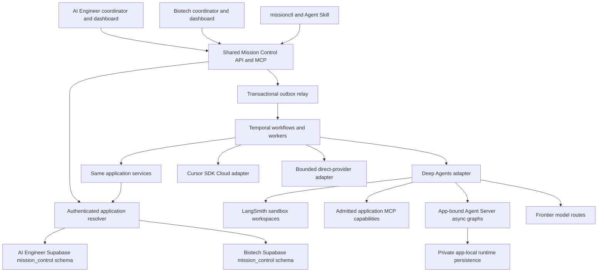

# General Mission Control system specification

Version: architecture expansion 4, 2026-10-03. Normative terms MUST and MUST NOT define the target implementation. They do not certify that today's repositories implement it. [Database](DATABASE.md) and [implementation](IMPLEMENTATION.md) specifications are part of this contract.

## Expanded owner scope and implementation packet

The [expanded packet](expansion/README.md) is a normative annex: searchable capabilities/configuration, sandboxed interview coordinators, concrete context/state algorithms, ordered intervention/subordinate contracts, specialized Knowledge Services intent execution, durable review/notifications, required WebSocket/generative UI/MCP Apps/MCP-UI, and web/mobile release. Knowledge integration is required scope now; earlier detailed-design deferrals cannot omit it. The [26-requirement coverage and 44-issue backlog](expansion/REQUIREMENTS.md) is the repo-local implementation input requested by the owner, not an external tracker publication or runtime authorization. Plans use dependencies, bounded allocations and proof gates, with no calendar timelines or invented price estimates.

Retain current accepted clean transformation into `mission-control`, no legacy Mongo/history/API coexistence requirement, private app-local runtime persistence subject to supported topology qualification, and Deep Agents/Agent Server parity preceding required Cursor SDK Cloud/direct-provider qualification. Desktop remains later scope. First usable parity and complete release remain distinct; complete release includes knowledge/data readiness and every requested client surface. [Architecture decisions](expansion/ARCHITECTURE-AND-ADRS.md) resolve expansion seams; [contracts](expansion/schemas.json), workflow 09 and RUNTIME-CONTRACTS share one wire authority. No metered probes, deployments, purchases, database changes or runtime features are performed by this specification task.

## Canonical authority and reading map

This file is the canonical General Mission Control specification in this workspace. The local workflow suite is its normative behavior annex; DATABASE and RUNTIME-CONTRACTS refine persistence and execution contracts. They must agree with this architecture. IMPLEMENTATION sequences delivery; CODEBASE-ORGANIZATION and the new system proposal describe reviewable organization/product conventions. Historical root proposals and external copies are not alternative authorities.

The 2026-10-02 accepted application/storage decisions and clean-break policy have been incorporated here. The current owner request prioritizes documentation consolidation in this task; an older directive to begin runtime implementation immediately does not authorize it here. Subsequent owner decisions should amend this pack directly.

Read [workflow types](../workflow-types/index.md), [database](DATABASE.md), [runtime contracts](RUNTIME-CONTRACTS.md), [codebase and database packages](CODEBASE-ORGANIZATION.md), [new system proposal](MISSION_CONTROL_SYSTEM_PROPOSAL.md), [implementation](IMPLEMENTATION.md), and [cleanup plan](DOCUMENTATION-CLEANUP.md). Proposed details are labeled; no runtime deployment is certified by this pack.

## Fixed architecture

Build one installable Python package, `mission_control`, with FastAPI, Pydantic contracts, a Temporal Python worker and Python execution adapters for Deep Agents (first priority), Cursor SDK Cloud, and frontier providers. Agent Server is required for bounded asynchronous subagent execution in both applications. Serve one HTTP API and one MCP endpoint over the same application services. Publish a `missionctl` CLI, generated TypeScript client and one canonical Agent Skill bundle. Both dashboards and coordinator agents consume those published interfaces.

Deploy one shared control service with two explicitly registered application bindings: `ai-engineer` and `biotech`. Install the same `mission_control` schema release into each existing Supabase database. Every mission's transactional state, definitions, capability installations, receipts and execution artifact registrations live in its application's database. Private Mission Control artifact bytes live in that application's configured object store; the default is a private Supabase Storage bucket in the same project. No third application database or MongoDB service is required for this Mission Control release.

Run Temporal outside the application databases. Agent Server/LangGraph runtime persistence starts in private, restricted schemas in each application's PostgreSQL, subject to pinned adapter compatibility, isolation and load qualification. Physical separation is a later operational option, not an initial third database requirement. They are subordinate recovery state, not business authority. LangSmith supplies sandbox workspaces and tracing; its traces are not the mission ledger.



The source root and runtime application are independent. General code MUST NOT import biotech or AI Engineer domain modules, resolve sibling directories, or use product-specific branches. Application capabilities call domain services through typed HTTP/MCP/CLI adapters. Shared Knowledge Services contracts and application-specific domain adapters are in design scope; their detailed implementation follows the Mission Control parity milestone. Entity stores and domain write authority remain application-owned.

## Authority and scope

| Concern | Authority |
| --- | --- |
| Authenticated application, tenant, actor and grants | Mission Control application resolver and deployment registry |
| Mission intent and executable revisions | Submitted definitions and immutable compiled revisions |
| Business transitions, commands, budgets, effects and acceptance | Mission Control application services and app-local PostgreSQL transactions |
| Durable scheduling, waits and recovery mechanics | Temporal workflows |
| Bounded cognitive work | Admitted harness binding: Deep Agents first, then Cursor SDK Cloud and bounded frontier-provider execution |
| Workspace execution | Harness-specific bound workspace: LangSmith for Deep Agents, qualified cloud workspace for Cursor SDK Cloud |
| Domain evidence judgment and domain writes | Registered capability's owning domain service |
| Whether required proof satisfies a mission contract | Mission Control completion evaluator using attributable assessments |
| Product publication | Explicit domain capability and its policy |

Mission Control MUST distinguish execution completion, output validity, evidence disposition, activation acceptance, mission acceptance, downstream domain admission and publication. It must never accept a result solely because an agent, provider, Temporal workflow or tool reports success.

First useful release includes Stage Graph, Goal Loop, Agent and Deterministic Executors, Human Gate, Proof Gate, Timer, one-shot Event Wait, exact capabilities, sync/async subordinates, revisions, commands, artifacts, budgets and continuation. Parallel Swarm, Evaluator Optimizer, child mission invocation and advanced Stage Graph behavior are required for the completed general-system release and follow the working vertical. A runtime MUST reject any unsupported behavior before starting a run; schema support is not executable support.

Deep Agents, its frontier model route, and required Agent Server async support must pass the first parity milestone for both apps. Cursor SDK Cloud and standalone frontier-provider executors follow through the same contract; they do not block that milestone. All four workflow systems and the listed cross-cutting behaviors remain required for the complete general system. Eve is not a supported or planned lane in this architecture. First release does not implement a different durable orchestrator or a general marketplace/discovery crawler.

## Deployment and application binding

The control service loads an immutable, versioned deployment registry. An entry contains:

```text
ApplicationBinding@1 {
  application_id, binding_version, binding_digest,
  installation_id, supabase_project_ref,
  database_secret_ref, artifact_store_binding_ref,
  accepted_issuers[], accepted_audiences[], auth_mapping_ref,
  tenant_resolver_ref, capability_installation_head,
  domain_pack_refs[], policy_profile_ref,
  temporal_namespace, control_task_queue, agent_task_queue,
  checkpoint_store_ref, runtime_checkpoint_namespace,
  agent_server_binding_ref, agent_server_graph_refs[], langsmith_project_ref,
  sandbox_profile_refs[], resource_ceilings, enabled
}
```

The registry contains secret references, never secret values. It is operator-managed deployment configuration, not an agent-writable table or a user-provided database URL. Startup/worker admission compares the intended installation UUID, actual Supabase project identity and required Mission Control component version. Mismatch makes that app unavailable, without falling back to the other project.

An HTTP application selector identifies a requested scope. The server verifies that scope against the token issuer/audience and actor grants. A token minted by app A MUST NOT acquire app B's authority by changing a path, header or MCP argument. Supabase tokens are validated against that project's issuer/JWKS or configured verification method; explicit service principals can receive grants in both apps. Global operator access requires independent grants in each scope. Authentication MUST complete before selecting a usable database connection.

Use a fixed HTTP prefix `/v1/applications/{application_id}`. MCP credentials bind one application by default; authorized multi-application operators can explicitly select among their granted applications. Responses and event streams carry `application_id`. Resource identity is `(installation_id, application_id, tenant_id, resource_id)`, even if UUIDs happen to match across projects.

Run admission pins the binding version/digest and installation identity. Durable activities resolve credentials server-side against that pin; they never use an arbitrary DSN from workflow input. Rotation may change the secret behind the same installation identity. Moving to another database/project requires an explicit migration and new binding, not a mutable registry edit. Revoking authority or disabling an app still takes effect; a frozen binding does not freeze revoked access.

## Coordinator interaction and authoring

The coordinator is an API client with authoring capabilities. It may run in Codex, Claude Code, a dashboard chat or an admitted Deep Agent session. Its conversation with the human is not the execution program and is not Temporal history.

The required interaction is:

1. Establish application, tenant and actor through authenticated context.
2. Describe the system and select a bounded context pack: schema definitions, available runtime behaviors, templates, capabilities, grants and applicable policies.
3. Discuss the research, ingestion, content creation or long-running coding/feature outcome with the human. Identify goals, success criteria, evidence, deliverables, side effects, review needs and ceilings.
4. Choose exact templates, agent/model profiles, skills, MCP tools, sandbox profiles and deterministic/domain executors from the admitted app catalog. Missing capabilities become visible blockers.
5. Create an editable mission draft. Author the recursive program, objectives, input/output bindings, completion contracts and governors.
6. Validate without launching agents or performing domain writes. Return typed errors with JSON pointers, missing capabilities, policy conflicts, cost/capacity warnings and transition impact.
7. Submit a revision proposal, compile deterministically and resolve any required human authoring review. Commit the immutable revision and activate its scheduling head with expected-head concurrency control.
8. Start a run with immutable input and resolved execution-binding manifests. Starting requires an explicit authorized call; commit does not imply start. App policy may allow the coordinator to make that call directly within the human-authorized task.
9. Observe events and artifacts, resolve Human Tasks through attributed actions, and issue commands when needed. Structural edits create a new proposal/revision.
10. Submit outputs as a Completion Candidate. Mission Control computes acceptance; the domain service separately admits/publishes if that action is part of the mission.

`AuthoringSession@1` records draft IDs, participant identities and optional attributed decision references. Raw chats can remain in the client's product store. No raw transcript is required in the common schema. The same skill teaches this procedure in both apps; app guides supply vocabulary and examples.

## Definition and compiler contracts

Every contract is a strict versioned JSON object with `lower_snake` keys. Unknown executable fields reject. Python uses Pydantic validation; OpenAPI/JSON Schema and TypeScript SDKs derive from the same contracts. API state literals, PostgreSQL constraints, CLI/MCP examples and fixtures MUST agree. UUIDs are backend-generated UUIDv7 with no dependence on an app-specific SQL UUID helper. Digests use `sha256:<64 hex>` over the specified canonical serialization; decimal money/token accounting never passes through floating-point math.

```text
MissionDefinition@1 {
  schema_version, mission_id, title, domain_pack_ref,
  goals[], objectives[], criteria[], inputs[], program,
  policies, budget, completion_contract
}
Goal@1 { goal_key, description, importance, criterion_refs[] }
Objective@1 { objective_key, goal_key, parent_objective_key?, description }
SuccessCriterion@1 {
  criterion_key, goal_key, description, evidence_requirements[], acceptance
}
ProgramNode@1 {
  node_key, objective_refs[], inputs[], outputs[], importance,
  policies, budget, completion_contract, behavior
}
behavior = stage_graph | goal_loop | parallel_swarm | evaluator_optimizer
         | agent_executor | deterministic_executor
         | event_wait | timer | human_gate | proof_gate
         | child_mission_invocation
```

Each behavior has its own discriminated body schema. Definitions reference exact catalog asset versions/digests; authoring-time aliases may be resolved before submission but cannot survive in a committed binding. Stable `node_key`/objective/criterion keys are scoped to their revision. Inputs name contract schemas and immutable artifacts or explicit bindings from producer outputs. Outputs name schemas, cardinality and required/optional status. Composite outputs require explicit projection.

The compiler MUST validate references, type compatibility, objective coverage, missing required inputs, admitted executors, asset compatibility, grant intersection, human/proof gates, evaluator independence, cycle/fan-out governors and feasible budgets. It produces canonical definition/program/per-node digests, a capability attachment plan, maximum expansion limits and a typed validation report. Compilation performs no model judgment or agent execution.

Completion expressions are a closed typed AST over `all`, `any`, schema/integrity checks, named assessment dispositions, human resolutions, and criterion results. They MUST NOT execute supplied SQL, Python, JavaScript or natural-language predicates. A criterion that needs semantic judgment references a registered assessment capability and rubric. The compiler checks assessment/result schemas; the kernel evaluates the resulting typed disposition under the pinned policy.

Definitions and submitted proposals are immutable snapshots. A mission has one scheduling head. Proposal activation locks/compares the expected mission version and prior head in one transaction. A material change to goals, authority, tenant or meaning of success creates a successor/forked mission. Revisions may refine the program without silently changing those facts.

A run's starting revision and admitted input/binding manifests stay immutable. Activating a successor revision for an active run records a `run_revision_transition` with per-activation impact and pinned successor bindings; only an explicitly applied transition changes that run's future scheduling revision. In-flight work retains its originating revision/binding unless the recorded transition cancels/checkpoints/supersedes it. The root does not follow a mutable head or catalog alias on its own. Completed work is reused only through digest-computed carry-forward eligibility, preserving the original execution reference.

## Common execution semantics

Implement the canonical local [program model](../workflow-types/00-EXECUTION_PROGRAM_MODEL.md), [Stage Graph](../workflow-types/01-STAGE_GRAPH.md), [Goal Loop](../workflow-types/02-GOAL_LOOP.md), [Swarm](../workflow-types/03-PARALLEL_SWARM.md), [Evaluator Optimizer](../workflow-types/04-EVALUATOR_OPTIMIZER.md), and [revision behavior](../workflow-types/07-MISSION_REVISION_AND_RUNTIME_EVOLUTION.md). These local workflow documents are normative parts of this specification, not an external competing architecture. Package their versioned contracts/fixtures with the runtime so execution never needs the documentation checkout. Binding, deployment, database and initial-lane rules in this package replace the corresponding product-specific assumptions for the new service.

| Record | Lifecycle and independent outcome |
| --- | --- |
| Mission | `drafting`, `ready`, `running`, `dormant`, `closed`; closure is `mission_accepted`, `not_accepted`, `abandoned` or `superseded` |
| Run | `pending`, `running`, `paused`, `completed`; terminal outcome is separate |
| Activation | `pending`, `ready`, `running`, `waiting`, `completed`; phase and terminal outcome are separate |
| Attempt | One try at an activation; execution outcome `succeeded`, `failed`, `cancelled` with failure class |
| Agent session and turn | Runtime-owned identities mapped to the attempt; no acceptance authority |

Common activation terminal outcomes are `accepted`, `not_accepted`, `stopped_by_policy`, `governor_exhausted`, `no_progress`, `revision_required`, `cancelled`, `execution_failed`, `skipped`, `superseded`; declared system extensions include `stalemate`, `quorum_unreachable` and `threshold_not_reached`. Terminal outcome MUST be absent before completion. Quality rejection is not an infrastructure retry.

Stage Graph releases work from dependencies, typed input availability, gates, accepted producer outputs, enclosing scope, concurrency and budget. A normal input binding requires producer acceptance. Provisional bindings are explicit, retain provisional derivation and cannot satisfy irreversible/publication gates. Static unreachable work rejects; dynamic stalemate records blockers. Revisit regions and fan-out are committed templates with hard bounds.

Goal Loop uses `observe → propose action → authorize → act → assess progress → decide`. Each iteration has its own identity and bounded governors. A sealed append-only Loop Journal and bounded Loop State retain observations, actions, receipts, progress reviews and completion candidates. The controller can select only the committed Action Space; new capabilities/goals need a revision. Native agent messages are not the Journal.

Parallel Swarm declares member variants, bounded expansion, required member completion policy and a separate convergence subprogram. Evaluator Optimizer declares producer/evaluator independence, rubric, round limits, blocking findings, improvement patience and abstention behavior. A subagent tool is not a substitute for either workflow system.

Retry, revisit, goal-loop iteration, optimization round and continuation are different counters and identities. Runtime or infrastructure retries retain the same side-effect identity; new logical actions receive new effect identities. An ambiguous effect is reconciled before any re-execution. Changed instructions/inputs/capabilities create new semantic work rather than disguising it as a retry.

## Domain packages and admitted capabilities

An app domain package contains only templates, goal/objective patterns, output and assessment schemas, rubrics/policies, exact capability references, prompts/context guides and example missions. It contains no alternate mission scheduler or acceptance bypass. Database workspace references are app-specific capabilities/context assets; the common kernel does not interpret a knowledge schema.

An installed capability record declares `capability_id`, immutable version/digest, kind, input/output schema refs, invocation adapter, endpoint/server identity, side-effect class, required scopes, policy, deadlines, concurrency/cost limits and compatibility. Capability kinds cover `mcp_tool`, `http_operation`, `sandbox_command`, `deterministic_executor`, `assessment`, `skill`, `model_profile`, `sandbox_profile`, `context_bundle`, `mission_template` and `agent_profile`. Approval/promotion is an operator function; the coordinator chooses admitted versions.

Select capabilities by semantics and filters, then compile exact bindings. Generic invocation adapters are implemented once. App-specific validation or ingestion stays in domain services behind those adapters. Privileged plugin code is installed by deployment, never supplied as an arbitrary mission payload.

Effective authority is the intersection of authenticated caller scopes, app policy, tenant grants, mission/action space, node scope and parent scope. Skill text, tool visibility, MCP metadata and model output grant no authority. App policies may narrow grants and require review; they cannot let an agent accept its own evidence, bypass a budget or publish without the declared domain authorization.

The application catalogs can expose different research/ingestion/content capabilities while the operation envelope stays the same. Example: `research.collect` or `ingestion.apply` may refer to distinct app endpoint bindings. A capability absent in one catalog is unavailable there; no fallback to the other app or an agent-generated shell write is allowed.

## Exact agent and sandbox binding

`AgentExecutorBinding@1` pins the runtime/package set, model/provider route and reasoning settings, prompt/Operating Contract, output schema, state/context schemas, ordered middleware, tool/MCP capability revisions, complete skill bundles, workspace manifest, harness-specific workspace/sandbox profile, checkpoint/store configuration, subagent profiles, budgets, retry/session/continuation policy and allowed side effects. The materializer records intended and actual versions and rejects mismatches before agent work.

Choose one exact Python dependency set at implementation kickoff. The biotech source currently pins Deep Agents `0.7.5`; reuse that compatible adapter if qualification passes, or upgrade deliberately with new evidence. The specification does not invent an SDK method or assume current online examples match the installed version.

Run the initial Deep Agent graph in the dedicated agent worker/Agent Protocol process. Model clients and privileged capability credentials remain server-side. Its filesystem/command backend uses a managed LangSmith sandbox. The agent graph running on a worker and its remote workspace are separate resources. Agent Server is a required deployment component for asynchronous subordinate graphs in both AI Engineer and Biotech. Use app-bound endpoints/pools with authenticated submissions, registered graph identities, isolated persistence and pinned versions. Temporal remains the sole mission scheduler; Agent Server supplies bounded graph execution. Its submission/recovery contract is specified in RUNTIME-CONTRACTS.md.

Official documentation describes Deep Agents sandbox backends and the LangSmith integration. Actual methods are bound by the chosen dependency lock and live qualification. [Deep Agents sandboxes](https://docs.langchain.com/oss/python/deepagents/sandboxes).

Each attempt gets its own owned workspace unless a pinned continuation policy restores that logical lineage. The workspace contains small read-only `.mission/` context, `/skills/` bundles, input manifests/files and declared writable output/scratch paths. Sandbox profiles pin a snapshot/image identity, CPU/memory/disk limits, max lifetime, egress requirements and cleanup policy. File outputs become durable only after immutable registration and digest validation.

Before a sandbox-backed profile is admitted, qualify access to its required MCP endpoints, object URLs and domain services in the actual LangSmith organization/region. Managed sandbox network restrictions may block destinations; do not assume adding a proxy configuration grants egress. Snapshots and the auth proxy are documented facilities, but the selected SDK and organization policy must prove the desired behavior. [LangSmith sandboxes](https://docs.langchain.com/langsmith/sandboxes).

Neither Supabase database credentials nor long-lived provider/MCP secrets enter agent-readable files, prompts, checkpoints or artifacts. Host-side MCP clients use scoped grants. If a sandbox CLI is needed, give it a short-lived task-scoped token to the control/domain service, bound to app/tenant/attempt/action. Sandbox commands must not have an alternative raw database write path. Network/security isolation is checked alongside tool filtering.

Sandbox and model calls consume admitted reservations. The worker retains native IDs, usage, checkpoint handles, artifact receipts and generation numbers. On recovery it reattaches or restores from a validated checkpoint; it never treats an unknown provider state as permission to launch a duplicate paid operation.

## Harness continuation and subordinates

The provider-neutral harness defines `prepare`, `start`, `send_turn`, `cancel_turn`, `observe`, `snapshot`, `usage`, and `end_session`. It returns typed handles and observations. Pause/resume/continuation are kernel protocols built from qualified primitives; each adapter reports real delivery semantics. Unsupported operations return a typed rejection.

For the initial lane, plain `pause` prevents new releases and requests quiescence at safe boundaries. A mid-call `hard_pause` or interrupt is only advertised when the qualified adapter can cancel and checkpoint/recover with documented effect uncertainty. Do not label cooperative or emulated control as guaranteed native suspension. A paused root continues to reconcile children, messages and costs.

Continuation proceeds by freezing new actions, reconciling effects, sealing a typed checkpoint, verifying identity/input/policy/artifact digests, preparing a fresh session/workspace as needed, hydration/continuity validation, then resuming. Runtime graph checkpoints support recovery but do not replace the canonical checkpoint manifest. Forking creates a new run or mission according to the semantic change; it does not clone in-flight commands or transfer ownership of active children.

Sync and async subordinates have admitted immutable bindings and grants no broader than the parent. Async execution records dependency class `required_blocking`, `degradable_blocking`, `nonblocking` or `advisory`, timeout, cancellation, budget allocation, output admission and late-result policy before launch. Its native graph/task/thread identity is persisted outside chat context. Required unresolved children block parent completion. Cancellation reconciles children and unsettled costs; late or stale-generation results cannot mutate terminal parents.

Each async launch MUST have a recoverable native identity or provider idempotency contract. If the pinned runtime cannot safely identify/reattach a lost launch, the async lane is not admitted until a wrapper/server supplies that guarantee. Dynamic child configuration cannot expand parent authority. A subordinate is not automatically a Child Mission; independent goals/governance require independently admitted Child Mission Invocation.

## Temporal and transactional execution

Temporal workflows use compact IDs, digests, binding versions and outcomes. All database, sandbox, model, MCP, secret, object-storage and domain-service I/O occurs in activities/application services. Workflow replay does not run domain effects. Queries are diagnostic and side-effect free; Updates carry commands and return delivery/admission results; Signals carry deduplicated observations/events. Handler completion is checked before Continue-As-New. [Temporal Python message passing](https://docs.temporal.io/develop/python/message-passing).

Use application/environment isolation in Temporal Cloud, with separate production namespaces per application/environment as the initial recommendation and app-specific control and agent queues: `mc-control-ai-engineer`, `mc-agent-ai-engineer`, `mc-control-biotech`, `mc-agent-biotech`. The same worker image runs for either app using a fixed application binding, separate credentials and pools. The API/MCP service remains shared. Queue naming, ceilings and per-app pool sizing are deployment settings with recorded versions.

The concrete production baseline is AWS containers for the long-running Python API/MCP, relay/reconciler, Temporal workers and bounded Agent Protocol service; Temporal Cloud for macro execution; LangSmith for managed sandboxes/tracing; and the two existing Supabase projects for application state/artifacts. Dashboards remain in their existing deployments. Use one immutable OCI release image with separate API, relay, worker and agent-server entrypoints where dependency/security separation permits; deploy processes independently. Private runtime schemas in the corresponding application PostgreSQL provide the initial Agent Server/LangGraph persistence binding, subject to compatibility and capacity qualification. Separate it physically only when deployment evidence warrants the change. Local/disposable profiles reproduce these boundaries without deploying production.

Minimum deployment secrets/configuration are the two application database/Storage bindings, each auth issuer/audience mapping, Temporal address/namespace/credential, runtime checkpoint connection, LangSmith credential/project/profile bindings and the qualified model route credential. Agents receive none of the database/checkpoint/Temporal deployment credentials. Static per-app allocations partition shared model/sandbox account ceilings initially, avoiding a cross-database global budget transaction. Expansion to a dynamic shared quota broker is a later feature.

Expose liveness, overall service readiness and per-application readiness separately. An app-specific DB/component failure returns `503` for that application's admission while preserving the other's service. Worker pools are separately app-bound; no worker assumes another app's binding to clear a failing queue. Outbox, cleanup and reconciliation processes remain scoped to their installation and retain retry/backoff state.

Workflow IDs include deployment installation/application/run identity. Each admitted Mission Run has one root; composite and atomic activation workflows retain their own IDs. Continue-As-New advances a technical segment, preserving semantic run, revision, counters, pending commands/waits and active child identities. Histories created by the new system stay on compatible versioned workers; rolling out code does not reinterpret in-flight semantics.

Starting a run writes the run, input/binding manifests, reservation and outbox intent in one application database transaction. The relay starts/attaches the stable Temporal root idempotently. There is no distributed transaction between PostgreSQL and Temporal. Similarly, every external effect is first journaled; ambiguous results enter reconciliation. Domain capabilities declare a reliable idempotency/receipt lookup or an explicit non-idempotent/manual-recovery policy. No receipt lookup means no automatic repeat after an uncertain outcome.

Budget admission and child reservation are serialized in the app database. Currency is integer micros; token, duration, tool and sandbox dimensions are recorded separately. Reservations cover maximum admitted call/workspace exposure and outstanding children. The remaining ceiling includes unsettled commitments. Unknown usage cannot count as zero. Cancellation retains reservations until effects/costs settle. Runs stop at governors and produce a governed outcome rather than repeatedly retrying for more funds.

## Public skill CLI MCP and dashboard contract

The canonical service operation catalog defines action name, input/output/error schemas, scopes, idempotency, side-effect class and availability. HTTP, CLI and MCP adapters invoke the same application handlers; contract parity tests prohibit divergent behavior. CLI uses the published HTTP client. MCP calls application services in process and has no algorithm or independent database authority.

| Action family | HTTP below app prefix | CLI examples | MCP tools |
| --- | --- | --- | --- |
| System and context | `GET /system`, `/schemas`, `/capabilities`; `POST /context:select` | `missionctl system describe`, `context select`, `capability list` | `mission_describe_system`, `mission_context_select`, `mission_capabilities_list` |
| Drafting and validation | `POST /missions`; `PATCH /missions/{mission_id}/draft`; `POST /missions/{mission_id}:validate` | `mission create`, `mission draft-update`, `mission validate` | `mission_create`, `mission_draft_update`, `mission_validate` |
| Revision lifecycle | `POST /missions/{mission_id}/proposals`; proposal validate/resolve; `POST /missions/{mission_id}/revisions/{revision_id}:activate` | `proposal create`, `proposal validate`, `proposal resolve`, `revision activate` | `mission_proposal_create`, `mission_proposal_validate`, `mission_proposal_resolve`, `mission_revision_activate` |
| Run and reads | `POST /missions/{mission_id}/runs`; mission/run/program/artifact reads | `run start`, `mission get`, `run get`, `program get`, `artifact get` | `mission_run_start`, `mission_get`, `mission_run_get`, `mission_program_get`, `mission_artifact_get` |
| Events and commands | `GET /missions/{mission_id}/events?after_seq=`; `POST /runs/{run_id}/commands` | `events watch --after-seq`, `command send`, `command get` | `mission_events_read`, `mission_command_send`, `mission_command_get` |
| Human decisions | `GET /human-tasks`; `POST /human-tasks/{human_task_id}/resolutions` | `human-task list`, `human-task resolve` | `mission_human_tasks_list`, `mission_human_task_resolve` |
| Executor reporting | attempt-scoped candidates, observations, artifacts and subordinate actions | executor-only reporting commands | executor-only tools withheld from normal coordinator grants |

CLI has explicit `--application`, `--tenant` where permitted, `--json`, `--wait` and `--after-seq`. Tenant selection is checked against grants. Mutation requests carry `request_id`/idempotency key and expected aggregate version where applicable. Unknown commit outcomes are recovered by the same request identity. Responses expose resource refs, current version, dispositions and typed errors, never credentials.

Remote MCP onboarding MUST use resource-bound authorization, protected-resource/authorization-server discovery and a supported OAuth flow with PKCE for interactive hosts. The auth adapter delegates identity to the originating application's login and issues/obtains a Mission Control resource token containing the permitted app/tenant/scopes. It MUST NOT simply pass an app JWT to a domain MCP server or accept arbitrary upstream tokens at the common MCP resource. Use a maintained authorization adapter/library; OAuth protocol state is not mission state. `missionctl auth login --application <app>` uses the same supported auth path; headless callers use explicitly provisioned scoped service credentials. An optional stdio bridge calls the deployed service with its local credential profile and never becomes another kernel. Verify actual remote/stdio onboarding in Codex and Claude Code as part of interface acceptance. [MCP authorization](https://modelcontextprotocol.io/specification/2026-07-28/basic/authorization).

Publish `mc://applications/{application_id}/missions/{mission_id}` and corresponding run/artifact/human-task refs, resolved against the configured installation. Add installation context to exported cross-deployment references; a bare UUID is insufficient. MCP resources include schema/context catalogs and authorized mission summaries/programs/artifact manifests. Large bodies require separate authorized artifact access.

The common scope vocabulary is `mission.read`, `mission.author`, `mission.start`, `mission.command`, `mission.invoke`, `mission.review`, `mission.admin`, `catalog.read`, `catalog.manage`, and `execution.report`. Executor reporting additionally binds a specific attempt/generation and permitted operation; it is not general coordinator authority. Domain capability scopes are intersected with these platform grants, not substituted for them.

Public errors use a common envelope `{request_id, code, message, details, retryable, recovery_ref?}` with safe typed details. Required codes include `APPLICATION_FORBIDDEN`, `TENANT_FORBIDDEN`, `INSTALLATION_MISMATCH`, `SCHEMA_COMPONENT_MISMATCH`, `VERSION_CONFLICT`, `IDEMPOTENCY_CONFLICT`, `CAPABILITY_UNAVAILABLE`, `CAPABILITY_DRIFT`, `AUTHORITY_DENIED`, `INVALID_DEFINITION`, `UNSUPPORTED_BEHAVIOR`, `BUDGET_EXHAUSTED`, `STALE_GENERATION`, `EFFECT_UNCERTAIN`, `CHECKPOINT_INVALID`, and `CURSOR_EXPIRED`. Transient infrastructure errors may be retried using their original identity; uncertainty requires the specified recovery operation first.

Events are app/tenant-scoped, sequenced per mission and transactionally published via outbox. HTTP SSE supports cursor replay, heartbeat, gap detection and bounded buffering; `missionctl events watch` uses it. MCP exposes bounded cursor-based event reads suitable for polling. Server push notifications are optional and MUST NOT be the sole recovery path. A cursor outside retained event history returns an explicit resync requirement; reconnect never silently skips a gap.

Both dashboards use the generated TypeScript client for drafts, graphs, run state, event tails, blockers, artifacts, Human Tasks and commands. They never directly mutate execution tables. Each sends the originating app's authentication; API URL may be identical. Navigation labels and templates may differ; contract/state meanings do not.

The Agent Skill lives at `skills/mission-control/SKILL.md` with small schema/procedure references. Its manifest pins the entire bundle and compatible service versions. Host-specific installation metadata points Codex/Claude Code/Deep Agents to that same asset. The skill teaches context selection, author/validate/commit/start, observe/intervene, receipt recovery and completion evidence. Domain guides are attached references rather than forks of the common skill.

## Repositories schema ownership and distribution

`MISSION_CONTROL_ROOT` owns general service code, runtime adapters, public contracts, CLI, skill, release manifest and deployment templates. Use the same neutral Python module names regardless of containing repository. Extraction into a dedicated repository later must preserve package/build identity. Distribution MUST pass an isolated-checkout build with no sibling repos.

Transform and rename the existing `Biotech/biotech-research-ingestion-evaluation-system/` backend into `Biotech/mission-control/`, using the neutral Python package `mission_control`. Reuse reviewed current machinery and regression invariants. Do not retain a second legacy kernel, old endpoint aliases, Mongo/Beanie dependency or old execution-data/history migration requirement. New runs must remain durable across their own retries, releases and recovery. This documentation task does not perform the rename. The specification entry point is `Biotech/mission-control-general/README.md`.

Ownership amendment 2026-10-03 (owner correction): canonical common Mission Control SQL and generated Mission Control-only types are owned by the independent `mission-control-db-contract` component at `mission-control/packages/mission-control-db-contract/`. `ai-engineer-db-contract` owns AI Engineer domain entity tables only and is not a prerequisite. The general service consumes the component contract; each app database deployment pins/applies that same component exactly once. The service does not import the full AI Engineer domain database model. Per the owner clarification, `biotech-postgres-db-contract` is a thin consumer of the shared installer that installs and verifies that common component and applies versioned, idempotent Biotech-specific seeds. AI Engineer applies the same common tables with its own seeds. Neither installer independently authors or regenerates a competing schema. [DATABASE.md](DATABASE.md) specifies this process.

The decided service root and the separate Biotech installer do not create another schema authority. The component package may later be extracted into its own repository with the same package/build identity; that extraction is not required to build or deploy the general service.

## Acceptance and release scope

The first useful release is accepted only when both app bindings run a real Stage Graph/Goal Loop vertical through the same deployed service build, each writing exclusively to its own Supabase schema and using its own admitted capabilities and exact skill. The first parity milestone requires Deep Agents with its qualified workspace and Agent Server async support in both apps. The subsequent Cursor SDK Cloud release qualifies its coding vertical through the same contracts and its own bound workspace. It must prove validation-before-side-effects, human wait, completion assessment, sync/async child settlement, cancellation, crash recovery, budget accounting and dashboard/CLI/MCP parity.

The complete general release additionally passes the existing accepted four-system/revision/child-mission conformance suite and advanced graph/continuation requirements. Ingestion capabilities can remain unavailable until their owning services supply the contract; that does not permit advertising an executable ingestion template. Shared Knowledge Services contracts are in synthesis scope; complete domain implementations are not a prerequisite for Mission Control parity.

The concrete phase deliverables and failure proofs are in [IMPLEMENTATION.md](IMPLEMENTATION.md). Unrelated application/domain data is preserved; installation is additive with respect to those domains. Legacy Mission Control/Mongo data needs no migration or compatibility engine. Inspect existing target schemas before installation; this policy authorizes no blanket database reset. Supabase Pro status alone is not a capacity or compatibility proof.

## Final contract and scope amendments

[RUNTIME-CONTRACTS.md](RUNTIME-CONTRACTS.md) defines the required lifecycle operations, Python types, feature availability, harness interface and HTTP/CLI/skill parity. [EVIDENCE.md](EVIDENCE.md) distinguishes accepted recorded Biotech qualifications from target behavior and lists decisions overriding older proposals.

AI Engineer entity reads/writes go to its PostgreSQL domain adapter; biotech entity reads/writes go to its Neo4j domain adapter. Both apps use their own Supabase PostgreSQL `mission_control` schema for mission state. General code cannot query either entity store or depend on their schemas. Research, ingestion, content creation and long-running coding/feature work share the same mission contract. Repository checkout, patch generation, tests, review, merge and deployment are separately scoped capabilities; starting a coding mission does not authorize merge or deployment.

The AWS containers/Temporal Cloud production baseline is retained as a deployment design assumption, not an installed environment or a purchase instruction. Hosting choice does not affect public or persistence contracts. LangSmith availability is a runtime qualification gate; it does not justify bypassing the existing local proof baseline.

## Accepted storage and Knowledge Services boundary

The recorded projects are `supabase-blue-ocean` for AI Engineer and `biotech-research-ingestion` for Biotech; actual project IDs/endpoints are trusted deployment inputs. Each retains its own Supabase Auth users, memberships and grants. Install the same common Mission Control component in both, with separate data and private buckets named `mission-artifacts`, `knowledge-artifacts` and `capability-bundles`. DATABASE specifies custody and runtime persistence; no common mission database centralizes their records.

Share source identity/version/snapshot/locator contracts, artifact custody, provenance, governed intent execution, operation receipts, evidence tracking, memory policy and retrieval envelopes. Keep entity semantics, schema navigation, evidence interpretation and SQL/Cypher writes in app-owned adapters. Immutable intent artifacts pin input digest, executor/target schema version, authority and preconditions. Domain effects have their own durable receipt/reconciliation contract. Even colocated PostgreSQL domain tables do not give the mission kernel unrestricted write authority.

Runtime checkpoints, continuation packages, operational memory and admitted long-term domain knowledge are separate. Retrieved memory is advisory. Shared service packaging and detailed source-intelligence/memory implementations follow concrete domain workflows; the common boundary is required now.

## Frontier provider binding

Deep Agents binds a qualified frontier model route from the first release. Record provider/model identity, endpoint binding, credential reference, reasoning and output settings, token/spend limits, supported modalities/tool behavior and usage semantics in an immutable profile. Secret values remain server-side.

A standalone `direct_model` execution profile is a bounded Agent Executor lane, not a new workflow system. Its adapter must preserve admission, effect identity, result validation, uncertainty reconciliation and accounting. It may advertise a single-turn lifecycle and reject unsupported continuation/control primitives. Cursor SDK Cloud uses its own qualified model/account/workspace contract. Automatic provider substitution cannot change a pinned binding or repeat an uncertain billed request. Additional providers require profile qualification, not kernel branches.

## Owner amendments 2026-10-07

Later owner decisions amend this pack by reference to the decision records in `mission-control/docs/adr/`; the prose above is not rewritten until a later consolidation. In any conflict the amendment governs.

- ADR-0017: Agent Server/LangGraph runtime persistence lives in a physically separate, app-bound PostgreSQL database per application, not in a private schema of the business database (the pinned Agent Server cannot use one). Supersedes the "private, restricted schemas in each application's PostgreSQL" statements in Fixed architecture and in DATABASE.md.
- ADR-0018 (proposed): Claude Code (Claude Agent SDK), Codex and Cursor are execution lanes behind the one harness protocol, not coordinator hosts only; qualification order is Deep Agents parity, Claude Agent SDK, Cursor Cloud, Codex. A primary-source research pass precedes acceptance.
- ADR-0019 (proposed): coding lanes qualify as worker-hosted local processes first; cloud placement is a second profile per lane. Supersedes "cloud placement first" in RUNTIME-CONTRACTS.md and workflow-types/05 for the first profile; Cursor Cloud remains required for the complete release.
- ADR-0020: capability kinds and admitted capabilities are canonical in the PostgreSQL catalog; the kind list in "Domain packages and admitted capabilities" above and the list in expansion/CATALOG-AND-ENVIRONMENTS.md are both references to that record, not authorities.
- ADR-0022 (proposed): missions are authored as a YAML Mission Manifest that compiles into `MissionDefinition@1`; the committed revision remains the typed definition.
- Shared language and decisions now live in `mission-control/GLOSSARY.md` and `mission-control/docs/adr/`; explanations of the code live in `mission-control/docs/knowledge/`.
