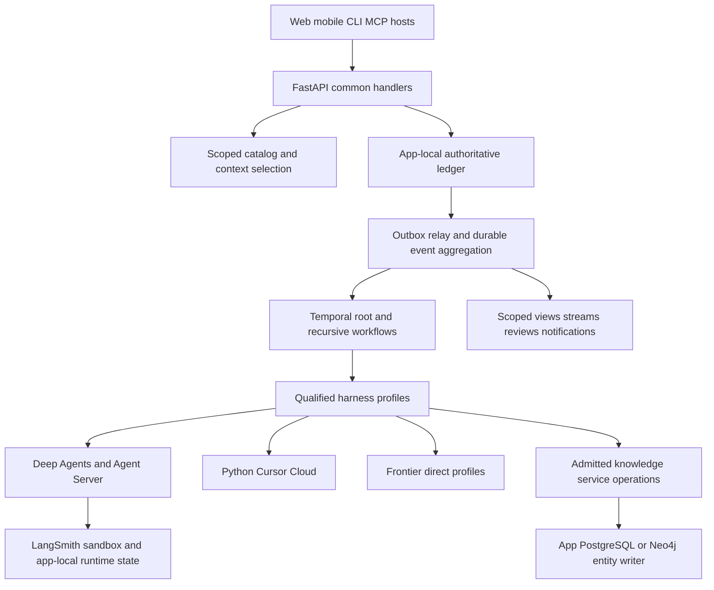

# Expanded architecture and design decisions

Normative target annex to [the canonical specification](../SPECIFICATION.md). Architecture choices below are settled for implementation planning unless specifically marked an operator/release input. No deployment is certified.

## Product-to-execution path

An authenticated app opens a sandboxed authoring interview. The coordinator searches the permitted catalog, fetches small context excerpts, authors a typed draft, validates goals/resources/side effects, proposes and activates an immutable revision, and explicitly starts its workflows. User intent and coordinator chat are not execution authority. The admitted Operating Contract, app grants and compiler determine authority. Authoring interviews are separately budgeted bounded sessions; they cannot silently launch paid children or domain writes.

Mission Control owns durable orchestration and computed acceptance. Agent Server hosts bounded graphs/subordinates. Sandboxes own scratch files/processes, not mission truth. Knowledge services own evidence and domain transactions. A generic ingestion envelope does not make entity SQL/Cypher generic. Reviewers approve exact artifacts/actions; approvals cannot be broadened by generated UI or coordinator text.

The BellLabs [product vision](../../../biotech-meta/docs/BellLabs/vision-and-product-system.md) requires decision provenance, evidence-aware exploration, personal/public separation and educational boundaries. Product protocols, purchase states and personal graphs can invoke missions and consume results; they do not become universal scheduler behavior. AI Engineer educational/recommendation experiments use analogous product-owned rubrics/datasets. Clinical interpretation, commerce checkout and personal-health release require separate domain authorization/qualification; no generic research mission claims to diagnose or prescribe.

## ADR-X01 — one authority and clean transformation

Decision: the local canonical pack plus this annex is the implementation input. Transform the existing backend into `Biotech/mission-control/`, Python import `mission_control`, with no legacy Mongo data migration/API aliases/history coexistence requirement. The transformation preserves useful behavior/evidence, not obsolete entity dependencies. The common SQL component is owned by `mission-control-db-contract` in `mission-control/packages/` (ownership amendment 2026-10-03, EVIDENCE D09); Biotech and AI Engineer installation manifests consume it, and `ai-engineer-db-contract` keeps only AI Engineer entity tables. A physical rename is an implementation issue with filesystem/worktree preflight, not work done by this packet.

Consequence: new-engine replay and upgrade compatibility are mandatory; old-engine compatibility is not. No automatic deletion of unrelated data or concurrent work follows from clean break. Extraction tests show one scheduler/writer, isolated build, no domain imports or Mongo/Beanie dependency.

## ADR-X02 — extend Deep Agents rather than fork initially

Decision: implement admission wrappers, typed tools and ordered public middleware at existing extension interfaces. Do not fork Deep Agents now. Qualify the installed baseline and compare against a fork only if a reproducible required behavior cannot be implemented without private APIs, unmanaged child launch or undocumented checkpoint mutation.

Fork trigger requires a minimized failing test, upstream/pinned-source analysis, adapter/middleware alternative cost, proposed minimal patch, maintenance/security/version impact and an owner decision. A fork must preserve public contract parity and immutable provenance; it cannot create a second scheduler. Progress instrumentation records summaries/tool facts, never requests hidden reasoning. Current evidence/gaps are in TECHNOLOGY-EVIDENCE.

## ADR-X03 — authoritative state separate from advisory memory

Decision: mission journal, typed iteration/transition state, command frontier, effect receipts and acceptance are the durable source of truth. Native graph checkpoints recover graph execution; sandbox files carry selected context and scratch. Knowledge memory recalls only authorized attributable references and is advisory until revalidated. Never checkpoint authority by trusting model messages or automatically ingest chat summaries into knowledge.

State handoff requires typed delta, base state version/digest, artifact provenance and deterministic reducer. Context selection is reproducible from captured candidate IDs/ranking/config, grants and tokenizer revision; not a promise that repeated external searches return identical bytes. Retain external search capture/receipt to make a past selection inspectable.

## ADR-X04 — control urgency and truthful interruption

Decision: durable ordered command admission plus an urgent cancellation channel/fence. `stop_now` means immediately persist the stop fence, reject new effect claims and request provider/process cancellation. It is not a latency guarantee, rollback or a guarantee that already dispatched remote tools are stopped. Native interruption capabilities and measured control latencies are declared per profile. Clients show requested, observed and settled states separately.

Queued context/messages deliver at recorded safe boundaries. Pausing requires checkpoint/quiescence validation. Revisions use explicit impact and new bindings; no mutable mission head leak. Feedback changes create new artifact/assessment/review versions. Required human review cannot be satisfied by notification delivery, UI rendering or agent approval.

## ADR-X05 — common release, separate app authority

Decision: same runtime/schema/operation contract release, two separate Supabase projects and app-bound server/worker identities. Private checkpoint schemas start app-local only if pinned Agent Server tooling supports the target topology. Mandatory qualification verifies schema routing, row access, pool context, load and backup recovery. If supported setup needs independent databases, block admission and present a reviewed infrastructure alternative; never silently connect both apps to one checkpoint namespace.

Catalog/search/vector indexes are scoped projections, not authorization stores. Apply grant filtering before content retrieval and reranking; revoked assets remain historically attributable but unavailable for new execution. Cross-app operator views query independently authorized installations, never pool data in an unscoped mission store.

## ADR-X06 — required UI extensions with fallback

Decision: web/mobile first-party clients, generative UI over a closed authorized view/action schema, and MCP Apps compatibility. MCP UI facilities supported by a selected SDK/host are integrated, not assumed universal. Host capability negotiation chooses embedded resource versus ordinary text/link rendering. No remote UI can mint grants, resolve a Human Task without an attributed action, access arbitrary webviews/files/secrets, or bypass the API.

Untrusted artifact HTML/PDF preview and generated app UI have separate sandboxes/origins. UI resources have pinned digests, CSP/domain allowlists, bounded data and audited tool mediation. Mobile must support the fallback even when an embedded MCP App runtime is unavailable. Desktop is later work.

## Explicit unresolved inputs

No architecture-changing choice is hidden inside a ticket. Defaults: AWS ECS/Fargate containers and ALB, existing per-app Supabase, Temporal Cloud, LangSmith sandboxes, existing web app integration, a proposed React Native/Expo mobile client, and current admitted frontier profiles. Mobile framework and notification channels are provisional implementation defaults: complete host/offline fixture proofs, then record owner choice before production packaging. Actual project IDs, operator roles, TLS/network configuration, provider plans/regions/rates, licensed datasets and finite live proof budgets are external inputs. They do not block authoring or executing offline first issues.
